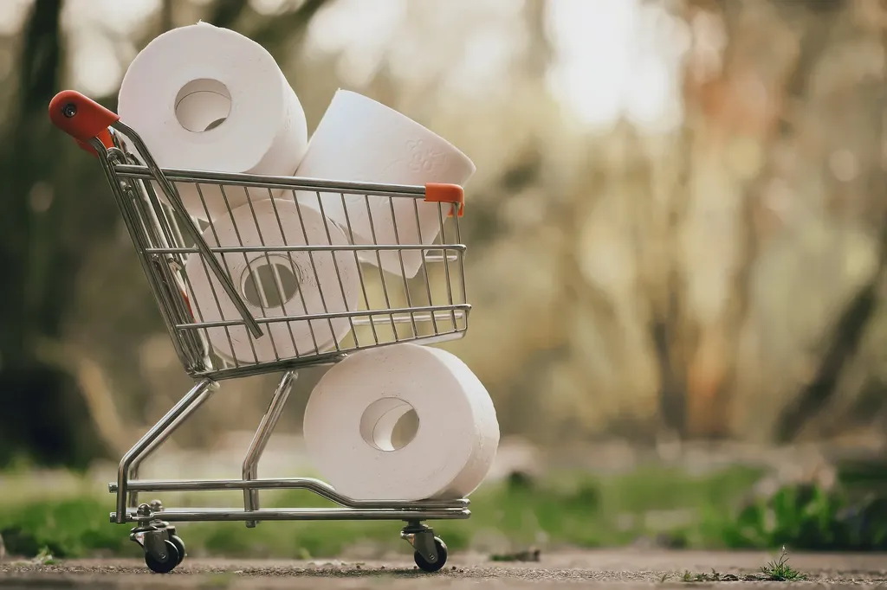
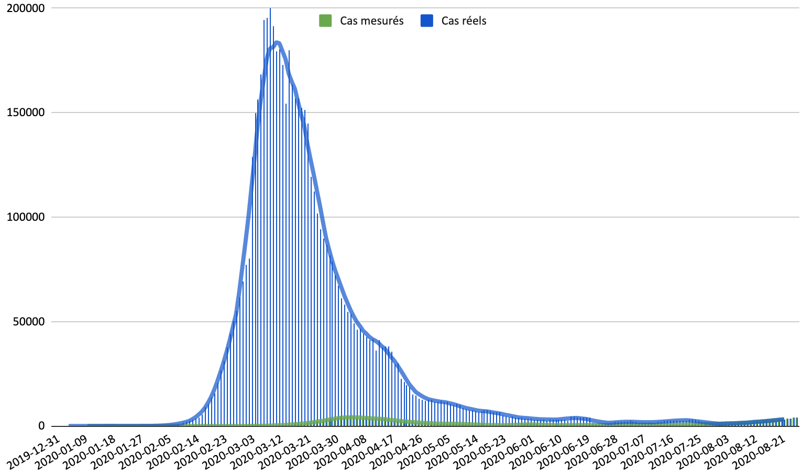
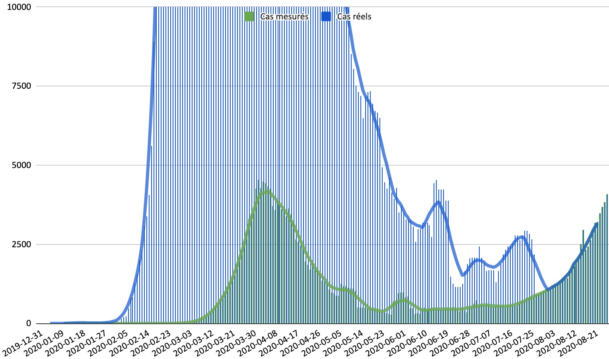
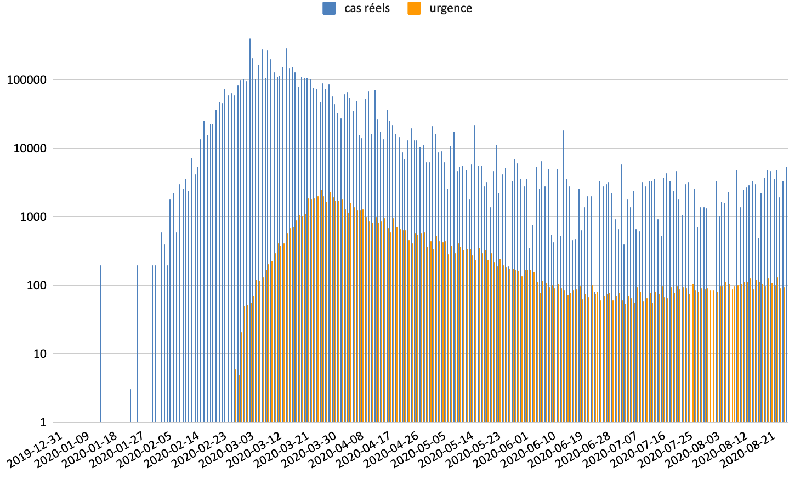

# Covid : nous sommes revenus en février

C’est un peu l’affolement général autour du développement de la pandémie en France, mais peut-être est-il utile de revenir aux chiffres et de constater que ce n’est pas encore la catastrophe partout annoncée.

Nous connaissons mieux le virus. Le taux de mortalité est d’environ 0,5 % et le délai entre une infection et la mort éventuelle est d’environ 31 jours (5 jours pour tomber malade, 5 pour tomber gravement malade, 3 semaines pour décéder).

Quand on a un mort un jour donné, on peut en déduire qu’il a été le malchanceux des 200 personnes infectées 31 jours plus tôt. Ainsi ont peut remonter dans le temps, reconstruire a posteriori le nombre de cas réels que nous avions jour par jour ([j’utilise les données Our-World-In-Data](https://ourworldindata.org/coronavirus/country/france?country=~FRA)).

Quand on regarde cette courbe des cas réels estimés, qu’on la prolonge pour 31 derniers jours avec les cas mesurés, on voit qu’en cette fin août nous sommes loin des niveaux de mars. Mais si on zoome sur la courbe, on voit tout de même que nous sommes dans la même situation que début février (un mois avant le confinement).

Le zoom révèle également les cas effectivement mesurés, qui étaient totalement sous-estimés au printemps. Quand on ne regarde que la courbe verte des cas mesurés, on peut prendre peur, mais cette courbe témoigne avant tout de notre capacité de test. Il faudra attendre fin septembre pour avoir une estimation sérieuse des cas réels en août.

Impossible de savoir si nous sommes au pied d’une nouvelle vague ou si nous allons continuer à osciller comme depuis la fin du confinement. Reste qu’il y a de quoi d’être préoccupé. Allons-nous encore une fois attendre trop tard ? Ne ferions-nous pas mieux de prendre des mesures légères dès à présent ? Ne faut-il pas entamer un déconfinement à l’envers ? Refermer tout ce qui a ouvert en dernier ? N’est-ce pas préférable à des mesures coercitives parce qu’elles arriveront trop tard et impliqueront chacun de nous, en mettant une seconde fois le pays à genoux ? Une chose est sûre, il faut lancer une nouvelle campagne de sensibilisation aux gestes barrières et [arrêter de faire croire que le port du masque généralisé est la solution](france-bombe-a-retardement.md).

Si je cumule tous les cas réels estimés, j’arrive à un peu plus de 6 millions de cas, ce qui signifie que moins de 10 % de la population française a été infecté, ce qui nous place [très loin de l’hypothétique immunité de groupe](../4/le-coronavirus-infecte-nos-cerveaux.md).

Quand je récupère les données des [passages aux urgences pour suspicion covid](https://geodes.santepubliquefrance.fr/#c=indicator&view=map1), je constate que nous en sommes au niveau de début mars, plus de deux semaines avant le confinement, donc durant une période où la situation était encore calme dans nos hôpitaux. Donc dire que tout va bien dans les hôpitaux aujourd’hui est logique, attendu, et n’indique en rien que le virus a muté. Simplement, nous mesurons mieux et constatons que nous en sommes à nouveau en février, à cela prêt qu’il n’y pas pénurie de PQ. Faudra-t-il attendre mi-mars pour réagir ? Ou est-ce que nous en faisons déjà assez pour stabiliser la situation ? J’en doute quand je constate que l’hygiène des mains est la grande oubliées des mesures de prévention. Rappel : les mains véhiculent en gros 75 % des infections (quand on est irréprochable avec l’hygiène des mains, on divise par quatre les maladies nosocomiales).

[Tableau utilisé pour le calcul…](https://docs.google.com/spreadsheets/d/e/2PACX-1vRnmXUbndk354MWaD90XFmO-V4BgNCsU4rRkuZTFJoZCBgSK_cINo4GeLK9OW7wg5DmtAT9opl5Boqy/pubhtml)

#covid #y2020 #2020-8-28-10h12
