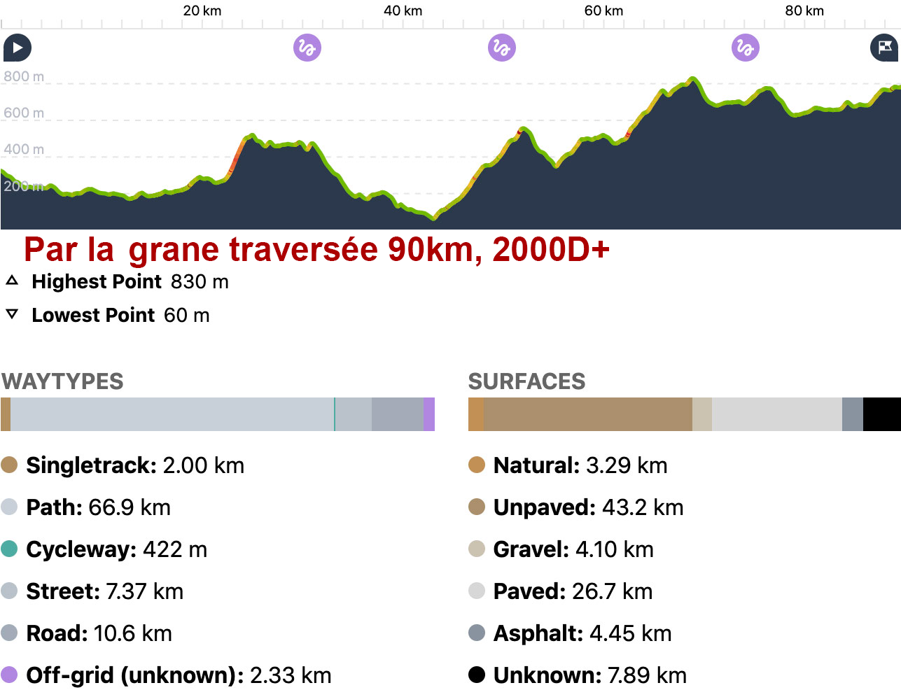

# La trace bikepacking ontologique

Comme nous avons programmé [un 727, c’est-à-dire un grand tour de l’Hérault](/727/) pour [le dernier week-end de septembre](https://www.facebook.com/events/228674601642946/), ce matin je pars en reco sur la partie nord du tracé qui, à mon goût, épouse trop exactement [La grande traversée de l’Hérault](https://sitesvtt.ffc.fr/grandes-traversees/la-grande-traversee-de-lherault/). J’ai envie de quelque chose d’autre, en même temps de me tenir plus près de la frontière du département sans me sentir obligé de plonger vers Saint-Guilhem-le-Désert, cet aspirateur à touristes.

Je prends la route à 5 h 30. Je suis toujours excité dans ces moments comme si je m’apprêtais à découvrir l’El Dorado. J’ai beau avoir étudié les cartes, la réalité du terrain me surprend toujours. Tout au long de la toute, je me demande ce qu’est une trace bikepacking idéale et je trouve une réponse radicale : c’est une trace ontologique, elle se tient elle-même, fait preuve d’une logique interne qui lui donne son identité et la détermine sans que son concepteur ait presque son mot à dire. Dans son *Journal extime*, Michel Tournier écrit :

> L’argument ontologique, excellent exemple (exemple par excellence) de l’attitude du philosophe qui laisse la parole aux êtres, aux choses, aux notions. Ne manipulons pas Dieu, laissons-le nous parler. Et que commence-t-il par dire ? J’existe. C’est à la fois la maïeutique de Socrate et la phénoménologie de Husserl. Phénoménologie : les phénomènes parlent.

Quand j’écris, j’ai parfois ce sentiment que le texte me guide. J’adore cette sensation. Comme je dis toujours qu’une trace est une œuvre d’art, le 727 me prend peut-être le dessus.

Qu’est-ce qu’une trace bikepacking ontologique ?

1. On lui choisit un objet géographique. Le lieu de l’aventure. L’Hérault dans mon cas.
2. On lui choisit une topologie. Un tour pour moi, parce qu’ils nécessitent une logistique minimale comparée à une traversée. Si en cours de route on est fatigué ou a un pépin mécanique, on peut couper pour regagner son point de départ (pour un tour du monde, ça se complique).
3. On lui choisit un mode narratif. Faire le tour de l’Hérault à VTT/monstercross en minimisant le macadam.

La suite découle de ces contraintes, et aussi de l’esprit du traceur. Je refuse…

1. Le tourisme pour le tourisme. Si la trace passe dans des endroits remarquables tant mieux, sinon tant pis, pas question d’effectuer des détours du moment que de beaux chemins passent plus près de la frontière.
2. Pas plus que le tourisme pour le tourisme, je ne recherche la difficulté pour la difficulté. La trace passe où sa logique l’amène et je cherche la meilleure solution pour l’amener au point suivant. Si une escalade permet d’éviter des routes et de réduire la distance, on escalade, sinon on s’en abstient.
3. Je ne veux pas une trace monotone. Par exemple, côté Méditerranée entre Agde et Lunel, on pourrait suivre tout droit les plages et les canaux pendant 80 km, ce qui me paraît barbant.

Je me gare à l’entrée de [Saint-Jean-de-Buèges](https://fr.wikipedia.org/wiki/Saint-Jean-de-Bu%C3%A8ges) peu avant 7 heures. J’ai notamment préparé le parcours grâce [un post de Carnets de Rando](http://www.carnetsderando.net/a-decouverte-de-bueges/), rando pédestre, mais la vidéo m’a permis de prévisualiser le terrain et de savoir un peu à quoi m’attendre quand je serai dans le dur.

Le but de cette reco : résoudre un cas de conscience. [Sur la partie nord-est du 727](https://www.google.com/maps/d/edit?mid=1glqm485m-Oo25P1jFNsgr6k7Z5-bl8AD&usp=sharing), entre [Ferrières-les-Verreries](https://fr.wikipedia.org/wiki/Ferri%C3%A8res-les-Verreries) et [Saint-Michel](https://fr.wikipedia.org/wiki/Saint-Michel_(H%C3%A9rault)), j’ai initialement tracé par la crête du massif de la Séranne (56 km, 1 400D+), mais on m’a signalé que la descente exige pas mal de portage tout en étant caillouteuse et presque jamais roulante. Pas vraiment idéal pour le bikepacking. Le covid interdisant les recos, j’avais en suite choisi la solution de facilité, un copier-coller d’un morceau de la grande traversée nord (90 km, 2 000D+, parfois durs à avaler, exigeant aussi un peu de poussage d’après les copains). C’est plus long, avec davantage de D+, ça suit moins les contours, donc ça ne me plaît pas.

Je me suis mis en tête de trouver mieux. J’ai donc replongé sur la carte, effectué des recherches sur le Net, puis je me suis dit qu’il y avait deux autres possibilités, l’une par le pied sud de la Séranne, la sublime vallée de la Buèges, l’autre par le nord, en surplomb des gorges de la Vis.

Le tracé sud est le plus attirant : il traverse quatre villages, notamment Saint-Jean-de-Buèges, un pur chef-d’œuvre de chaleur, d’ombres et d’eau vive, où on trouve un café, un boulanger et même un réparateur de vélo, point non négligeable lors d’une aventure bikepacking.

Mais ce trajet a un point névralgique. Au bout de la vallée, au cul du [cirque de la Séranne](https://fr.wikipedia.org/wiki/S%C3%A9ranne), il faut grimper sur le causse du Larzac pour rejoindre [Saint-Maurice-Navacelles](https://fr.wikipedia.org/wiki/Saint-Maurice-Navacelles). Est-ce que ça passe à vélo, et pas avec un gros VTT tout-suspendu ?

Au départ, tout roule pour le mieux. Je suis immédiatement sous le charme de la rivière, des vignes et des oliviers. Malgré quelques hésitations, je trouve une trace agréable dans un cadre bucolique à souhait jusqu’à la résurgence de la Buèges d’un turquoise translucide assez exceptionnel.

Je me mange quelques méchantes drailles, trouve moyen de les éviter par un petit bout d’asphalte, puis je n’ai plus le choix, je dois m’attaquer à la paroi rocheuse contre laquelle le chemin serpente. Il est sublime, large, régulier, mais caillouteux. Avec son 10 % presque constant, il est difficile à pédaler. Je finis par me résoudre à pousser presque continuellement sur 3,2 km pour 330D+, après c’est parfait, du velours. Je n’arrive pas à me dire que cette voie est à rejeter. Le paysage est incroyable, le cirque de la Séranne m’ouvre les bras avec les villages et les champs éparpillés dans la vallée.

Au retour, j’essaie un autre passage par le GR74, plus prometteur au début, mais finalement qui s’avère plus étroit et impossible à descendre sans pousser. Il y a bien une troisième draille, mais d’après le topo elle paraît pire que les deux autres, ce que convient Gilles le loueur/réparateur de vélos avec qui je discute avant d’aller boire un verre sous une terrasse ombragée au bord de la Buèges. Je suis monté par la voie la plus facile, si on peut dire.

[Lors du Houblon Tour](bikepacking-brulant-dans-laubrac.md), le troisième jour, j’ai pesté dans une montée à plus de 30 %, certes encore plus caillouteuse que mon sentier, mais trois fois moins longue bien que sans la moindre vue. Qu’est-ce que je dois faire ? Chercher une autre option ou bien prévenir qu’il y aura du poussage, en aucun cas du portage ? Je me tâte et attends des suggestions. Au total cette voie par le pied de la Séranne fait 59 km pour 1 300D+. La voie nord dont je n’ai reconnu qu’un bout est plus courte, 53 km pour 1 250D+, mais moins charmante et plus monotone sans que je sois sûr qu’elle soit plus roulable. J’ai quelques doutes quand je regarde le profil. Je ne suis pas sûr d’avoir envie d’aller m’y casser les dents. Peut-être il faudra… si le poussage rebute… mais ne vaut-il pas mieux un section poussage plutôt que chemin finalement plus galère ? Mieux ne vaut-il pas pousser une bonne fois pour toutes ?

L’ontologique me dit « Va pour le poussage… », c’est bien l’ontologie, ça sonne toujours bien comme mot, ça en jette.

#727 #velo #y2020 #2020-8-15-7h44
