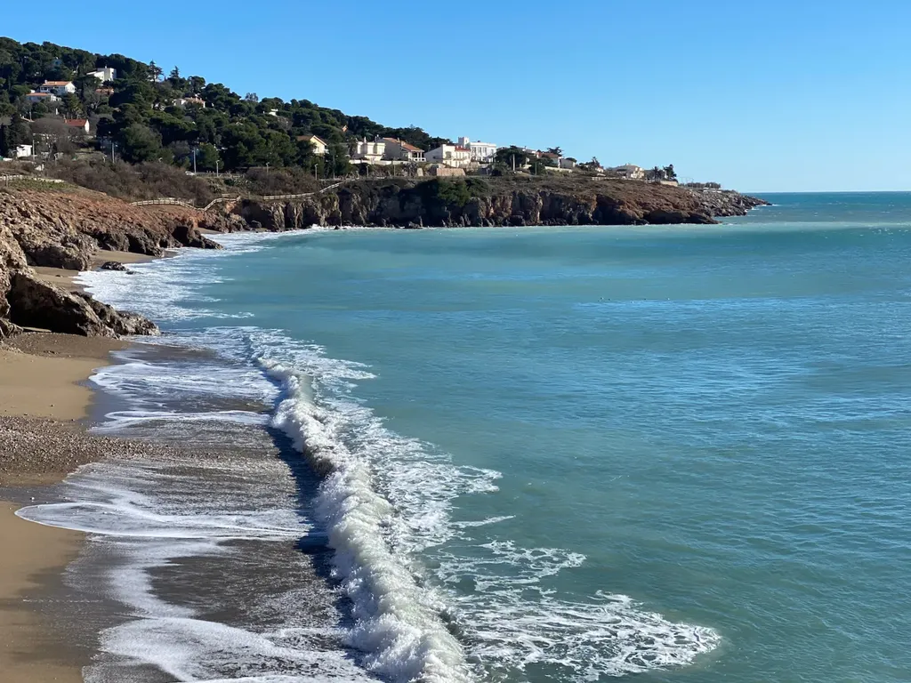
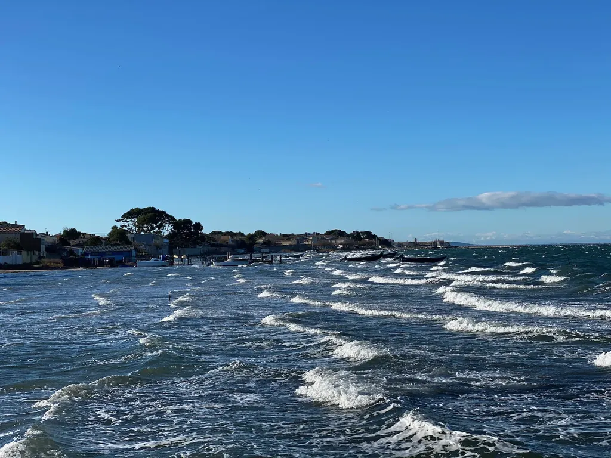
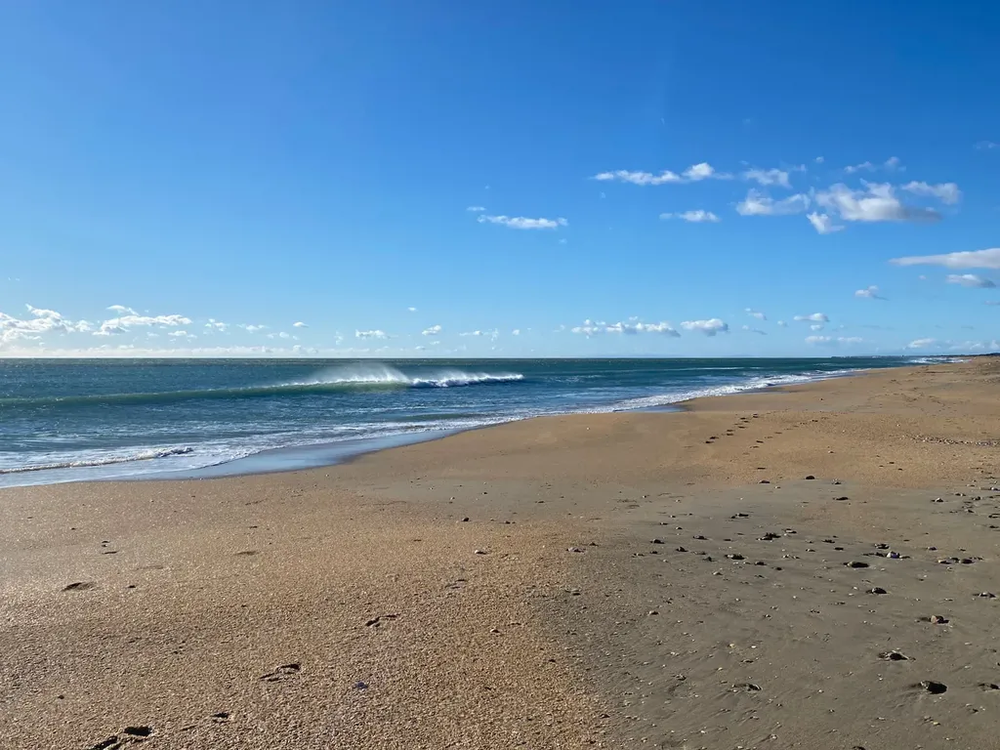
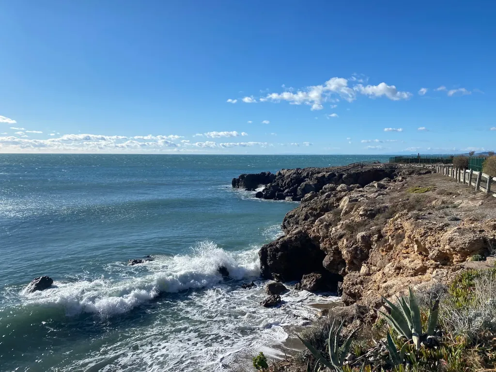
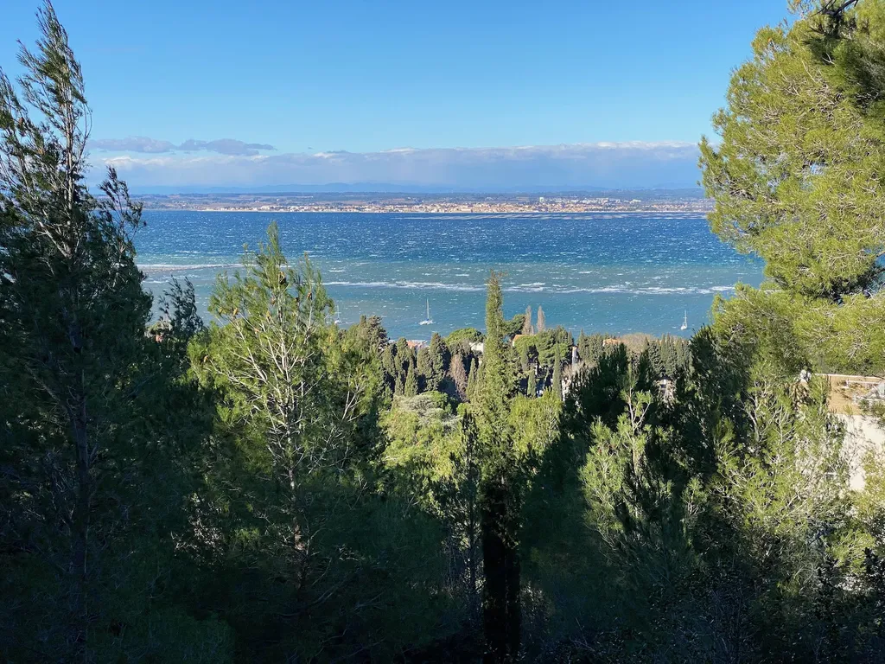
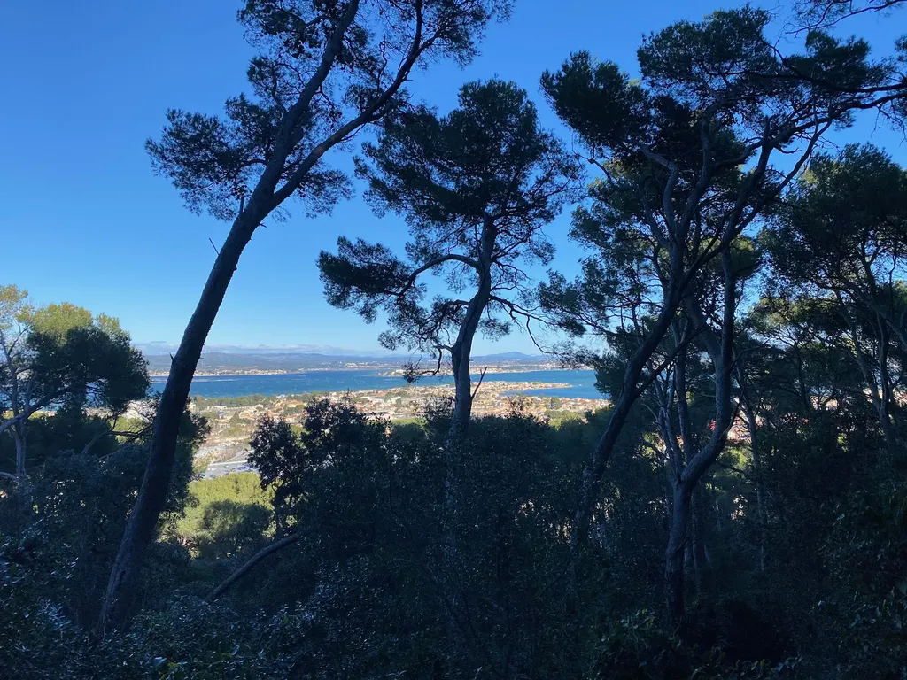
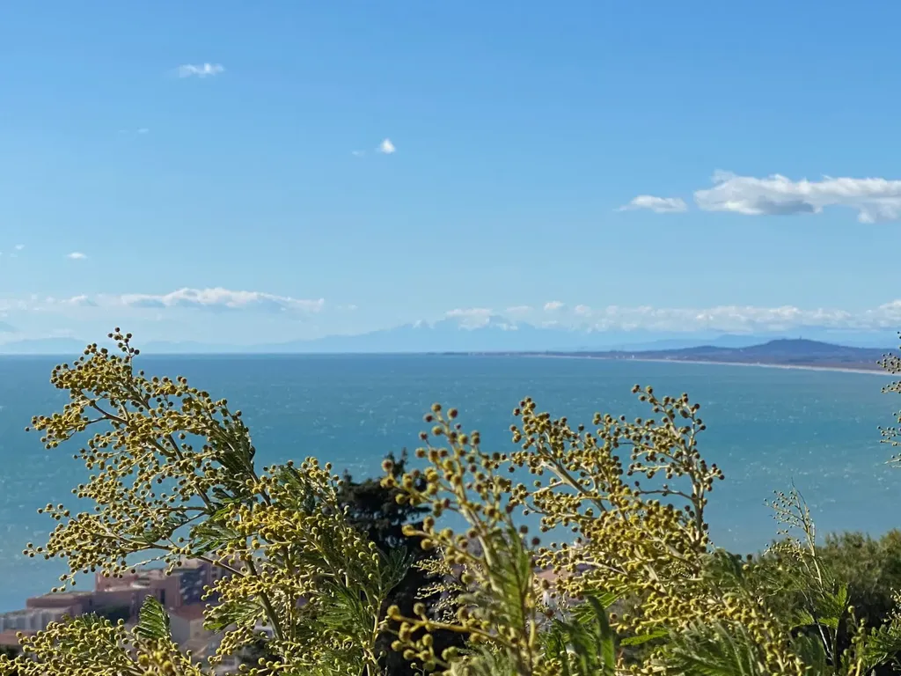
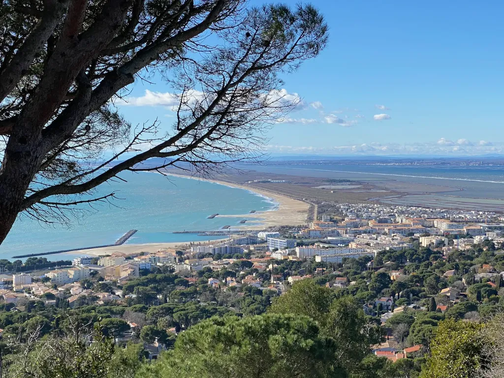

# Sète par les chemins insolites

En traçant [les lignes de désirs sétoises](../../2020/1/lignes-de-desir-a-sete.md), parcours urbain qui préfère aux grands axes les voies peu pensées par les urbanistes, mais adoptées par les citadins, j’ai pris conscience que je ne connaissais pas la ville où je suis né, où j’ai étudié jusqu’au bac et dont je vois la silhouette de cétacé se détacher à l’horizon de l’étang de Thau depuis chez moi. Je ne cesse de la redécouvrir, de la dévoiler par des passes discrètes que se réservent les riverains, parfois si étroites qu’il faut se contorsionner pour les traverser. J’aime les explorer au grès des saisons et des conditions météo, certain que des images nouvelles s’imposeront à moi et que mes yeux s’écarquilleront de stupéfaction admirative, comme si j’étais le premier homme à les contempler.

En ce dimanche matin de janvier, il fait beau, une dizaine de degrés, mais une tempétueuse tramontane nous balaye. Depuis Balaruc, nous nous laissons porter vers Sète par la piste cyclable, vent arrière, et attaquons la boucle côté étang par la pointe Courte, coagulation de maisonnettes blotties les unes aux autres, dos au nord, bordées de cabanes de bric et de broc et d’étendues odorantes de filets au séchage.

Nous longeons la côte, jouant entre les embruns et les rafales qui nous prennent de travers et contre lesquelles nous nous appuyons, au rappel sur nos bécanes transformées à dériveur. Quand nous rejoignons la sinusoïde sableuse du lido, nous manquons dessaler à plusieurs reprises, nos embardées poussant nos pneus à mordre la limite herbeuse qui nous sépare de l’eau.

Dès le premier virage plein sud, le vent se tait illusoirement. Nous gonflons les spinnakers et filons vers la plage léchée par le soleil, la mer frottée à rebrousse-poil par les risées qui décoiffent la houle baveuse. Grand largue, nous mettons cap sur la ville, grignotons le sentier côtier au-dessus des calanques déchiquetées avant de nous diriger vers le mont Saint Clair.

Pas question d’attaquer l’escalade au plus court, nous entamons des préliminaires caressantes. Nous enfilons le chemin des Dames, bientôt arcboutés sur nos montures, la pointe de la selle au creux des fesses, dans les pourcentages à plus de 20 %. Un virage à gauche et nous voilà sur la traditionnelle ascension des Pierres blanches, que nous dévalons d’un souffle pour rejoindre la pinède nord.

La piste ombragée de terre rouge ne nous fait pas de cadeau. Elle redouble de mordant après un replat, mais nous ne la poursuivons pas vers la table d’orientation, nous maintenant au flanc du mont, en lévitation au-dessus des bois, des toits et de l’étang rayé de vagues battues en neige. Le bleu, entre émeraude et écume, entre azur et cobalt, n’est jamais aussi intense qu’en hiver par ces journées venteuses et douces.

Au premier plan, les troncs et les frondaisons des pins découpent des tableaux de maîtres hyperréalistes, à rendre jaloux David Hockney. Nous roulons dans un musée à ciel ouvert, jusqu’à rejoindre le chemin de la Craque, dans lequel nous nous échinons, les yeux rivés à l’asphalte, avant de bifurquer sur la gauche, dans le passage secret de la Huppé, qu’il est facile de manquer, car les murs de pierres de part et d’autre se colorent identiquement de gris, et se fendent d’un interstice à sens contraire de la montée, invisible même à celui qui sait sa présence.

Nous nous faufilons dans ce boyau champêtre jusqu’à plonger dans le chemin du Glacis, étroite ruelle entre des maisons en balcon sur la ville, qui s’achève par une volée de longues marches joueuses. Mais pas de répit, virage à droite, et nous repartons à l’attaque, nous glissons dans un autre improbable lacis, puis dans une sente herbeuse, oubliée, négligée, d’une sauvagerie amazonienne, clôturée par un escalier, en haut duquel subsiste le chambranle d’une porte qui nous fait basculer dans un autre monde, celui plus civilisé des rues et des commerces.

Nous léchons le lycée Paul Valéry, rejoignons le secteur piétonnier, avant de zigzaguer entre quartiers bas et hauts, les rues latérales ouvrant des perspectives sur le port, aux saturations estivales. Nous le laissons dans notre dos et escaladons le flanc sud de Saint Clair, traçons un trait entre les deux parties du Cimetière-Marin, débordement d’extravagances baroques découpées par les sobres pinceaux des cyprès noirs.

Sous le phare, nous nous arrêtons pour admirer un immense cargo au mouillage, avant de zigzag en zigzag nous trouver au pied de la Chabanette. Nous serrons les dents. Les pourcentages sont titanesques. À chaque coup de pédales, la roue avant se lève. Ne pas s’énerver, ne pas tout donner, virer de droite à gauche pour casser la pente qui atteindrait par endroit les légendaires 40 %. Nous passons de justesse, goûtant presque avec plaisir les 20 % qui nous conduisent enfin au sommet, où malgré le vent des touristes se photographient.

Nous redescendons vers le promontoire des Pierres blanches, que nous abordons par le haut de la pinède nord, jetons un dernier regard à l’étang, avant de revenir dans le soleil méditerranéen. Nous furetons entre les villas étagées, chacune s’offrant une vue imprenable sur le cordon littoral et le Canigou enneigé lévitant vers le large au fronton de la chaîne des Pyrénées.

Sans jamais passer deux fois au même endroit, nous rejoignons la Corniche et la mer. Le vent favorable nous ramène vers la ville, que nous traversons le ventre vide, pressés de rentrer chez nous, d’autant que nous faisons du surplace dans les bourrasques démoniaques. Pas un temps à mettre des cyclistes dehors, mais nous sommes ivres de lumière, et déjà prêts à de nouvelles aventures en terres d’autant plus inconnues que nous croyons bien les connaître. Nous avons encore en tête des noms magiques. Rue rapide. Quai de la Dorade. Chemin de l’Équinoxe. Impasse du Roitelet. Nous ne sommes pas des cyclistes, mais des poètes.

#mini_aventures #velo #y2021 #2021-1-25-9h28
