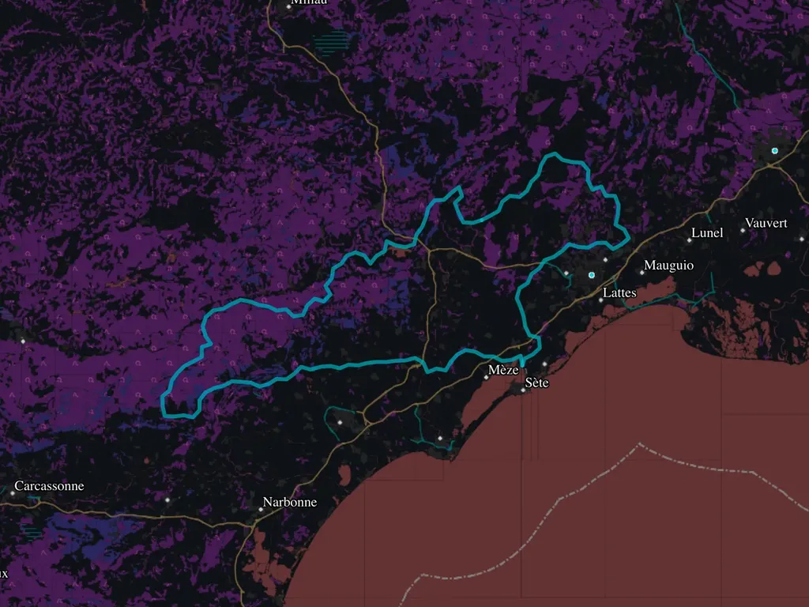
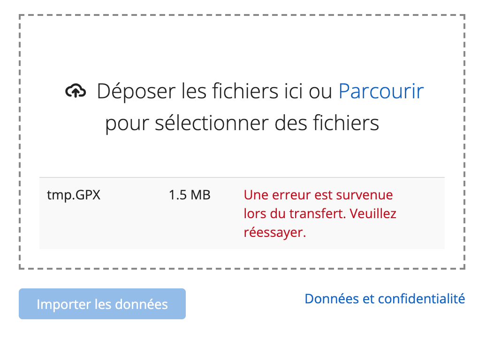
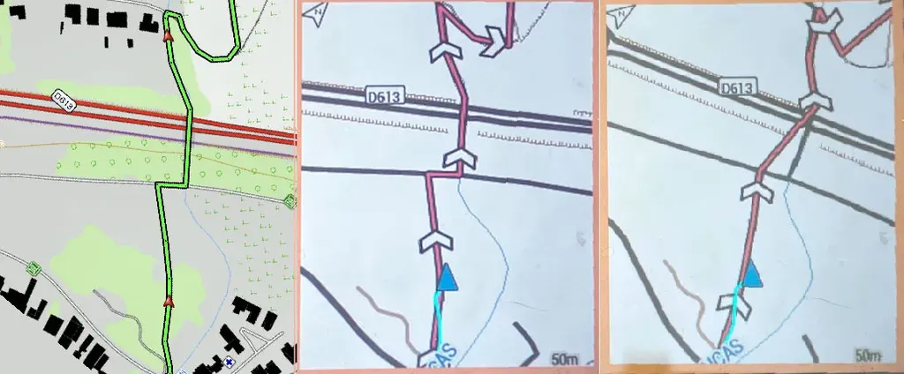
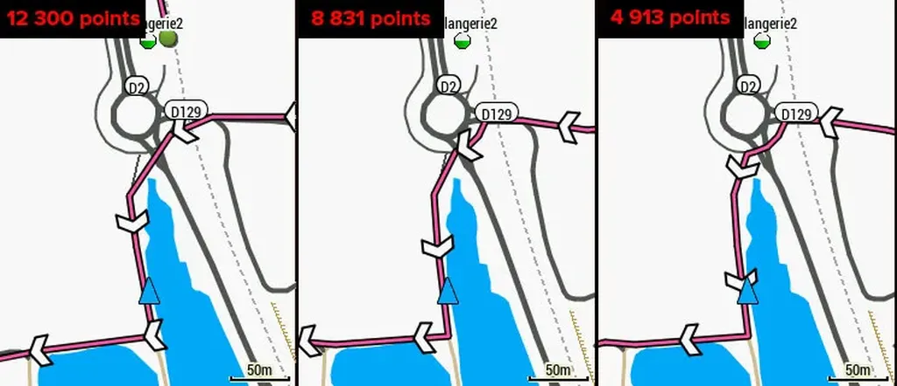

# Garmin : au-delà de 8000 points, votre trace n'est plus valable

Si comme moi vous roulez des traces créées avec [Garmin BaseCamp](https://www.garmin.com/fr-FR/software/basecamp/), l’outil de dessin le plus puissant à notre disposition, bien plus performant que les services en ligne, vous êtes peut-être tombés sur un bug des plus ennuyeux, parce qu’il survient sur le terrain, une fois bien engagé sur la trace.

J’ai découvert le problème peu de temps [après avoir troqué mon Garmin 820 contre un 530](../../2020/10/pourquoi-jai-rachete-gps-garmin/?swcfpc=1.md). Lors d’une sortie, après une vingtaine de kilomètres, ma trace manquait de précision, des secteurs entiers étaient remplacés par des lignes droites. Une amie qui roulait avec un 1030 avait le même problème, pendant que tout fonctionnait normalement avec les Wahoo.

J’ai cru à un bug intermittent, puis il s’est répété plusieurs fois, j’ai fini par constater qu’il était fréquent, souvent assez insignifiant pour ne pas trop me déranger. Je ne décide de comprendre cette affaire qu’à la veille de m’engager avec les copains dans une [i727](https://tcrouzet.com/i727).

Quelques recherches en ligne me font tomber sur une note, [selon laquelle des points peuvent manquer quand on crée une trace routière avec une carte et l’envoie vers un GPS équipé d’une autre carte](https://support.garmin.com/en-US/?faq=ZWxU2CxR7d4U7adcx1RDJ8). Pour le vélo, surtout le VTT, c’est absurde, parce qu’une trace GPX est une liste de coordonnées GPS, sans aucun lien avec la carte. On doit pouvoir rouler partout, même sur l’eau. Reste que mon problème n’est pas isolé, les traces peuvent perdre des points, parfois beaucoup trop de points.

### Premier bug

Pour tester si une trace générée par BaseCamp est valide ou non, j’ai initialement pensé avoir découvert une méthode : je l’enregistrais en GPX et tentais de la charger dans [Garmin Connect](https://connect.garmin.com/modern/import-data). En cas de refus, je supposais que, si j’envoyais directement sur le GPS cette trace, j’aurai des problèmes. À noter que Garmin Connect peut refuser une trace, mais pas mon 530.

En revanche, si je publie ma trace sur [OpernRunner](https://www.openrunner.com/), la télécharge, puis la charge sur Garmin Connect, je n’ai aucun problème. De toute évidence OpernRunner corrige quelque chose dans la trace (mais pas [Calculitineraires](https://www.calculitineraires.fr/), [GPSVisualizer](https://www.gpsvisualizer.com/convert_input), [VisuGPX](https://www.visugpx.com/), [GPSviewer](https://fr-fr.gps-viewer.com/), [AllTrails](https://www.alltrails.com/fr/converter/), Strava ou UtagawavVTT).

Pourquoi est-ce que ça marche avec OpenRunner et pas avec la plupart des autres applications ? J’ai dû plonger dans le XML des fichiers GPS pour comprendre. OpenRunner horodate les traces, c’est-à-dire qu’il leur ajoute des temps de passages aux différents points, même s’il n’en existe pas sur la trace originale. Garmin Connect a donc besoin de fichiers horodatés (et, sauf erreur, BaseCamp ne sait pas en produire). Mais voilà qui n’explique pas la disparition des points.

### Second bug

Sur l’i727, j’ai constaté que ma trace, bien que validée par Garmin Connect, continuait à prendre quelques liberté avec mon tracé. Une fois de retour, j’ai chargé plusieurs versions de la trace sur mon 530 et j’ai comparé leur rendu sur le terrain.

L’image ci-dessus montre le fichier source sur fond IGN tel que visualisé sur BaseCamp, puis son rendu sur le Garmin, dans le premier cas relativement fidèle quand la trace a été récupérée sur OpenRunner, dans le second très approximative quand elle passe par les autres services ou même provient directement de BaseCamp.

J’ai ouvert les fichiers GPX pour les analyser. Si la source comporte 12 323 points sur BaseCamp, le fichier OpenRunner n’en comporte que 9 325 ! Voilà déjà qui explique pourquoi le tracé OpenRunner est moins précis que l’original. Problème, les autres fichiers comportent davantage de points tout en étant moins précis.

Et si, au-delà d’un certain nombre de points, les GPS Garmin simplifiaient la trace sans avertir l’utilisateur ? Je suis retourné sur le terrain avec la trace de l’i727 grandement raccourcie, et là, miracle, le rendu était parfait. Le problème n’est donc pas une question d’horodatage, mais d’un nombre de points au-delà duquel le Garmin filtre la trace, un peu au petit bonheur.

L’image ci-dessus montre comment la trace se dégrade quand le nombre de points augmente. D’après mes estimations, sur mon Edge 530, la zone de filtrage survient au-dessus des 8 000 points, même si Garmin Connect accepte des fichiers [allant jusqu’à 99 999 points](https://support.garmin.com/en-US/?faq=EWm0A6dgWu2OTV4bVYXWK6).

Moralité il faut découper les traces pour que les GPS Garmin les affichent correctement alors que les Wahoo s’en tirent parfaitement dans tous les cas. Si sur route le filtrage cause rarement des problèmes, il devient pénible dans les secteurs VTT avec beaucoup de singles, ce qui entraîne sans cesse des hésitations, surtout en bikepacking. [Je me suis donc bricolé une petite appli pour découper automatiquement mes traces.](https://bikepacking.000webhostapp.com/gpx/)

#gps #velo #y2021 #2021-10-3-10h43
