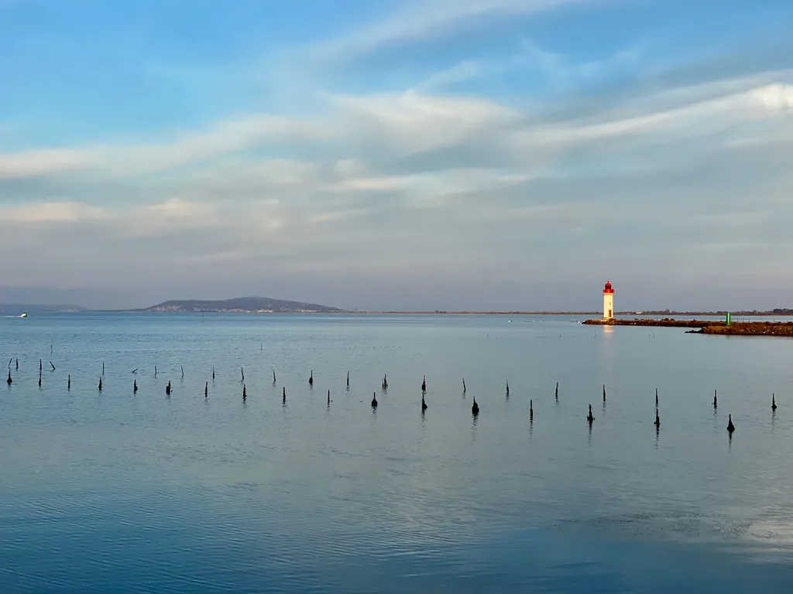

# Bikepacking côté sud - projet open source

L’idée est simple : créer une trace VTT qui suivra la côte française méditerranéenne, de Cerbère à Menton. Je me dis que ce serait une belle trace à faire en hiver, quand il n’y a pas de touristes.

Dès qu’une fenêtre météo se présentera et que des copains seront dispo, j’espère effectuer la partie de Cerbère à Sète, soit 280 km pour 1 800 m de dénivelé. J’ai tracé la partie entre Cerbère et Narbonne en compilant des traces trouvées à droite à gauche, ainsi qu’à l’aide le l’IGN. Elle est donc hautement prototype. La suite jusqu’à la Grande-Motte m’est beaucoup plus familière et je connais de nombreuses variantes.

Comme toujours, je suis partisan de l’open source et du libre. Qui veut collabore, qui veut récupère la trace, la modifie et l’améliore. Si vous connaissez de belles traces côtières, si vous habitez dans les secteurs côtiers, n’hésitez pas à me proposer vos traces.

Le but est de rester près de la côte, mais de ne pas manquer les plus beaux singles et chemins du proche arrière-pays, surtout quand ils offrent de beaux points de vue sur la mer ou les étangs.

[Je compile les bouts de traces sur Google Map.](https://www.google.com/maps/d/u/0/edit?mid=1WYAQBQ99C0y6GUGgSZJh8FekCyQr1U3a&usp=sharing)

#bikepacking #cotesud #velo #y2021 #2021-11-10-21h25
