# Octobre 2021

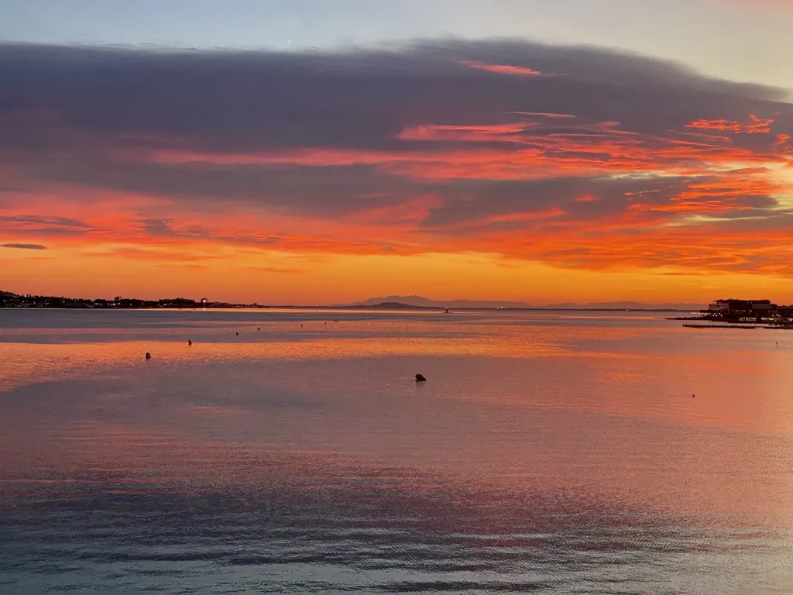

### Vendredi 1er, Balaruc

Je travaille, me déroute de ma tâche en cours, bientôt avec la sensation de transporter quelque chose de lourd, et je repense que j’ai interrompu un copier-coller. La mémoire de mon ordinateur devient un peu la mienne.

---

Je lis un roman de la rentrée, répondant à une demande. J’ai le plus grand mal. Le texte roule, mais je ne sais pas vers quelle cible part la flèche. Je dois faire confiance à l’auteur, les yeux fermés, alors que son style seul ne suffit pas à me tenir. Des pensées, il n’y en a point. Lire pour lire. Je n’ai pas besoin d’un tel placébo, ou au milieu de la nuit, et encore je choisis des aventures, souvent en anglais, pour les rendre plus mystérieuses.

### Samedi 2, Balaruc

J’écris un texte pour Didier, une conférence qu’il doit donner sur un sujet philosophique plus que médical. J’aime être son ghost writer, par plaisir, parce que la contrainte me stimule. En trois heures, dix pages surgissent sans souffrances, et arrive une conclusion : la méthode scientifique ne peut fonctionner sans transparence.

---

Je regarde *Foundation*, décevante série guimauve inspirée d’Asimov. Je persiste par nostalgie de mes lectures d’adolescence. Lointain futur, villes tentaculaires, comme si notre avenir ne devait pas être tout autre. Rien ne tient dans cette projection. Après trente ans sur une nouvelle planète, des pionniers en sont encore à vivre dans des yourtes alors qu’aujourd’hui, en Chine, dans la même durée, on construit des villes de plusieurs millions d’habitants.

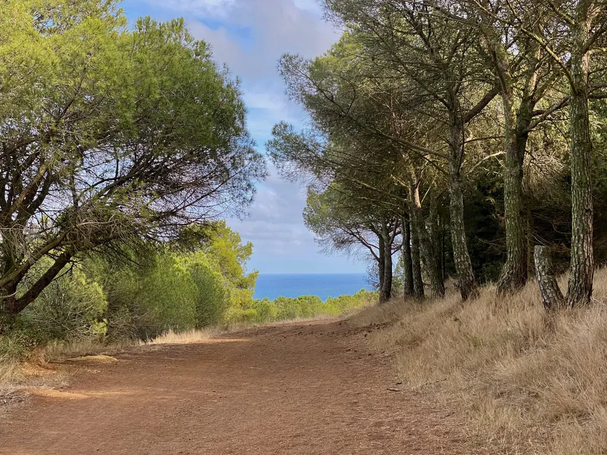
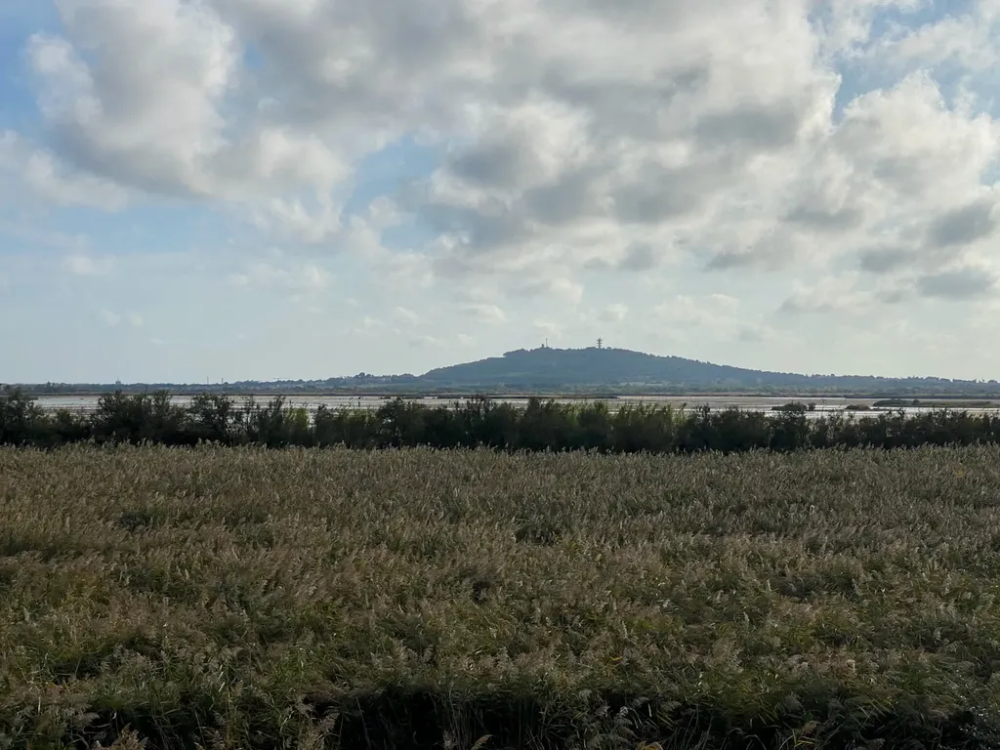
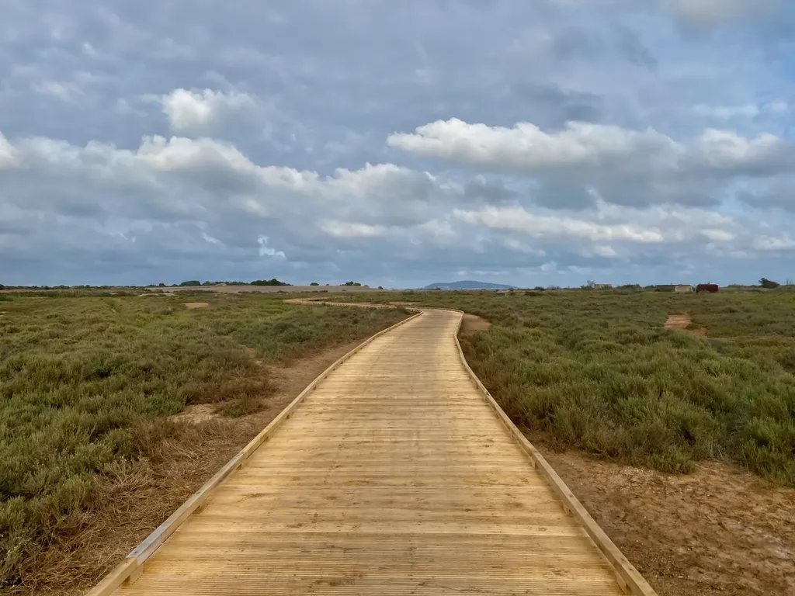

### Dimanche 3, Balaruc

Mort d’une crapule, éloge médiatique d’une crapule, obsèques nationales pour une crapule… parce que nous aimons les histoires, même les plus sordides. Nous préférons les escrocs aux honnêtes gens sans histoire. Nous ne voudrions pas que nos vies ressemblent aux leurs, mais à travers leurs vies nous nous imaginons d’autres existences.

### Lundi 4, Balaruc

Des amis, souvent des créateurs comme moi, me sollicitent pour lire, écouter, regarder, et je n’ai pas le temps de penser à autre chose qu’à mes propres créations. J’en suis frustré, mais trop préoccupé par ma propre route. J’ai même du mal à relire pour la dernière fois *One Minute*.

### Mardi 5, Balaruc

Sortie vélo, préoccupée par un grincement. Je bois un coup, lâche la gourde, roule dessus, le vélo se couche, je m’éjecte, saute devant, me reçois un peu lourdement sur mon pied gauche, mon genou se tord légèrement, petite douleur qui ne m’empêche pas de rentrer en pédalant, mais j’espère que je ne vais pas être handicapé pour les quatre jours de bikepacking qui arrivent.

### Lundi 11, Balaruc

[Je rentre de la boucle à VTT, le genou a tenu](../10/bikepacking-dans-lautomne-flamboyant-du-midi.md), la lumière translucide de l’automne a aidé, je me retrouve face au vide attendu. Les deux derniers tomes de *One Minute* à relire et je serai sans projet.

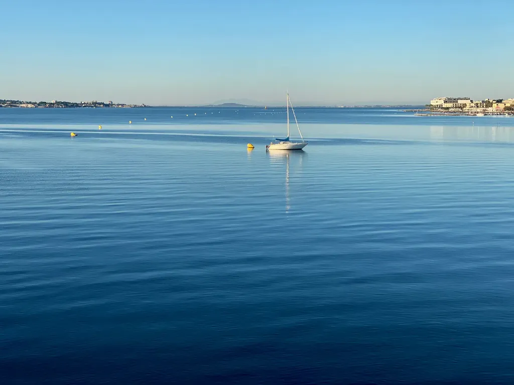
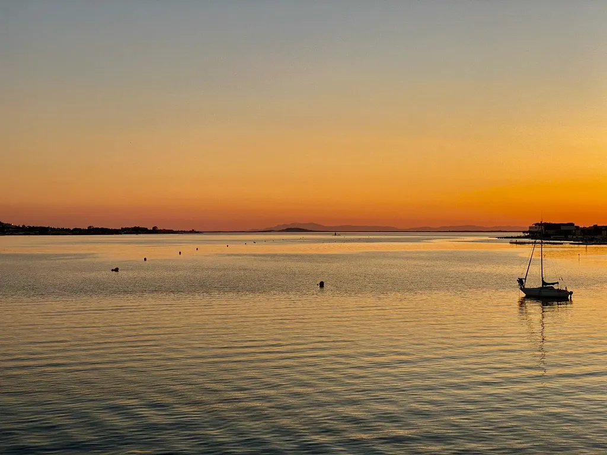

### Mardi 12, Balaruc

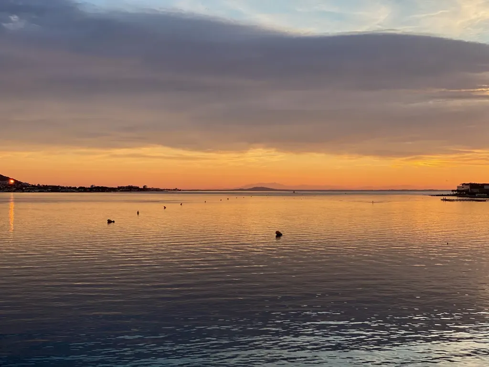
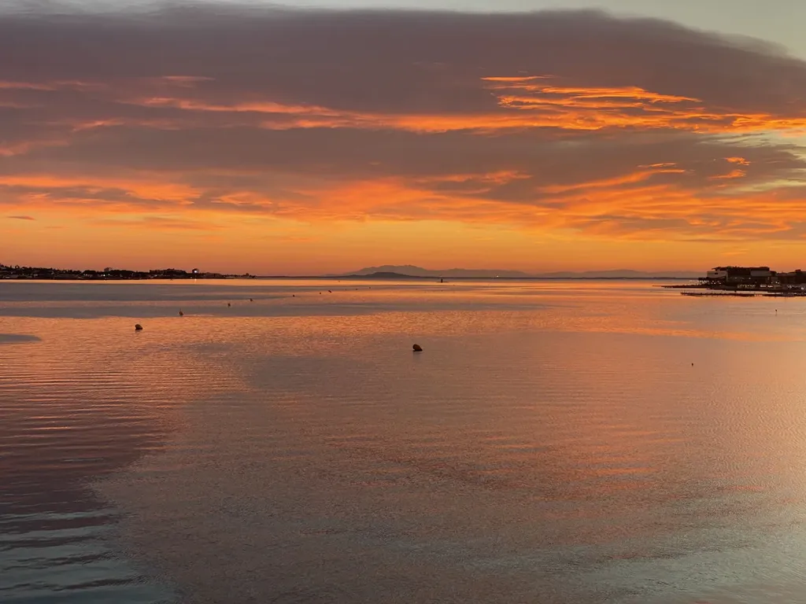

### Mercredi 13, Balaruc

Je dépile l’administratif, repousse le moment du grand saut dans l’inconnu. Je ne suis sûr que d’une chose : je ne sais pas ne rien faire.

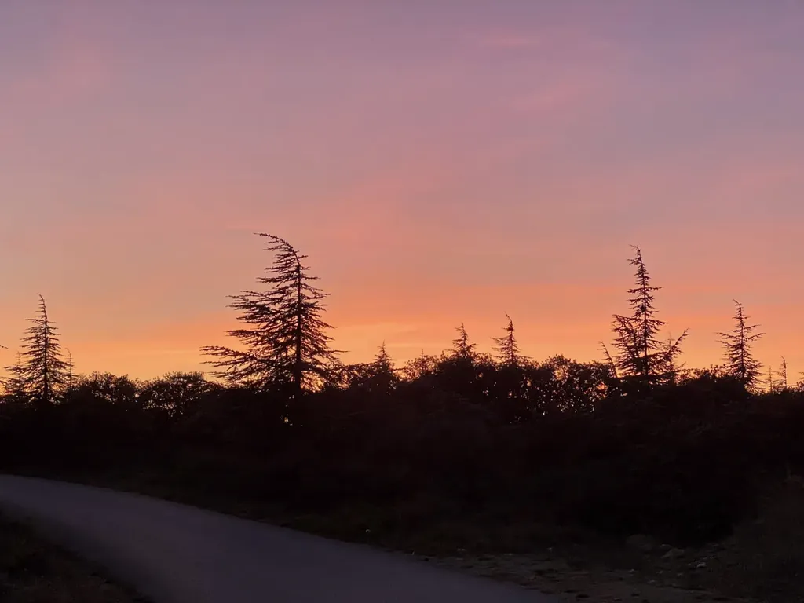

### Jeudi 14, Balaruc

Parfois, j’ai peur de ne plus jamais avoir d’idée, ou plus d’envie d’expérimenter, ou seulement de voyager à vélo avec les amis pour jouir des paysages construits par nos ancêtres, et me contenter de les célébrer, comme d’autres célèbrent la littérature ancienne.

Alors qu’est-ce que je laisse à mes fils, à mes successeurs ? Mon regard est-il seulement nostalgique ? Peut-être pas parce que je l’exerce du point de vue nouveau de bikepacker, peut-être est-ce l’expérimentation d’une nouvelle modalité existentielle. Un mélange de haute technologie et de respect de l’environnement, une façon de déplacer son corps dans l’espace, de poser son regard sur les paysages en prenant le temps de les respirer, de dormir où la nuit attrape, les yeux tournés vers les étoiles. Et de ressentir un manque dans le confort de la maison, de l’appartement, de l’écran d’ordinateur. Les œuvres issues de ces boîtes m’étouffent, parce qu’elles ont d’abord étouffé les esprits qui les ont produites, les privant d’oxygène, d’une forme de stupéfiant, oui, la nature devient mon héroïne, j’y suis addict. Pas tant à la nature qu’aux paysages, à la nature transformée en jardin par les mains de nos ancêtres, qui l’ont sillonnée de chemins, pour leur usage utilitaire, désormais comme route pour nos rêveries. L’œuvre est son interprétation. Je l’interprète quand je trace à sa surface des explorations. Il y a du *Jeu des perles de verre*. Une infinité de combinaisons, un art qui s’en dégage, non pas à exposer dans un musée, mais à vivre par son corps et toutes les jouissances possibles.

Je suis au-delà de la littérature, au-delà du jeu de rôle, je les embrasse, les généralise. Peut-être n’ai-je pas d’idée dans les formes anciennes, parce qu’autre chose me bouleverse désormais, et que revenir à des histoires à lire dans un canapé ou un lit, ou même sur un banc public, ne m’excite pas beaucoup. J’aspire à un art total, et cet art exige l’engagement du corps autant que de l’esprit. Cet art échappe à la numérisation, à la commercialisation, à la collectionnite, il ne peut que se vivre, donc que toucher de véritable amoureux. Cet art a son langage, la trace, une espèce de scénographie pour les spectateurs/acteurs.

Je ne fais pas les paysages, je les choisis : les collines, les chemins, les forêts sont les mots de mon nouveau langage, alors les relier pour que le passage des uns aux autres provoque des émotions. Je suis un DJ qui a troqué la palette sonore contre celle des paysages. Je compose une œuvre en trois dimensions, même en quatre, puisqu’elle exige le temps, en cinq, parce qu’elle dépend des conditions météo, de la lumière, même de la condition physique du spectateur/acteur.

Ma quête esthétique est hors des livres, des musées, des cinémas, ma quête est dans l’espace géographique, à la surface de Gaia, ma quête est écologique, engage comme les jeux vidéo engagent mes fils. Il y a une parenté, une nouvelle dimension de l’art, qui comme toujours a des origines anciennes, Stevenson et son voyage dans les Cévennes, par exemple.

[Quand j’ai écrit mon dernier récit](../10/bikepacking-dans-lautomne-flamboyant-du-midi/?swcfpc=1.md), je me suis dit que je me répétais. J’ai commencé par dire que la littérature venait après le voyage, mais la littérature n’est qu’un compte rendu d’une œuvre interprétée par nous, que d’autres interpréteront à leur tour. S’il y a œuvre, c’est la trace, comme le GR70 est l’œuvre de Stevenson plus que le *Voyage avec un âne dans les Cévennes*. Les textes ont pour ambition de provoquer des envies, de célébrer l’expérience, de l’intensifier rétrospectivement et prospectivement, au nom de celles qui suivront.

Je pourrais m’arrêter là. Revenir à la carte, imaginer d’autres traces, l’envie est violente, je la réfrène, contaminée par une idée ancienne de l’art et de la littérature, aussi parce que mon existence d’auteur tient à une vieille industrie qui n’a pas idée d’à quoi je passe mon temps, dont ses acteurs ignorent nos jouissances. Je reste faible, attaché à une petite reconnaissance, j’ai envie parfois d’imiter comme les autres, de revenir à la norme. Alors j’attends l’idée d’un livre, avec la certitude dérangeante que la beauté est ailleurs, à moins que je ne réussisse un tour de passe-passe qui m’échappe encore.

Une sorte d’horreur du bureau d’écrivain s’empare de moi, avec ses piles de bouquins, ses paperasses, aussi désormais ses ordis et autres gadgets. Je leur trouve un côté aliénant quand je les vois en photo, comme si je pénétrais dans des labyrinthes tortueux, comme si je tombais malade, comme si je manquais d’oxygène pour respirer. Cet environnement me déplaît parce que ceux qui les créent trouvent leur oxygène à travers les écrans, les textes. Leur bureau est leur vaisseau pour voyager comme le vélo pour moi, mais il dit une histoire trop sédentaire, qui ne peut qu’avoir une influence sur l’art produit, celui d’un temps révolu, et auquel l’humanité s’apprête à tourner le dos.

Je suis heureux dehors, la littérature devrait faire sortir, arracher à la pensée normée comme à l’existence normée. Elle devrait pousser sur la Terre, à cette seule condition nous la respecterons, nous nous respecterons. Le bureau d’écrivain n’est ni plus ni moins qu’une carapace, comme la carrosserie d’une voiture, qui fait croire aux conducteurs qu’ils sont des chevaliers et les pousse à ne pas respecter les autres usagers de la route.

Je devrais écrire un manifeste pour une littérature en extérieur. Par ma fenêtre, sur l’étang immaculé, un pêcheur à la ligne, deux traînières strient l’or bleu. Je me dis que les rameurs sont en cet instant les plus heureux des humains. Les œuvres d’art peuvent simuler leur émotion, elles ne peuvent pas l’être. L’art, après avoir été premier dans ma vie, passerait au second plan ? Ai-je trouvé plus fort stupéfiant ?

### Vendredi 15, Balaruc

Société violente, littérature violente, cinéma violent, parce que nous avons besoin d’action pour nous sentir vivre, alors le vélo de voyage comme action pacifiste. Faut remplir tous les capteurs, satisfaire tous les désirs. L’art contemplatif n’a plus sa place dans une société en apparence pacifiée. Il répondait à la guerre par contre-point. Quand la guerre est larvée, souterraine, dans d’autres vies que les nôtres, nous avons besoin d’un art dynamique, celui des jeux vidéo comme de la trace.

---

Je lis des autobiographies et elles me parlent mieux que toutes les fictions. On n’est jamais aussi pertinent, et aussi littéraire, que quand on se raconte, tant bien même on se connaît mal, se comprend mal. Cette forme importe autant pour l’auteur qui part à la découverte de lui-même que pour ses lecteurs qui ajoutent une vie à la leur. Grand plaisir à lire Dan Fante. Et si j’ai envie d’écrire sur d’autres que moi, c’est pour à travers eux tenter de mieux me comprendre moi-même. La démarche est identique. Je veux continuer de grandir, les années de devant sont toujours mystérieuses, je n’ai pas la clé, et lire les histoires des autres me forme. Quand elles ne font que me distraire, elles me tombent des mains.

---

Petite rencontre autour de *Résistants* à la médiathèque de Bédarieux. La bibliothécaire a parlé superbement de mon livre, je l’avais presque oublié.

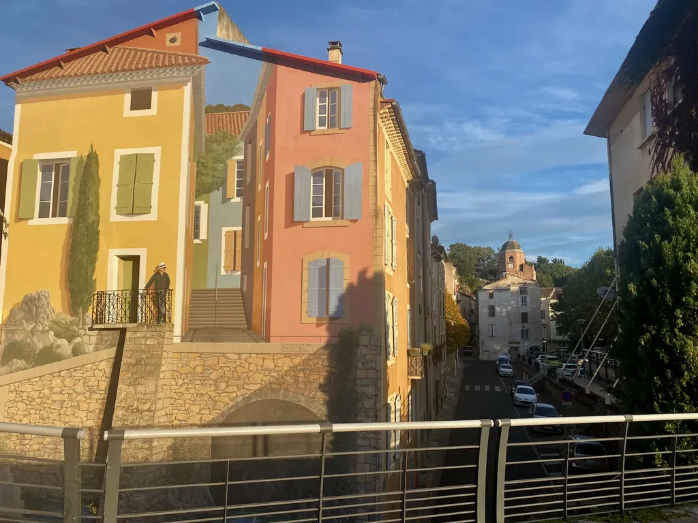

### Samedi 16, Balaruc

J’aime lire la vie de Dan Fante parce qu’elle n’a rien de semblable à la mienne, aucun point de recouvrement, sauf la littérature. Drogue, ivresse, sexe, violence, débauche extrême. Je les expérimente par procuration comme d’autres en lisant mon autobiographie expérimenteront ma quête esthétique, la recherche d’une transcendance, d’un objet imaginaire quasi mystique. La vie de Dan Fante comme une métaphore de notre saccage du monde. Je mène une vie plus respectueuse de moi-même et de l’environnement. L’ironie : l’histoire se termine toujours de la même façon. L’attitude de Dan Fante finissant par être la plus rationnelle.

---

La trace est l’œuvre et le récit que sa description. Impression de tourner en rond quand je raconte mes voyages, à la fois de rendre compte de la trace avec une certaine neutralité, lui ajoutant les circonstances particulières de son interprétation.

### Dimanche 17, Balaruc

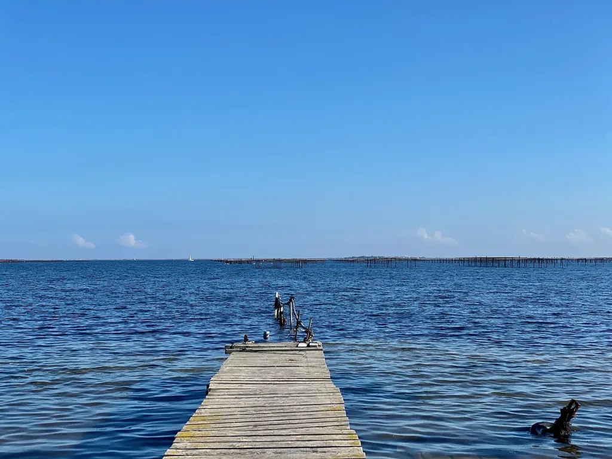
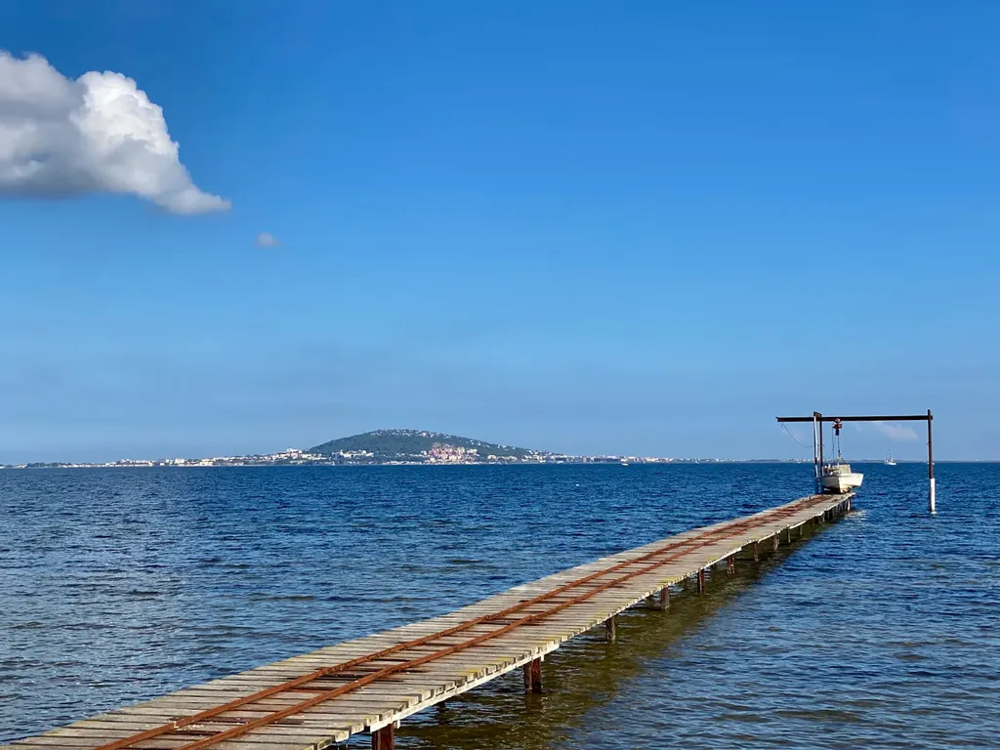
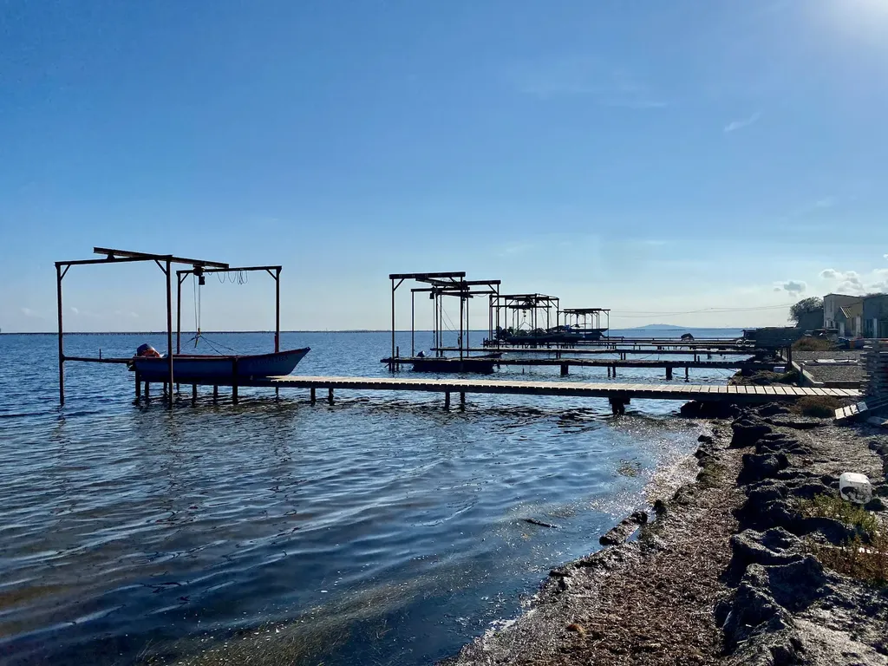

### Lundi 18, Balaruc

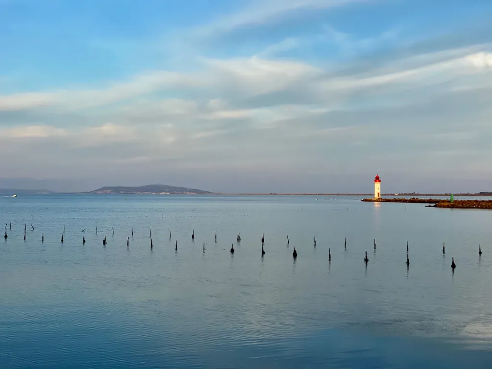
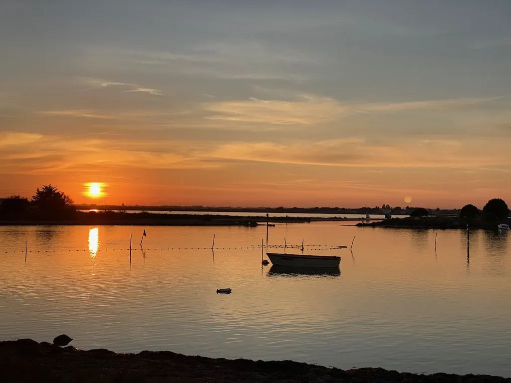
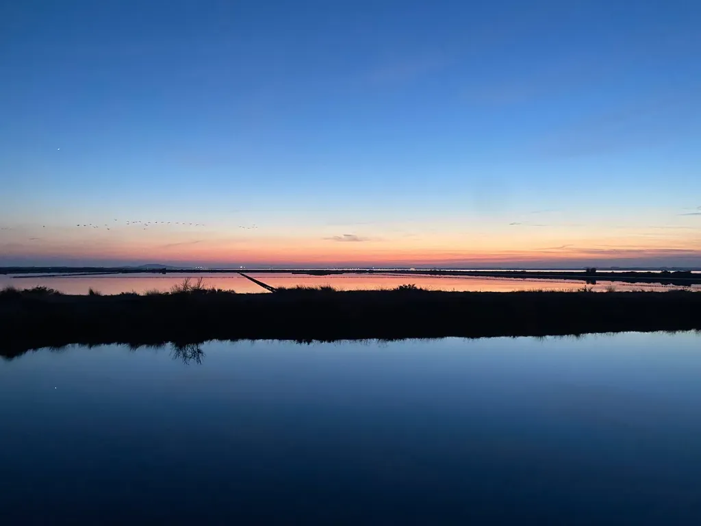
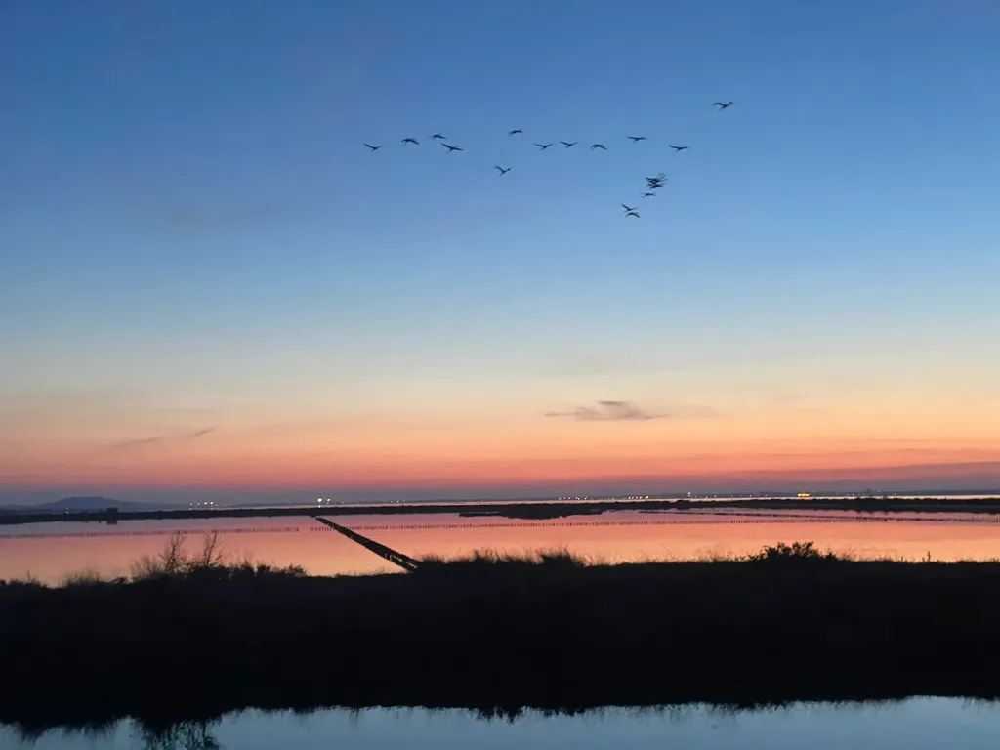

### Mardi 19, Balaruc

Je me sens penser différemment, plus lentement, plus linéairement. Mon cerveau se transforme plus que mon corps. Les idées ne s’empilent plus. Je navigue dans une mer d’un calme terrifiant, comme si jamais plus de tempêtes ne la secoueraient.

---

J’ai regardé la série sur Orelsan, rapeur dont j’ignorais tout, jusqu’au nom avant de regarder le reportage de son frère sur son ascension médiatique. Sa musique ne me touche pas. Dans le même temps, j’ai écouté un podcast de France Culture sur le Velvet. Médiocre, où on recouvre la musique du Velvet par la voix d’une lectrice et d’un traducteur, ridicule montage.

John Cale a l’intention de s’inscrire dans l’histoire de la musique, d’être après Beethoven et consorts. De faire une œuvre radicale. Orelsan est dans l’histoire du rap. Il ne décroche pas de la son genre. Mais son histoire me parle comme tout récit initiatique. J’aimerais que mes fils regardent ce reportage intimiste. Le gamin un peu gras, un peu mou, un peu fainéant, devient au fil des années une bête de scène et un travailleur infatigable. On voit comment une fois une vocation trouvée et assumée, on peut se transcender. Certes le succès aide, mais il n’est pas indispensable, comme j’ai essayé de le raconter dans mon autobiographie. Ce documentaire est la plus belle chose que j’ai vue depuis longtemps. Il tient parce qu’il a été filmé dans la durée, sans idée préalable de la destinée d’Orelsan.

---

Je lis une célébrité du business (encore par obligation). Il dit avoir changé, mais ne réussit à décrire qu’en quoi il n’agit plus de la même façon. Un singe aussi agit différemment quand on enferme ses bananes dans une boîte plutôt que de les lui lancer. Le changement, lui, se joue au plus profond de nous, à l’échelle de nos croyances élémentaires.

Cette célébrité nous propose de lister les gens que nous admirons et d’en conclure qui nous voulons être. Des chercheurs, des curieux, des infatigables… Alors quelle pourrait être ma notice nécrologique : « Il a cherché, il n’a pas trouvé, il a continué à chercher. »

---

Étrange de ne pas avoir de projet, tout en sachant qu’il arrivera et me surprendra. Les romans contemporains me tombent des mains, pourquoi en écrire un de plus ? Je n’ai aucune raison de penser que je peux mieux faire que les autres.

---

Je craque pour le nouveau MacBook Pro. Je n’ai jamais acheté un ordi aussi cher.

### Mercredi 20, Balaruc

Désirs contradictoires. Envie de romanesque tout en sachant que je ne suis bon que dans l’autobiographique. Désir de l’initiatique, comme auteur pour transmettre, comme lecteur pour grandir. Peut-être envie de mixer le tout : être romanesque dans la transmission et l’autobiographie.

J’en reste à me poser des questions que je ne devrais plus me poser. Dans la voiture, allant chez ma dentiste, un titre : *Avoir soixante ans*. Une préparation à la maturité. Le héros serait vieux et soudain se mettrait à faire des choses que beaucoup de jeunes ne feraient pas.

Une idée me revient. Un homme abandonne le métro pour le vélo. Puis, un jour, il passe au pied de son bureau et ne s’arrête pas. Alors il roule, droit vers le sud, droit vers la mer et la lumière. En chemin, il apprend à s’aimer, à aimer sa vie, à aimer la vie. Quand il rentre chez lui, il est un autre homme.

Peut-être que dans cette trame je pourrais réunir mes aspirations. J’ai été cet homme du métro, qui détestait sa vie et accusait les autres d’être mal dans sa peau, puis j’ai changé, et le vélo continue de me changer. Il me provoque des émotions d’une intensité extraordinaire. Pas tant le vélo, que le fait d’être grâce à lui dehors, là où on ne va pas. Ce serait le récit d’une initiation tardive, comme quoi rien n’est définitif dans la vie.

### Jeudi 21, Balaruc

Suite à une espèce de dégoût, je décide ce matin de ne plus écouter la radio quand je petit-déjeune ou déjeune seul. Impression qu’être à l’écoute des autres m’éloigne de mon propre flux mental, donc réduit ma créativité. J’avais pris cette habitude début 2020 avec le Covid. Je m’éloigne des médias après m’être éloigné des réseaux sociaux. Privilégier les sources alternatives et les textes longs.

---

Ai-je envie d’entrer dans un ou des personnages de fiction ? Je n’en suis pas sûr. Il faudrait trouver leur musique, penser comme eux, me sortir de moi-même. Je ne suis pas sûr d’apprécier l’exercice, et d’une certaine façon je n’y ai jamais réussi. Peut-être changer de mode narratif, abandonner l’énonciation et le présent. Pour voir où cela me mènera, au moins le temps d’un essai en coulisse.

### Vendredi 22, Balaruc

Nuit agitée avant départ [pour trois jours de bikepacking](../10/les-100-miles-de-lozere-en-bikepacking.md). Une idée me réveille. Un roman totalement structuré qui réunit mes thèmes de la critique sociale au vélo en passant par la technologie. Mon cerveau n’aime pas rester sans projet.

### Mardi 26, Balaruc

Je viens d’écrire quelques pages pour poser mon idée de roman. La question, ai-je envie d’y travailler ? Est-ce que ça en vaut la peine ? Est-ce que j’apprendrai quelque chose dans cette aventure ? Je n’en suis pas sûr. Le problème n’est jamais les idées, mais l’envie.

### Mercredi 27, Balaruc

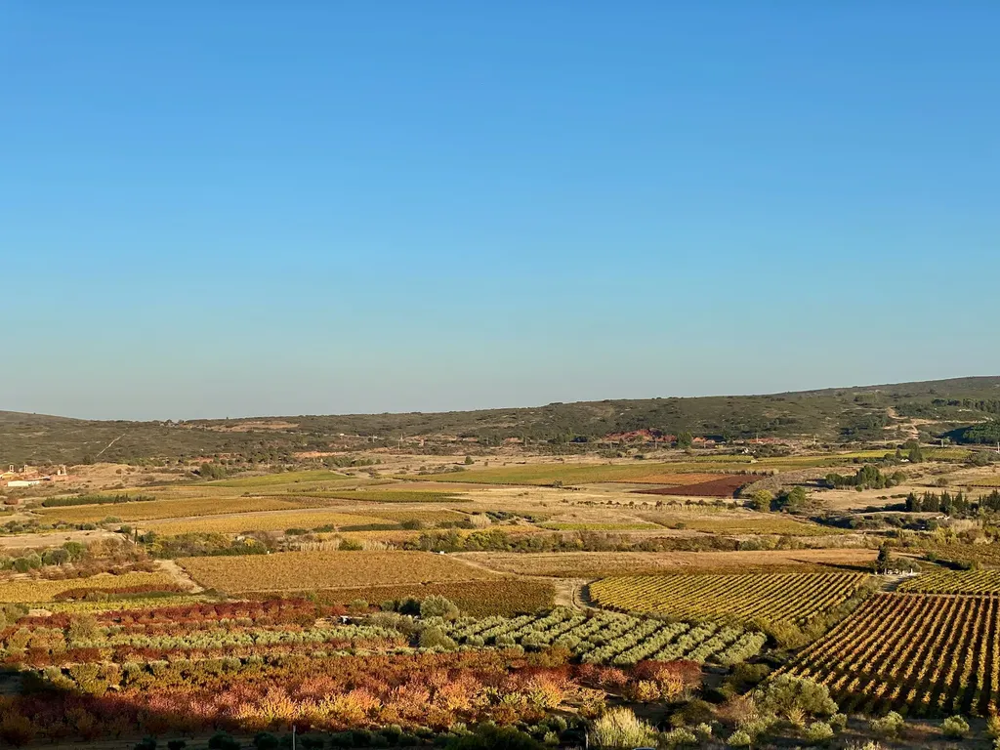

### Jeudi 28, Balaruc

« Vieil homme, pourquoi es-tu aussi heureux ? lui demande l’enfant. Oh ne te fie pas aux apparences. » Écrire sur le mode de Khalil Gibran. Il y a de la magie dans les petits livres réussis, là où la plupart des romans empilent des inutiles. Pierre Michon dit quelque chose comme ça. N’être que fulgurances.

Je n’avais jamais lu Jim Harrison avant de dévorer *Le Vieux Saltimbanque*, alors je me dis qu’il est temps de lire *Dalva*. Je plonge dans une coulée d’anecdotes empilées sur d’autres, avec écart érotique à chaque page, je vois le talent, sans réussir à m’émouvoir. Cette foison impressionne les lecteurs, elle se résume pour moi à balancer tout ce qui passe par la tête. Cette méthode ne peut s’achever que par la fatigue de l’auteur. La mort de l’éhéroïne, ou quelque chose du même ordre. Je ressens davantage d’émotions dans les textes tracés d’un trait.

---

Je me suis mis à écrire. Une musique s’est imposée. J’ai envoyé à Pierre un projet de roman, je pars sur la même idée, mais avec un point de vue autre, le mien en quelque sorte. Mes doutes se sont effacés. J’écris cette histoire parce que j’en ai besoin, alors peu importe qu’elle soit bonne, qu’elle intéresse Pierre ou pas.

### Vendredi 29, Balaruc

François Bon raconte son autobiographie en vidéo. Il me paraît être le premier à explorer cette forme. Ses expérimentations de ces dernières années amenant à ce point précis. J’ai écrit la mienne de manière plus traditionnelle, mais peut-être qu’une autre s’écrit sur les chemins. Lui comme moi ne savons qu’une chose : pour nous dire, il nous faut arriver à notre forme, qui passe par les nouveaux outils pour dire en quoi notre vie est contemporaine. Pour François, la vidéo. Pour moi, le GPS. J’aimerais savoir comment Michon résoudrait cette équation. Dans le discret silence ? Peut-être la seule réponse face au brouhaha.

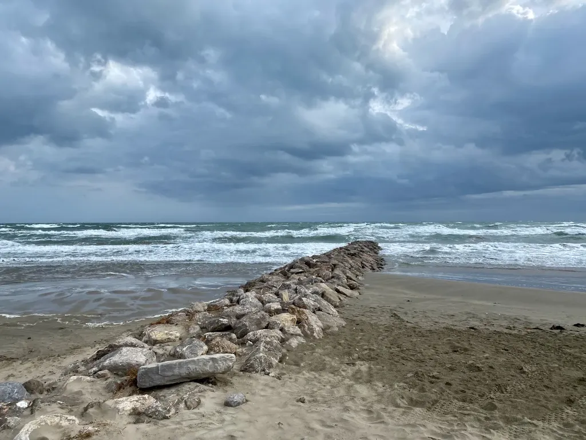
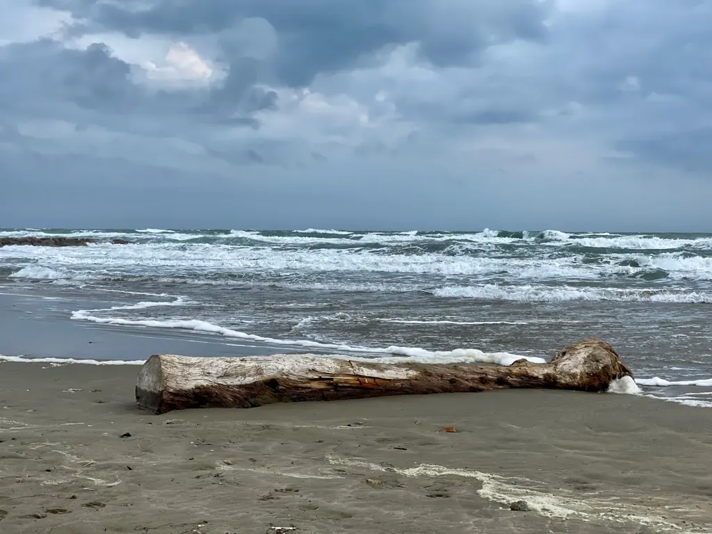
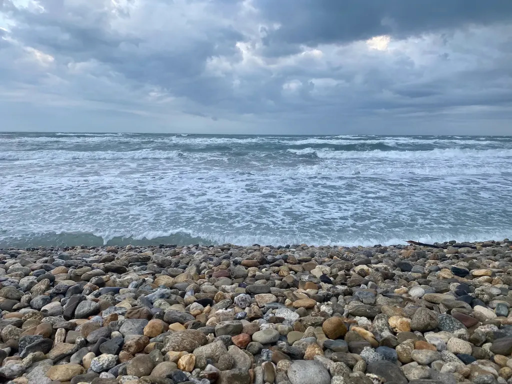

### Samedi 30, Balaruc

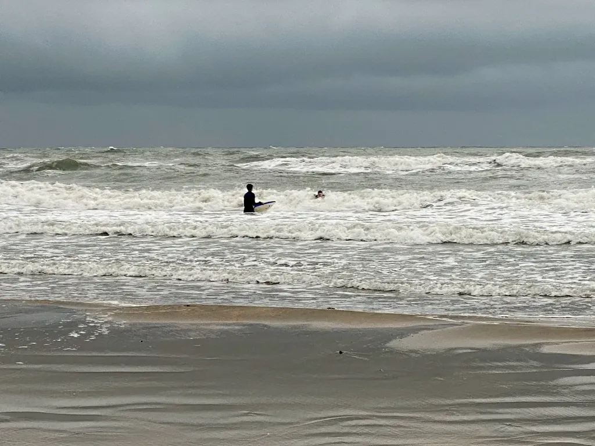

#carnets #y2021 #2021-11-7-21h3
