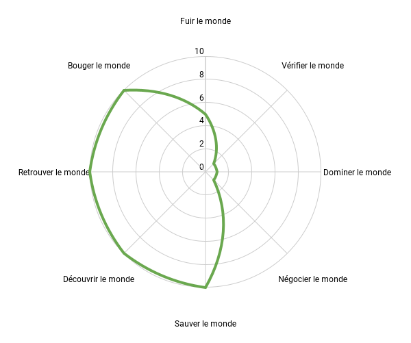

# Pourquoi pédalez-vous ?

J’entends souvent dire : à vélo, chacun sa pratique, chacun fait ce qu’il veut. Chaque fois je bondis, parce que si je peux faire ce que je veux à vélo pourquoi pas avec mon logement, ma voiture, mon argent, mes ordures, mes goûts de luxe, mon entreprise…

Il s’agit d’un classique problème de philosophie abondamment discuté par Wittgenstein. Où mettre le curseur ? Quand est-ce que ce qui est bon pour le vélo n’est plus bon pour d’autres pratiques ? De proche en proche, on peut glisser d’une pratique « acceptable » à une autre qui ne l’est pas. La seule façon d’en sortir est d’éviter les positions à géométrie variable.

Dans le vélo, je tente de vivre de la même façon qu’en dehors, avec les mêmes objectifs, les mêmes préoccupations politiques et environnementales (et aussi les mêmes contradictions). Un comportement nocif dans la finance reste nocif quand il se reproduit dans le vélo. Ces deux mondes ne sont pas étanches. Ils s’influencent, dans une société massivement interdépendante. On ne peut pas enfermer le vélo dans une bulle étanche comme beaucoup tentent de le faire.

Par exemple, quand on dit « On fait ce qu’on veut », on adopte une position ultralibérale. On peut traduire par « On fait ce qu’on veut pour gagner. » Je doute qu’une telle attitude dans le vélo n’ait aucune influence hors du vélo, ne serait-ce que par le modèle de société qu’elle promeut.

Je discutais de ces points avec une amie quand elle m’a dit que l’anthropologue [Franck Michel](https://www.croiseedesroutes.com/franck-michel-assoc-deroutes-detours) avait proposé en 2009 huit raisons de voyager et qu’elles pouvaient sans doute être adaptées au vélo, puisque toute sortie est à minima un petit voyage.

* Représentation psychanalytique : **fuir le monde**, c’est la quête de soi. (Certains pédalent pour se laver la tête, ils vont jusqu’à se fuir eux-mêmes, comme s’ils se détestaient le reste du temps. Peut-être parce que leurs actes professionnels contredisent leur position éthique. Fuir le monde, c’est le sport pour le sport. Le sport, pour le plaisir des endorphines. De manière plus modérée, nous pouvons fuir le monde bruyant et pollué, ou fuir le monde surmarchandisé par le capitalisme. Nous pouvons aussi plonger en nous-mêmes quand nous pédalons. Je m’abandonne souvent à de longues introspections. Au contraire de me vider la tête, je me la remplis quand je pédale.)
* Représentation juridico-policière : **vérifier le monde**, c’est l’enquête. (Certains cyclistes effectuent toujours les mêmes sorties, comme s’ils voulaient s’assurer que telle route ou telle côte étaient toujours à leur place.)
* Représentation anthropologico-humaniste : **découvrir le monde**, c’est la quête de l’autre. (Certains cyclistes, comme moi, passent leur temps à s’engager dans tous les passages qu’ils ne connaissent pas. Voilà qui pousse inévitablement vers le gravel ou le VTT. Nous aimons tout autant pédaler avec nos amis qu’avec des inconnus, et travailler la dimension sociale du vélo. C’est aussi une façon de documenter le monde, de l’écrire, le photographier, le dessiner.)
* Représentation militaro-géopolitique : **dominer le monde**, c’est la conquête. (Certains cyclistes, même à plus de 70 ans, continuent de faire des courses. D’autres veulent se dominer eux-mêmes, repousser leurs limites.)
* Représentation économique : **négocier le monde**, c’est la conquête des marchés. (Pour certains, le vélo est un business comme un autre.)
* Représentation politico-humanitaire : **sauver le monde**, c’est la requête, voire la reconquête. (Il y a des cyclistes humanitaires, il y a aussi la possibilité de se transformer en un globule blanc dans le réseau des chemins, de façon de les maintenir en vie, de faire vivre le système immunitaire du territoire, d’y amener d’autres personnes, de leur [faire aimer la nature de façon intime](../8/lecologie-commence-par-lamour-du-territoire.md), de la partager. À cette seule condition, une véritable écologie est sans doute envisageable.)
* Représentation religieuse : **retrouver le monde**, c’est la quête spirituelle. (Difficile de rester insensible face aux grands espaces, face à la nature… Je me sens vivre quand je pédale et j’éprouve des émotions souvent bouleversantes.)
* Représentation nomade : **bouger le monde**. (Pédaler c’est se déplacer, mais aussi faire tourner le monde autour de nous, changer de perspective, de point de vue. Je pédale pour me remettre en question, pour éprouver le monde.)

Nous sommes bien sûr un peu tout cela à la fois. [Je me suis représenté dans un graphique à huit branches.](https://docs.google.com/spreadsheets/d/13qMNbL0xSvFwuIHOmW6DbYl2enaX-DmAhyKOyD95N9s/edit?usp=sharing) J’ai un profil asymétrique qui reflète mes positions politiques et philosophiques.

#velo #y2021 #2021-12-23-13h18
