# Février 2021

### Lundi 1er, Balaruc

Quand j’écrivais *[Ératosthène](../../../../page/eratosthene.md)* et forgeais ma conception du généralisme, j’avais en mémoire un roman de Van Vogt lu dans ma jeunesse, où il était question de la même idée, sans réussir à en retrouver le titre. Après avoir lu [le chapitre 8 de mon autobiographie littéraire](../1/histoire-dun-nerdeux-en-litterature-8.md), Michel Torres me demande si le lien avec [le nexialisme](https://fr.wikipedia.org/wiki/La_Faune_de_l%27espace#Le_Nexialisme) est voulu, la science inventée par Van Vogt dans *La faune de l’espace*. J’aime ces imprévus provoqués par les mots.

### Mardi 2, Balaruc

Journée d’exploration du massif de la Serrane, extrême sud de Cévennes. On se casse les dents sur des sentiers qui n’offrent aucun intérêt à vélo, trop de pierres rondes et glissantes, mais quelle vue depuis le Roc blanc : la plaine littorale et ses collines se transforment en un modèle réduit verdoyant, arrêté par le miroir de la Méditerranée, l’arc enneigé des Pyrénées, le Ventoux et les Alpilles.

Puis on se translate vers l’est du département et cette fois les panneaux défense d’entrée des chasses privées nous arrêtent alors que de magnifiques pistes entretenues par nos impôts les traversent. Les privilèges des chasseurs m’exaspèrent.

Il fait de plus en plus doux, il ferait même plutôt chaud quand nous rentrons, le ciel délavé de teintes printanières. En février, la lumière change de texture dans le Midi, une question d’inclinaison solaire, qui nous fait basculer dans une ambiance plus tendre, même si à tout moment le froid peut encore nous rattraper.

### Mercredi 3, Balaruc

J’attends d’une seconde à l’autre l’éclosion des bourgeons de l’amandier du jardin. On les dirait prêts à éjaculer leurs pétales blanc-rose.

### Jeudi 4, Balaruc

Je fais mes courses. Quand je passe à la caisse, je souffle de lassitude. « Mais qu’est-ce qui vous arrive ? » me demande la caissière. « Je viens de faire cent kilomètres à vélo. » « Ça vous a pris combien de temps ? » « Cinq heures environ. » « Cinq heures pour cinq kilomètres ! » « Pas cinq, cent. » « Je comprends mieux, moi, avec cinq, je serais aussi fatiguée que vous. »

### Vendredi 5, Balaruc

« Tu confonds, tu te trompes. » Sur les réseaux sociaux, il y a beaucoup de professeurs. J’écris : « Un conseil, ne jamais dire à quelqu’un qu’il confond tant que tu n’es pas sûr de ne pas confondre toi-même. » Mais je ne publie pas ce commentaire.

---

Fatigué d’entendre faire l’éloge du consommé local, même pour les vélos. Mieux vaut acheter plus loin des biens de qualité, créés avec soin, que d’autres moins précautionneux produits à côté de chez soi. Le transport n’est qu’un élément de l’équation. Pour le vélo ça frise l’absurde. Parce que si le cadre est produit en France, presque tout le reste arrive d’Asie. Donc autant que tout soit assemblé en Asie et envoyé en une seule fois chez nous. Une usine en Asie peut nous livrer des produits avec moins d’impact qu’une usine près de chez nous. Qui prend en compte toutes les externalités ?

### Samedi 6, Balaruc

Gracq n’écrivait que par intermittence, laissant des béances entre ses textes, sans en éprouver de douleur. Il dit qu’écrire sans discontinuer, comme je le fais, « n’est pas tant céder à la préférence abusive qu’on a pour son moi, qu’aliéner ce moi dans son fort le plus reculé, en le soumettant tout entier aux mécanismes extérieurs du langage. C’est consentir à n’être à chaque instant *littéralement*, que ce que l’écriture va tirer de vous, à ne vivre que pour alimenter cette espèce de lactation. »

Et si c’était le contraire, si ce besoin de lactation n’était que le prélude à la vie ? Qu’une façon d’écarquiller les yeux, d’étirer ses membres, avant de sortir de son antre et de se remplir d’émotions ? Le lait produit n’a pas tant d’importance que l’action mise en branle par son extraction. L’art naît de l’égoïsme, parce que d’abord l’artiste jouit, et puis il donne son sperme à contempler.

---

J’aime être dans un projet suivi, où tous les matins je dois reprendre le train où je l’ai laissé la veille. Alors, quand le démarrage est douloureux, quand le moteur broute à froid, souvent par la suite il ronronne mieux que quand je pars sur les chapeaux de roues. Pour autant, je préfère quand l’écriture s’impose à moi, quand une intuition me déborde et se développe d’elle-même. Si d’abord je tente de la malaxer en moi, elle s’enlise alors qu’en mots je la vois naître sous mes yeux. Un écrivain est tout simplement quelqu’un de plus intelligent quand il écrit que quand il pense. On peut remplacer intelligent par sensible et par bien d’autres qualificatifs. L’écriture augmente l’écrivain. Voilà pourquoi rencontrer des écrivains ne présente guère d’intérêt. Ils apparaissent dans leur banalité diminuée.

### Dimanche 7, Balaruc

Un soir, je finis la journée satisfait, voire exalté, le lendemain soir, alors que je n’ai rien fait de différent, je suis énervé, ne me sens pas à ma place, comme si mon propre corps me paraissait étranger. J’ai souvent l’impression qu’un seul aliment suffit à me dérégler, ou une remarque, ou une lecture. Mon point d’équilibre est fragile, hypersensible aux stimulus extérieurs. L’âge ne m’apaise pas. Je peux éprouver des vexations absurdes, des excès de jalousie ou de frustration, quand j’aimerais être un moine impassible doté d’un flegme tout britannique.

---

Gracq parle des textes qui jadis couvraient les murs des pissotières. J’ai connu la fin de cette époque dans mon enfance, où le texte gardait toute sa puissance. Désormais, les hommes pissent assis pour regarder leur téléphone. Excepté des artistes nostalgiques, plus personne n’a envie d’écrire sur les murs.

---

Dans mon carnet, j’écris comme je pisse, quand l’envie s’en fait sentir. Je peux parler d’un coucher de soleil, puis d’une promenade, puis de mon dégoût de nos organisations sociales sclérosées. Parfois le flux dans mon cerveau exige les mots, souvent en cascade, puis plus rien durant quelques jours.

La pratique du carnet s’apparente à la transcription des rêves. Plus j’écris dans le carnet, plus j’ai envie d’y écrire (et plus j’écris mes rêves, plus je rêve). Toute écriture est physique, au sens où elle s’entraîne comme un muscle, puis survient d’elle-même, puisant dans le réservoir mystérieux d’une combinatoire infinie.

Si un jour je produis une œuvre stupéfiante, je le devrais à un coup de chance. Quelques alignements bénéfiques m’auront entraîné sur ce terrain. Au contraire, un romancier à succès déroule une mécanique dont toutes les étapes sont déjà connues de lui et de ses lecteurs. Un contrat les lie et explique leur passion passagère.

Je commence sans canevas, sans concordat avec mon futur lecteur, nous devons tout apprendre ensemble, travailler ensemble, connaître au même moment la jouissance de la découverte. Nous serons quelque temps des compagnons de route. J’écris comme je pédale, pour partager des moments.

### Lundi 8, Balaruc

« Le beau est d’abord ce qui désoriente » écrit Gracq, pourtant le public et la critique acclament ce qui rassure et n’enfreint aucune règle. Soit Gracq se trompe, soit le reste de l’humanité. Comme Gracq, j’ai tendance à être ému par l’art qui me surprend, me perd, me bouscule… tout en aimant la répétition des couchers de soleil, avec une préférence certaine pour ceux qui m’ensorcellent d’harmonies dont s’étonnent encore mes yeux et mon appareil photo. Quand je peux dire « celui-ci je ne l’ai jamais vu », j’en éprouve un plaisir supplémentaire, sans que le plaisir d’un coucher de soleil ordinaire en soi gâché.

---

Un critique ne parle de la magnificence d’un style qu’en référence à un autre de déjà connu.

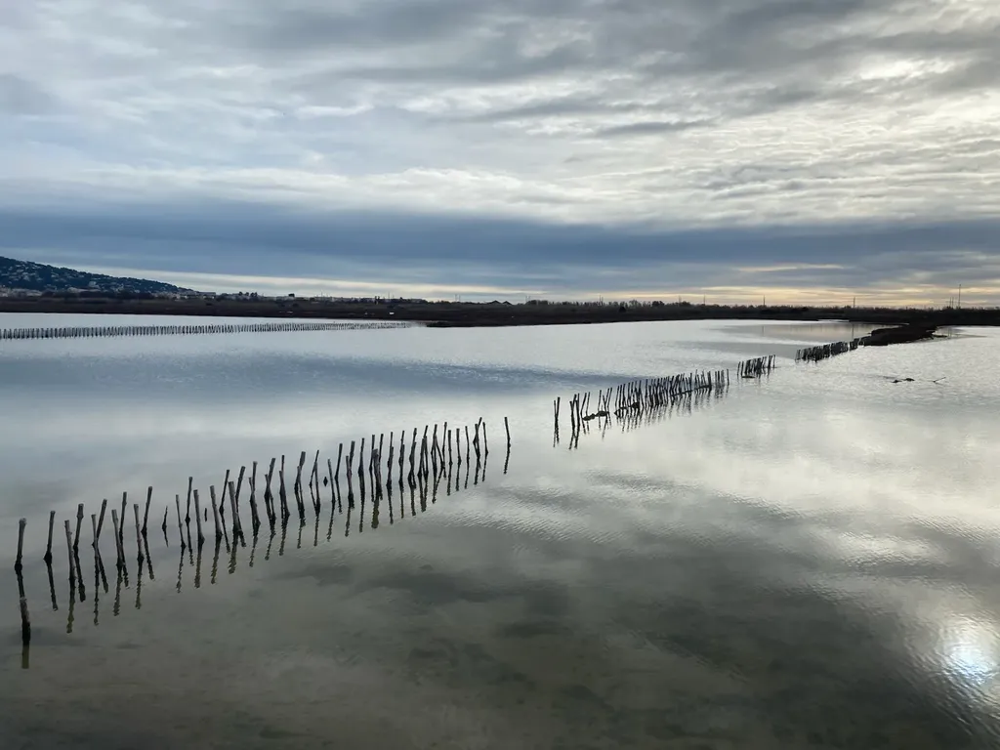

### Mardi 9, Balaruc

Je ne voue aucun culte aux mots, à la langue. Ne m’intéresse que le canal de communication entre nous à travers eux. J’aspire à une télépathie et, quand elle adviendra, je serai télépathe et non écrivain.

---

Peut-être il existe des auteurs joueurs d’échecs, qui anticipent leurs coups, pensent au lecteur, à l’amener d’étape en étape vers un état particulier de stupéfaction, qui ne saurait stupéfier que celui qui n’a pas prévu la mécanique à l’œuvre, mais la plupart des autres auteurs avancent au grès du vent, pour se surprendre eux-mêmes, ne regardant pas plus loin que le bout de leur nez, parce que plus loin n’existe pas encore. Écrire d’abord pour soi et, si ça marche pour soi, s’attendre à ce que ça marche aussi pour d’autres. La plupart des livres, je n’aurais pas pu les écrire parce que ce travail m’aurait ennuyé.

---

Plus je vieillis, plus le « je » s’impose, parce que j’écris ce que je pense à un instant donné. Si un « je/aujourd’hui » existait, j’en abuserais pour montrer que j’ignore ce que pensera le « je » de demain et que j’ai oublié ce que pensait celui d’hier.

---

Il y a deux Gracq, celui du « je », celui du « nous », qui généraliste, théorise, et me touche beaucoup moins, parce que peut-être il ne me prend pas par la main dans son cheminement, mais m’en expose avec trop de froideur le résultat, oubliant la poésie, les heureuses rencontres, les aléas qui devront être écartés du produit final. J’aime le Gracq mathématicien, qui a besoin de faire des calculs dans les marges, des ratures, de recommencer, pas celui qui m’expose une belle démonstration impeccable et me cache son échafaudage intérieur.

Tim a souvent ce problème avec ses cours de maths. Il me demande comment les mathématiciens ont fait pour découvrir qu’il fallait passer par là et là pour arriver à telle démonstration. Je suis souvent obligé de lui avouer que le découvreur a suivi un tout autre chemin et que ses professeurs proposent une démonstration arbitraire, qui fonctionne, mais n’a aucun sens épistémologique. Privée de son histoire, une démonstration n’a plus beaucoup d’humanité en elle.

L’atelier ne devrait jamais être caché. Il n’y a pas pire mensonge que faire croire au génie parce qu’alors il ne subsiste que la froideur pétrifiante. J’ai trop souvent paru inhumain à force de nettoyer mes textes au point de les désincarner. Je n’ai plus peur de me montrer laborieux. J’accepte les phrases toutes plates, parce que sans elles il n’y aurait pas de cols, pas de montagnes sans vallées pour les creuser.

---

Facebook me révèle la crasse bêtise de certains commentateurs, passant à côté d’un texte, révélant leur totale incompréhension, et donc leur bêtise, sans même s’en apercevoir, et attirant comme des mouches d’autres imbéciles. Phénomène dont l’observation n’en finit pas de me fasciner.

### Jeudi 11, Balaruc

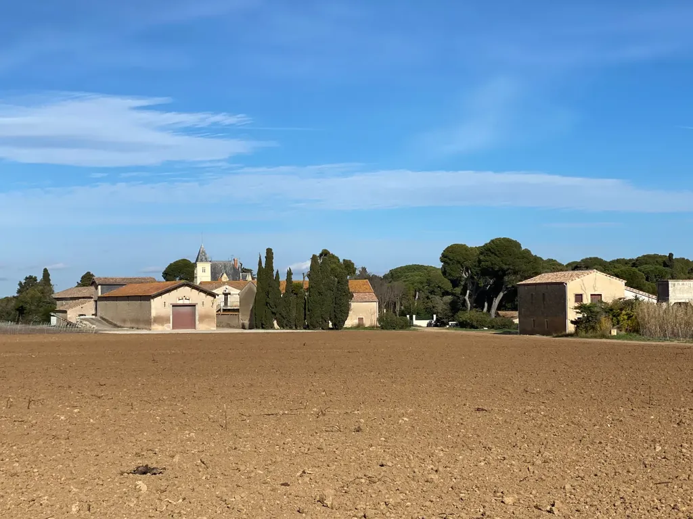

### Vendredi 12, Balaruc

Je suis affligé par la violence administrative, pendant de la violence policière, qui nous assimile tous à des truands, oubliant que nous pouvons commettre des erreurs par incompétence, oublie, négligence, parce que les formalités demandées sont si absurdes et kafkaïennes qu’elles échappent souvent à l’entendement du profane.

Pendant ce temps, les truands patentés et les véritables escrocs se pavanent à travers ce système dont ils sont des experts, alors que nous n’en sommes que les vaches à lait, traites matin et soir. Quand, par défaut, une société ne fait plus confiance à ses citoyens, elle court à sa perte par rupture du contrat social.

En plus d’être affecté personnellement, je vois dans la violence administrative la déréliction des institutions, qui semble irréversible, comme celle d’un corps qui vieillit inexorablement et que la médecine n’arrive pas à rajeunir. Il y aurait un impératif évolutif pour toutes les structures, condamnées à croître puis décroître.

À moins que cet état d’incompétence ne soit le propre des administrations, leur faiblesse inaltérable, due à leur nature même. Elles ne pourraient qu’être maladroites, pesantes, méchantes, et justement elles n’évolueraient pas, toujours aussi médiocres quelles que soient les vicissitudes. Après tout, si le bug était correctible, nous l’aurions déjà corrigé, non ? Alors peut-être que l’administration, sorte de paratonnerre, attire à elle les cellules mauvaises, coagule leurs esprits étriqués et foncièrement policiers qui postulent la malhonnêteté congénitale des corps étrangers à eux-mêmes. Nous serions selon elle et ses composantes intrinsèquement mauvais, parce le mal est d’abord en elle et lui fait voir tout en mal.

Les administratifs et les policiers devraient être sous la juridiction d’hommes et de femmes qui ne veulent pas en être, qui ainsi pourraient leur apporter l’humanité qui leur manque. Je suis peut-être trop sensible, mais ces gens me font mal rien que par leur existence. Je sens leur mentalité néfaste dans leur moindre courrier, j’ai la nausée quand j’entre dans leur bureau comme si je pénétrais dans un temple du Troisième Reich.

### Samedi 13, Balaruc

Mon autobiographie n’est une fiction qu’à cause des enjolivures ou de failures introduites par ma mémoire. Ce texte peu à peu se déploie, prend plus de profondeur que je l’avais imaginé et trouve sa forme, me demandant d’en modifier le début et d’en penser avec soin sa fin.

Je réussis à écrire ce texte parce que je publie en ligne, mais une fois ce premier jet achevé, je devrais le masquer, pour le reprendre et lui donner la cohérence étanche d’un livre.

---

Tim écrit un commentaire de texte. La rencontre du docteur Bovary avec Emma. Il y voit des choses pour moi étonnantes. Mais quand je lis ce passage de Flaubert, je le trouve maladroit, pesant, avec même une confusion de sujet. Du Flaubert peu inspiré, besogneux. Et Tim se casse la tête pour trouver une intention derrière chaque phrase. On dirait que les profs de français ignorent tout du fonctionnement du cerveau créatif, qui avance voiles déployées, vent arrière, sans s’arrêter sinon il ne redémarre jamais. Même Flaubert, à mon sens, n’a jamais eu d’intention millimétrique, quoi que, ce qui expliquerait pourquoi ce *Bovary* me soit toujours tombé des mains, un livre qui ne doit son succès qu’au scandale provoqué à l’époque. Je préfère le Flaubert ultérieur, plus allègre.

Tim, et tous les élèves, découvrent la capacité merveilleuse de notre cerveau de tenir des propos intelligents sur tout et n’importe quoi. Voilà pourquoi le monde est si compliqué. Nous le justifions jusqu’à l’invraisemblable. Les cours de français sont un entraînement à l’interconnexion interactive, sauf que les profs n’acceptent que quelques interconnexions, validées par leurs pairs, au lieu de laisser se déployer l’imagination des élèves. Tim se payera une note catastrophique pour ne pas avoir piqué sa réponse dans un manuel.

### Lundi 15, Balaruc

Selon Gracq, pour durer la littérature ne doit pas trop compter sur le langage parce qu’il évolue comme un mur qui se fissure et sur lequel a été peinte une fresque. Les œuvres trop ancrées dans la langue portent moins loin et survivent moins longtemps parce que leur traduction pose problème. Gracq a tourné cette difficulté par la conflagration de mots habituellement étrangers : la chaleur huileuse ou les ombres bleues. Une fois le truc connu, il devient tentant.

---

Gracq célèbre Tolkien qui écrit *Le seigneur des Anneaux* déjà âgé et du haut de sa chaire universitaire. Et il dit : « En France, passé trente ans, les écluses ne se rouvrent plus pour laisser passage aux eaux printanières, sinon sous la forme douce-amère du souvenir. » J’ai attendu de passer les cinquante ans pour me raconter et j’espère qu’il n’y rien de doux-amer dans mes textes. Et j’ai toujours le rêve d’être saisi comme Tolkien par une forme que l’âge entraînerait vers le renouveau et la virginité. Après tout j’avais plus de cinquante ans quand j’ai écrit *One Minute*.

---

Il y a au XIXe et même au XXe toute une littérature qui sent le moisi et que j’ai dû lire à l’école pour ne jamais y revenir. J’avais la sensation de me noyer dans le marécage de l’humanité. Il me suffisait de quelques phrases pour suffoquer et éprouver une douleur physique, révélatrice de mon hypersensibilité, à tel point que ces textes m’étaient nocifs.

---

Je pars rouler malgré la grisaille peu engageante, très vite il bruine, puis il pleut, mais je continue avec une forme de plaisir juvénile, isolé sur mon vélo, entouré par les éléments, dans une bulle que ne transperce pas la lumière.

### Mardi 16, Balaruc

Gracq affirme que c’est une chance « pour un écrivain de n’avoir jamais été à la mode » tant celle-ci impose sa volonté et nous interdit de développer ce que nous avons en propre. Chaque fois que j’ai fait un pas vers les sujets populaires, je me suis perdu, dépensant une énergie folle à faire entendre ma voix dissonante. Si j’avais été à la mode, disons à trente ans, ou même à quarante, je n’aurais jamais écrit aucun de mes livres, surtout pas *One Minute*.

### Mercredi 17, Balaruc

Journée printanière à ne pas rater, d’autant que la grisaille doucereuse l’encadre. Avec Jacques, nous chargeons les vélos dans le Kangou et fonçons vers Vendres, village au sud de Béziers, au bord d’un vaste étang circulaire, avec à l’ouest [le massif de La Clape](https://fr.wikipedia.org/wiki/Massif_de_la_Clape). Secteur magnifique, au pied de petites falaises jaunes courues de sentiers, coiffées de pinèdes avec vue panoramique jusqu’à la mer. Quand je remonte sur le vélo après notre pique-nique, mon GPS indique 33°C !

Mais dans un bois épais, sillonné de sentes, des chasseurs abrutis ont piégé les passages de branches et de pierres pour nous compliquer le pédalage et nous détourner de ce secteur, qu’ils voudraient se réserver pour eux-mêmes. Cette ultraminorité dangereuse voudrait interdire la nature à la foule des promeneurs. Et nos préfets leur accordent des prérogatives inexplicables. Leur activité ne devrait plus être autorisée que dans des propriétés privées, dûment clôturées pour que d’innocents touristes ne viennent pas s’y faire occire.

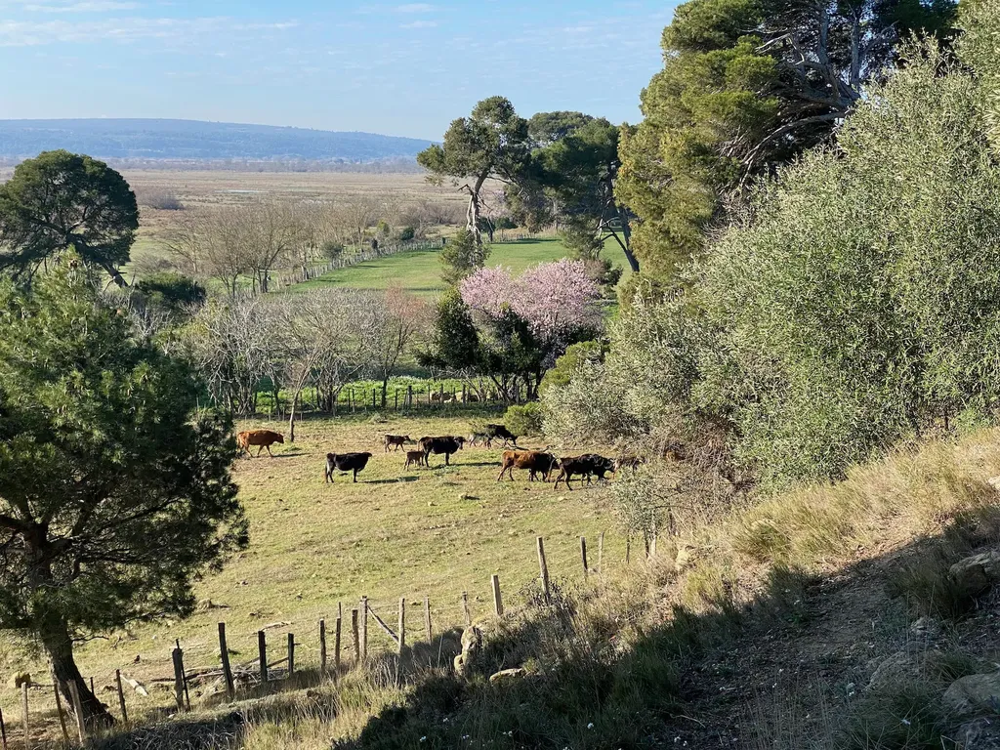
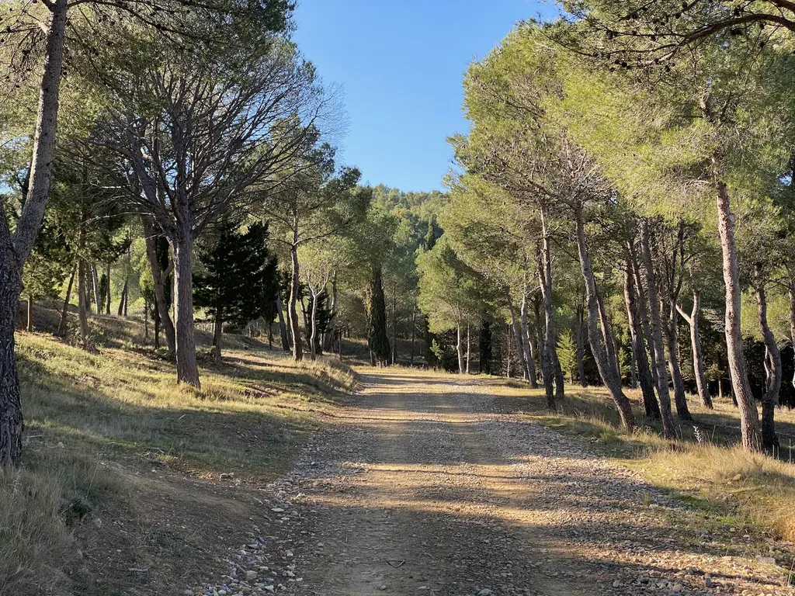

### Vendredi 19, Balaruc

Cette nuit, je ne sais plus si je rêvais, sans doute pas. Je voyais un phare laser, tourner sur lui-même et dont le faisceau l’entourait, traçant un cercle parfait de lumière, aussi loin que son énergie le portait. Si on mesure sa vitesse circulaire à un point éloigné, on découvre qu’elle est supérieure à celle de la lumière, pourtant sans contrevenir à la théorie d’Einstein, parce que les points sur le cercle ne peuvent pas échanger d’information. Dans les brumes du demi-sommeil, je me disais qu’il y avait peut-être un truc, un moyen de tout faire péter, de trouver une astuce pour violer une des règles du monde. Bien sûr, je ne l’ai pas trouvée, mais c’était comme si j’étais au bord d’une révélation. J’ai souvent connu ce sentiment, surtout dans ma jeunesse, mais je n’ai jamais été frappé par la grâce du découvreur.

L’écrivain fabrique tous les jours des petites choses artisanales, produites en série limitée, jamais de belles formules dignes d’être gravées dans le marbre. Pourtant, ce matin, je retrouve une de mes phrases tirée du [*Peuple des connecteurs* dans une collection de citations](https://www.dico-blagues.com/citations-quotidiennes-du-18-02-2021) : « Dans un monde global hautement interconnecté, il faut être irresponsable pour exercer le pouvoir. Un ordinateur imbécile, qui prendrait des décisions au hasard, ne commettrait pas plus d’erreurs qu’un politique averti. » Je ne m’en souvenais même pas, alors qu’Einstein n’aurait jamais oublié son E=mc2. Nos phrases sont de petites crottes, celle du théoricien des bronzes.

Juste après ma citation, il y a du Calvino. « La photographie n’a de sens que si elle épuise toutes les images possibles. » S’il avait raison, je ne continuerais pas de photographier mon étang, parce que je m’épuiserai longtemps avant lui, avant sa puissance à générer des images nouvelles jours après jour. La photographie n’épuise même pas un instant contrairement à l’idée de Barthes. Elle ne peut que nous le faire regretter, ou au contraire nous donner envie de mieux apprécier le suivant.

Il me faut un bon moment avant de noter l’incongruité de mon nom sur cette page de citations. Comme si j’étais arrivé finalement à me glisser dans le gotha des écrivains. Une forme de consécration insidieuse.

---

Cette nuit, pendant que je rêvais d’un phare cosmique, un nouveau robot s’est posé sur Mars, sans que j’ai eu besoin de suivre sa trajectoire en direct comme je l’aurais fait durant mon enfance. La surprise ne viendra que de ce qu’il découvrira. Le voyage jusqu’à la planète rouge est presque devenu un détail. Reste que je dévore les premières images qu’il nous envoie.

### Samedi 20, Balaruc

Comme Gracq me fait du bien, j’ai replongé dans *Lettrines 2*, ouvert un peu au hasard, un livre de fragments, comme un journal duquel on aurait extrait des passages les plus savoureux. Bien souvent Gracq voit ce qui change entre sa jeune et sa soixantaine, sans réussir à voir ce qui est propre à son temps, alors les années 1970, et qui pour nous désormais fait référence. Il ne voit pas le roman noir ou Perec ou Warhol ou le Velvet ou Pratt. Suis-je moi-même condamné à la nostalgie ? Peut-être que mon obsession pour le futur m’en préserve. Peut-être que Gracq devient un auteur fragmentaire parce qu’il avoue son impuissance à être classique, d’un bloc. Son échec fait son succès pour nous. Avec bien d’autres artistes, il est un des précurseurs de ce que j’ai appelé l’échantillonnage.

Je n’écrirais pas si je pensais qu’il ne pouvait y avoir un art puissant aujourd’hui. Je me bats pour cet art, pour son événement. Ne pas y croire serait un échec. En quelque sorte Gracq avouait son échec au moment où il réussissait brillamment. L’art nous est nécessaire. C’est un résidu de la conscience. Comme nous sommes plus nombreux, il y a davantage d’artistes, donc davantage de dissolution de nos œuvres, ce qui n’en diminue en rien la puissance. Par le passé, il y avait tromperie, car le faisceau médiatique ne pouvait qu’être concentré sur quelques figures emblématiques.

### Dimanche 21, Balaruc

### Mardi 23, Balaruc

L’art, et la littérature en particulier, ne peut être universel parce qu’il innerve des cerveaux dont la topologie varie d’un individu à l’autre, et d’un même individu à lui-même au fil de sa vie. L’art exerce une pression particulière sur cet organe, et à travers lui sur le corps, via une multitude de canaux, soit directement stimulées, odeurs, images, sons, soit indirectement par jeu avec la mémoire et les fantastiques interconnexions inventées par le cerveau lui-même.

Tout juste si on peut dire que l’art le plus puissant innerve davantage, sachant que ce degré d’innervation ne peut être mesuré dans l’absolu, puisqu’il dépend de l’innervé. Il ne reste pour célébrer l’art que les récits à son sujet. Si un nain de jardin me touche, si je suis capable de le dire et d’être entendu, ce nain de jardin rivalisera avec le David de Michel-Ange. Là, tout se complique, parce que je dois dire avec art pour faire d’un nain de jardin un chef-d’œuvre. L’art ne serait donc qu’une réflexivité, qu’une extériorisation des processus cognitifs, leur exposition spontanée sans recourir à des scanners. L’artiste se met à nu cérébralement et cette nudité nous bouleverse.

---

J’aimerais écrire un livre intime, emberlificoté dans un espace réduit, avec quelques lieux d’écrits jusqu’à la patine pour provoquer une impression chaleureuse, avec une légère tension, le vernis pouvant se craqueler à chaque instant. J’en suis incapable, j’aime trop les liens à longue distance, spatiale et temporelle, j’aime interconnecter les improbables, mon imagination se téléporte avec allégresse. Je ne serai jamais un auteur de l’intime parce qu’il m’étouffe.

---

J’aime ce que Gracq dit de *La recherche*, un film livré dans l’ordre des séquences tournées, parfois plusieurs fois à quelques variations près.

### Mercredi 24, Balaruc

J’oublie ce que j’écris aussi vite que je l’écris, et ce que je lis presque aussi vite. Mon existence littéraire a une étendue temporelle étroite. Je suis incapable d’être tout entier à moi-même. Je perds la mémoire même de mes pensées, il ne reste que la sensation de les avoir pensées quand je retombe dessus. Elles pourraient être d’un autre sans que j’en sois affecté.

---

Gracq parle d’un auteur jadis célèbre et depuis oublié qui « a cheminé à travers son époque sans rien y accrocher de ce qui nous semble aujourd’hui en faire la réalité et l’éclat… ». Pouvons-nous savoir si nous entrons en résonance ? Je voudrais le croire même si mes résonances, par exemple le jeu de rôle ou la littérature numérique, n’ont jamais bouleversé les foules, mais peut-être elles bouleverseront l’avenir, sinon pourquoi auraient-elles tant d’importance pour moi, pourquoi je ressentirais tant de force en elles alors même que d’autres lumières me profiteraient davantage ?

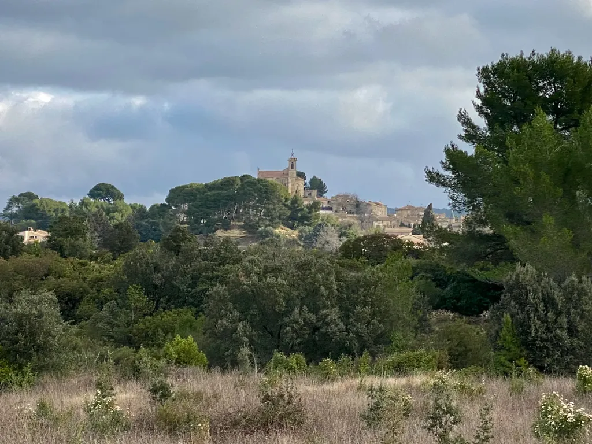

### Jeudi 25, Balaruc

Je n’écris que pour vivre, même quand j’écris ma vie.

### Vendredi 25, Balaruc

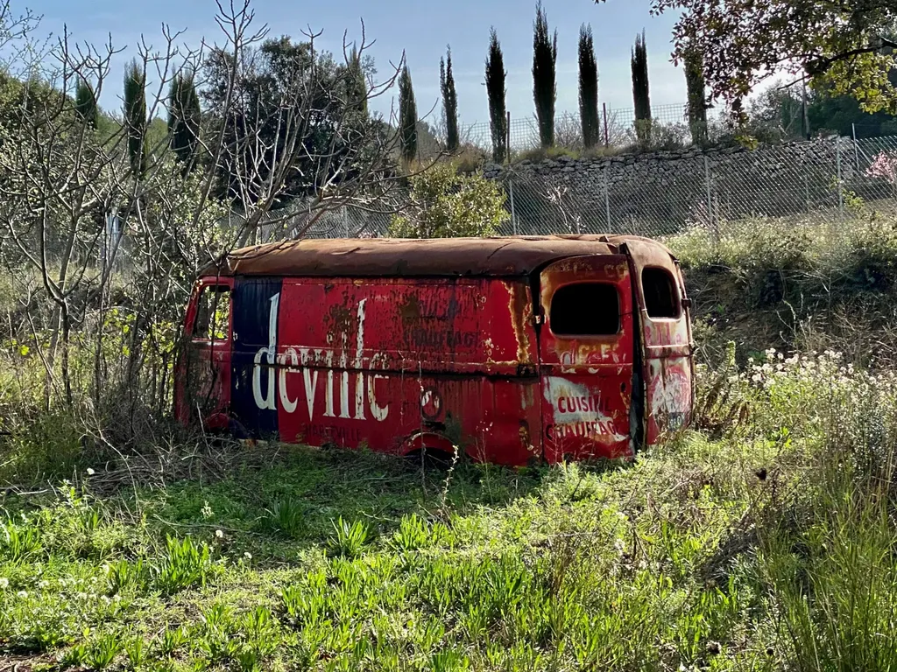
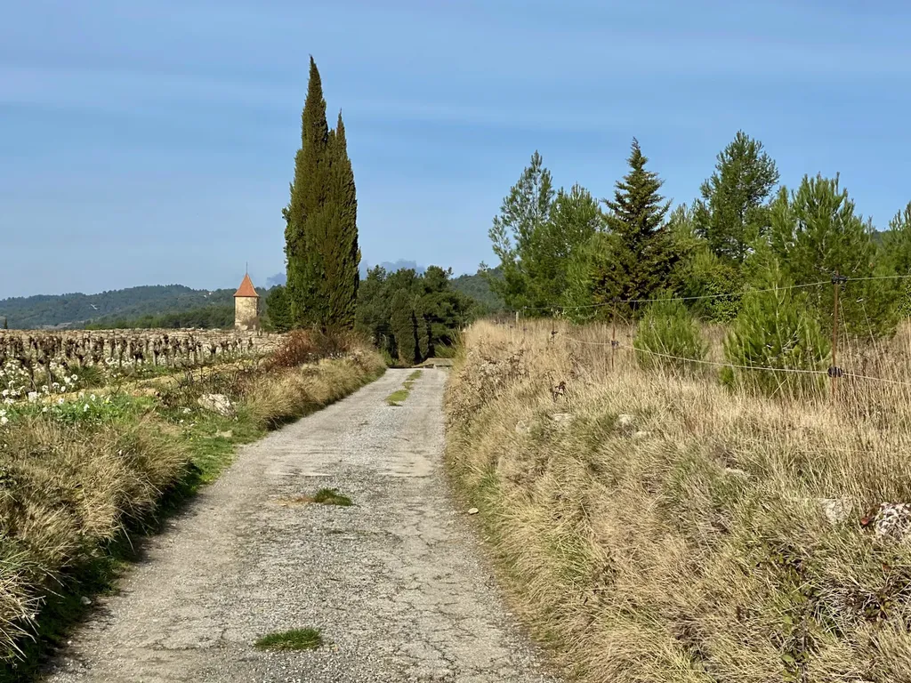

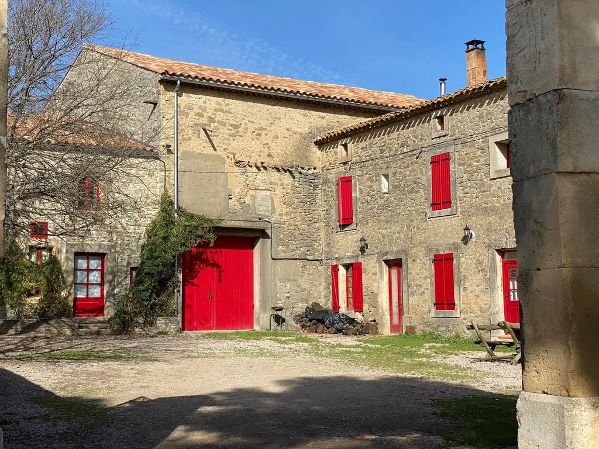

### Samedi 27, Balaruc

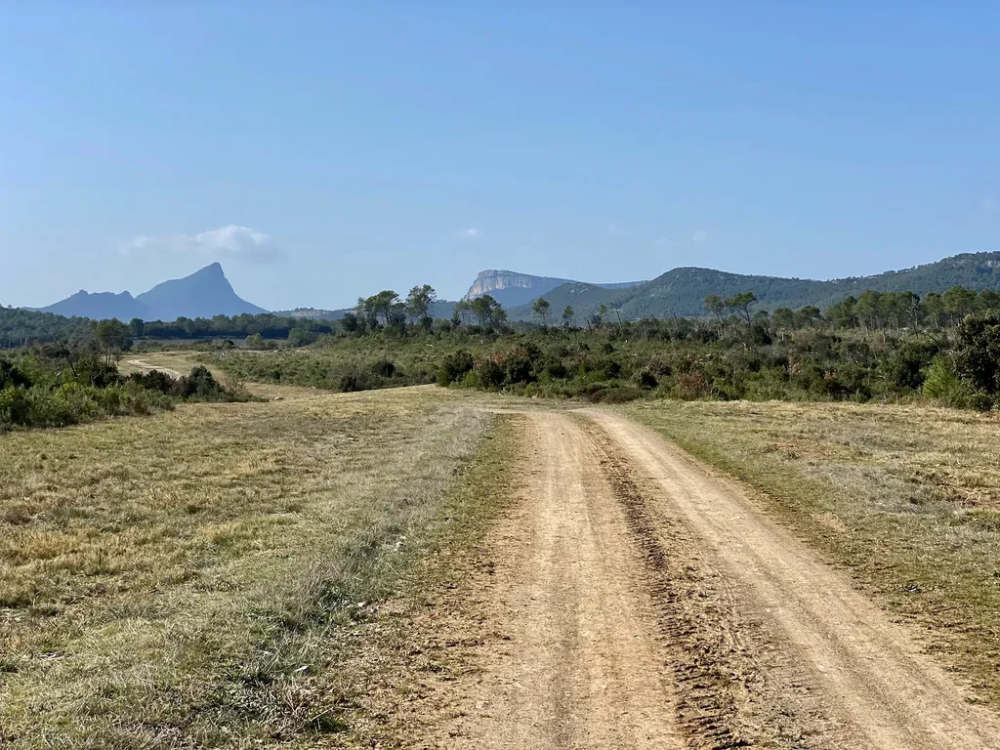
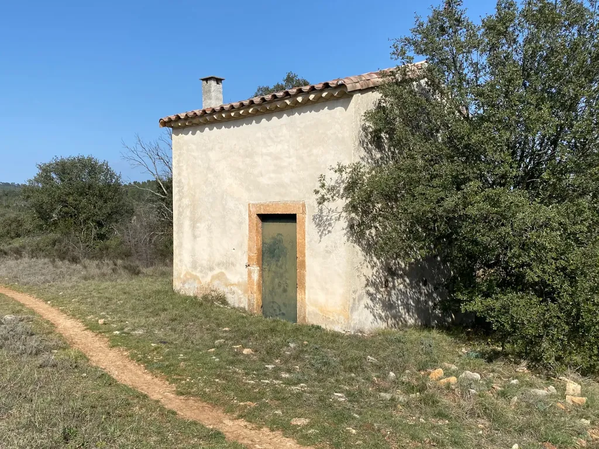

### Dimanche 28, Balaruc

Par le passé, j’assujettissais ma vie à l’écriture. Désormais, quand on m’offre une longue balade à vélo, j’hésite, puis je cède à l’idée de passer une journée en extérieur, parce que peut-être elle sera le sujet d’une écriture dictée par la nature et la lumière. Se pose le dilemme pour demain. Je suis au bord de terminer mon autobiographie et je repousse le moment, comme si ce texte me condamnait ensuite à pénétrer dans l’inconnu, à passer après moi-même.

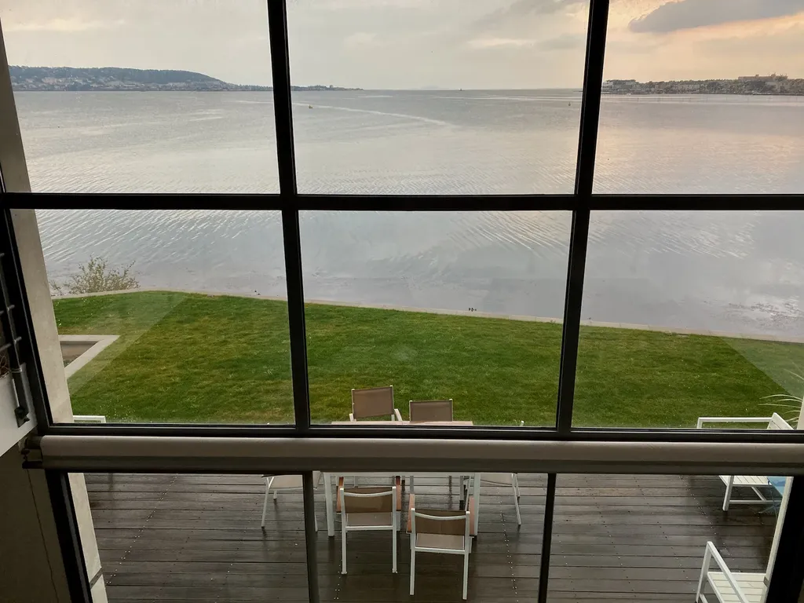

#carnets #y2021 #2021-3-4-10h4
