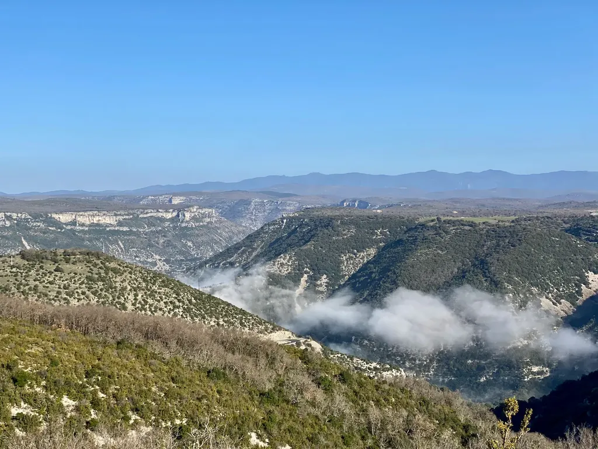
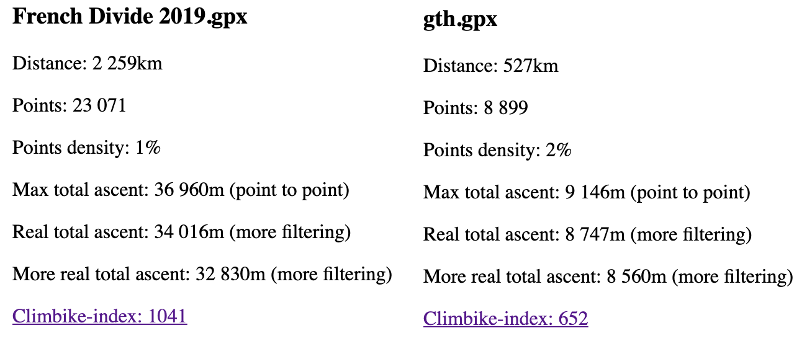
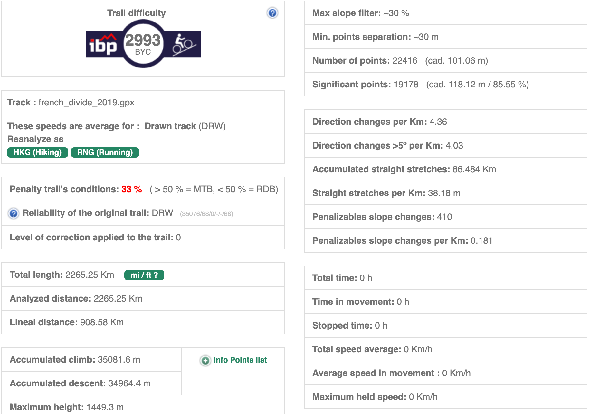
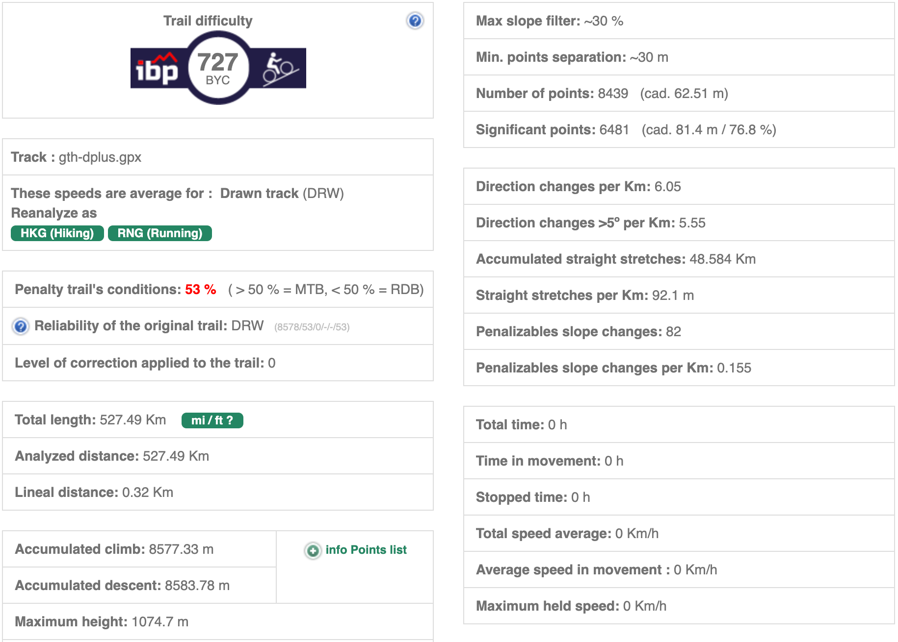

# Comment estimer la difficulté d’une trace

Comme nous nous élançons dans quelques jours pour une [GTH et comme je partage librement la trace](../../page/gth), je tiens à ce que les bikepackers qui l’emprunteront sachent à quoi s’attendre.

Quand j’ai publié [la GTH sur Utagawavtt](https://www.utagawavtt.com/randonnee-vtt-gps/GTH-Grand-Tour-de-l-Herault-24330), j’ai remarqué qu’ils lui attribuaient un [Climbbybike Index](https://www.climbbybike.com/climb_difficulty.asp) de 657. J’ai découvert ainsi qu’il existait d’autres indices pour évaluer la difficulté d’une trace à partir de son GPX, notamment l’[IBP](https://www.ibpindex.com/).

J’ai commencé à jouer avec ces indices, puis, pour mieux comprendre comment ils fonctionnaient, [j’ai écrit un bout de code pour analyser la GTH](https://lab.tcrouzet.com/gpx/). Quand j’ai additionné les moindres dénivelés positifs entre deux points consécutifs du parcours, j’ai obtenu un total de 9 146 m (estimation proposée par certains services, Utagawavtt entre autres).

En regardant de plus près les données, j’ai constaté que souvent des sections plates se transformaient en grimpettes à force d’ajouter centimètre sur centimètre, sans que leur réalité soit bien confirmée. J’ai alors filtré ces pseudos montés pour aboutir à 8 560 m, sans doute plus près de la réalité. J’ai aussi recalculé le Climbbybike Index pour aboutir au même score que Utagawavtt (mais la valeur trouvée pour la French Divide 2019 me montre que ma méthode de calcul n’est pas satisfaisante).

Pas grave, pour y voir plus clair, j’ai comparé la French Divide 2019 et la GTH avec [l’analyseur IBP](https://www.ibpindex.com/) et découvert que les traces étaient de difficulté comparable à la distance près, ce qui n’est pas un détail. La GTH apparaît comme plus orientée VTT, avec beaucoup moins de routes, ce que confirme les statistiques Komoot. J’ai toutefois veillé à ne choisir que des singles roulants, pour laisser une chance aux gravels de passer sans difficulté notoire.

Sur ces données IBP, on voit, par exemple, qu’il y a 30 % de changements de direction au kilomètre en plus sur la GTH que sur la French, ce qui est en phase avec la plus grande proportion de singles et de chemins. Ce service mérite d’être utilisé avant de longs voyages en compléments des statistiques Komoot. Connaissant son temps sur un parcours référence, on peut ainsi le comparer à un nouveau parcours et se fixer un objectif raisonnable.

#727 #gps #velo #y2021 #2021-3-30-12h25
