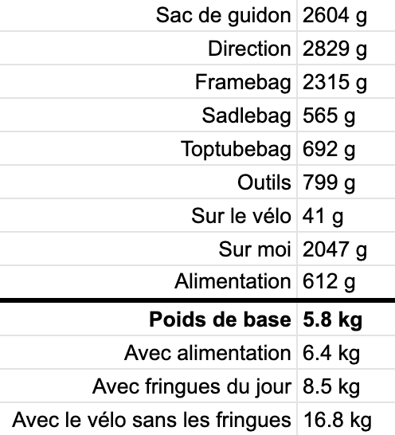

# Config bikepacking avril 2021

Avril est un mois compliqué. L’hiver comme l’été peuvent s’inviter dans le printemps. Parfois, les journées commencent par des gelées blanches et finissent torrides, du moins dans le Midi. Choisir l’équipement adéquat pour le [727](../../../../page/727tour.md) est donc un casse-tête, surtout côté fringues, d’autant que nous commencerons à pédaler en plaine, puis passerons deux jours au-dessus des 1 000 mètres.

### Sacs

Classique pour moi, excepté pour la selle, où j’ai logé un sac de 3 litres, destiné aux fringues de route.

Mon sac de guidon est bien trop vaste, mais Revelate Design est en rupture en ce moment de poche de 14 litres. Donc je roule le mien pour le ramener à la contenance nécessaire. Un ami, qui lance sa boîte de sacs sur mesure, m’a promis de me confectionner un nouveau sac de cadre plus léger, mais il ne sera pas prêt pour ce raid (je peux gagner 150 g sur ce poste).

J’ajoute des sous sacs en Dyneema ou Cuben pour ranger mes affaires séparément, aussi pour les déballer sans qu’elles risquent d’être mouillées.

### Outils

De voyage en voyage, j’optimise ma configuration, m’inspirant des recherches incessantes de [Patrik Lamarre](https://withspirit.fr/). J’hésite encore entre rassembler les outils dans un sac sous le cadre ou les caser au fond du sac de cadre. Tout dépendra de la météo et des derniers ajustements.

Les petits outils atterrissent dans une trousse Wolf Tooth bien pratique, les autres dans un stuff bag en Cuben pour les maintenir au sec.

Pour la première fois, je n’emporte pas de cartouche de CO2. Comme mes pneus ont déjà claqué, je peux les regonfler avec ma très efficace pompe Specialized. Avec ses 80 g, la cartouche et l’embout représentaient 10 % du poids des outils. Je continuerai d’utiliser des cartouches pour les sorties courtes, mais en bikepacking je prendrai mon temps pour regonfler, quitte à transporter une pompe un poil plus lourde, mais efficace.

### Camping

Du très classique pour moi, sac de couchage trois saisons et tente. Je réserve le bivy aux raids d’une nuit, quand je suis sûr de ne pas prendre la pluie et n’ai pas besoin d’un tarp (bivy et tarp pèsent autant que ma tente).

### Électronique

Comme je ne prévois pas de rouler la nuit, sauf galère, je me contente de ma frontale 1 000 lumens, avec un accumulateur de rechange. J’ai abandonné la config avec un seul câble USB multifonction : les vibrations déboîtent les embouts.

### Hygiène

Le b.a.-ba. J’ai gagné 50 g en dénichant une serviette ultralégère.

### Fringues

Je scrute fébrilement les prévisions météo sur le parcours. Nous atteindrons parfois les 20°C sous abri, synonyme de tenue d’été, sur les hauteurs les matins nous ne serons pas loin de zéro, avec risque de pluie.

Quoi qu’il arrive, même en été je pars avec un imperméable et une doudoune légère. C’est un incontournable. Reste à définir les couches inférieures. Je pourrais faire l’économie de ma veste Alpha, mais je pense l’emporter pour m’offrir plus de souplesse (j’aviserai au dernier moment).

S’il se met à pleuvoir, je passe un surshort de pluie et mes chaussettes étanches, que je peux aussi utiliser s’il faut marcher dans l’eau dans des terrains pas trop coupants (qui ne devraient pas se présenter sur la GTH).

J’hésite pour les gants. Je pense partir avec une paire étanche associée à des sous-gants, utile pour la nuit ou froid. Tout dépendra des prévisions météo de dernière minutes.

### Alimentation

On devrait trouver de quoi s’alimenter au moins une fois par jour, donc je ne me surcharge pas au départ. J’emporte 2 000 calories environ, de quoi tenir une journée au cas où. L’idée est de ne pas taper dans cette réserve, ou de la reconstituer à la moindre occasion. Je stocke dans le sac de cadre.

Depuis quelques mois, je ne consomme quasiment plus de barre sucrée, dans les sorties longues et courtes, sans éprouver pour autant de coup de mou et sans avoir la bouche empâtée en fin de journée. Je pars donc dans cet esprit.

La réserve calorique de secours ne pèsera que 120 g sous la forme de [4 pochettes Holyfat](https://holy-fat.com/), rien que du bon gras, soit 800 kcal. À côté, j’emporte une poche zippée avec un cocktail maison de fruits secs, avec un très bon ratio de 500 kcal/100 g. Je suggérerai à mes compagnons de m’imiter, comme ça dans les épiceries on achètera des paquets de fruits secs et se les partagera. Enfin, en cas de coup de mou, je ne garde que deux gels bio, pas hypercaloriques, mais digestes.

Dans la gourde attachée à ma fourche, j’utilise en début de journée des pastilles d’électrolytes, toujours à faible dose. Dans mon sac de cadre, j’ai une poche d’eau claire de potentiellement 2 litres.

Le plus difficile reste d’attacher la gourde à une fourche hydraulique sans fixation. J’ai testé [le porte-bidon BBB HaulerMount](https://bbbcycling.com/fr_fr/bbc-111-haulermount), serré avec un velcro. En plus d’être lourd, il ne tient pas, quels que soient mes efforts. Il a tendance à tourner et à ramener la gourde contre la roue. J’ai aussi testé les [Zéfal Gizmo Universal-Colliers](http://www.zefal.com/fr/porte-bidons-thermoplastique/60-gizmo-universal.html), moins protubérants, plus légers, mais qui se détendent au bout de quelques jours. Je pense les doubler avec du Duck Tape, si je ne reçois pas les [King Cage Universal Support Bolt](https://kingcage.com/products/universal-support-bolt) commandés il y a déjà un mois aux USA.

### Bilan

Mon poids de base bikepacking reste sous les 6 kg, c’est mon objectif. Le poids avec vélo (10,4 kg) et alimentation restera sous les 17 kg. Même avec le plein d’eau, je me situerai sous ma limite fatidique des 20 kg (au-delà, je peine dans les sections de portage).

Le sac de cadre est le plus lourdement chargé, surtout quand j’ajoute jusqu’à 2 litres d’eau. Ma direction atteindra le poids maximal pour moi acceptable, au-delà je trouve le vélo moins joueur dans les singles.

#727 #velo #y2021 #2021-3-26-20h33
