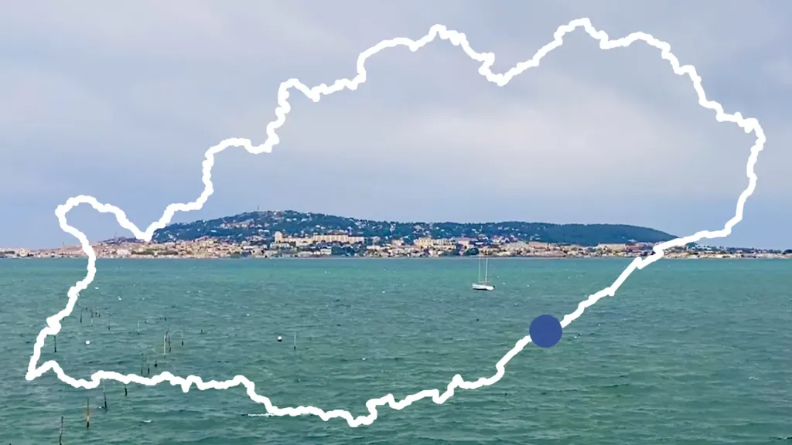

# De Sète à Sète en vidéo

Durant des mois [j’ai rêvé d’un tour de l’Hérault à VTT, puis je l’ai tracé](../../../../page/727tour.md), enfin début avril nous l’avons effectué pour la première fois. [J’ai raconté notre périple](tour-de-lherault-bikepacking-agrandir-limaginaire.md), sans trop préciser que nous l’avons aussi filmé, surtout Patrick Lamarre qui transportait plusieurs caméras, dont un drone.

On m’a demandé si une équipe de réalisation nous accompagnait pour le tournage. Je rappelle que ce tour est offert en open source et donc nous avons tourné les images avec les moyens du bord. Patrick nous arrêtait, nous faisait repartir en arrière pour repasser sous le regard de sa caméra ou de son drone. De mon côté, j’ai filmé quelques séquences avec mon téléphone ou avec une des GoPro de Patrick. Julien transportait aussi une GoPro.

J’ai passé pas mal d’heures à monter le tour sur FinalCut, à visualiser les rushes, à les sélectionner, les saucissonner et à discuter de la forme du film avec Patrick. Les commentaires des premiers spectateurs sont pour nous une belle récompense. Si désormais vous avez envie de rouler le tour, c’était le but : nous voulons simplement partager notre plaisir. Plus nous serons nombreux adeptes de cette philosophie, plus le bikepacking sera une pratique réjouissante.

J’entends parfois dire que des épreuves bikepacking sont payantes, souvent plusieurs centaines d’euros, parce que les créer et les promouvoir demande un investissement et des moyens. La trace du tour de l’Hérault et le film démontrent que nous pouvons en créer dans un autre esprit. Il existe toujours deux modèles de société, l’une fraternelle, l’autre marchande. Comme je l’ai expliqué dans *[Le geste qui sauve](../../../../page/le-geste-qui-sauve.md)*, l’économie de paix s’oppose à l’économie prédatrice, ou tout ou moins la complète, en présentant une alternative heureuse.

Le bikepacking nous pousse vers la nature, à mieux l’aimer, à mieux la respecter, à mieux la vivre pour mieux vivre. Il penche vers la paix et toute tentative de le ramener vers la prédation le dégrade. J’ai envie de le voir comme un terrain expérimental pour le monde d’après, même si beaucoup d’organisateurs veulent l’engluer dans le monde d’avant. C’est une question politique importante. Chacun devrait se la poser, autant les organisateurs que les participants à leurs épreuves. Je milite pour une éthique du bikepacking, un espoir peut-être vain, voire idéaliste, de maintenir la pratique proche de ses origines et proche des valeurs qui me tiennent à cœur.

[Plus d’infos sur le tour, traces, conseils…](../../../../page/727tour.md)

#727 #bikepacking #velo #y2021 #2021-4-28-10h12
