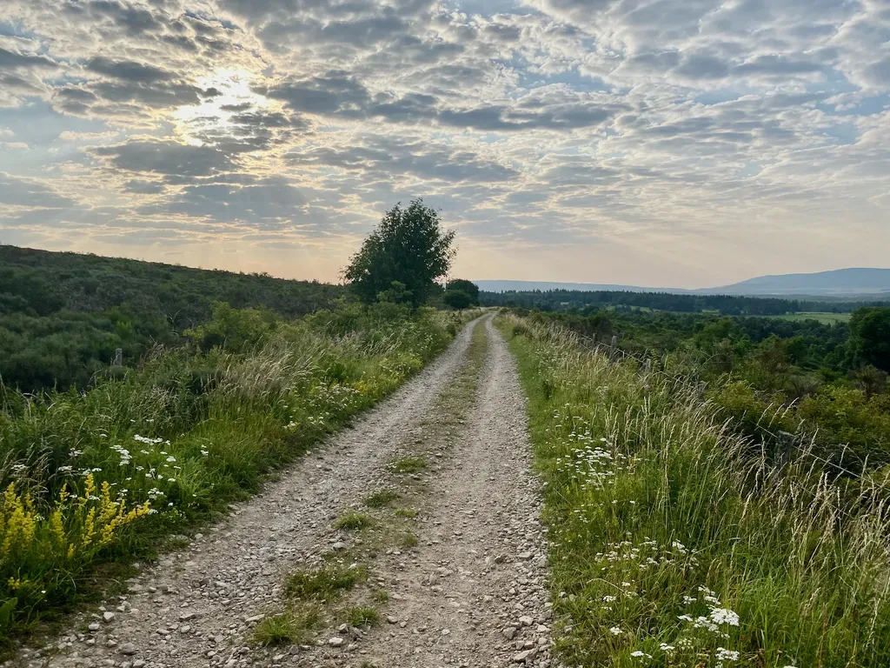

# Créer une trace est un art narratif

Tracer un parcours à vélo est une écriture comme une autre, pour moi semblable à l’écriture de textes ou même de codes. J’y mets ma personnalité, partage mes émotions et émerveillements. Une trace réussie est une œuvre d’art dans laquelle le traceur se donne tout entier. C’est une histoire d’amour entre lui et le territoire.

J’ai découvert cette dimension de la trace aux États-Unis lors de mes premiers raids bikepacking, dont le point de départ et d’arrivée étaient situés à l’endroit le plus judicieux pour que l’introduction et la conclusion soient dignes d’un roman d’aventures. Travail d’autant plus compliqué pour une boucle.

J’ai alors commencé à tracer mes propres périples et à les partager. Mon plaisir est de savoir que je fais plaisir, que ceux qui suivent mes traces reviennent avec les yeux pétillants. J’ai réussi à faire découvrir mon propre territoire à des copains qui l’arpentaient depuis des années, parfois dénichant des chemins sublimes à deux pas de chez eux. Avec [le 727](../../../../page/727tour.md), je commence à faire découvrir l’Hérault à des bikepackers de toute la France.

J’ai aussi suivi de nombreuses traces créées par d’autres auteurs, oui un traceur est un auteur, et tout de suite ressenti leur personnalité dans leurs choix, plus ou moins d’asphalte, de pistes ou de singles, de difficultés, de points de vue, de terrasses de café, de lieux culturels. Un traceur a un style comme n’importe quel artiste, un style souvent identifiable entre mille. J’ai aussi suivi des traces sans âme, sans style, presque mécaniques, créées dans le seul but de faire souffrir. J’ai bien noté la différence entre elles et celles qui étaient des œuvres d’art.

J’ai les boules quand je lis les commentateurs qui affirment que les routeurs automatiques, [comme Komoot et bien d’autres](../../../../2019/9/vtt-gravel-bikepacking-que-vaut-le-routage-automatique.md), peuvent construire des traces tout aussi riches que celles que nous tressons avec patience, souvent après des mois de travail, des jours et des jours sur le terrain à explorer les chemins. J’ai les boules, non parce que mon travail n’est pas reconnu, assez de cyclistes suivent mes traces et m’en disent du bien, mais parce que j’ai l’impression que lesdits commentateurs ignorent la dimension esthétique prise par le vélo, et notamment le bikepacking, depuis que nous avons des GPS.

Créer une trace automatiquement, étant entendu qu’elle soit roulable, ce qui n’est pas toujours le cas dès qu’on s’écarte de l’asphalte, c’est comme écrire un roman avec un algorithme de génération automatique. Un jour peut-être les IA nous révéleront de belles surprises, mais ce jour n’est pas encore arrivé. Quand j’ai tracé la 727, et je fais encore des découvertes à chaque exploration, j’ai choisi parfois un chemin presque parallèle à un autre parce que le point de vue est dans un cas époustouflant. Aucun algo n’intègre encore cette notion, et même alors, il restera à définir ce qui est époustouflant, selon moi un non absolu où l’art entre en jeu.

Arrive après le moment de rouler la trace. Alors pédaler sur une trace automatique est comme lire un roman automatique. J’ai essayé, je vous souhaite bien du plaisir. Mais j’ai parfois l’impression que certains cyclistes ne perçoivent pas la différence entre les deux approches, et je ne suis pas surpris que certains s’échinent durant des heures sur des home-trainers. Telle n’est pas ma philosophie. J’essaie de mettre de l’art dans ma vie (OK, la provocation en fait parfois partie, c’est mon arme contre l’apathie et le suivisme).

On me répète « J’utilise tel service pour créer mes traces et je n’ai aucun problème. » Mais quel genre de trace ? C’est un peu comme dire j’écris des mémos avec Word et je n’ai aucun problème alors que le but est d’écrire un roman avec de multiples épisodes (nous autres auteurs utilisons souvent Ulysses, Scrivener et une panoplie d’autres outils comme Antidote, sans parler des outils de mise en page pour finaliser le job chez l’éditeur).

Créer des œuvres d’art, qu’on soit écrivain, peintre photographe, musicien ou autre, implique de recourir à de nombreux outils. Tous les artistes le savent, et le traceur ne fait pas exception à la règle. J’utilise donc de nombreux logiciels, services et système cartographiques, aucun à lui seul n’étant capable de me combler. Quand on me dit, ce n’est pas une bonne idée, c’est risquer le bug, je l’entends, mais le bug n’est jamais loin quand on se lance dans la création et tous les artistes l’acceptent.

Mais quels bugs ?

Un fichier GPX, n’est qu’une suite de coordonnées GPS, avec quelques autres paramètres. Créer des traces revient à découper, coller, recomposer de tels fichiers. Ce n’est pas en soi très compliqué. Tous les outils acceptent ce format XML. Mais bien sûr, un bug peut se glisser dans un tel fichier, une balise mal refermée peut créer une erreur d’interprétation, voilà pourquoi il est sage de partager ces fichiers sur différentes plateformes, qui chacune les mettront à l’épreuve ([et éviter les plateformes comme Komoot qui les altère, ce qui revient à nier le statut d’auteur du traceur](../5/gaffe-komoot-est-bugue.md)).

Pour créer ces fichiers, j’utilise trois sources.

1. Mes traces enregistrées lors de mes explorations, en général sur Strava.
2. Des traces partagées par d’autres sur une multitude de services.
3. Des traces que je trace directement sur cartes (OSM ou IGN), images satellites (Google ou IGN).

Comme un roman doit être relu avant d’être publié, une trace doit être roulée avant d’être partagée. Il faut alors la corriger, la réformer, parfois la reprendre de fond en comble, ainsi je n’ai cessé de réviser la 727 depuis presque deux ans. J’utilise les traces automatiques quand je ne trouve pas de solution sur des secteurs de liaison, parfois elles me donnent des idées, qu’il est toujours nécessaire de creuser et surtout de tester.

Je conçois que tous les cyclistes n’ont pas la vocation ni le désir de créer des traces dans un but esthétique, mais il me semble important qu’ils n’oublient pas que cette dimension du vélo existe et se développe de plus en plus. Tracer une sortie vite fait de quelques heures pour le dimanche matin n’a rien à voir avec créer une trace pour la partager et donner du plaisir à ceux qui la parcourent.

De même, partir bille en tête avec une carte pour faire un voyage d’un point A à un point B ne peut qu’être catastrophique sur le plan esthétique, surtout quand on veut se tenir à l’écart de l’asphalte. J’utilise souvent cette technique lors de mes explorations. C’est comme écrire, raturer, recommencer, écrire à nouveau. J’aime ce travail préparatoire, cette façon d’esquisser, j’y prends du plaisir parce que je prépare une trace qui elle devra tenir d’elle-même.

Il y a trace et trace. Une trace pour une sortie d’entraînement peut tournicoter sur elle-même, enchaîner les dénivelés punitifs, les passages qui demandent la pleine puissance. En revanche, une trace de plusieurs jours ne peut se contenter de mettre bout à bout des sorties d’un jour. Dès qu’une telle trace tournicote, elle perd sa finalité, sa direction, son ambition. Comme je l’ai raconté dans [mon récit de la GTMC](la-gtmc-des-bijoux-a-travers-les-cailloux.md), on dirait alors que l’auteur ne sait pas où il va. Si tu traverses la France, tu la traverses. Tu ne t’arrêtes pas soudain pour explorer tous les singles de ton jardin. Si tu fais le tour d’un département, tu ne t’enfonces pas à l’intérieur. Surtout tu évites les boucles qu’il est possible de couper parce qu’alors presque tout le monde les coupera, comme on sautera les pages d’un roman quand il ne s’y passe rien d’important pour l’intrigue générale.

Une trace de bikepacking raconte une histoire. Elle nous met à la place d’un personnage de roman et joue autant sur nos jambes que notre cerveau. Elle ne vise pas à nous faire faire du sport mais à provoquer des émotions, par exemple en nous faisant passer devant une bonne boulangerie plutôt qu’un dépôt qui recuit du pain industriel. Elle nous fait entrer dans une autre dimension de l’existence. En tous cas, telle est mon attente quand j’attaque à une trace et quand j’en crée, tout comme quand je me confronte à n’importe quelle œuvre d’art. Je suis souvent critique parce que mes attentes sont élevées. Je fais du vélo dans la nature à longueur d’année. Quand je pars en bikepacking, je suis en quête de transcendance.

*PS : J’ai répondu à ceux qui croient qu’une trace tue l’aventure dans [mon second récit de la 727](../5/le-727-ou-la-fonction-regenerative-du-bikepacking.md). Pour ceux qui jurent encore par les cartes papier, je leur rappelle que pour le VTT nous avons besoin du niveau de détail maximal des IGN, donc qu’il faut en transporter des brouettes pour la moindre sortie un peu longue, d’autant plus quand elle se prolonge sur plusieurs jours. Nous consultons les cartes sur nos téléphones, et c’est très bien. Par ailleurs, quand on fuit l’asphalte, on n’a pas d’autre choix que préparer ses sorties, autre point développé dans mon récit de la 727.*

#velo #y2021 #2021-7-30-11h44
