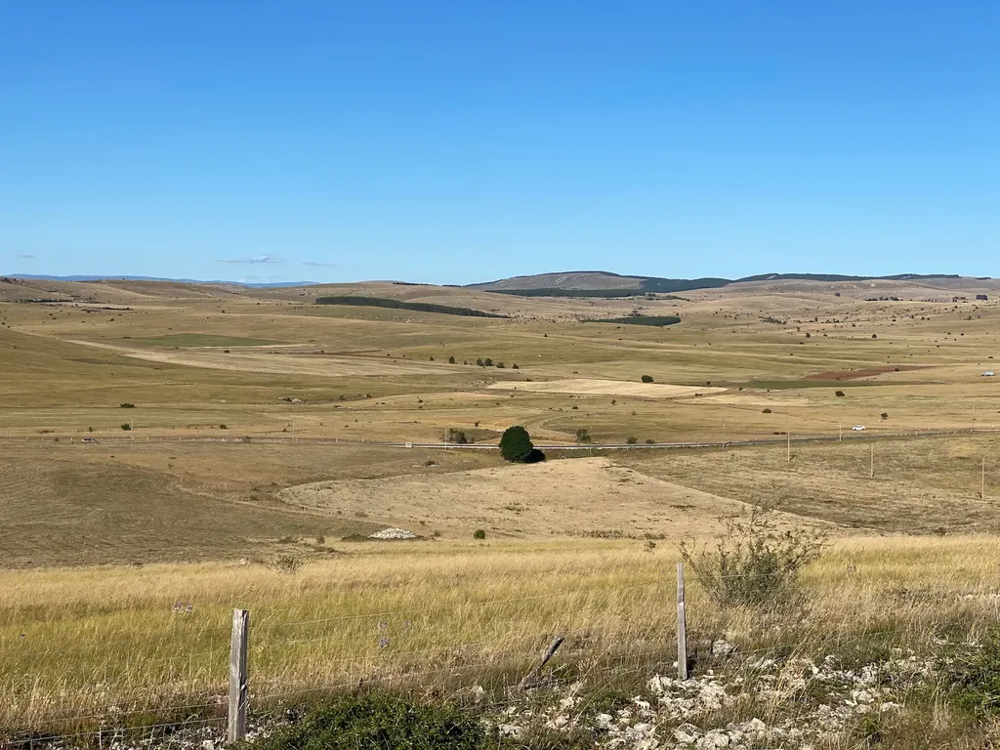
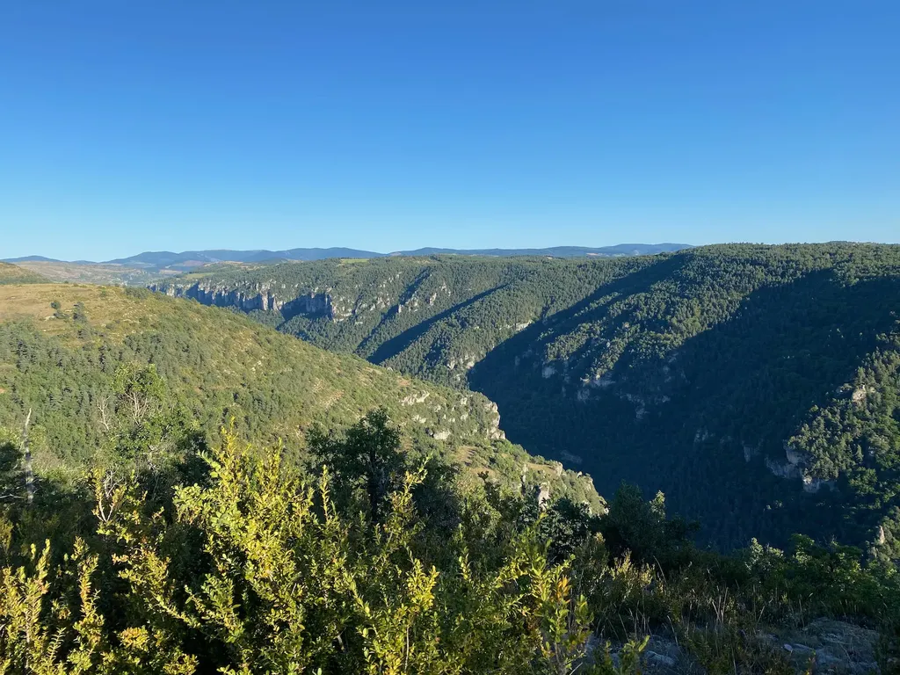

# Bikepacking sur la Géobike : ressusciter une trace mythique

J’aime les courtes aventures sur deux trois jours. Elles allongent le temps et l’espace, me transportent loin alors que je m’évade tout à côté de chez moi. Charger le vélo, partir avec le matos de camping, ne pas savoir à l’avance où je mangerai et où je dormirai suffit à me procurer un immédiat sentiment de liberté.

Alors quand [Patrick Lamarre](https://www.youtube.com/c/Patventure34/) me dit « Tu fais quoi ce week-end ? », je m’empresse de lui répondre « Rien » pour me rendre disponible. Son idée : effectuer une boucle de 225 km entre Hérault, Gard, Lozère et Aveyron sur la Géobike, la trace du tout premier Ultra VTT français, créé en 2006, sans balisage, en autonomie totale. Patrick est un vétéran de cette épreuve disparue depuis une dizaine d’années. Il en garde quelques vagues souvenirs, assez confus, parce qu’à l’époque il était en mode course, couteau entre les dents. Son temps : 22 heures. Cette fois, nous comptons prendre notre temps. Patrick pour filmer, moi pour photographier dans l’idée de raconter le périple.

### Vendredi 27 août

Notre point de départ : [Le Caylar](https://fr.wikipedia.org/wiki/Le_Caylar), village pittoresque du Larzac, en surplomb de la dernière aire sur l’autoroute A75 avant de plonger vers la plaine littorale. Nous avons nos habitudes à la boulangerie. Nous achetons de quoi manger pour le soir et le lendemain matin et nous voilà partis, par un agréable 29° et un vent du nord modéré.

Avant d’attaquer la boucle, Patrick me propose de grimper au sommet des rochers qui dominent les maisons, avec les ruines d’un château, une croix. Nous dénichons un sentier, peinons entre les pins, puis abandonnons nos vélos dans les broussailles et finissons à pied. Nous sommes passés des centaines de fois au Caylar sans prendre le temps. Du sommet, le plateau se révèle à l’infini, avec au nord-est notre objectif, le massif de l’Aigoual.

Je perds Patrick entre les blocs calcaires, débouche au sommet d’un rocher, quand sur un autre rocher je surprends une séance photo. Une nana en string robe soulevée par le vent se pavane sous l’objectif d’un photographe. Nous n’en avons pas terminé avec l’idée de la femme-objet. Bien sûr, la fille est magnifique, je n’en perds pas une miette, mais la marchandisation du corps me met toujours mal à l’aise. Ce rappel de l’esclavage heurte mon sentiment de liberté et révèle toutes mes ambiguïtés.

Après ce prélude, nous voilà partis pour de bon, tout de suite sur les chemins, entre les buis vert et or. Dès la première côte, j’ai mal aux jambes. Mon cœur s’emballe, j’ai le souffle court. On dirait que je n’ai jamais fait de vélo. Je me traîne derrière Patrick qui amène son fat à bonne allure, avec une franche jubilation. Quand nous arrivons à Saint-Michel, il me propose un arrêt pour explorer les ruines d’un second château. Nous laissons nos vélos à la garde des vieux du village et grimpons jusqu’à la table d’orientation.

Je ne suis pas au mieux. J’ai beaucoup travaillé durant la semaine, peu dormi, je le paye cash. J’arrive en haut de la butte sur les rotules, mais le paysage Far West du Larzac et le vent me revigorent. Je pense à [la théorie de Paul Virilio](https://www.franceculture.fr/emissions/avoir-raison-avec/avoir-raison-avec-paul-virilio-45-le-lieu-fait-le-lien), selon laquelle nous avons trois corps : le corps animal, qui se rappelle à moi en cet instant, le corps social, qui me relie aux autres, et notamment à Patrick, le corps territorial, mon extension à la Terre, à l’espace, à la géographie, corps que j’étends quand je fais du vélo, et surtout du bikepacking.

Virilio disait : « Gagner du temps, c’est perdre le monde. » Alors peut-être que j’aime le bikepacking à temps lent, qui ne se donne pas d’objectif sinon vaguement kilométrique, qui ne s’engage dans aucune compétition, qui me laisse le loisir de me réapproprier la Terre. Virilo voyait dans la vitesse toujours grandissante de nos sociétés un mal, une force de dislocation, une explosion. Contre elle, je cherche à resserrer, à reboulonner, à rattacher ma vie à la Terre.

Le bikepacking, du moins tel que je le pratique, serait une mise en application de la théorie des trois corps de Virilo. La vitesse, et notamment celle des communications, tend à nous éloigner de nos trois corps. Je l’ai raconté en 2011 dans *J’ai débranché*. Elle nous fait passer des heures derrière nos écrans, nous éloignant aussi des autres, puisque nous ne prenons plus le temps d’être avec eux, près d’eux, en leur compagnie. Nous partons du postulat que la relation à distance est comparable à la relation physique, ce qu’elle n’est pas. La vitesse disloque le social. Elle abolit aussi le territoire, puisque soit nous restons chez nous, soit le traversons le plus vite possible pour aller d’un point A à un point B. Le bikepacking est tout le contraire. Il se pratique avec lenteur, de préférence à plusieurs, sur un territoire à déplier à l’infini.

Cette prise de conscience donne un sens nouveau à mes coups de pédales. Au pied du village, nous nous arrêtons devant une lavogne, mare circulaire pour abreuver le bétail, avant de retrouver le tracé de [la GTH](https://sitesvtt.ffc.fr/grandes-traversees/la-grande-traversee-de-lherault/), chemin manucuré entre les buis. Quand nous le quittons, nous nous perdons dans les broussailles. En dix ans, le territoire a changé, s’affirmant bel et bien comme un corps en constante transformation. Nous sautons des clôtures, avant de retrouver une voie praticable. Nous nous transformons en archéologues de trace.

À l’approche de Saint-Maurice de Navacelles, des nuées de papillons blancs se lèvent devant nous. Je m’enthousiasme, le temps de reconnaître les dévastatrices [pyrales du buis](https://fr.wikipedia.org/wiki/Pyrale_du_buis) qui dévorent les arbustes, les laissant à nu. En terrasse de la guinguette, les locaux nous expliquent que c’est une catastrophe. « Quand les buis disparaîtront, les ronces les remplaceront. »

Il est 17 h. J’ai du mal à me remettre en route. Nous attaquons le single qui plonge vers les gorges de la Vis. Au début, un billard en balcon au-dessus des falaises. Vue imprenable sur le canyon. Mais très vite les choses se compliquent. La descente est technique, voire dangereuse. Nous mettons souvent pied à terre. Nous arrivons en bas en nage. Nous convenons qu’il est plus judicieux de descendre par la route, avant de retrouver la piste sous les pins. Elle se transforme assez vite en single, qui nous impose de pousser, quand nous retrouvons le canal qui la longe.

Après le village de Navacelle, nous continuons sur le single de la Vis, parfois obligés de pousser nos vélos, mais sans déplaisir, la rivière est claire et joyeuse. Mes jambes aussi. Alors que le soleil n’éclaire plus que le sommet des falaises, je me suis refait une santé. Nous atteignons Vissec, nous ravitaillons en eau, puis par la route rejoignons un sentier qui nous fait remonter sur le plateau. Nous poussons, poussons, puis entrons dans un sous-bois épais qui nous force à allumer nos frontales. Nous commençons à rechercher un spot pour camper. Nous traversons le hameau de Régagnas et avisons à la sortie, une terrasse devant un pavillon de chasse. Il est un plus de 21 h, il ne fait plus que 15°. Les étoiles brillent entre les arbres quand nous nous glissons dans nos sacs de couchage.

Dormir à même le sol, sous le ciel et les arbres, m’enracine. J’ai beau être installé moins confortablement que dans un lit, de sans cesse me retourner, je m’y repose mieux, comme si je me rechargeais au contact de la Terre, au-dessus de laquelle d’habitude je lévite dans mon lit. La lune se lève, se braque sur nous, aveuglante. Au loin, un chien aboie, un cheval galope. Nous commençons à rêver.

### Samedi 28 août

Si le vent a soufflé par rafales dans la nuit, le calme plat et un ciel radieux nous accueillent au matin. Il ne fait que 10° quand nous nous remettons en marche sur les coups de 8 h. Une route nous amène au village de Campestre, puis jusqu’aux portes du parc National des Cévennes. Nous rejoignons le GR71. Une belle piste forestière grimpe vers le massif de l’Aigoual. Nous franchissons, les 1 000 m et nous engageons sur le GR66, les yeux écarquillés. Il faudrait tout photographier, tout filmer.

Nous nous arrêtons au pied d’un monticule parsemé de boules de pétanque géantes. Nous nous gorgeons du panorama et des odeurs, avant de plonger dans un single parfait, entre bois et prairies. Nous piquons vers la vallée. Nous arrêtons pour discuter avec une jeune bergère aux yeux azurs. Nous remplissons nos gourdes à La Rouvière, avant de pousser nos bécanes quelque temps, puis de plonger sur La Dourbie par un single parfois technique.

Après nous être ravitaillés, nous nous installons en terrasse du café pour boire un verre, par un temps soyeux de fin d’été. Devant l’église, des dizaines de pétanqueurs s’affrontent dans un tournoi national. Nous repartons par la route, puis suivons une piste en balcon au-dessus de la vallée. Nous déjeunons là, perchés, seuls au monde et dominateurs. Au-dessous passe un peloton de cyclistes, suivi d’une voiture jaune de la Poste.

Nous plongeons dans le beau, toujours plus beau, à perte de vue. Nos roues se régalent des singles et nous aussi. Nous sommes bien sur nos VTT, et aucun autre vélo ne serait mieux à sa place sur cette trace, dans ces paysages.

À Camprieu, nous nous arrêtons dans un café-restaurant aux tenanciers peu sympathiques, puis déguerpissons vers l’Aigoual. Au col de la Caumette, nous atteignons le point culminant de notre périple à 1 450 m, avant d’engager un single de rêve, le plus beau selon moi du parcours. Il court entre les fougères et les prairies, révélant la vallée de Camprieu, le village tout en bas désormais.

Une longue descente roulante nous amène à Meyrueis où nous méritons une glace géante, sur l’une des nombreuses terrasses du centre-ville. Il est 16 h 30, température idéale pour farnienter une petite heure avant de repartir. Routes communales, sous-bois, sentiers, ma mémoire se trouble à cause de la charge visuelle accumulée depuis le matin. Nous grimpons vers le causse Méjean, immense panorama d’or et de bleu. Nous roulons sur le GR6, dépassons des hameaux, hésitant avec la tarce, finissant dans un jardin où se déroule une fête. Nous refusons un verre de blanc et reprenons la route. Il est 19 h 30, les jambes commencent s’alourdir, le chemin pervers devient de plus en plus étroits et difficile. Le soleil se couche à travers les arbres et, au loin, teinte d’ocre les murailles des gorges de La Jonte. Nous nous arrêtons dans un bois de sapins à 20 h 30, peu après la buvette des Cassagnes, malheureusement fermée. La nuit s’annonce plus fraîche la veille.

### Dimanche 29 août

J’ai eu chaud dans mon bivi, mais j’ai du mal à m’en extraire et à remettre mon cuissard. Quand nous repartons à 7 h 45, nos GPS indiquent moins de 7°. Heureusement, le soleil éclaire le sommet des sapins et il ne tardera pas à nous atteindre. La piste nous amène vers un single, lui-même vers une route, qui nous propulse au sommet des gorges du Tarn.

Que dire, à part abuser de superlatifs. Le temps a marqué son travail dans les couches géologiques. Le vent a sculpté les rochers en Moaï de l’Île de Pâques. La végétation joue à l’équilibriste sur la moindre terrasse que survolent les vautours. Nous nous arrêtons dans les virages de la route pour regarder, mais avec la sensation que jamais nous ne réussirons à capturer ces paysages aux proportions désorientantes.

Nous voyons bien le soleil baigner la face nord des gorges, mais plus nous plongeons vers le Tarn, plus il fait froid. Roulant, le single qui borde la rivière ? Non. Souvent nous poussons, portons, mais toujours au détour d’un rocher ou d’une racine un point sublime se déroule pour payer nos efforts. Je déteste les traces masochistes. La Géobike ne l’est jamais. Elle recherche la beauté, sans concession à tel ou tel vélo, ou telle ou telle compétence technique. C’est une trace pour vététistes comme nous les aimons.

Nous croisons des enduristes qui déboulent vers nous. Petit échange. Ils nous expliquent que le sentier est plus agréable quand on remonte le Tarn. Pas de chance, nous le descendons. Au niveau de La Sablière, un hameau desservi par une tyrolienne, nous jardinons, avant de retrouver un secteur plus bucolique qui nous amène à Le Rozier, point de départ historique de la Géobike, confluence du Tarn et de La Jonte.

Après un petit-déjeuner sommaire, il est déjà pas loin de 11 h 30, nous attaquons l’escalade du causse Noir, par la route. Pas d’autre possibilité à vélo, a priori. Nous enchaînons les épingles, avant de bifurquer entre les bois, puis d’atteindre la ferme de La Rouvière. Le paysan a joué avec les chemins. Nous sautons des clôtures, des monceaux de branches, avant de retrouver une piste rouge et sableuse.

[Loran Nicolardot](https://www.facebook.com/loran.nicolardot), le créateur de la Géobike, nous attend au détour d’un chemin. Patrick improvise un petit interview pour son film. Loran nous explique l’origine de la trace. Elle rassemble les plus beaux chemins où avec ses copains ils aimaient randonner. Alors l’idée leur est venue de les enchaîner à VTT en moins de 30 heures. Il n’était pas question de baliser le parcours. Comme dans leur boulot ils utilisaient des GPS, ils ont pensé à l’autoguidage.

« C’était aussi pour nous le moyen de démontrer qu’on pouvait organiser des évènements sans grands moyens. » Démonstration réussie. Aussi de prouver que les mieux à même de tracer dans un territoire y vivent, parce qu’ils travaillent leur corps territorial au sens de Virilo. Voilà peut-être pourquoi je n’ai pas cessé d’avoir [des doutes sur la GTMC](../7/la-gtmc-des-bijoux-a-travers-les-cailloux.md) et d’autres traces, comme si je roulais hors du territoire, dans une abstraction géographique, construite sur carte plus que par amour de la Terre.

Je promets à Loran de mettre à jour la trace pour qu’elle puisse continuer à vivre. Nous lui parlons du problème rencontré quelques minutes plus tôt à La Rouvière. « En dix ans, il s’en est passé des choses. » Loran ne fait plus de vélo. Il faudrait qu’un autre gars du coin trace une variante dans ce secteur.

Ce n’est pas tout, mais il nous reste pas mal de kilomètres avant Le Caylar. Nous quittons Loran, retrouvons une route, un single exigeant, une nouvelle route magnifique qui nous fait dégringoler vers les gorges de La Dourbie et Roque-Sainte-Margueritte, où nous dénichons un charmant café-restaurant. Il est déjà plus de 14 h, mais le patron nous sert à manger avec le sourire. Ailleurs, nous avons eu l’impression que commander hors des heures administratives était un crime.

Nous traînons une bonne heure, avant d’attaquer l’escalade du causse du Larzac. De l’autre côté des gorges de La Dourbie, sur le causse Noir, se dressent les totems calcaires [du chaos de Montpellier-le-Vieux](https://fr.wikipedia.org/wiki/Chaos_de_Montpellier-le-Vieux). Les intempéries ont rongé tout autour les calcaires plus tendres, ne laissant que les vestiges de building d’un autre temps.

Après un bout de route, nous entrons dans le Larzac vert, suivant un single bucolique entre les herbes hautes et les sapins. Nous enchaînons de belles pistes, puis le tracé de [l’ancienne ligne de chemin de fer, Roquefort-Le Vigan](https://fr.wikipedia.org/wiki/Ligne_de_Tournemire_-_Roquefort_au_Vigan). Par moment, nous pédalons dans la caillasse concassée jusqu’à ce que j’en perde patience avec mes pneus de 2,1 pouces.

Nous atteignons la Couvertoirade à 18 h 30. Le drapeau templier flotte au sommet du château en ruines. Les échoppes nous plongent dans le moyen-âge. Le temps d’un dernier verre et nous repartons vers Le Caylar, suivant un single meurtrier qui m’arrache des cris de rage et d’impatience. Un champ de cailloux à se défoncer les articulations, avec comme par miracle des secteurs en velours qui courent sous les arbres. Quand nous rejoignons notre point de départ, le soleil couchant enflamme le Rock Castel. Nous sommes heureux. Les joues rouges de grand air. Nos trois corps plus grands, et nous avec.

Nous avons vécu trois journées d’un dépaysement total. Merci Loran pour ta géniale initiative de 2006. Tu as inventé le bikepacking moderne sans le savoir, en même temps qu’il s’inventait aux États-Unis. À chacun des détours des chemins, nous avons senti ton amour du lieu et avons ressenti les frémissements de son génie. Tu ne pouvais pas nous rendre plus humains.

### Infos

Trace de la Géobike 2.0 sur [Google Map](https://www.google.com/maps/d/u/0/edit?mid=1wqDWX6dtA3_4qzptgRDUSU3_G2-ZE9zN&usp=sharing) et [Utagawavtt](https://www.utagawavtt.com/randonnee-vtt-gps/Geobike-2-0-2021-225-km-34429).

#bikepacking #velo #y2021 #2021-8-30-16h30
