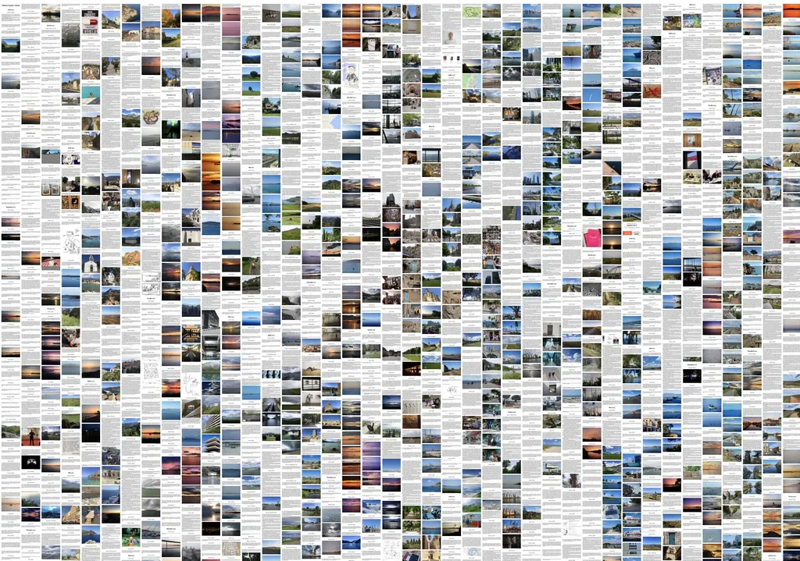
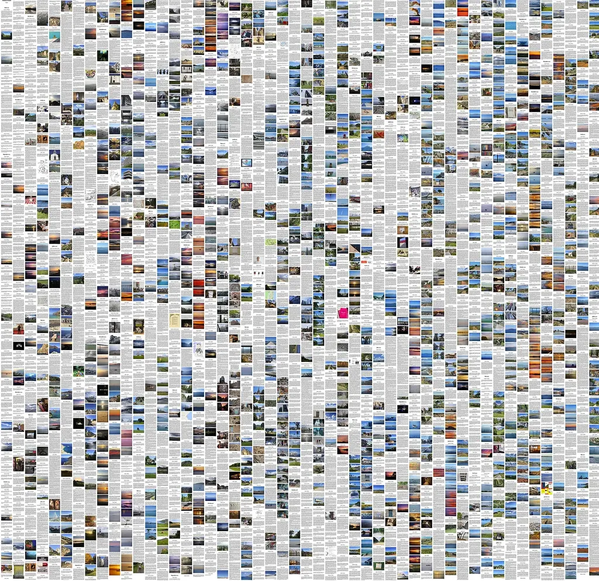
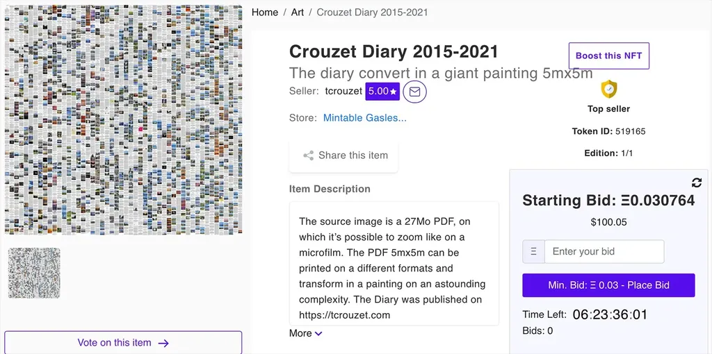

# Je vends mon blog aux enchères en NFT

J’ai la hantise que mon blog disparaisse, que la plus grande partie de mon travail d’auteur s’évanouisse comme si elle n’avait été qu’un happening que personne n’aurait filmé, [sauf peut-être internet archive](https://web.archive.org/web/*/https://tcrouzet.com), mais de manière incomplète et peu lisible.

Les causes potentielles de cette annihilation ne manquent pas. Après ma mort, qui aura le courage de maintenir en état de fonctionnement mon affaire ? Déjà, aujourd’hui, je cours après les mises à jour, la nécessité de suivre les standards web, de rester lisible sur tous les appareils. Demain, qui effectuera ce travail à ma place, qui l’effectuera pour les milliers de blogs laissés sans leur géniteur ? Une grande partie de notre patrimoine culturel contemporain risque de disparaître. Sans parler du risque plus immédiat de la destruction d’un serveur, que je tente de pallier par des backups automatiques quotidiens et mensuels.

Un livre a l’avantage d’être archivé dans les bibliothèques privées ou publiques. Un livre électronique traîne sur divers disques durs, mais surtout sur les serveurs des multiples librairies électroniques, ce qui leur assure une forme d’archivage décentralisé, relativement sécurisé, sauf en cas de cataclysme numérique. Pour pallier à une telle catastrophe, il y a quelques années j’ai [converti mon blog en livres](../../books/les-annees-blog.md).

Mais cette transposition implique une perte de ce qui fait le propre du blog : la lecture ne s’y effectue pas en tournant des pages, [mais en les déroulant comme avec les rotulus antiques](../../../../2015/1/lebook-quun-ersatz-de-lecture-numerique.md). Sur les blogs, les textes et les images se succèdent dans une cinématique verticale, quand les pages de livre impliquent de couper les textes en fin de page, de déplacer les images, de les composer d’une manière non linéaire, souvent de les identifier avec des renvois. Par exemple, [mon carnet](../../page/carnets) est difficilement convertible en livre, parce que les photos y occupent une part presque aussi importante que les textes. Elles doivent être placées là où elles ont surgi, et seule la page indéfiniment longue résout cette contrainte avec élégance.

J’ai effectué ce constat depuis des années, mais je tournais autour de la question jusqu’à ce que surgisse la notion de NFT, ces non-fungible tokens étant des titres de propriété d’objets numériques garantis authentiques et traçables. Je me suis alors demandé s’il n’y avait pas moyen de créer des objets textes/images qui pourraient être vendus sur les places de marché de NFT, leur simple mise en vente revenant à les backuper dans des bases de données décentralisées. Et si des acheteurs se présentaient, ils transformeraient ces objets en œuvres d’art, pourquoi pas dignes d’être exposées dans les musées. Donner de la valeur à un blog reviendrait à le pérenniser.

J’en étais à ce stade de ma réflexion jusqu’à ce que par hasard je tombe sur [un article de rhythmus.be à la mise en page minimaliste fort séduisante](http://rhythmus.be/md2indd/). Dans la logique de pérennisation du blog, le minimalisme est tout aussi indispensable que l’archivage. Le code HTML des pages doit être aussi simple que possible, recourir aux standards les plus anciens, concentrer fantaisie que hors du document dans une feuille de styles dont la maintenance n’affecte pas le reste de la structure.

En voyant rhythmus.be, je me suis dit voilà à quoi devrait ressembler mon blog, ou tout au moins une de ses instances ultrasimplifiées. J’ai donc commencé à créer un bout de code pour exporter mon blog en HTML basique et statique, c’est-à-dire ne nécessitant pour être diffusé qu’un disque dur connecté au réseau, voire même pas connecté. J’avais dans l’idée que ce site pourrait devenir un NFT une fois zippé ou encapsulé dans un MHT, fichier HTML conteneur lisible par tous les navigateurs.

J’ai commencé par ne travailler que sur [mon carnet](../../page/carnets), pour ne pas avoir à manipuler un objet de plusieurs gigaoctets, mais déjà les 1,7 M de signes et ses presque 1 400 images occupent 500 Mo. Quand j’ai commencé à explorer les places de marché NFT, j’ai découvert que [toutes fixaient pour l’instant des tailles de fichiers relativement minimes](https://cyberscrilla.com/minting-your-nft-file-size-upload-limitations-and-restrictions/), [OpenSea](https://opensea.io/), la plus populaire conseillant de ne pas dépasser 20 Mo avec un max à 40 Mo.

Pour le moment, la plupart de ces places de marché diffusent des objets relativement classiques : images, sons, vidéos… J’ai alors pensé à créer un PDF d’une seule page qui rassemblerait la totalité des six années de mon carnet. L’idée m’a réveillé au milieu de la nuit. Au matin, j’ai sauté sur mon clavier et découvert qu’il était possible de créer des PDF de 5 mètres sur 5. Mais comment générer un tel PDF ?

J’ai rapidement trouvé une solution. J’ai compilé une version minimaliste de mon carnet sur une seule page web, donc un immense rouleau, puis je l’ai imprimée dans un PDF. Après pas mal de bricolage, j’ai découvert qu’avec cinquante colonnes, je remplissais presque exactement mon immense page. Quand l’image est apparue à l’écran, j’ai trépigné de joie. C’était juste superbe, une œuvre d’art en soi. Je me suis dit qu’elle pourrait être imprimée dans diverses dimensions et se transformer en un tableau d’une complexité assez folle. Mais la taille du fichier PDF occupait toujours environ 500 Mo.

J’ai alors compressé une première fois ce fichier, réduisant sa taille à 50 Mo environ, avant de le compresser une seconde fois et de tomber sous les 30 Mo. J’avais enfin un fichier de la taille requise par OpenSea. Avec ce PDF, j’ai réinventé le microfilm. Zoomer sur l’image fait apparaître son contenu. Le texte vectorisé reste parfaitement lisible, les photos perdent en qualité, mais l’ensemble devient autre chose que mon carnet initial, une œuvre en soi. J’ai créé une fresque contemporaine, la version graphique d’un bout de mon blog.

Quand j’ai voulu la mettre en vente sur OpenSea, nouvelle déconvenue. Cette place de marché, contrairement à d’autres, n’accepte pas les PDF. J’ai tenté de convertir mon PDF en SVG, format vectoriel accepté, mais Illustrator a refusé d’ouvrir ce PDF un peu trop volumineux à son goût. J’ai donc basculé sur une place de marché moins connu, [Libra.codes](https://libra.codes/), qui accepte des fichiers de tout type jusqu’à 100 Mo et [j’ai mis en vente une première fois mon PDF](https://libra.codes/token/79c1a8af5ef708a621b1334fc87bea94ac07c4f0).

Peu séduit par ce site, j’ai essayé [mintable.app](https://mintable.app/), qui s’est avéré assez intuitif. N’importe quel type de fichier peut être vendu, la taille maximale devant être inférieure à 200 Mo. [Vous pouvez participer à la vente aux enchères.](https://mintable.app/art/item/Crouzet-Diary-2015-2021-The-diary-convert-in-a-giant-painting-5mx5m/buKmUZJYsiO9bxn)

Je ne fais que jouer, qu’expérimenter. J’entrevois des possibilités pour les blogs, mais aussi de nombreux textes, qui pourraient être transformés en objets numériques uniques. Affaire à suivre.

#edition #nft #y2021 #2021-8-20-20h50
