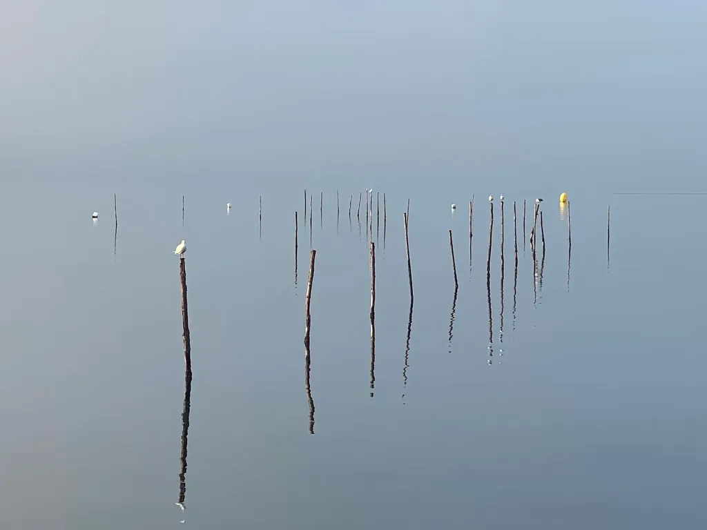
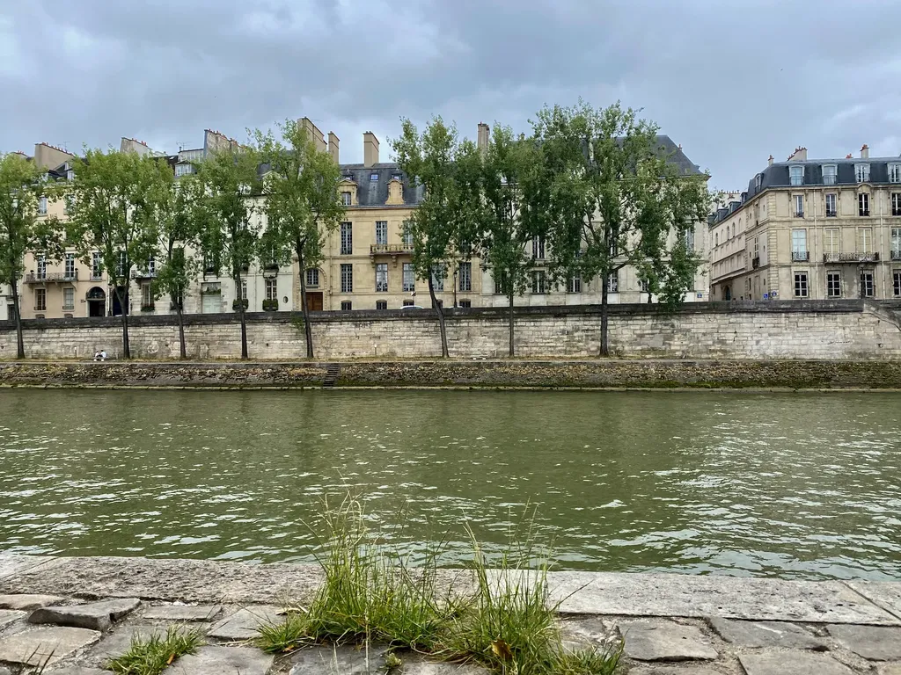
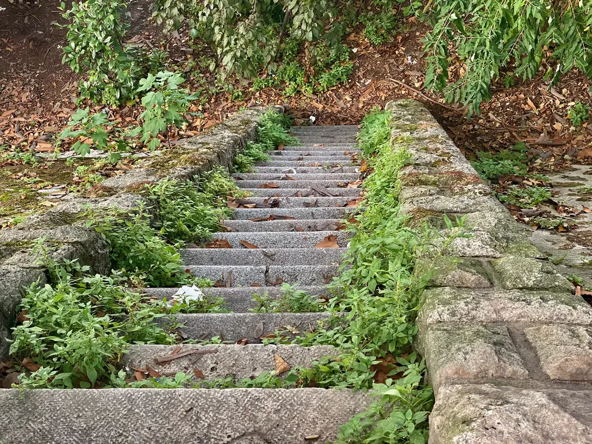
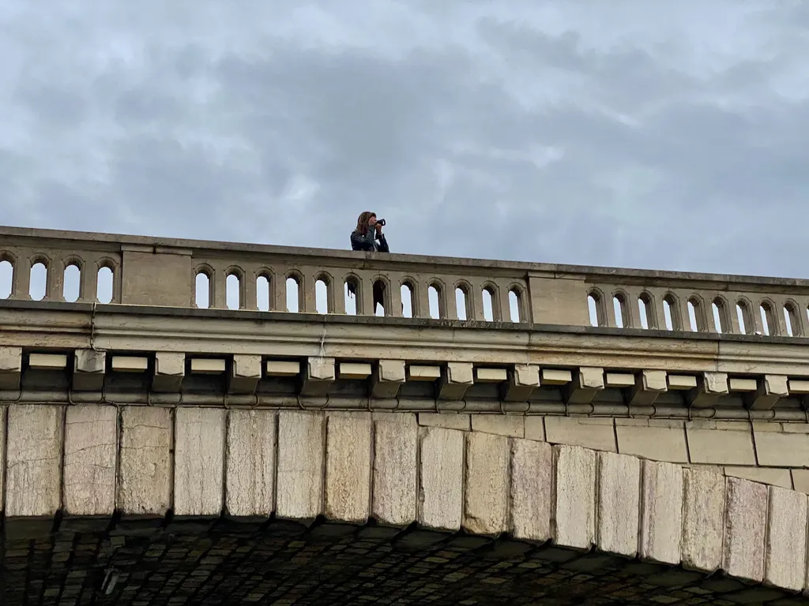
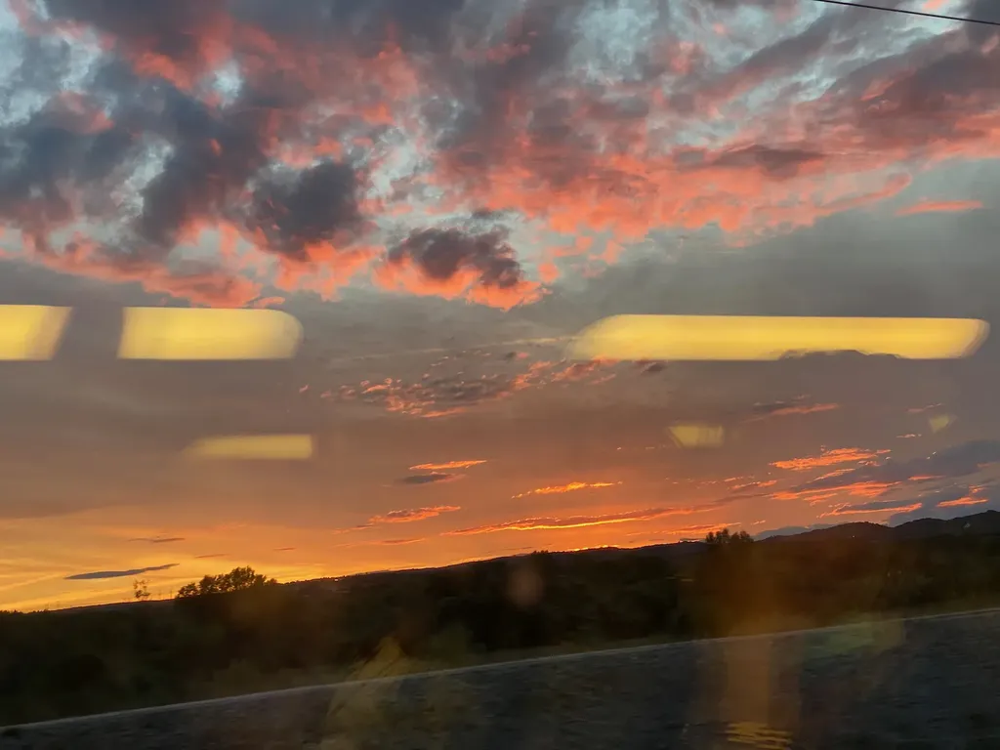
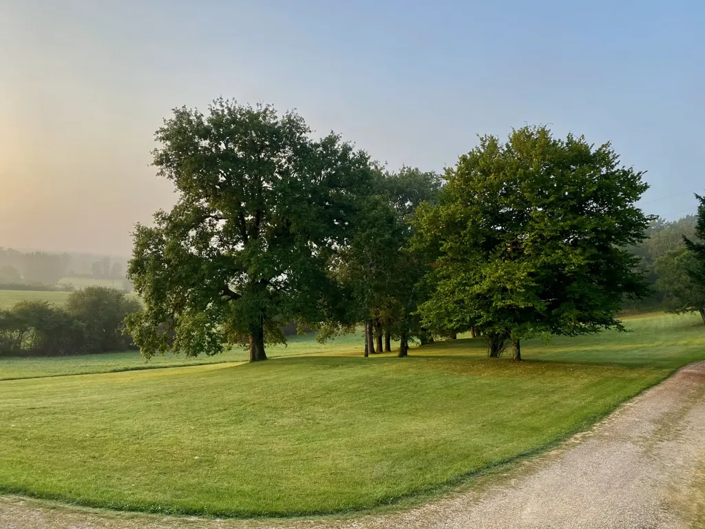
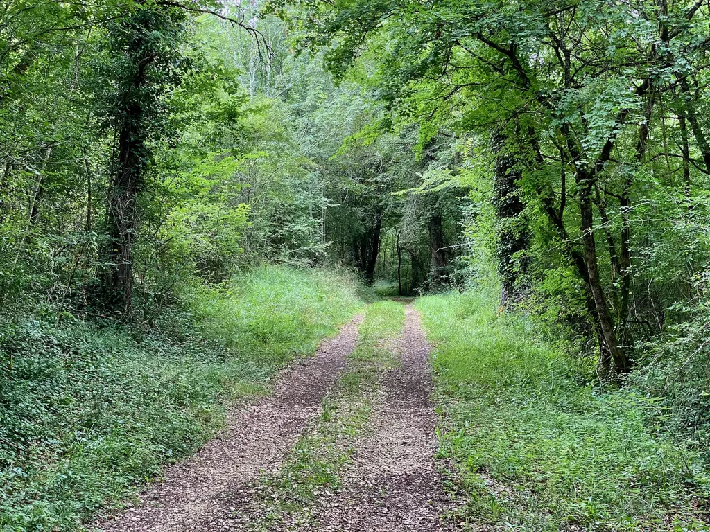

# Août 2021

### Dimanche 1er, Balaruc

Je m’ennuie en société. Je n’écris que pour tromper cet ennui, que pour rechercher des relations satisfaisantes, souvent avec des personnes mortes depuis longtemps.

Hier une soirée, la première depuis presque deux ans, comme une aberration par temps de covid, j’ai croisé des gens que j’aime, mais sans aimer être parmi eux, peut-être à cause de la musique trop forte pour autoriser la moindre conversation.

Je suis incapable d’accepter la soirée comme lâcher prise. Je n’enclenche un processus de détachement que lors des longues sorties à vélo, surtout de plusieurs jours, quand j’entre dans une transe, semblable à celle des méditants. Dans une foule d’amis et d’inconnus, je suis extérieur, je regarde non sans tendresse, avec une pointe de tristesse de ne pas ressembler aux autres, de ne pas être à ma place parmi eux.

Je n’ai rien à leur dire, pas envie de bouger mon corps, encore moins de lui injecter des ingrédients nocifs, soit trop gras, soit trop alcoolisés, qui me mettront le lendemain dans un état d’inappétence détestable.

Ces sentiments ne sont pas nouveaux, ils constituent même une constante depuis aussi loin que je me souvienne. Je ne me sens à mon aise que dans les soirées qui autorisent les petits groupements dans les clairières calmes et verdoyantes, ce que l’orage d’hier soir a interdit.

---

Petite boucle à vélo. Quand j’arrive au sommet de Gardiole, à contre-jour, une biche ne semble pas me voir jusqu’à ce que je sois à quelques mètres et qu’elle s’enfuit. Entre l’ombre et le soleil d’été, elle est sortie droit d’un conte de fées.

### Lundi 2, TGV pour Paris

Arrêt en gare de Nîmes. Un chien tenu en laisse pisse contre un poteau, puis des voyageurs marchent dans la pisse et y roulent leurs valises. Vision d’apocalypse. Profond dégoût. Le propriétaire du chien, un gars trop gros, qui ne prend pas plus attention à lui-même qu’au monde, et qui en prime se charge de la gestion d’un chien, que bien sûr il ne contrôle pas plus que lui-même.

### Lundi 2, Paris

Est-ce que j’aime Paris ? J’ai été seul sans cette ville, jusqu’à la douleur, et socialisé jusqu’à en perdre la tête, et je m’y retrouve seul aujourd’hui, parce que je suppose que les amis sont en vacances. Je me suis assis au débouché du port de l’Arsenal, puis j’ai marché jusqu’aux quais rendus aux piétons. J’ai piqué une chaise longue, face à l’île Saint-Louis, une position nouvelle, parce que je ne m’étais jamais arrêté à cet endroit. Il fait un ciel de novembre, avec des bourrasques humides, une lumière qui convient à la ville, à ses arbres, à ses toits gris.

J’aime Paris en souvenir de ma jeunesse, quand je voulais trouver la clé de ma littérature. Je ne l’ai toujours pas trouvé, sauf le carnet, qui dès cette époque a fabriqué ma tonalité. Aujourd’hui, j’écris mieux, sans avoir besoin de me relire, parce que j’ai tant écrit que les mots prennent leur route d’eux-mêmes.

J’ai beaucoup attendu de cette ville et, en fin de compte, elle m’a peu donné. Je n’ai pas réussi à y être pleinement, traînant partout une rage rentrée. Ma misanthropie par maladresse m’a desservi.

Hier soir, j’ai repensé à mon autobiographie, à en modifier l’angle, la reprendre pour en faire un livre pour mes fils. Leur raconter ce que j’ai appris, ce que j’ai merdé. Qu’ils ne perdent pas de temps.

Quand j’étais jeune, j’admirais des écrivains, des peintres, des photographes, je ne suis pas allé à leur rencontre de peur de les importuner. Désormais, je pourrais aller vers eux sans culpabiliser, mais ils sont morts. Je ne lis plus mes contemporains, je navigue hors du temps.

J’admire François Bon parce qu’il transmet avec ses ateliers. Il partage son expérience. Moi, je reste en vase clos. Je ne communie qu’avec des esprits éthérés. J’ai si peu résolu ma propre équation que j’ai du mal avec les autres, sauf peut-être à vélo, où la moindre anecdote nous occupe parce que nos cerveaux manquent d’oxygène.

J’ai l’intuition que le moi reste le sujet de notre époque trouble, sans perspective, secouée par les crises, avec en suspend l’épée de Damoclès du réchauffement climatique. Il est difficile de penser des œuvres radicales, la tentation est grande de divertir, parce que les derniers lecteurs n’attendent qu’à s’arracher à la monotonie universelle.

J’ai été radical avec *One Minute*, peut-être pas suffisamment, mais au moins formellement. J’ai poussé un cran plus loin la désintégration narrative du XXe siècle tout en réinventant une autre forme de narration. J’ai une certitude quant à la forme de ce texte. J’aurais dû saisir un autre moment : nos vies polyphoniques, sans recourir à la métaphore du contact extraterrestre.

Mais plus la société craque, plus le monde se tend, plus les lecteurs attendent de l’attendu. Ils veulent être confortés ou faussement secoués par du noir à deux balles. La seule difficulté dans les temps troublés est de produire de la lumière. Réveiller l’espoir. Proposer une autre direction. Seules les œuvres de ce genre marqueront notre époque, les autres n’en seront que des photographies déformées, qui apparaîtront toutes identiques à nos successeurs.

La lumière où la chercher ? Parfois elle brille en moi au détour des chemins. Il me semble la saisir dans mes récits de voyage. Mais je pense à une œuvre que je reprendrais, jour après jour, et dans laquelle je commencerais la journée par allumer la lumière. Une construction qui ne viendrait que de moi-même, que de mon imagination, qui se construirait non pas à partir d’interactions sociales ou médiatiques, mais jaillirais de mon for intérieur comme a dû jaillir *Le Seigneur des Anneaux* dans les neurones de Tolkien, enfermé dans une maison confortable où il pouvait jouer à dieu.

Paris m’a toujours inspiré des pensées troubles. Je dois être sensible à un tropisme du lieu. Il suffit que je m’y assoie pour que du texte se matérialise, comme si par son déferlement il me rendait la ville plus intelligible. Pourtant quand j’arrêterai d’écrire rien n’aura changé. Peut-être au mieux le ciel se sera dégagé et le soleil amorcera son retour.

Où que je me trouve, j’aimerais ouvrir mon ordi et replonger dans la même narration. Aspirer la matière environnante pour l’injecter dans une cathédrale. Au contraire, je recommence à zéro. Je piétine toujours les mêmes pensées, non sans déplaisir, mais en sachant que je n’avance nulle part, sinon vers la mort.

### Mardi 3, Paris

Tous les antivax ou presque se méfient des gouvernements, mais presque tous passent leur vie à se publiciser sur Facebook, une dictature planétaire qui n’a pour ambition que de faire d’eux des consommateurs.

### Mercredi 4, Paris

### Jeudi 5, TGV Sète

J’ai lu un article sur le panpsychisme, l’idée selon laquelle toute chose serait conscience, donc même une particule élémentaire. La question est intéressante. Existe-t-il un seuil de complexité à partir duquel la conscience émerge ou est-elle distribuée à toutes les échelles avec plus ou moins d’intensité ? Cette question me passionne. Dans les moments de communion avec la nature, je penche vers le panpsychisme, je me laisse griser par lui. Il y a peut-être de la matière pour un roman initiatique, qui mettrait en scène le conflit inévitable entre les défenseurs du panpsychisme et ces détracteurs.

Comme toujours une idée apparaît, séduisante, puis je l’oublie. Elle n’a une chance de devenir livre que si elle retoque à la porte assez souvent pour qu’elle devienne obsessionnelle.

### Dimanche 8, Balaruc

Journée passée à discuter avec des amis, dont un spécialiste du climat, de comment le monde du business pourrait enfin le prendre en compte. J’ai renoncé à la lutte théorique, j’ai passé les années 2005-2012 à batailler pour arriver à la conclusion qu’il nous manquait des narratifs pour nous tendre vers le futur en tant que société.

Stabiliser le climat n’est pas un objectif. Pourquoi retrousser nos manches ? Pour quel rêve collectif ? Survivre n’est sans doute pas suffisant. Me faut-il imaginer un roman qui porterait un des narratifs possibles, un parmi une multitude, mais tous avec un point de convergence ? Avant de me quitter, mon ami me dit imagine qu’Al Gore ait été élu président en 2000, peut-être que tout en aurait été changé, que nous aurions gagné vingt ans.

Mon ami connaît le bonhomme, il a travaillé avec lui. Je doute du personnage providentiel. Je crois qu’il faut jeter cette idée aux orties. Mais elle m’a donné l’idée d’une uchronie. Et si Al Gore avait été élu, qu’est-ce que nous aurions pu faire ? Peut-être faudrait-il imaginé ce qui aurait été possible pour penser ce qui aujourd’hui doit être, mais face à une urgence plus grande, après vingt ans de perdus.

Je doute d’être assez motivé par mes semblables pour m’attaquer à cette tâche. Je suis plus attiré par l’intime, par les microscopiques histoires, par les vertus de [tracer des boucles sur le territoire pour le faire aimer et faire aimer le monde à travers ces parties les plus intimes](../8/lecologie-commence-par-lamour-du-territoire.md). Mais peut-être que mes aspirations diverses convergeront. Lier l’intime au collectif. Je n’ai jamais écrit pour divertir, mais pour m’initier au monde, et peut-être aider mes lecteurs à suivre mon cheminement pour qu’il double le leur.

### Lundi 9, Balaruc

J’ai cessé d’aller sur Facebook depuis dix jours et constate déjà les bénéfices. Certes, je n’ai plus de nouvelles de mes copains cyclistes, alors je dois leur téléphoner, mais j’ai gagné en sérénité, et pour commencer j’ai gagné du temps. Terminé de saisir mon téléphone à tout bout de champ pour y lire le plus souvent des insignifiances.

Il y a dix ans, j’écrivais *J’ai débranché* et j’en reviens au même constat : les réseaux sociaux sont nocifs. Cela pose la question de mon existence en tant qu’auteur, aujourd’hui que le net s’est centralisé. Mon blog devient une minuscule île en lointaine périphérie d’un État totalitaire. J’ai besoin de me recentrer et de laisser venir à moi, plutôt que d’aller vers les lumières où des milliers d’autres tourbillonnent sans que nous ayons de raisons profondes d’échanger. M’appliquer à mon propre narratif. Cesser de le pervertir pour le rendre plus séduisant aux yeux des lucioles. Accepter d’être moins lu pour être mieux compris. Vivre a contrario de l’époque pour mieux la saisir.

---

Le dernier rapport du GIEC réveille les foules comme si nous ne savions pas déjà tout ça depuis vingt ans. J’assiste à une nouvelle campagne électorale, qui soulève l’espoir, mais n’entraînera aucun changement.

### Mardi 10, Balaruc

Tourner le dos aux réseaux sociaux implique peut-être de repenser le blog une fois de plus. Ma première tâche doit être de créer une version statique, indépendante de mon serveur, transportable, minimaliste, puis de la distribuer sous forme de NFT. Ce travail technique ne doit pas s’effectuer au détriment de la littérature elle-même. Mais face à l’évolution toujours plus rapide des normes et des protocoles, je dois rester à flot, même si plonger dans le code me cause vite des tourments et me provoque des insomnies terribles.

---

Chateaubriand est avant tout un être social. Ses mémoires relatent ses relations aux autres, les admirables moments de solitude contemplative restent minoritaires. Quand je pense à mon journal, je le vois au contraire comme un regard plongé en lui-même, qu’une enquête sur soi, peut-être jamais poussée assez loin pour qu’en émerge quelque chose de neuf pour moi. Ou peut-être que je ne me regarde pas vraiment, que je reste à la surface de contact entre l’extérieur et moi, peut-être pour adoucir l’interface.

Ce matin, un temps printanier, bien paradoxal en août. L’étang d’huile brille de bleu avec en son centre le reflet d’une coque rouge. Je ne peux pas rester longtemps à observer le paysage sans qu’il me devienne douloureux. Sa beauté gonfle et exige que je lui réponde. La cause de l’écriture est là, dans ce phénomène d’insatiété esthétique. Pour me soulager, je dois créer, et la douleur redouble quand j’en suis incapable. Pourtant, j’ai toujours une échappatoire à ma disposition, le carnet, ces phrases mêmes, pour évacuer l’excès de beauté. Je connais la médication depuis plus de trente ans, mais souvent j’oublie de m’y abandonner, comme si j’en avais perdu l’habitude, peut-être parce que je publie mes carnets, parce que je suis incapable d’en mener deux versions en parallèle, l’une qui serait intime et l’autre publique.

---

Quand Chateaubriand parle du *Génie du Christianisme*, il parle de l’effet de la religion elle-même et non de la foi. Dieu semble mis de côté, sans grande importance. Seules comptent les institutions et non leur fondement. Le christianisme comme constitution, comme liant sociétal. La crise climatique pourrait-elle incarner notre divinité, inspirer le génie d’aujourd’hui ? Sauf que la crise n’a rien d’une croyance. Sauf que cela n’a aucune importance. Il s’agit de trouver un point d’ancrage commun pour marcher tous ensemble, plus ou moins dans la même direction. Chateaubriand accordait cette vertu féconde au christianisme, vertu bel et bien dépassée aujourd’hui, inapte face à la crise, et même en partie sa cause.

---

Dimanche, nous avons parlé de la notion d’incentrabilité. J’ai émis l’idée qu’à l’aide du théorème de Gödel nous pouvions démontrer qu’aucun système ne pouvait être incentralisable, et donc que la quête d’une telle incentrabilité était vaine. Pour qu’un système ne soit pas centralisable, il faut qu’un système hors de lui-même veille à sa décentralisation, mais ce système extérieur est lui-même centralisé en quelque sorte. La solution est plutôt dans une dynamique entre un système décentralisé, supervisé par un système qui veille à sa décentralisation, lui-même contrôlé par feedback par le système décentralisé. Voilà pourquoi je suis en faveur de modalités de gouvernances globales, si leur ambition est de veiller à la décentralisation des instances qu’elles régissent. Aujourd’hui, ce n’est pas le cas, les instances globales participent à une hiérarchisation du monde, donc à une limitation de son intelligence collective plutôt qu’à sa maximisation. Exemple : on distribue de l’argent aux pays et non aux citoyens.

Nous avons aussi parlé de cette mode où il n’est que question des droits des uns et des autres et où nous oublions que nous avons aussi des devoirs, déjà vis-à-vis de nous-mêmes, devoir de nous nourrir par exemple, et aussi vis-à-vis des autres. Je suis tombé [sur un podcast au sujet de Simone Weil](https://www.franceculture.fr/emissions/avoir-raison-avec/avoir-raison-avec-simone-weil). Dans *L’Enracinement*, elle oppose la notion de droits et de devoirs. Pour régler la crise climatique, nous avons dès à présent des devoirs : cesser de consommer à tort et à travers, de prendre l’avion pour un oui ou un non, de bouger sans cesse, oubliant que le moindre recoin du monde recèle de merveilles qu’une vie ne suffit pas à explorer. La liste est longue. Devoir d’expliquer la situation, devoir de donner l’exemple, devoir d’appliquer à soi-même la logique de respect qui devrait être appliquée à l’environnement.

Certains « positivistes » modernes refusent jusqu’à utiliser l’impératif quand ils parlent ou écrivent, mais je ne vois pas comment nous pouvons contourner l’impératif écologique ? Comme il n’y a pas de liberté sans responsabilité, il n’y a pas de droits sans devoirs. Je dois être le changement que je veux voir advenir dans le monde. Je ne peux pas me voiler la face. Je ne peux pas dire « Je peux être le changement », non, ça ne marche pas, il ne s’agit plus d’une possibilité. « Commence par toi-même » devrait être l’impératif contemporain.

Maintenant, le devoir n’a pas à être imposé, il peut s’imposer de lui-même, par une conversion intérieure, sinon son injonction aura peu de poids. Je ne peux sans doute pas donner d’ordre aux autres, mais je peux m’en donner à moi-même.

---

Je n’ai jamais lu Simone Weil, mais si un bout de sa pensée telle que je l’entends présentée me séduit, tout le reste me répugne, à commencer par son platonisme et son déisme, sa croyance en la vérité et sa foi dans les hiérarchies.

### Mercredi 11, Balaruc

J’ai commencé à coder un petit plugin qui transforme mon blog en sa version statique minimaliste.

### Jeudi 12, Balaruc

Je ne me suis jamais trop intéressé à Bitcoin, sinon au tout début, j’aurais dû en miner, mais tout de suite nous avons vu que cette monnaie se recentraliserait, parce que les premiers entrants emportaient le jackpot, ce qui entraînerait la spéculation. Bitcoin a beau être techniquement décentralisé, ses usagers ne le sont pas. Cette analyse a poussé Laborde à créer le concept de monnaie libre, où tous les acteurs ont le même poids. Ce qui à mon sens aussi est une grande faiblesse, puisque personne ne se précipite vu qu’il n’y a aucun intérêt à le faire. Nous sommes condamnés à osciller entre décentralisation et centralisation.

### Vendredi 13, Balaruc

Chateaubriand est d’une suffisance parfois insupportable. Le personnage ne devait pas être très agréable à vivre. J’ai du mal à comprendre pourquoi il éprouve le besoin répété d’affirmer son génie dans une œuvre posthume, peut-être parce qu’il doute, parce qu’il veut se persuader lui-même et persuader la postérité. Il en vient alors à m’ennuyer, surtout quand il ne cesse de parler des uns et des autres, des célébrités de son temps dont nous ignorons tout et dont les existences trop vite esquissées ne nous touchent pas.

La suffisance est-elle la condition nécessaire du génie ? Il faut ne pas douter pour entreprendre une œuvre, pour tenter de faire date. On me reproche souvent mon arrogance. Parce que j’affirme ma pensée, parce que je la projette, parce que des lecteurs se sentent ensevelis par elle, mais je ne suis qu’un enfant de chœur comparé à Chateaubriand. J’ai compris qu’aucun combat de se gagne par la pensée, mais seulement par la narration. On ne peut comprendre une pensée sans suivre ses errances. Le carnet est la forme ultime du roman.

Chateaubriand vit avec le mythe du grand homme. Il croit que la providence s’attache à quelques-uns. Monarchiste, élitiste, hiérarchisant, sa pensée a peu à nous apprendre, à nous autres confrontés à la complexité des crises globales. Nous avons besoin de lire des penseurs polyphoniques comme Tolstoï. Des auteurs qui mettent chaque personne à égalité, qui à chacune attribue assez d’intelligence pour participer au projet humanité.

---

On vient de me proposer de présider un concours de nouvelles. Comment répondre non gentiment ? En disant que je n’ai pas le temps, vu les délais impartis. Je vais éviter d’expliquer que lire une quarantaine de nouvelles, participer à des réunions est un travail et que tout travail mérite salaire, surtout quand il ne procure pas de plaisir particulier. Dans le fond, la cause de mon refus est autre. Je suis contre toute forme de sélection, de hiérarchisation, de concours, d’autant plus en art. Peut-être que je trouverai médiocre la nouvelle d’un futur génie de la littérature, peut-être que mon jugement pourrait le décourager. Que les gens qui écrivent continuent de le faire, non pour gagner des prix, mais pour partager leur cheminement.

Si un jour je reçois un prix littéraire prestigieux, je devrais en toute logique le refuser, sauf si mon orgueil succombe à la séduction, ou s’il y a un gros chèque à la clé, ou si on m’offre un beau voyage. Je reste un matérialiste aux convictions idéalistes éthérées.

### Samedi 14, Maillardou

Je ne suis pas revenu dans le Lot-et-Garonne depuis ma fracture du col du fémur. Impression de presque y être étranger. Deux arbres abattus. Le temps. Déjà un affaiblissement de la mémoire. Une chaleur insupportable.

### Dimanche 15, Maillardou

Je pars tôt faire du vélo, tout de suite les mouches m’attaquent, des taons cherchent à me piquer. Je commence par rouler jusqu’au lieu de mon accident, un chemin anodin, un virage en léger dévers, puis je roule sans plaisir. Vue bouchée, atmosphère lourde, ciel terne, et dès que je plonge dans les bois, le nuage de mouches se reforme. Bientôt mon esprit vagabonde. Je repense à mon export en version statique du blog. Je me heurte à une difficulté imprévue : l’intégralité de mon carnet publié en ligne occupe 470 Mo avec les photos, mais les places de marché de NFT acceptent pas plus de 200 Mo pour les documents, et seulement 40 Mo pour la plus populaire. Cette nuit, j’ai eu l’idée de créer un PDF géant, sur lequel il faudrait zoomer pour lire mon blog, comme sur un microfilm. Ce matin, je découvre que la taille maximale d’un PDF est de 5 m sur 5 m (on peut même aller au-delà).

### Lundi 16, Maillardou

Je crée mon tableau de 5mx5m, c’est assez bluffant. Mon ordi est à l’agonie pour la génération. Je suis excité comme un gamin. Voilà une façon de pérenniser les blogs tout en créant des images dont la comparaison suffira peut-être à différencier les auteurs d’un coup d’œil, tantôt davantage de textes, tantôt davantage d’images.

---

Mon beau-père, ancien professeur de médecine, me reproche de trop faire l’éloge de Didier dans *Adapter pour Adopter*. Mais comment ne pas faire l’éloge d’une personne aussi positive, aussi altruiste, qui a contribué à sauver des millions de vies, sans pour autant en faire un business lucratif. Didier est un modèle.

### Mardi 17, Maillardou

J’envoie *Adapter pour Adopter* à l’imprimerie. J’aurais souffert sur ce livre, incapable de réussir à écrire une histoire.

---

Repas de famille. Une pièce rapportée est spécialiste de sécurité informatique. Il analyse les attaques perpétrées dans le monde et tente de prévenir ses clients des risques encourus. En l’écoutant, je me suis dit que si j’avais ses connaissances j’écrirais un roman sur le piratage, crime qui rapporterait trois plus que le trafic de stupéfiants. Je suis spécialiste de quoi sinon de moi-même ? Qu’est-ce que mon expérience me pousse désormais à écrire ?

### Mercredi 18, Maillardou

La technique avale des journées. Problème de certificat SSL sur mon serveur, puis je crée les epub d’*Adapter pour Adopter*, non sans rencontrer des bugs dans mon générateur. En parallèle, je tente en vain de publier mon tableau géant. De son côté, Illustrator atteint les limites de l’espace mémoire de mon ordinateur. Heureusement, petite boucle VTT en fin de journée.

### Jeudi 19, Maillardou

Je lis depuis longtemps les réflexions d’un auteur de genre sur l’écriture. Il aime parler de son travail, de ses outils, de ses millions de signes produits et de la complexité de ses œuvres. Je finis par lire un de ses romans et découvre une parodie involontaire qui accumule les travers des romans de la même catégorie. Un usage surabondant des qualificatifs, la recherche de mots rares quitte à faire sourire. Une écriture propre, mais qui s’enlise à force d’ornements, avec un effet néfaste sur le récit et les personnages jusqu’à ce que cet univers si savamment construit deviennent un Disney Land de pacotille.

Le nettoyage de cette prose diviserait sa taille par deux. Alors resteraient des phrases pour la plupart non déterminantes qu’il faudrait à nouveau couper. Peut-être que finalement l’histoire serait lisible par ceux qui aiment la littérature. La possibilité de ce travail de rabotage sur une œuvre est peut-être ce qui différencie le roman de gare du roman littéraire, qui lui, devrait ressembler à une pyramide de dominos à laquelle on ne peut rien enlever ou ajouter sans la faire s’écrouler (vision bien sûr idéaliste de la littérature, mais vers laquelle je m’efforce de tendre).

Comme j’ai beaucoup lu les auteurs de genre dans ma jeunesse, je suis encore tenté de plonger dans leur univers. J’ai découvert qu’à force de se lire les uns et les autres, ils ont abouti à une norme, appréciée par leurs lecteurs, souvent nombreux, mais qui ne tient pas face à l’ensemble de la galaxie littéraire. Ce microcosme souffre de consanguinité, dégénérescence contre laquelle Ayerdhal se révoltait non sans paternalisme. Il me semble qu’un auteur de genre doit lire tout sauf du genre dans lequel il exerce pour chercher ailleurs à le revitaliser. Aujourd’hui, les œuvres de fantasy se miment les unes les autres, faisant de leurs défauts de style des signes distinctifs indéfiniment répétés.

J’entre dans de mauvais scénarios de *Donjons & Dragons*, où le maître du jeu passe son temps à travailler le décor, à dessiner la carte du monde, mais où il ne se passe rien de surprenant. On retrouve des mondes scotchés dans un moyen-âge magique, qui oublie une des règles les plus fondamentales du vivant : l’évolution. Une société qui a dépassé ses conditions premières de survie, qui nourrit des intellectuels, les magiciens, développe tôt ou tard de la technologie.

Si j’écrivais un tel roman, je me demanderais ce qui bloque l’évolution technologique, pourquoi elle se serait arrêtée aux roues et aux arcs. Même Tolkien n’a pas répondu à cette question. Certains de ses personnages sont trop brillants pour ne pas être des scientifiques. Il faudrait donc que la curiosité soit morte, mais elle ne l’est jamais puisqu’il subsiste une fascination pour le magique et le merveilleux. Et je ne vois pas en quoi la magie serait en contradiction avec la technologie, ce que de nombreux auteurs ont compris en créant de la fantasy contemporaine ou même futuriste. La fantasy est peut-être un genre impossible, illogique, et il cultive cette anomalie jusqu’au bout d’un style d’une consistance affligeante.

### Samedi 21, Balaruc

### Dimanche 22, Balaruc

À la radio, un mec : « On a vécu un truc de dingue. On a compris que cette planète il fallait la protéger. Cette expérience nous a changés à tout jamais. » Il raconte un voyage dans l’extrême nord de la Sibérie, qui a dû coûter une blinde en empreinte carbone. On dirait Elon Musk qui découvre la magnificence de la Terre en volant en apesanteur. Les crétins malins. Dès votre arrière-cour la Terre est sublime pour peu que vous ouvriez les yeux.

### Mercredi 25, Balaruc

Hier soir, rendez-vous à Palavas, pour une virée à vélo jusqu’à Aigues-Mortes. Retour de nuit, température parfaite, sensation de liberté extrême quand nous roulons au bord du canal du Rhône à Sète, plaisir redoublé quand nous traversons les rues du Grau du Roi, puis longeons la mer. Les passants ne cessent de nous faire des reproches, parce que nous sommes à vélo, parce que nous ne devrions pas rouler sur les promenades, parce que ça ne se fait pas, peut-être parce qu’ils sentent notre jubilation et regrettent de ne pas la partager.

### Dimanche 29, Balaruc

[Retour d’un week-end bikepacking entre Hérault, Gard, Lozère et Aveyron.](../8/bikepacking-sur-la-geobike-ressusciter-une-trace-mythique.md)

---

Je dis toujours : « Je suis trop anarchiste pour me définir anarchiste. » Explication : « Je suis trop moi pour me revendiquer d’autres choses que moi. » Ou comment lutter contre le grégarisme.

### Lundi 30, Balaruc

[Je raconte mon week-end](../8/bikepacking-sur-la-geobike-ressusciter-une-trace-mythique.md), jouant avec la théorie des trois corps de Virilo, et mon blog plante quand je veux publier le texte. Il me faut des heures pour débloquer la situation. Je suis noyé dans le code et le bidouillage depuis que je me suis lancé dans mes jeux NFT. J’ai d’ailleurs vendu mon PDF géant. Je n’ai même pas le temps de creuser cette idée. Je me perds dans la technique jusqu’à en perdre comme toujours le sommeil. Peut-être une bonne manière de maintenir à flot mon cerveau, d’huiler ses rouages dans leurs moindres recoins.

#carnets #y2021 #2021-9-4-10h4
