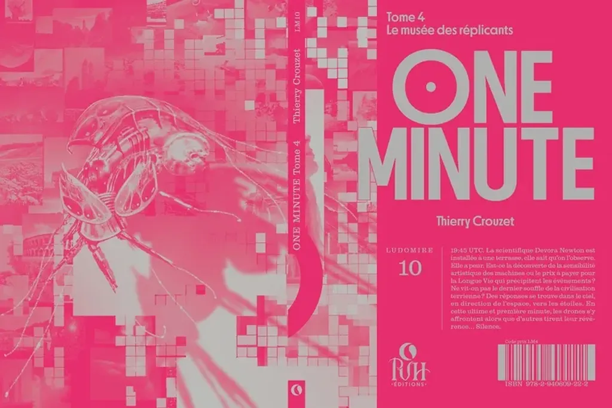

# De l’écriture, de la vie, du roman

Je réponds aux questions de Lionel Jeannerat, l’éditeur de *[One Minute](../../comments/page/une-minute.md)* chez PVH Éditions, et reviens sur les mécanismes du processus créateur.

*— Quelle place occupe l’écriture dans ta vie ?*

— Tu aurais dû me demander quelle place il reste à ma vie hors de l’écriture, parce que j’ai centré ma vie autour d’elle. Je vis en écrivant, je perçois en écrivant, j’aime en écrivant. Si on m’empêchait d’écrire, je serais aveugle.

*— Comment t’est venue l’idée de*One Minute*?*

— Si je savais te dire comment, je pourrais reproduire ce comment et générer des idées à tour de bras. En fait, j’ai ma petite méthode. J’écris tous les jours, au minimum dans mon journal et les mots parfois engendrent des idées, en apparence venues de nulle part. La plupart, je les oublie, mais certaines reviennent taper à la porte et je finis par en faire quelque chose. L’idée d’écrire et récrire un grand nombre de fois la même situation m’est venue en 2011 quand je travaillais à [*J’ai d’ébranché*](../../books/jai-debranche/jai-debranche.md). Je l’ai même résumée dans ce livre.

Cette idée formelle ne vient pas de mars. Depuis [*Le Peuple des connecteurs*](../../books/le-peuple/le-peuple-des-connecteurs.md), je défends un modèle de société horizontal, décentralisé, le seul selon moi capable de nous aider à combattre les crises globales qui se caractérisent par un haut de degrés de complexité. Je ne crois plus en la possibilité d’un sauveur, d’un grand homme, d’un héros, encore moins d’un petit livre rouge.

Au contraire, je crois que chacun de nous a son rôle à jouer. Or, beaucoup de fictions continuent de célébrer le héros ou l’héroïne qui sauve le monde. Dans la fantaisy ou la SF, c’est souvent même plus caricatural, avec la mise en scène presque systématique de sociétés pyramidales hypercentralisées (avec des princes, des rois, des élus…). Donc, plutôt qu’un roman avec une poignée de personnages entre lesquels on bascule de chapitre en chapitre, forme éculée du roman de genre, j’ai décidé de démultiplier les points de vue, dans le but de dynamiter la notion même de héros (mais pas celle d’héroïsme).

Il me restait à choisir la situation autour de laquelle déployer cette forme. Il devait s’agir d’un moment charnière dans l’histoire de l’humanité. J’ai pensé à traiter de 9/11, de la minute où le premier avion frappe le World Trade Center. Puis, voyant sans cesse de nouvelles exoplanètes découvertes, je me suis dit que nous ne tarderions pas à découvrir de la vie extraterrestre. Je me suis donc intéressé à la minute où nous découvrirons que nous ne sommes plus seuls dans l’univers (un grand classique en SF). Ce sujet s’est imposé fin 2014. J’ai commencé à diffuser en ligne le texte à partir du premier janvier 2015, à raison d’une minute par jour.

Au final, le héros a la vie dure. Sara Cash, même si on n’entre jamais en elle, finit par s’imposer comme le personnage dominant, parce que les autres portent leur regard sur elle, et le lecteur aussi.

*— Que représente cette œuvre dans ta vie personnelle et artistique ?*

— Depuis aussi longtemps que j’écris, je cherchais la forme qui illustrerait mes préoccupations littéraires, politiques et philosophiques, et *One Minute* a résolu l’équation, presque par miracle, sans que je m’y attende. Je considère ce roman comme l’aboutissement d’un long cheminement.

Je n’ai pas été surpris quand les éditeurs littéraires ont refusé le texte, sous prétexte que c’était de la SF, et que les éditeurs de SF l’ont refusé parce que c’était trop littéraire, que la forme ne ressemblait à rien de ce qui était publié en littérature de genre, et pour cause j’avais dynamité pas mal des mécanismes de la littérature de genre. J’ai été touché quand, par l’intermédiaire de mon ami Ploum, PVH Édition a décidé de le publier en livre. Bon, je n’avais pas prévu qu’il me faudrait plusieurs mois de travail pour reprendre le manuscrit et le finaliser.

*— Que penses-tu de la collection Ludomire et as-tu une œuvre de la collection à recommander ?*

— Je ne peux pas ne pas parler de [*Printeurs*](https://pvh-editions.com/shop/printeurs/243-printeurs-version-ludomire.html) de Ploum, justement, qui reprends des thèmes technologiques chers à mon cœur, et surtout parce que Ploum a aussi publié son texte en direct sur internet, en relation avec ses lecteurs, ce qui je crois donne à nos deux textes une patine propre à la littérature nativement numérique.

Un autre point m’intéresse : Ludomire parie sur le livre objet. Voilà qui me semble indispensable à l’époque où nous passons notre temps à lire sur écran. Pour ma part, je ne lis que des ebooks. Si j’en reviens au papier, c’est avec de beaux livres, à la fois agréables à feuilleter, à regarder, à toucher. Je suis assez fier que *One Minute* sorte en coffret, même si le prix élevé peut dissuader pas mal de lecteurs, qui pourront se tourner vers la version ebook.

Enfin, PVH est un éditeur suisse et j’entretiens avec la Suisse de longues amitiés, notamment éditoriales. Un tropisme m’attire vers la Suisse et les Suisses. Je crois y être plus apprécié qu’en France. D’ailleurs, je réponds à ces questions dans le TGV qui me conduit à Genève.

#netlitterature #sur_1_minute #y2021 #2021-9-14-12h40
