# Décembre 2021

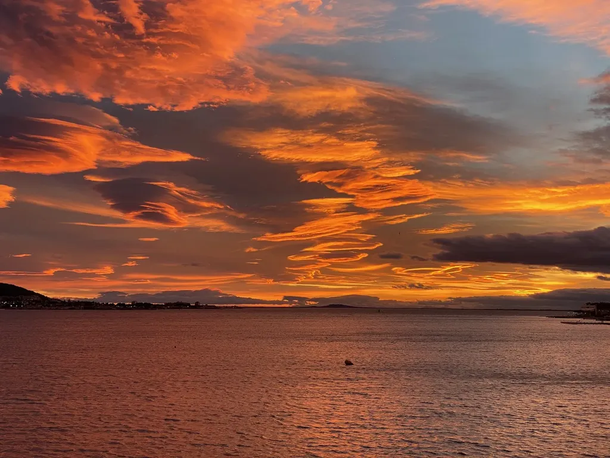

### Vendredi 3, Balaruc

Cauchemar cette nuit. J’étais un cadre dans une organisation qui virait au fascisme et je me suis retrouvé exclu du groupe des collabos. Je me suis réveillé à ce moment. Je n’avais pas suivi le mouvement, mais je n’avais pas encore rejoint la résistance.

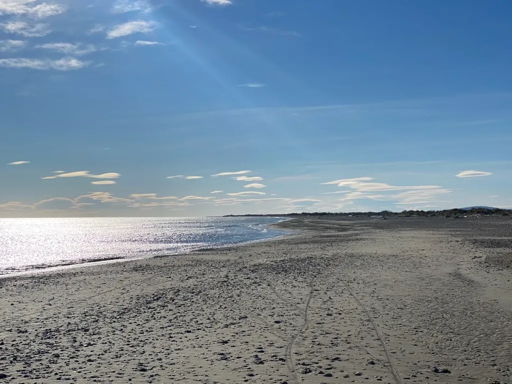

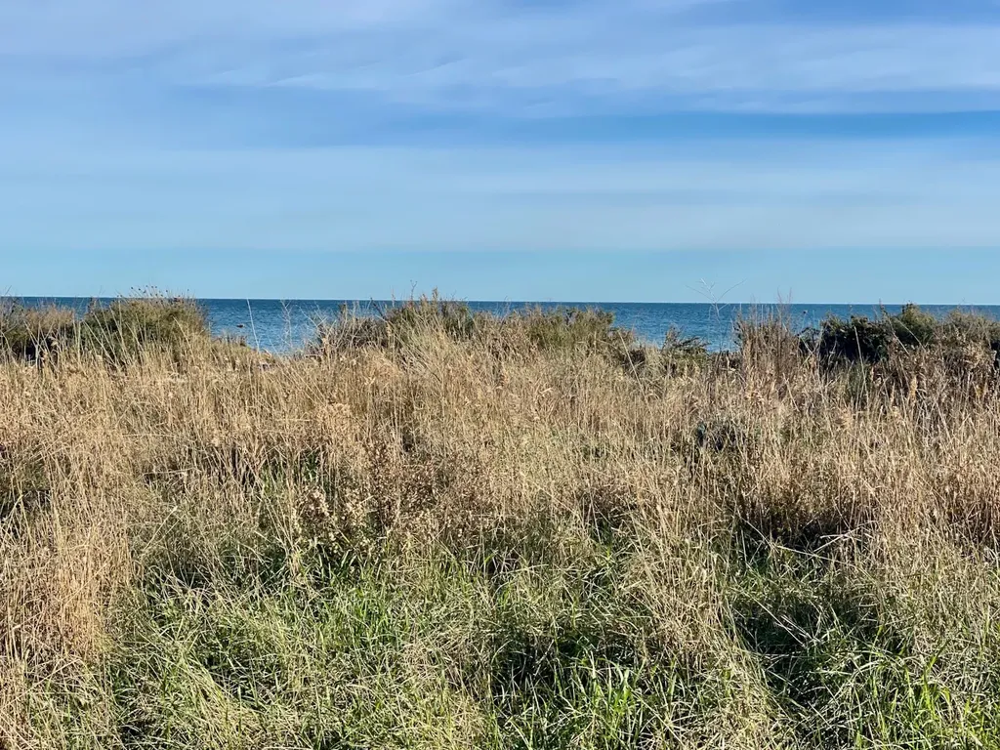
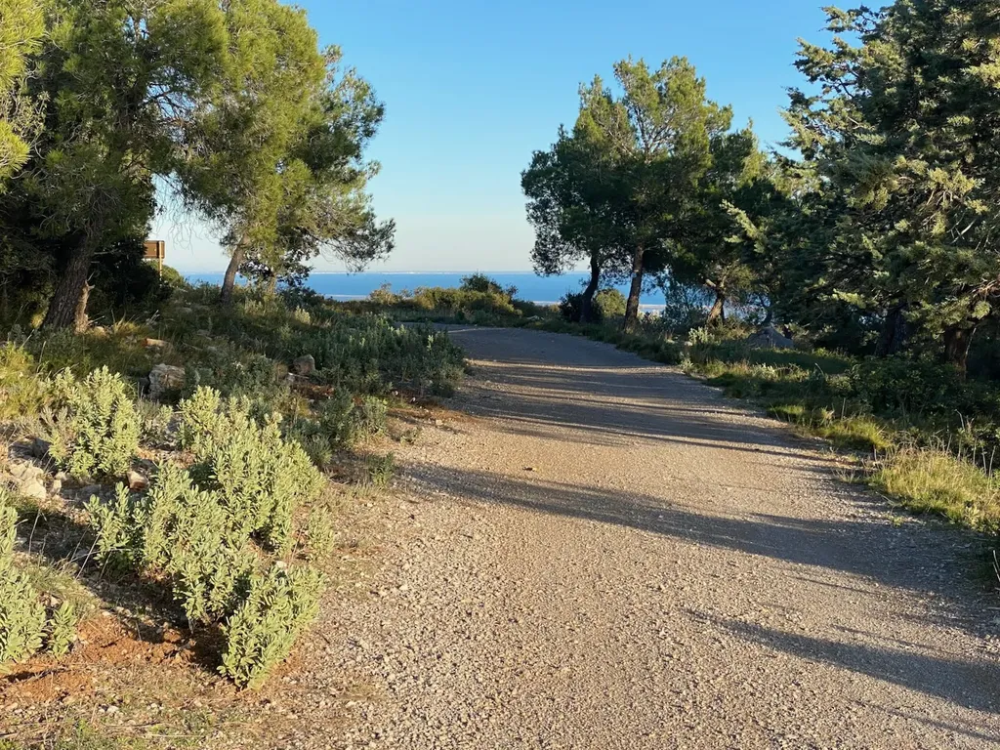
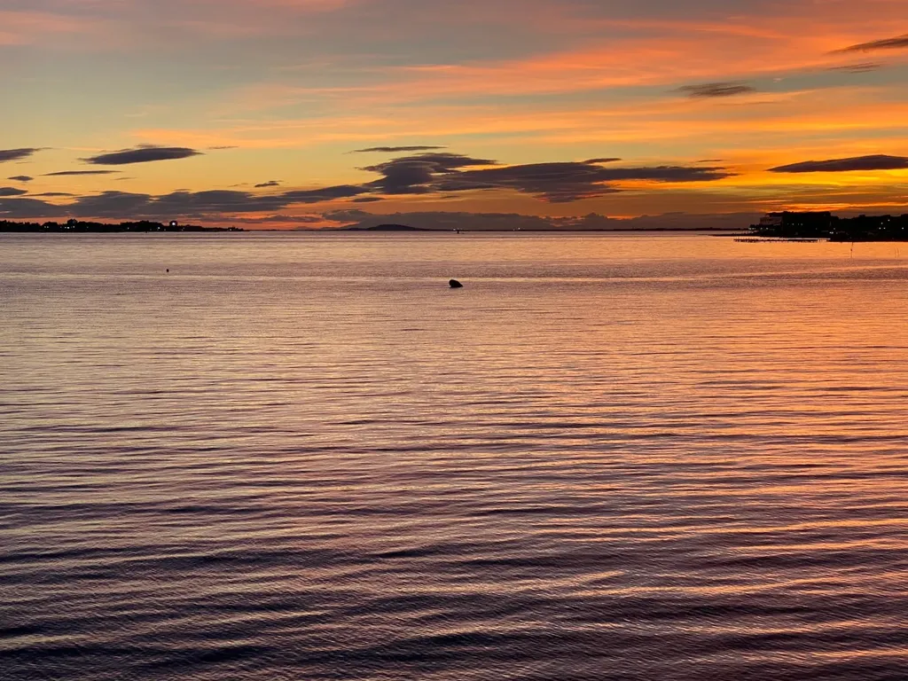

### Samedi 4, Balaruc

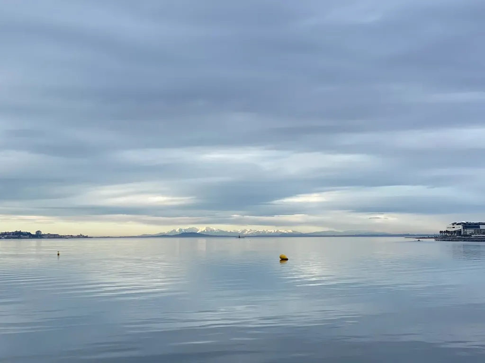
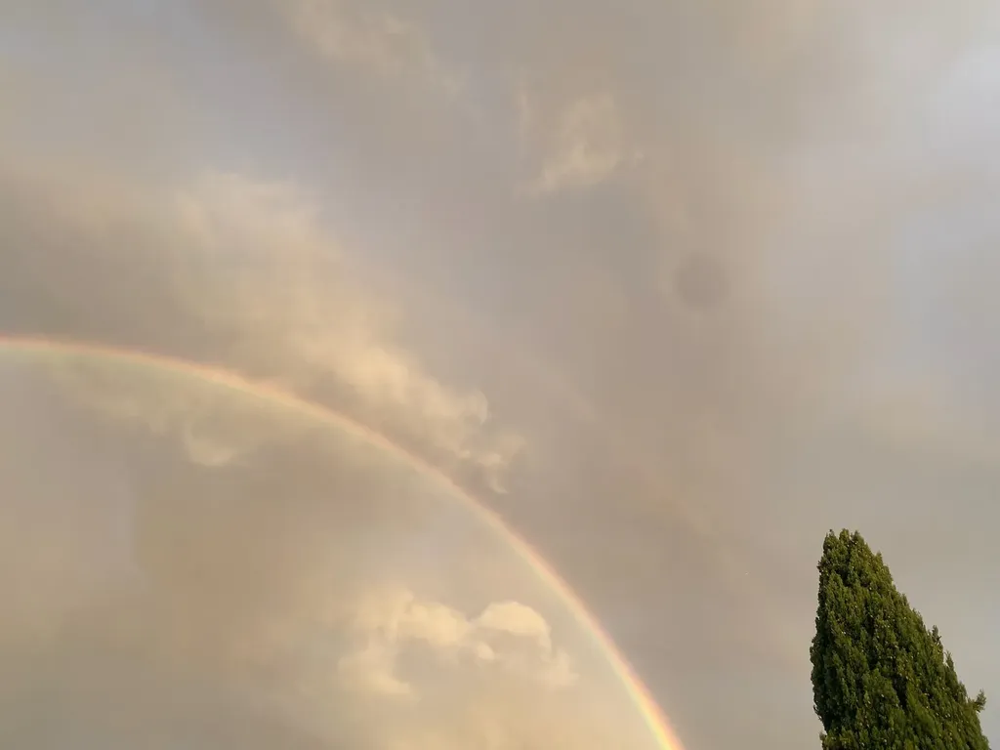

### Dimanche 5, Balaruc

[Les copains se posent des questions sur ce que serait une œuvre numérique.](https://philippe-castelneau.com/2021/12/05/de-lecriture-dite-numerique/) J’ai passé beaucoup trop de temps à me les poser. Le numérique pousse le texte dans ses derniers retranchements, à traiter des sujets qu’il reste le dernier à pouvoir traiter, ainsi la photographie a poussé la peinture à se réinventer, le numérique exerce une pression semblable sur tous les arts.

Une œuvre peut être radicalement numérique et ne pas le laisser paraître. Je crois que c’est le cas de mon *One Minute* qui n’aurait pas pu exister sans ordinateur, ou mon *Équinoxe d’Automne*, écrit au début des années 1990. Et alors ? S’il n’y a pas de lecteurs, une œuvre peut être numérique ou pas on s’en contre fiche.

Plus le numérique accélère le monde, raccourci les formes, plus j’ai envie de prendre mon temps, d’écrire dans la longueur, d’aller à contre sens, parce que voilà ce qui reste à la littérature, voilà où elle se réinventera, mais bien sûr avec l’aide du numérique, à travers lui.

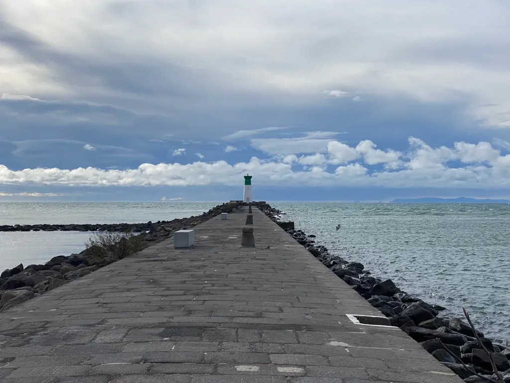
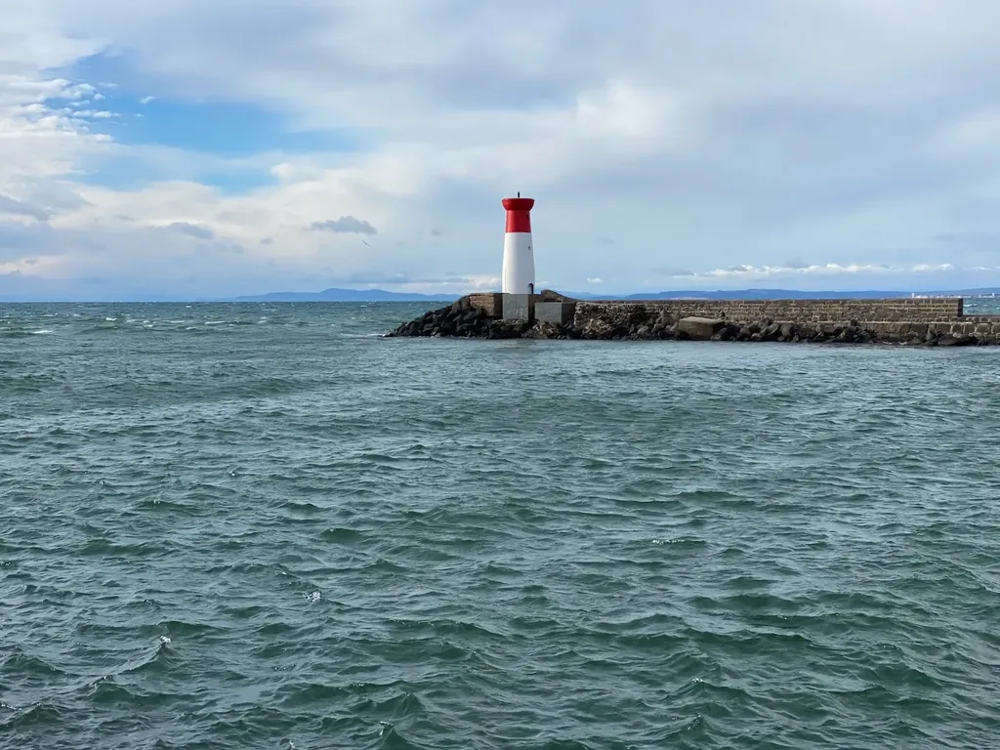

### Mardi 7, Balaruc

Beaucoup d’auteurs se questionnent sur la forme et oublient de raconter, ne savent pas le faire, méprisent ceux qui le savent, et alors s’abandonnent à la trop facile écriture pour l’écriture. Je sais de quoi je parle pour avoir souffert de ce syndrome durant 20 ans.

Le numérique transforme la littérature parce qu’il nous permet d’écrire ce qui hier était impossible. Typiquement, nos carnets Web, avec photos, vidéo et tout le reste, c’était impossible. *One Minute*, c’était impossible. Si c’était possible, ce n’est pas numérique. Mais ce n’est pas parce que c’était impossible que c’est intéressant. Il faut aussi avoir à dire, à raconter, à émerveiller, sinon c’est de la masturbation.

### Mercredi 8, Balaruc

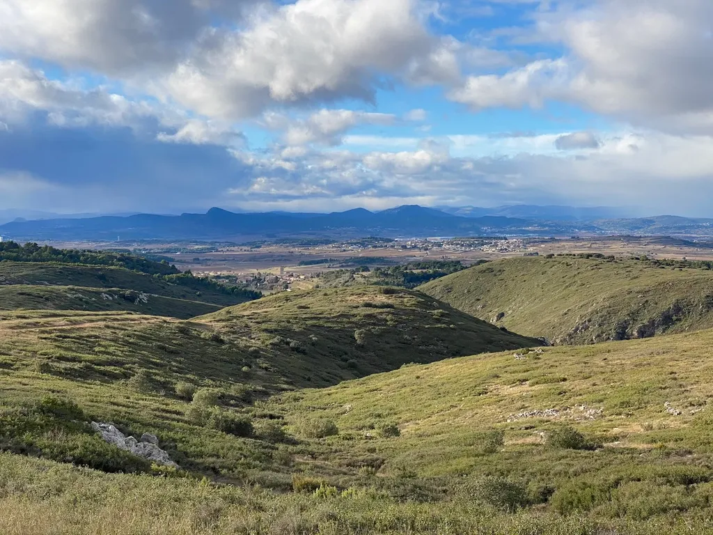

### Jeudi 9, Balaruc

Richard Feyman : “The first principle is that you must not fool yourself—and you are the easiest person to fool.” Il s’adressait aux scientifiques, mais j’essaie de m’appliquer ce conseil quand j’écris.

---

J’envoie le manuscrit de *Renaissance* à Pierre, tout chaud, peut-être encore trop brûlant, mal démoulé, mais je dois m’en détacher pendant quelques semaines, pour mieux y revenir ou au contraire l’abandonner. J’ai commencé l’écriture le jeudi 28 octobre, soit exactement il y a cinq semaines. J’ai écrit vite, mais avec une intensité rare, qui me laisse épuisé. J’aurais préféré que ça dure davantage, entrer dans un texte plus ample, qui m’aurait maintenu longtemps dans le processus créatif, cet espace non réflexif, sans critique, sans attente, sans comparaison, mais voilà, je ne choisis pas les livres que j’écris. Je prends conscience que ce roman a pratiquement la même taille que *Mon père, ce tueur*.

### Vendredi 10, Balaruc

Être dans une phase créative est pour moi un grand bonheur. J’entrouvre la porte d’un paradis où je dors mieux, où je suis moins irritable, plus positif. Toute mon énergie est dirigée vers un but et le monde autour peut bien s’écrouler. Je traverse parfois des moments difficiles, de doute, mais tant que je poursuis le travail solitaire, je reste dans cet état délectable. Puis arrive le moment vers lequel je tends, la fin du travail, le moment où le texte doit être donné à lire et où la confrontation au principe de réalité devient douloureuse. Tant que je suis le seul lecteur d’un de mes textes, il est génial.

Hier, par exemple, je croise le chemin d’un texte autoédité, catastrophiquement insalubre dès sa présentation boursouflée. Je suis sûr que de son point de vue l’auteur a construit une cathédrale, là où je ne vois que décombres. Des mots empilés, sans puissance, sans rien à dire, qui ne font que témoigner d’une extase durant la phase créatrice. Du sperme froid.

Je me garderai de faire la moindre remarque. Que l’auteur reste le plus longtemps possible dans son illusion, dans le souvenir de sa baise. Parce qu’on peut jouir comme un dingue et ne pas engendrer d’enfants viables. C’est assez génial, d’ailleurs. On peut baiser tant et plus, écrire tant et plus, jouir tant et plus, mais nous avons le fâcheux défaut de vouloir le dire à tout le monde. Regardez mon éjaculation, elle n’est pas belle ? Nous sommes incapables de comprendre que nous écœurons les autres avec nos excrétions.

Nous autres artistes avons reçus le don de jouir d’une manière peu orthodoxe. Nous devrions le célébrer, nous en féliciter, sans pour autant vouloir crier sur tous les toits notre différence. Nous manquons de discrétion et de dignité.

### Samedi 11, Balaruc

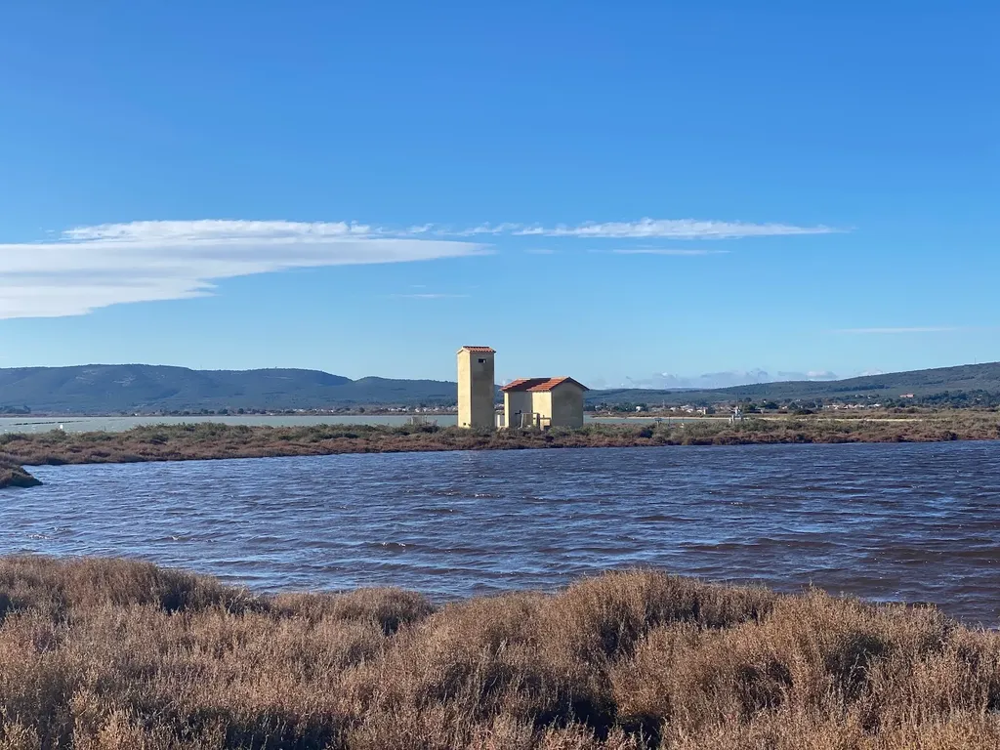

### Dimanche 12, Balaruc

[Je mets en vente *Les Silencieux* en NFT.](../../2021/12/je-vends-un-roman-inedit-en-nft.md) Je suis sand doute un des premiers auteurs à tenter cette expérience. Je ne suis pas le mieux placé pour provoquer le buzz. Une star pourrait faire un carton en vendant ainsi un inédit. Gagner davantage de fric avec un manuscrit qu’avec un succès en librairie. Moi je ne suis qu’un infime pourceau dans le monde de l’édition, il ne se passera sans doute rien.

Une autre idée plus amusante, et moins élitiste, m’est venu ce matin. Mettre en vente une nouvelle à un prix infime. L’acheteur a alors pour devoir de la revendre en augmentant le prix de 10 %. Jusqu’où pourrait grimper la chaîne ?

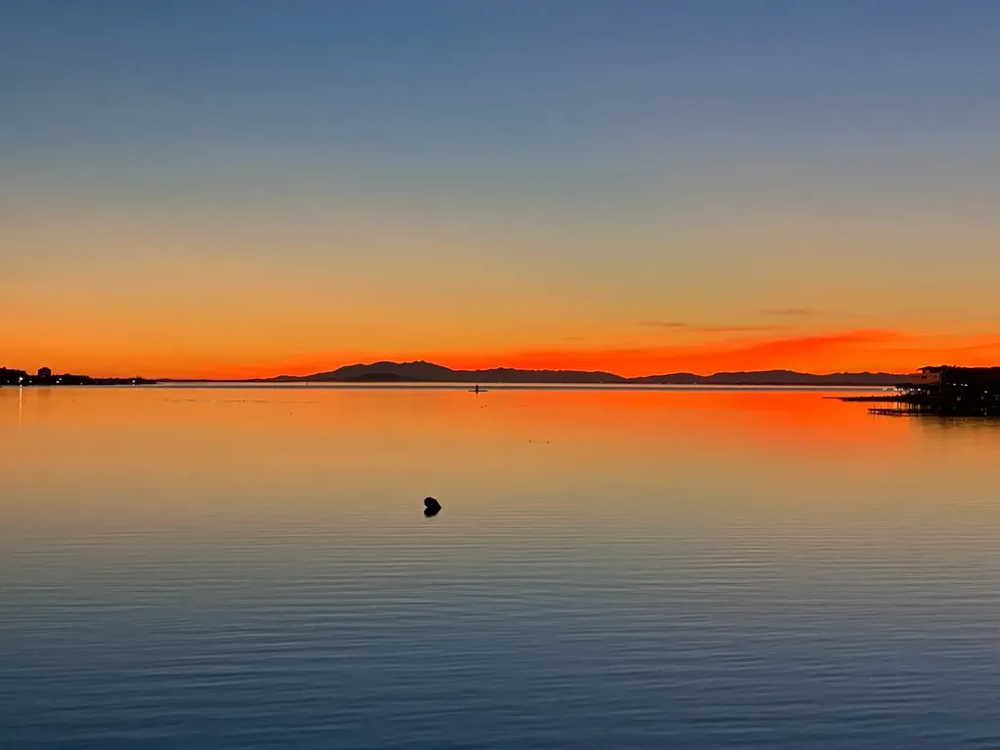

### Lundi 13, Balaruc

Terrifiant sentiment d’impuissance. Je lance cette initiative NFT et le silence l’accueille, d’autant plus que j’ai cessé de hurler sur les réseaux sociaux. Malrau s’est bien planté. Il aurait dû dire « Le XXIe siècle sera marketing ou ne sera pas. » L’art n’est plus que marketing, la vie est publicisée en ligne, en politique les candidats veulent avant tout être vus et se moquent que leurs idées l’emportent. Nous en avons la preuve en France en ce début de campagne présidentielle. La gauche incapable de s’entendre parce qu’aucun de ses représentants ne renonce au marketing de soi. Ces gens sont-ils encore de gauches ? Je me demande pourquoi des électeurs potentiels les soutiennent encore. Réponse : parce qu’ils sont eux-mêmes victimes du marketing. Aujourd’hui, tu es marketing ou tu n’es pas. Bon, OK, j’éprouve le coup de mou du post-partum après la fin de mon roman. Mon cerveau se sentait si bien dans la phase créative qu’il ne se contenter plus de la lumière sublime qui baigne l’étang. Le bel hiver a commencé.

---

Après deux doses de Pfizer, j’ai reçu une dose de Moderna. Au bout d’une heure, une étrange sensation dans le bras gauche, qui déséquilibre mon corps. Je sens une présence en moi, une activité anormale, une réaction en d’autres mots. Souffle un peu court quand je monte à mon bureau. Pas habituel.

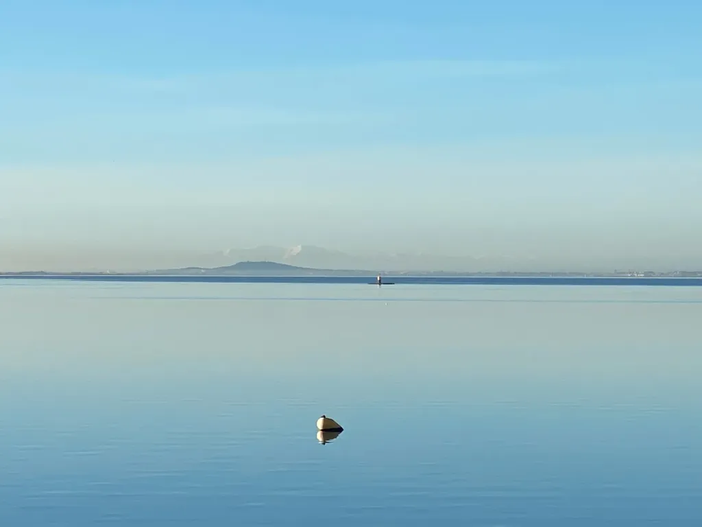

### Mardi 14, Balaruc

Sensation de ne plus m’appartenir. D’être dans un corps étranger. Parce qu’un corps étranger est entré en moi. Peut-être que les racistes éprouvent la même sensation. Un étranger sur leur territoire suffit à les rendre mal à l’aise comme pour moi un vaccin. Je fabrique des anticorps et les racistes de même.

### Mercredi 15, Balaruc

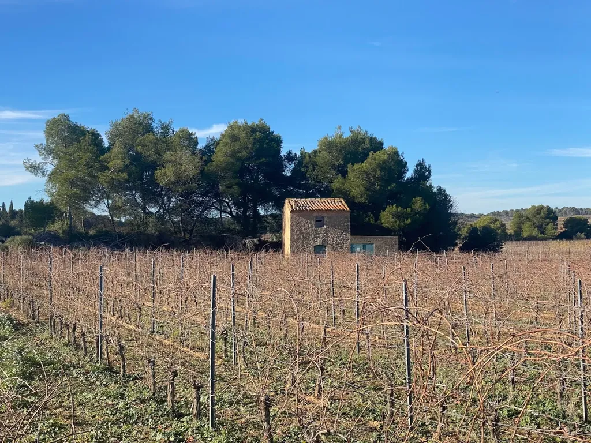
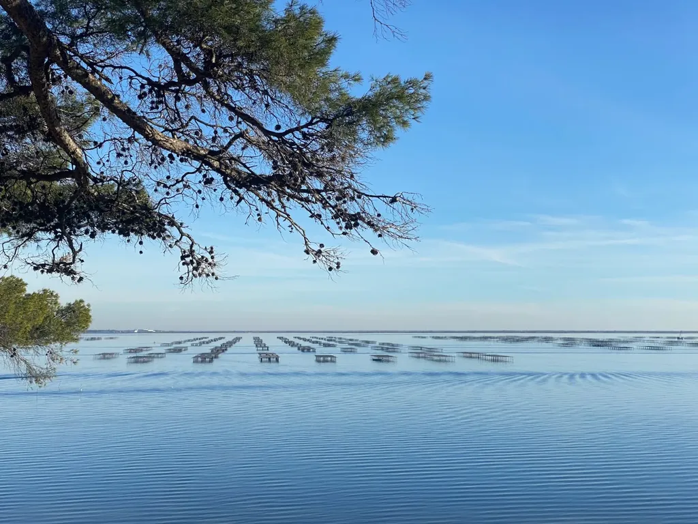

### Jeudi 16, Balaruc

Une vidéo vante un évènement vélo. Des copains s’enthousiasment sans voir qu’il ne s’agit que de marketing. L’évènement sold out en 10 minutes. L’année prochaine la vidéo sera encore plus belle, les inscriptions encore plus chères. Cela s’appelle du marketing. Et ça marche. Le capitalisme est capable de faire briller tout ce qu’il veut, quitte à détruire tout le reste autour.

---

Je trouve drôle la volonté de certains de ne pas utiliser le verbe être dans leurs textes. Sont-ils aveugles ? Parce que moi je vois partout qu’ils en font l’ellipse. « Le ciel est bleu » devient « Le ciel bleu », et ça ne change souvent rien. Encore une mode, encore du marketing, tout est bon pour attirer l’attention. Perec est notre maître.

### Samedi 18, Balaruc

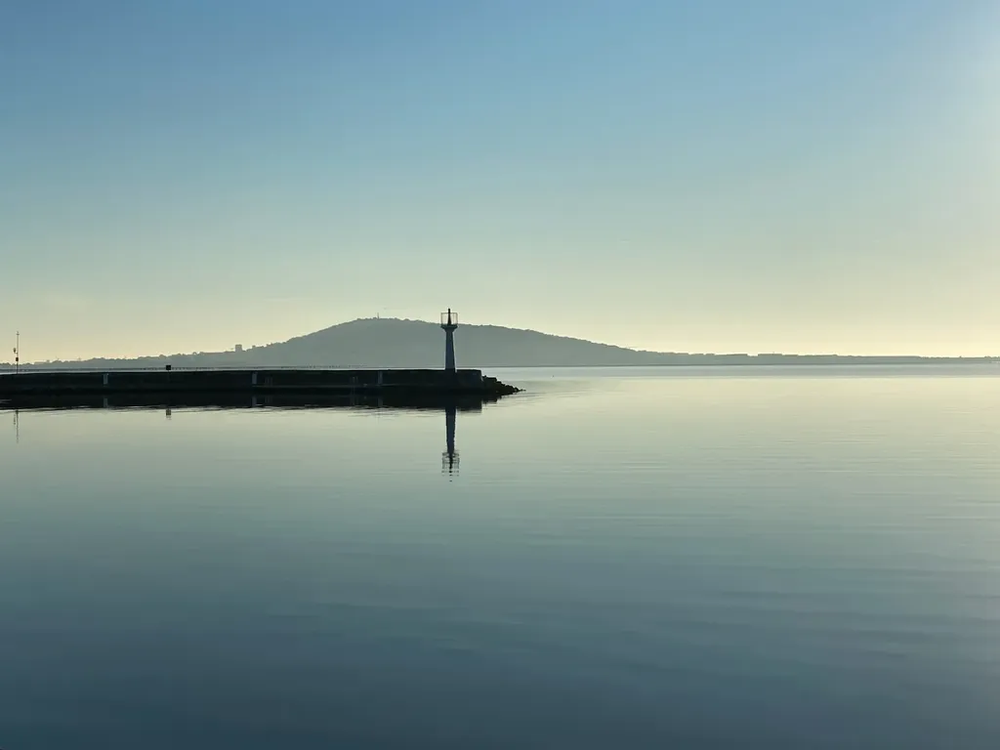
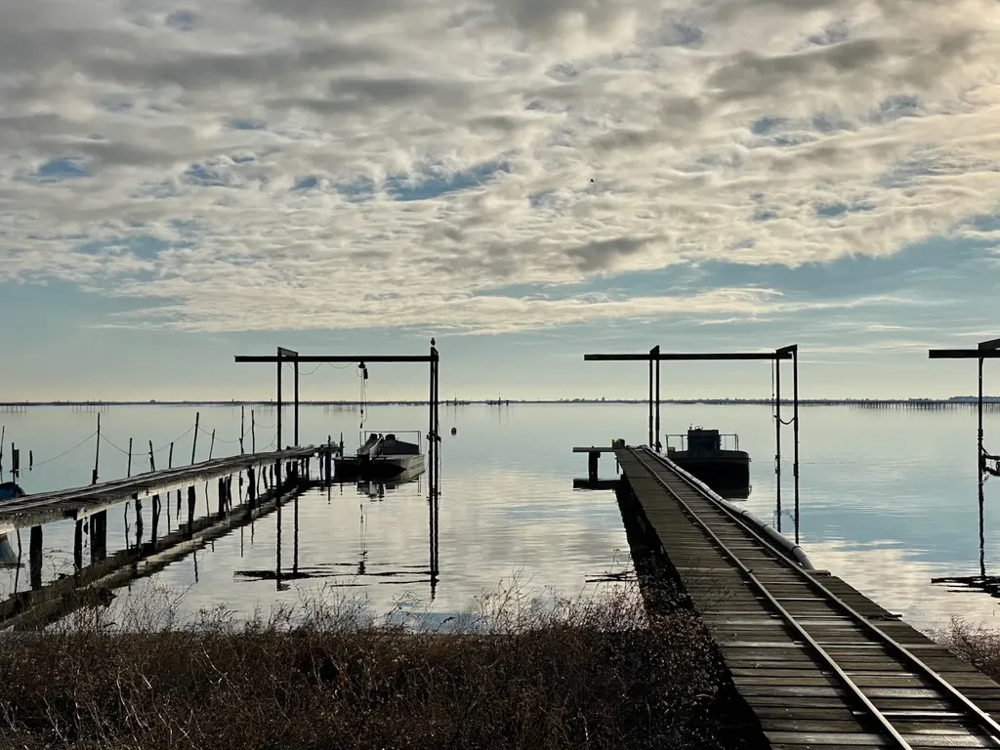
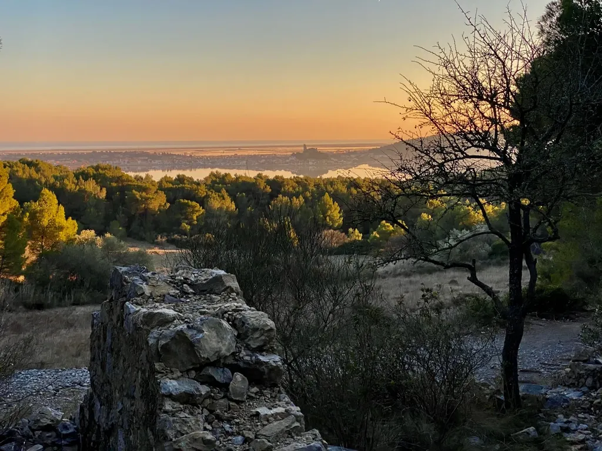

### Dimanche 19, Nancy

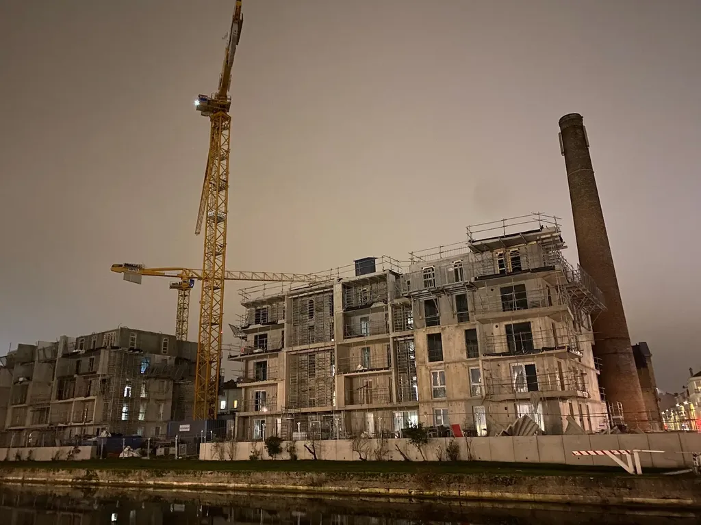

### Lundi 20, Nancy

### Mardi 21, Nancy

Je suis heureux quand je suis en relation avec les autres, avec ma famille, mes amis, jusqu’à ce que je me retrouver seul face à moi-même. Alors je ne suis heureux que dans la création. Il me faut fabriquer, imaginer, élaborer.

---

Marche lumineuse au bord du canal. Le plus bel endroit de la ville, avec le jardin d’eau et ses immeubles modernes et quelques-uns plus anciens, d’origine industrielle. Si je devais vivre ici, ce serait là, peut-être dans un des vieux entrepôts de briques. Le reste de la ville m’indiffère, pas assez imaginative, pas assez biscornue, presque trop prévisible, surtout le quartier Charles III, avec ses grands axes orthogonaux. J’atterris au café Foy, où j’entre avec quelques réticences malgré mes trois shoots vaccinaux. La salle n’est pas bondée, mais suffisamment pour qu’elle se transforme en bombe virale. Tous ces endroits devraient être à nouveau fermés. J’aime y écrire, mais n’y suis pas venu depuis deux ans.

Je ne pratique plus l’écriture vagabonde, l’écriture sismographe, qui se résume à enregistrer l’influence du monde sans autre objectif que le plaisir. Au Foy, les clients se connaissent, se saluent comme de vieux amis, échangent quelques mots, mais restent chacun à leur table, avec distinction.

Hier, j’ai acheté des jeux de société pour jouer avec les enfants. Nous avons commencé par tester *6 qui perd*, un de ces jeux à la mode depuis quelques années où les joueurs ont peu de choix, où les règles les portent sans que leurs décisions n’aient beaucoup d’importance. Nous avons rigolé, j’étais heureux de voir les enfants s’amuser, mais eux-mêmes ne cessaient de répéter que c’était avant tout une question de chance. Des jeux pour occuper les soirées, pour remplir le vide, pour provoquer le rire. Après tout, ce n’est pas si mal. Les livres à succès utilisent les mêmes mécanismes. Mais ils me laissent insatisfait, au bord de l’ennui. Devant une série, dans ces moments, je lis un article et consulte mes statuts sociaux.

Ces jeux correspondent à un air du temps pour lequel je n’ai jamais été fait. J’aime sentir des hypothèses se former, devoir prendre des décisions, avec des perspectives à plusieurs tours. Avec les livres, je fonctionne de la même façon. La beauté doit me saisir et déclencher en moi un processus créatif concurrent de celui de l’auteur. Me mettre en mouvement. Je ne goûte pas les divertissements statiques. J’ai besoin d’interaction, même si elle n’est qu’imaginaire.

Je n’ai sans doute jamais eu de succès littéraire parce que je suis incapable d’écrire des livres reposants. J’aimerais le faire, je bataille pour la simplicité et la limpidité, mais malgré moi je superpose, j’entremêle, je reste à la surface des choses, me contente d’établir des correspondances sans les expliciter, sans les creuser au marteau piqueur jusqu’à la nausée.

La lumière d’aujourd’hui brille d’un translucide froid. Elle décolore la gelée blanche qui saupoudre l’herbe et les planches des passerelles du jardin d’eau. Je n’ai pas besoin d’en dire plus, je n’en ai ni l’envie ni le talent. Cette surface photographique me contente parce que quand je la lis chez d’autres elle suffit à me remplir la tête d’images. Peut-être que les auteurs ont un seuil de réactivité et qu’ils ne touchent que les lecteurs au moins aussi sensibles qu’eux. Je dispenserais des stimuli beaucoup trop légers pour la plupart des lecteurs. Je ne serais pas assez expressif. Le savoir ne m’aide en rien, puisque j’écris d’abord pour jouir.

Je me jure souvent de ne plus jamais parler d’écriture dans mon journal, de ne m’intéresser qu’au monde, à la lumière, mais je reviens toujours aux rouages de mon intériorité, du moins à ceux qui m’intéressent. Quand on me demande ce qui me ferait plaisir pour l’année prochaine, je suis incapable de répondre, à part de beaux voyages à vélo. Mais côté écriture je me sens parfois comme si mon ticket n’était plus valable.

Des auteurs beaucoup plus âgés que moi m’ont par le passé souvent déprimé, quand je les voyais toujours s’échiner dans l’espoir d’un succès que de toute évidence ils n’auraient jamais. Longtemps, j’ai rêvé de ne pas les imiter, puis insidieusement j’ai rejoint leur âge, sans connaître la reconnaissance que j’attendais. Alors je ne l’attends plus, ou je voudrais ne plus l’attendre, ne faire que pour le plaisir, ce qui est toujours le cas quand je travaille, sauf dans les intervalles réflexifs, où je me retrouve face à mon impuissance.

Pour l’année prochaine, je n’ai donc pas d’espoir, sinon que de beaux projets m’occupent, que je vois de beaux paysages et éprouve du plaisir. J’en suis réduit à une pratique épicurienne de la littérature. Plus vite je l’accepterai, plus vite je me donnerai une chance de vieillir heureux, sans éprouver d’éternels regrets. Selon Isa, je cours après la reconnaissance extérieure parce que je n’ai jamais eu celle de mon père. Je doute de cette explication. Je suis un faiseur. J’ai la certitude que mes faires peuvent profiter à d’autres. Je veux juste partager, et je suis frustré de ne pas assez le faire. Je ne cherche la reconnaissance qu’à travers le partage. Me faire du bien en faisant du bien. Je suis égoïste, tout simplement.

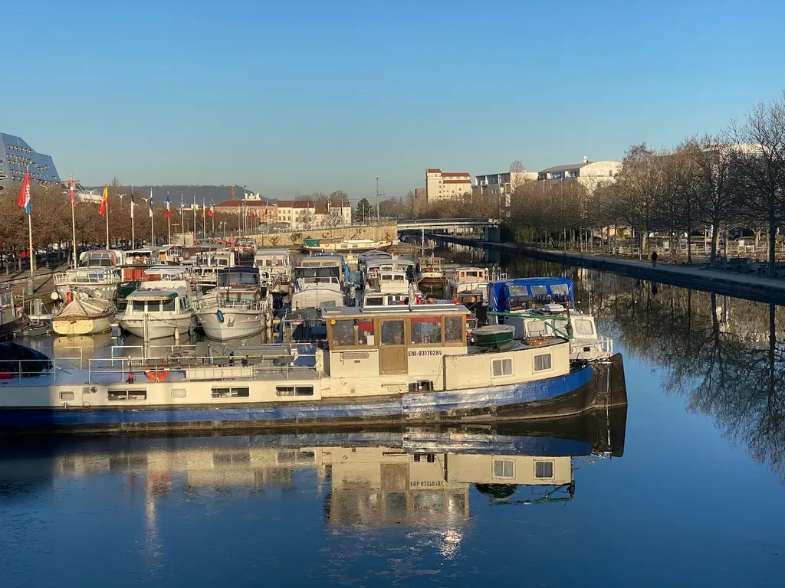
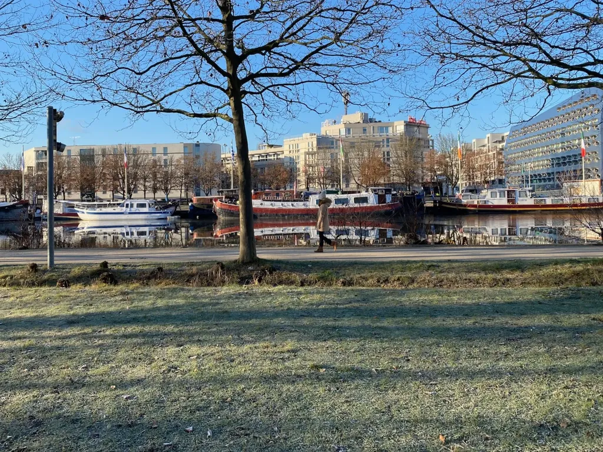

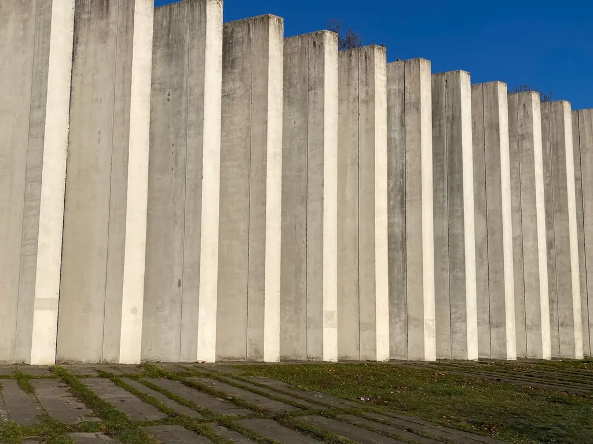
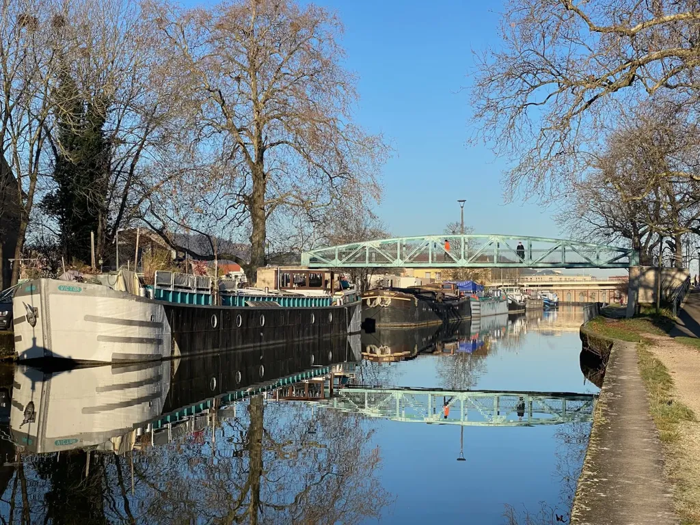

### Jeudi 23, Nancy

Petite boucle pédestre traditionnelle, avant de traverser la vieille ville et de découvrir un café jazzy, quasi désert. Le temps que je sirote mon thé, la salle se vide tout à fait. Je suis le nez dans la Grande rue, où de rares voitures, aussi rapides que bruyantes, filent vers la cathédrale Saint-Epvre.

Depuis deux ans, j’entretiens le rêve obsessionnel d’un roman réaliste, mais la famille que je comptais interroger pour cette histoire refuse l’investigation. Il ne me reste plus que le choix d’en faire un roman inspiré par une situation réelle, que je devrais décaler pour qu’aucune identification ne soit possible. Le sujet était difficile, loin de ce que je fais d’habitude, et m’y lancer sans le secours de la réalité me fiche la trouille. Peut-être une bonne raison pour essayer.

Hier soir, je télécharge le dernier Houellebecq, je lis quelques pages, que j’ai déjà lues dans ses précédents livres, ce qui ne me donne guère l’envie de poursuivre. Il est notre grand écrivain contemporain aux yeux de tous. Je suis un peu jaloux. Il en fallait un, et c’est lui. Mais à qui parle-t-il ? Pour moi, il a toujours le regard dans le rétro. L’avenir ne l’intéresse pas, il ne se tend pas vers lui, il n’a rien à lui dire.

J’ai toujours voulu être un écrivain enthousiasmant, et j’ai systématiquement échoué, mais je ne vois aucune autre raison d’écrire. Plonger mes lecteurs dans le purin ne m’a jamais intéressé.

Voilà que le serveur démonte sa micro-terrasse comme si le café s’apprêtait à fermer. Je déteste cette façon de mettre le feu au cul du client. Ranger la terrasse, c’est dire, bon débarras, journée terminée. Il ne s’y passera plus rien, et plus rien pour toi qui écrit sur ta petite table.

Je regarde la ville au-delà de la baie vitrée, à la hauteur des passants. Ils déambulent avec leurs sacs de course, leur écharpe, leur blouson entrouvert parce qu’il fait doux. Des visages masqués, d’autres pas. Des enfants, des parents, beaucoup de bonnets, puis inexplicablement un jeune gars en manches courtes. Une fumeuse, une guirlande ne Noël, un improbable olivier dans un pot de terre, et pas un souffle de vent, sinon celui des voitures.

La nuit est tombée tout à coup. Silhouettes lourdes, hésitantes, d’autres aériennes, comme cette grande fille croisée plus tôt, avec une sorte de poncho rouge, elle naviguait le regard fixé vers le large pour surtout que personne ne lui dise sa beauté ou sa prétention. La fumeuse était une buraliste, elle est retournée dans son étroite boutique vendre des cancers. Au-dessus, un appartement tout aussi étroit, avec une bibliothèque surchargée, peut-être un minuscule bureau, derrière des vitres encrassées. J’imagine enfermé là un écrivain condamné au succès. Il bouge, comme assis sur un pouf très bas. Il doit fumer, sinon comment expliquer la buée jaune qui voile le vitrage.

Regarder la vie me réjouit. Pourquoi faudrait-il que moi même je sois dans cette vie. J’ai lu une belle citation d’Einstein : « La vie, c’est comme la bicyclette, il faut avancer pour ne pas perdre l’équilibre. » Voilà le sujet de *Renaissance*. Un éloge du mouvement. Alors rester dans le café, à condition d’y rester en mouvement, rester dans la vie pour y bouger, y expérimenter, accumuler des sensations pour les transmettre, et que plus tard elles enflent, deviennent plus grandes et belles.

### Vendredi 24, Nancy

Je lis un petit livre sur le vélo, sur un ton universitaire, à collectionner les citations, à prendre de haut beaucoup d’auteurs non cités, alors je ne le cite pas lui-même. Cette accumulation d’autres textes sur le vélo, dont je ne faisais que pressentir l’existence, n’en ayant lu que quelques-uns, me fait douter de la pertinence de mon roman. Voilà peut-être pourquoi Pierre ne m’a pas donné signe de vie après deux semaines, lui qui d’habitude réagit vite à mes bafouilles. L’accumulation des textes des autres me terrasse, et voir un nouveau Houellebecq volontairement rétrograde avec ses passés simples me laisse chancelant.

---

[Philippe Castelneau m’apprend la mort de Joan Didon.](https://philippe-castelneau.com/2021/12/24/disparition-de-lautrice-joan-didion) Il la cite : « J’écris pour savoir ce que je pense, ce que je regarde, ce que je vois et ce que cela signifie. » Malgré quelques dérapages narcissiques, qui n’épargnent aucun auteur, j’écris pour les mêmes raisons. Alors j’espère échapper à ce que [Pierre Darvel, un autre copain auteur, dit d’un collègue](http://robertdarvel.lecarnoplaste.fr/2021/12/23/phrases-indiscernees/) : « Il a beaucoup aigri. »

---

Quelle époque vivons-nous ? On se souviendra de nous comment ? Des irresponsables sans doute. Pourvu que notre capacité à jouir soit retenue plus que notre tendance à croire les thèses les plus absurdes.

Dans quelques heures, une fusée Ariane enverra le James Webb Telescope vers le point de Lagrange 2. J’attends ce moment depuis vingt ans. Avec la fièvre des découvertes à venir. Si la fusée explose, si quelque chose part en vrille, on jurera que les ET ne veulent pas que nous les repérions.

Nous vivons une journée historique dans la plus grande indifférence générale. Une de ces riches heures de l’humanité, peut-être à inscrire à côté de ces autres points de bascule dont a parlé Stefan Zweig.

Je suis installé dans un coin velouté du Foy, à la salle quasi vide, alors qu’hier près de 100 000 Français étaient covid positif. Un record. Il me suffit d’écrire cette phrase pour qu’une vingtaine de clients débarquent et que les conversations s’animent. J’aime leur bruit, qui recouvre le mien, me laisse le surfer et libère des pensées indistinctes.

Je souffre du regard des autres, de leurs jugements comme de leur indifférence. Tant que je ne suis qu’avec moi-même, je suis le plus heureux des hommes. D’où mon goût pour les cafés, en position d’observateur invisible. Je suis présent sans y être. Mon regard bascule des clients à la place sillonnée par des promeneurs sous parapluie. La devanture tendue dégouline. Les dorures perdent de leur lustre. Dans la salle, les velours lie de vin des banquettes et fauteuils se réchauffent sous les spots d’un blanc aveuglant.

Le Foy est l’un de ces cafés à la française, douillets, feutrés, pour citadins distingués qui boivent leur thé le petit doigt levé. Je m’y tiens à l’affût d’un affleurement de réalité, d’une discontinuité anormale, qui provoquerait en moi un flot. J’en connais la possibilité, à cause de la tendance des lois naturelles à dérailler dans ma tête, sans que je sois capable de prévoir quand. Alors je papillonne.

Il me suffit de tourner la tête vers la droite pour découvrir la rue commerçante, avec au coin la boutique Baccarat où se vendent des verreries hideuses pour de petites fortunes. Le luxe a quelque chose d’indécent, surtout quand il s’expose face à un SDF détrempé. J’aime le confort simple, les lignes claires et minimales, et il est vrai que cette sobriété s’apparente souvent à une gageure. Dans les magasins de bricolage, nous payons plus cher les objets minimalistes que ceux tarabiscotés, dont on persuade les plus pauvres de s’équiper sous prétexte qu’ils seraient plus stylés.

### Samedi 25, Nancy

Lors de mon passage quotidien sur Facebook, je découvre un commentaire de quelqu’un qui résume en le déformant un de mes propos, et alors quelqu’un répond avec virulence, presque il s’en prend à moi avec haine, sans même se demander une seconde ce que j’ai réellement écrit. Joyeux Noël. Le pire, ce commentateur parle de rencontres, d’aller vers les autres. Et il fait le contraire de ce qu’il prêche sans même s’en rendre compte. Ces sorties ne me touchent pas personnellement, mais parce qu’elles disent de nous, de notre incapacité à nous tendre vers l’harmonie.

---

Durant le déjeuner de Noël, je regarde le décollage du James Webb Telescope. Impression d’assister au départ de Christophe Colomb pour l’Amérique.

### Dimanche 26, Balaruc

Journée mémorable, après dix heures de trajet, donc quatre dans les bouchons. Aucune des radios du service public n’évoque le James Web Telescope. Je suis abasourdi. Nous rions beaucoup en écoutant sur France Culture un ancien directeur de Beaubourg parler de lui à la troisième personne.

### Lundi 27, Balaruc

Chat familial. J’écris : « Je vais lancer les pâtes, je sors de la douche, je puais le book. »

---

Je marche jusqu’au port, m’assois sur la vieille digue, aux pierres grises, dont je connais les emboîtements depuis toujours. Lumière d’huile, plus éblouissante qu’en été, presque insoutenable. Un paddle figé entre moi et Sète, hypnotisé par les éclaboussements argentés. Si le diable m’offrait de renoncer à cette incandescence en échange de la gloire, je refuserais le deal. Bruce Chatwin a passé sa dernière journée sur une terrasse méridionale flamboyante comme pour affirmer qu’il n’y avait rien de plus beau dans l’existence.

Une risée du nord bouleverse l’étang. Plus bruyant, plus froid, effet girouette, encore incertitude, et déjà la promesse de davantage de violence. Les drisses claquent sur les mats, les clapotis picorent les rochers, les promeneurs haussent le ton pour se faire entendre. Il aura suffi de quelques minutes pour que j’assiste à une révolution atmosphérique.

Je pourrais tous les jours venir là, ou ailleurs en fonction du vent et de la saison, et vivre en hédoniste, me contentant de quelques phrases que je volerais au temps. Mais j’ai toujours cette envie de partager, une sorte de responsabilité héritée avec ma liberté. Pour continuer à jouir, je dois aussi m’ouvrir aux autres. Voilà mon deal avec le diable, ou avec moi-même, peut-être pour me donner bonne conscience.

J’ai longtemps désiré changer les autres parce que je ne parvenais pas à me changer moi-même. Désormais, je me contente de parler de mes changements. Passage de l’hyperactivité créatrice à l’humeur maussade. Besoin de sortir, de me poser sur la digue et de l’écouter. De peser en moi chacune de ses caresses. Que me disent-elles ? Que dois-je faire d’elles ? Peut-être caresser les lecteurs, leur faire du bien. Je ne sais pas trop comment m’y prendre.

---

J’ai toujours été fasciné par l’ensemble de Mandelbrot (Zn+1=Zn²+C, avec Z0=0 et C un nombre complexe). Un texte pourrait être écrit selon cette logique récursive. Le résultat d’un chapitre injecté dans le suivant où le même procédé narratif se répèterait. Une vague intuition. Je n’ai découvert aucune biographie de Mandelbrot. Un seul roman. Son autobiographie.

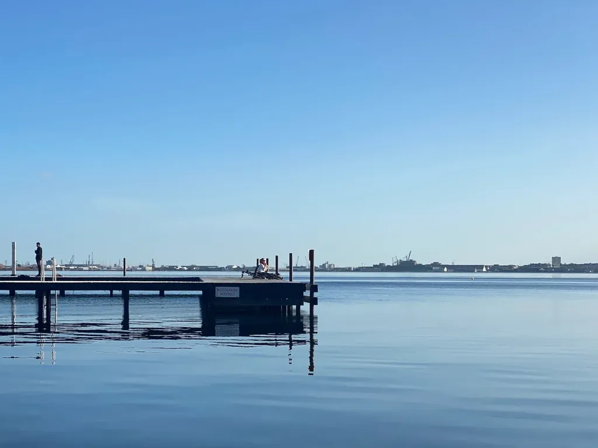

### Mardi 28, Balaruc

L’univers est absurdement beau. La vie n’a pas d’autre sens que savourer cette beauté. J’éprouve un frisson à l’idée des beautés que je ne contemplerais jamais. J’aurais pu passer à côté de l’ensemble de Mandelbrot. Durant des millénaires, personne de l’a entrevu. J’imagine l’émerveillement de Mandelbrot quand l’ensemble apparaît sur le papier de l’imprimante et révèle les soubassements du monde : les branches de l’arbre, le delta du fleuve, les rides du désert, les infinis replis de la matière… Quand je regarde autour de moi, je vois partout l’ensemble de Mandelbrot, je vois les galaxies lointaines, les lumières éblouissantes. Le tout résumé dans chaque parcelle de lui-même puisqu’il n’est que l’expression de lois universelles.

Sauf que cette universalité est douteuse. Un peu effrayante. Dictatoriale. Je me dis que l’univers ne peut être aussi homogène. L’humanité ne l’est pas. Si je possède un libre arbitre alors il n’existe aucune loi universelle. Je peux défier l’universalité. Être une singularité. Voilà ce que j’ai toujours voulu, jusqu’à la souffrance de l’impuissance. Échapper aux lois naturelles tout en restant dans la nature. Un rêve fou.

---

Parfois je lis des critiques de livres. Elles sont si élogieuses qu’elles me donnent l’impression d’une rupture radicale, d’une brisure de perspective, puis j’entrouvre les livres et ils n’enfreignent aucune loi, au contraire ils s’y abandonnent avec complaisance. La critique me donne une idée de la littérature plus grande que la littérature elle-même. Elle peut parler d’une littérature qui n’existe pas. Il me faudrait critiquer tous les livres que je n’ai jamais écrits. J’y serais bouleversant, renversant, stupéfiant.

---

Si l’univers était fractal, il suffirait d’observer l’infiniment petit pour observer l’infiniment grand. Ce qui n’est a priori pas le cas. Des innovations surviennent à chaque échelle. Peut-être vivons nous à celle qui les maximise, la seule où le libre arbitre est possible.

---

Mes expériences NFT se heurtent à un mur : les frais de mise en ligne avoisinent souvent 100 €. J’ai payé pour vendre mon roman, payé pour faire l’expérience, sachant que ce serait à perte, mais ça n’a aucun sens pour une nouvelle que je veux vendre à quelques centimes. Et si je ne paye pas ces frais, le premier acheteur doit le faire, ce qui est plutôt dissuasif. Les NFT ne sont qu’une bulle capitaliste pour l’instant.

---

« Regular writing can give you a safe, cathartic release valve for the stresses of your daily life. » [Tenir un journal réduirait le stress.](https://lifehacker.com/why-you-should-keep-a-journal-and-how-to-start-yours-1547057185) Voilà que ma graphomanie s’explique. Mais il faudrait que j’écrive au sujet des évènements qui me stressent. Ce gars à qui j’ai crié « attention » alors que je fonçais sur la piste cyclable, parce qu’il se tenait au milieu pendant que sa petite famille batifolait sur le bas-côté. Il me hurle « Tu devrais aller plus vite. » Comme un zouave, je réponds « Oui, sans doute » et je file. Mais je l’entends éructer, m’ordonner de faire demi-tour et de l’affronter dans un combat singulier. Voilà ce qui me stresse, le niveau de stress des autres.

Mais le stress le plus terrible est le vide devant moi. Je ne sais pas dans quoi je vais tomber. Je n’ai pas la moindre idée de quoi seront faits les mois qui arrivent. Rien. Agenda vide. J’ai bien un roman à écrire pour publication en 2023, mais comme il ne se dessine pas encore, il n’est qu’une vague possibilité dans la brume du vide.

Il y a bien un autre stress : *Au-delà de cette limite, votre ticket n’est plus valable*. La peur que mon hyper activité se tarisse, quelle cesse de remplir le vide jusqu’à ce qu’il déborde. Parfois je me dis, c’est trop tard, tu as manqué le coach, puis je me souviens que j’écris pour voir le monde, alors je me ressaisis, parce que voir le monde est en soit sublime et tout le reste secondaire. Mais tout de même, j’apprécie les caresses. Elles me manquent.

Tenir un journal stimulerait la créativité. Je remarque que j’écris davantage dans le mien entre les projets. J’ai besoin de redescendre dans ce laboratoire. Je devrais aussi y noter mes erreurs et mes succès. Pas simple dans les deux cas. Une erreur, par exemple : j’ai dit à Pierre que son roman de la rentrée littéraire m’était tombé des mains. Pas très malin quand je lui envoie après un de mes textes.

Pourquoi je ne me tais pas ? La franchise est plus forte que moi. Je suis incapable de bluffer dans les jeux de société. Quand je pense un truc, il faut que ça sorte. Je me contiens de mieux en mieux, mais je me demande si garder tout ce fatras en moi ne me fait pas du mal. Parfois je dis que je n’ai aucun succès à mon actif. Isa me reprend au vol. « Regarde tes enfants. » Quand je parle de succès, je pense à l’art, à la littérature. Le succès dans le regard des autres. Ce truc un peu vague, un peu fourbe, donc je ne connais qu’une mesure : le fric. Au moins, si un lecteur paye, c’est soit qu’il est trop riche, soit que quelque chose doit l’intéresser chez moi.

### Mercredi 29, Balaruc

Vu hier soir *Don’t Look Up*, film satyrique qui dénonce notre aveuglement dans une société décadente. Beaucoup de gens traitent le film de navet. Est-ce parce qu’ils trouvent le sujet absurde ? Est-ce parce que la critique ne les touche pas ? Est-ce parce qu’ils ne perçoivent pas le danger ? J’ai ri jaune d’un bout à l’autre. Le réalisme du film est presque terrifiant. Que la métaphore passe inaperçue me terrifie encore plus. Ce n’est pas un chef-d’œuvre, mais pas un navet.

---

Je suis un voyageur de la vie. Je n’ai jamais trop compris le concept de voyage intermittent. Je ne pars pas en voyage, je voyage tous les jours. Parler de littérature de voyage, c’est un pléonasme. « Déplacement d’une personne qui se rend en un lieu assez éloigné de celui où elle réside. » Si je ne me déplace pas à la surface du monde, je le fais imaginairement. Mon bureau est déjà très éloigné de ma chambre, bien que dans la même maison. Je n’y vis pas les mêmes choses.

---

Je viens de lire [un article sur les innovations préhistoriques](https://theconversation.com/how-a-handful-of-prehistoric-geniuses-launched-humanitys-technological-revolution-171511). Si certaines ont été effectuées plusieurs fois en différents endroits, la pyramide, les mathématiques, l’écriture, la bière, d’autres a priori une seule fois. On voit ainsi l’arc apparaître en Afrique du Sud il y a 70 000 ans avant peu à peu de se propager. Un seul humain est sans doute à l’origine de cette découverte. Je trouve ça vertigineux. Qu’une idée fortuite, certes géniale, provoque des bouleversements durables. Qui était-ce ? Un homme, une femme ? On s’en fiche, même si on aimerait savoir comment cela s’est passé.

J’aurais voulu inventer un truc aussi décisif que l’arc, un truc comme les fractales, je n’ai inventé que la forme romanesque de *One Minute*, un truc anecdotique dans l’histoire de la littérature. Mais peut-être que je dois lui ajouter des cordes, puisque c’est mon arc.

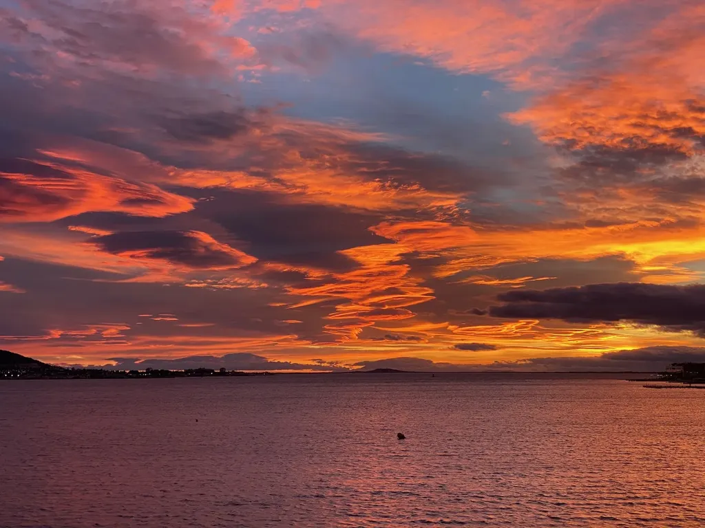

### Jeudi 30, Balaruc

[Je renoue avec mes vagabondages littéraires.](../../2021/12/prendre-son-temps-a-velo/?swcfpc=1.md) J’écris avec un petit clavier pliable sur mon téléphone.

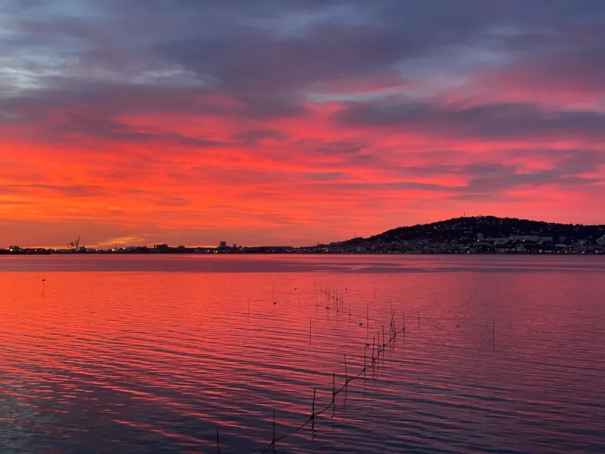

### Vendredi 31, Balaruc

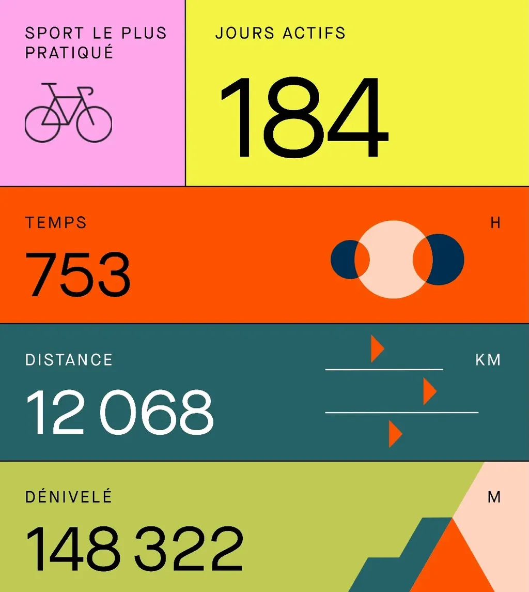

#carnets #y2022 #2022-1-3-12h12
