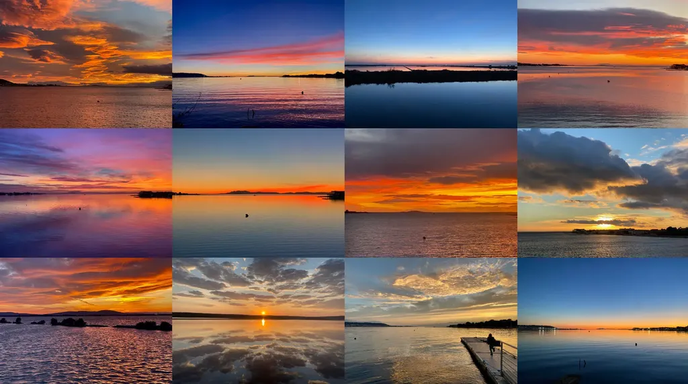

# NFT : une chaîne de spéculation vertueuse pour les créateurs

[Au gré de mes expérimentations](#nft), je découvre les bons et les mauvais côtés des NFT, et aussi entrevois de nouvelles possibilités.

Initialement, je me suis dit voilà une opportunité de vendre des textes inédits ou remis en forme graphiquement. Il s’agissait de permettre à des collectionneurs d’investir dans la littérature contemporaine née sur le Net. Après tout, [Jack Dorsey a vendu son premier tweet pour 2,9 millions de dollars](https://www.bbc.com/news/business-56492358). Tout en sachant que les amoureux de littérature numérique étaient d’autres auteurs de littérature numérique et non des geeks férus de cryptomonnaies, j’ai tenté de vendre quelques œuvres, non dans l’espoir fou de faire fortune, mais parce que j’aime me dire « pourquoi pas ».

Voilà, c’est fait, j’ai essayé. [Mon premier PDF](../../2021/8/je-vends-mon-blog-aux-encheres-en-nft.md) a été acheté par [un artiste](https://mintable.app/u/rvig_art/wallet) qui lui même a connu un certain succès avec des œuvres génératives vendues en NFT. [Ma nouvelle proposée initialement 2 $](la-croix-et-la-galere-pour-vendre-un-texte-en-nft/?swcfpc=1.md) a grimpé à 80 $ sans ne plus trouver d’acquéreur. [Mon manuscrit inédit](../../2021/12/je-vends-un-roman-inedit-en-nft/?swcfpc=1.md) n’a intéressé personne. Cette possibilité de mettre en vente m’a au moins motivé pour [rassembler tout au long de 2022 mes photos de coucher de soleil](../../../../page/one-sunset-a-day.md). La série complète dessinera un poster éblouissant.

J’ai bien envie d’arrêter là mes expérimentations, mais non sans d’abord évoquer une possibilité qui ne me paraît pas encore exploitée. On m’a parfois dit que vendre en NFT ne changeait rien au financement participatif. À titre personnel, je n’ai jamais recouru à ce type de financement parce que j’écris d’abord par besoin, puis choisis soit de donner mes textes, soit de les vendre.

Mais avec les NFT, une nouvelle possibilité apparaît. Je peux continuer à donner des textes, par exemple cet article, le laissant libre d’accès, tout en le mettant en vente aux enchères en NFT. Un acheteur ne payerait donc pas pour avoir le privilège de lire, mais de revendre mon texte. En me soutenant, puis en tentant de rentabiliser son investissement, il ferait ma promotion. Nous serions liés par un partenariat gagnant-gagnant.

Tous les créateur numériques pourraient utiliser cette astuce, ajoutant un bouton de vente à leurs contenus (vous ne tarderez pas à les voir fleurir). Je me prête au jeu en mettant en vente cinq articles qui ont eu beaucoup de succès sur mon blog.

1. [Lettre à la Fédération Française de Cyclisme, avril 2020](https://isengard.market/nft/TCC-5cf6ff-03) ([texte original sur le blog](../../../../2020/4/lettre-a-la-federation-francaise-de-cyclisme.md)).
2. [Retomber amoureux des librairies, une nécessité, septembre 2019](https://isengard.market/nft/TCC-5cf6ff-04) ([texte original sur le blog](../../../../2019/9/retomber-amoureux-des-librairies-une-necessite.md)).
3. [Comment pirater légalement tous les livres , novembre 2014](https://isengard.market/nft/TCC-5cf6ff-05) ([texte original sur le blog](../../../../2014/11/comment-pirater-legalement-tous-les-livres.md)).
4. [Qu’est-ce que la liberté ?, octobre 2013](https://isengard.market/nft/TCC-5cf6ff-06) ([texte ordinal sur le blog](../../../../2013/10/quest-ce-que-la-liberte.md)).
5. [Qui a la plus grosse quéquette sur Twitter ?, septembre 2009](https://isengard.market/nft/TCC-5cf6ff-07) ([texte original sur le blog](../../../../2009/9/qui-a-la-plus-grosse-quequette-sur-twitter.md)).

#edition #nft #y2022 #2022-1-13-22h8
