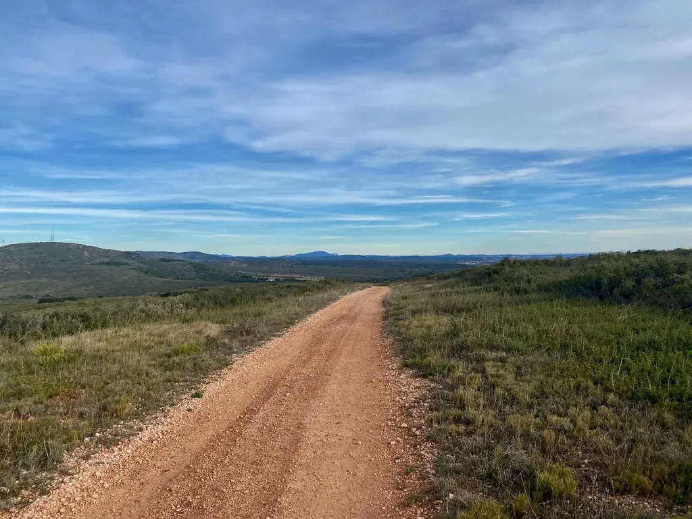
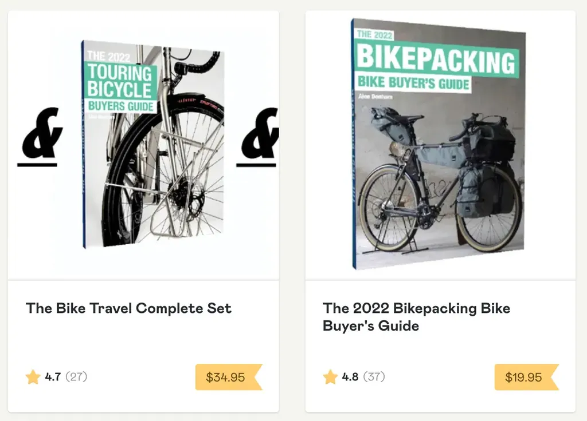

# Qu’est-ce qu’une trace et comment les créer

Depuis quelques semaines, je réfléchis à une liaison hors asphalte entre Paris Gare de Lyon et Sète, que je compte effectuer début juillet 2022. Je me suis dit, ça serait top de la créer à plusieurs, chacun apportant son expertise locale. Après avoir découvert l’association américaine Bikepacking Roots qui s’est donné en parti un tel but, j’ai [lancé l’idée d’une association française qui aurait pour ambition de créer des traces bikepacking](backpacking-roots-france/?swcfpc=1.md). Après avoir discuté avec pas mal de cyclistes, j’ai découvert que beaucoup ne comprenaient pas de quoi je voulais parler.

L’un n’a cessé de me répéter : « Créer une trace, c’est facile, il suffit d’utiliser tel et tel service. » Sa conclusion : lancer une association qui se donnerait le but de créer des choses aussi simples n’a aucun sens. Quand j’ai transposé cette remarque dans mon domaine de prédilection, la littérature, cela a donné : devenir écrivain, c’est facile parce que l’utilisation d’un traitement de texte est facile. Il y a là une grande confusion entre les outils, potentiellement faciles à utiliser, et l’objet qu’ils permettent de créer, parfois après beaucoup de travail.

### Qu’est-ce qu’une trace

Répondre à cette question est aussi difficile que d’expliquer ce qu’est un roman à quelqu’un qui n’en aurait jamais lu. Je parle de roman à dessein, parce qu’une trace aboutie est en quelque sorte toujours romanesque, toujours artistique, toujours marquée par la pâte de son ou de ses créateurs.

Vous avez tous lu des romans, donc je peux commencer par là. Dès les premières pages, on découvre une situation, des protagonistes, peu à peu on est pris par une intrigue, par un style, par des émotions, avec des moments de tension, de détente, des coups de stress, parfois des plages calmes, on tend vers un climax, puis on arrive à l’épilogue, parfois avec des réponses, parfois pas, mais en ayant cheminé intérieurement. Les romans qui nous touchent nous transforment. Une trace peut produire en nous le même effet.

J’ai arpenté ma première grande trace en Floride, lors de la neuvième [Huracan](../../2019/2/satori-a-lake-lindsay/?swcfpc=1.md), et un nouveau monde esthétique s’est ouvert à moi. Au fil de ces 600 km dans le sable, les marécages, des singles infinis, parfois de petites routes champêtres, je suis passé par une multitude d’émotions, parfois prenant mon pied, parfois maudissant Carlos l’auteur de la trace, mais toujours conscient que je vivais quelque chose d’unique, que chaque étape me préparait à la suivante, selon un ordre impeccablement ciselé.

Depuis dix ans, Carlos ne cessait de sillonner la Floride centrale pour concocter le plus bel itinéraire possible. D’année en année, il l’ajustait, le détournait, l’éditait et le corrigeait, pour proposer une expérience totale aux bikepackers qui suivraient sa trace. Facile comme travail ? En un certain sens oui, il ne faut pas compter ses heures sur le terrain, essayer tous les chemins. Mais le plus dur reste à faire. Créer les enchaînements, faire en sorte que les chapitres se suivent, que l’histoire progresse. Là, on touche à l’art. Et l’art n’est jamais facile, en plus de n’avoir rien d’universel puisque sa perception dépend des expériences de chacun.

Voilà pourquoi quand on me dit que créer une trace est facile, je perds souvent patience. Je trouve ça totalement irrespectueux pour le travail de Carlos et consorts. Il faut suivre une trace de ce type pour comprendre de ce dont je parle. Carlos m’a initié à la trace. Dès lors il ne s’est plus agi pour moi de fabriquer des fichiers GPX, comme je le faisais jusque là, mais de raconter des histoires à vivre à vélo, le fichier n’étant plus qu’une transcription en mots d’un parcours imaginaire.

Créer une trace est facile [quand on utilise un logiciel de routage](../../2019/9/vtt-gravel-bikepacking-que-vaut-le-routage-automatique/?swcfpc=1.md), [quand on effectue des copier-coller entre des traces existantes](../../2019/3/randos-vtt-ou-autres-comment-creer-une-trace-gpx/?swcfpc=1.md), mais il n’y a rien de plus complexe quand on veut raconter une histoire, influencer l’état d’esprit du cycliste, l’entraîner dans une rêverie sportive.

[Je viens de mettre plus de deux mois pour créer une trace gravel de 100 km sur mes terres.](../../2021/12/prendre-son-temps-a-velo/?swcfpc=1.md) Je connais tous les chemins et pourtant j’ai dû repartir presque de zéro, tentant de me mettre dans la peau de ceux qui rouleraient là pour la première fois. Par où partir, que leur proposer pour commencer, puis comment tendre peu à peu vers le dénouement. J’avais à ma disposition une infinité de possibilités, j’en ai choisi une adaptée au gravel, elle aurait été toute autre à VTT. Je ne suis pas forcément satisfait par tous les secteurs. Certains m’ennuient parce que je ne suis pas un pur gravelliste, mais il me paraissait important de les incorporer pour faire prendre conscience de mon territoire. C’est une partie de son histoire que j’ai voulu raconter avec cette trace. Comme avec tous mes textes, je n’en suis pas totalement satisfait, je ne sais pas si les les cyclistes l’apprécieront, mais j’ai essayer de la construire avec ma sensibilité.

Je ne me pleins pas, j’adore écrire des traces autant que des textes, [ces deux activités ont beaucoup de points en commun](../../2019/2/le-velo-comme-ecriture/?swcfpc=1.md). Mais on ne peut pas me dire que c’est simple, que ça prend deux minutes. Je ne compte pas mes heures quand je crée mes traces, à étudier les cartes, les images satellites, puis à arpenter le terrain en tout sens. La difficulté n’est pas d’avoir un tracé possible d’un point A à un point B, mais celui qui sera le plus enchanteur dans la perspective d’une plus grande histoire.

Parce que je ne suis pas le seul en France à cultiver cette conception artistique de la trace, parce que d’autres œuvrent dans leur coin, je me suis dit que nous pourrions connecter nos initiatives plus ou moins solitaires, et pourquoi pas leur ajouter des interconnexions qui elles-mêmes seraient pensées avec art. Comme il existe des associations d’auteurs, il pourrait exister en France une association de traceurs (et même plusieurs avec des approches différentes).

### Du bikepacking

Sur [le groupe Bikepacking France](https://www.facebook.com/groups/1396341304006680), je m’écharpe avec pas mal de dits bikepackers au sujet de la définition de ce que serait le bikepacking. Les babacools prêchent le chacun sa définition, ne nous prenons pas la tête et vivons heureux (sans nous comprendre), d’autres veulent une définition si large qu’elle englobe même les routiers épisodiques, sous prétexte qu’ils transportent une chambre à air sous leur selle (un bike avec un pack, ça devient du bikepacking). Comme j’ai un sac sur tous mes vélos, je ferais même du bikepacking quand je vais acheter le pain.

Quand je vivais en Floride, j’ai découvert la discipline sur [bikepacking.com où j’ai déniché l’Huracan](https://bikepacking.com/routes/huracan-300-bikepacking-route/) et bien d’autres traces off-road. Je prends conscience en écrivant ce texte que la trace définit ce qu’est le bikepacking pour ses promoteurs américains : une aventure de plusieurs jours à vivre à vélo. Alors dans les forums on se demande quelle taille de pneus utiliser, combien de vivres transporter, quel type de bivouac prévoir…

Je crois que tant qu’on n’a pas expérimenté la trace comme le scénario d’une aventure romanesque, on ne fait pas du bikepacking. On voyage, on se déplace, on fait du cyclotourisme, ou simplement du vélo, mais pas du bikepacking. Le bikepacking est né avec le GPS parce le GPS le rend possible. Si avec une carte on survole le territoire et le découvre dans son entièreté synthétisée, avec une trace on le pénètre par un minuscule trou de souris. Elle nous le dévoile page après page, virage après virage, de surprise en surprise. Elle ne nous guide pas, elle nous perd dans sa dimension imaginaire.

Si, dans une expérience de pensée, je définis le bikepacking comme suivre une trace scénarisée, je n’exclus aucun vélo. Maintenant, je me mets à la place du traceur. Pour lui, se limiter à l’asphalte, c’est comme écrire en se passant de la plupart des lettres de l’alphabet cyclistes. En art, la contrainte est souvent source de créativité (cf Perec), mais quand nous traçons, nous subissons déjà un nombre incalculable de contraintes (chemins privés, chemins embroussaillés, chemins impraticables, points de vue inaccessibles…). Je vois mal pourquoi nous nous interdirions les pistes, les singles, les plages, les poussages, parfois les portages… surtout quand ainsi nous évitons des routes abominables (les cyclotouristes des origines ne s’interdisaient rien de tout cela d’ailleurs). Pourquoi réduirions-nous notre palette expressive puisque nous disposons de vélos suffisamment polyvalents pour rouler sur tous les terrains ?

Pour ma part, je préfère éviter les voitures, leur bruit, leur pollution. Même sur les petites routes, nous ne sommes jamais à l’abri des chauffards. Et puis l’asphaltes, c’est un autre vestige de la civilisation thermo-industrielle, le symbole d’un monde qui s’effondre, rouler dessus revient pour moi à perpétuer un système délétère. En tant qu’auteur de traces, voilà pourquoi j’évite le plus possible l’asphalte, tout en étant souvent forcé de m’y replier parce qu’il salit le monde. Au XXIe siècle, c’est une exigence écologique d’écrire des traces le plus loin possible de l’asphalte (il y a une vie après le goudron).

### Post-scriptum

Si vous ne connaissez pas [Alee Denham](https://www.cyclingabout.com/), je vous conseille de suivre [sa chaîne YouTube](https://www.youtube.com/c/Cyclingabout) et de [lire ses bouquins](https://cyclingabout.gumroad.com/). Si vous voulez acheter un vélo, ses guides sont indispensables. Ses conseils aussi. J’aime son approche scientifique et rationnelle. Figurez-vous qu’Alee se définit tantôt comme cyclotouriste, tantôt comme bikepacker. Il propose d’ailleurs un guide des vélos de bikepacking, un autre des vélos de touring, deux pratiques pour lui très différentes, qui loin de s’exclure se complètent, mais ne se pratiquent pas sur les mêmes terrains. Je ne comprends toujours pas pourquoi nous tentons de nier ces différences en France plutôt des les cultiver dans leurs spécificités. Elles en sortiraient toutes deux grandies au lieu de fusionner dans un melting pot insipide. Mais le sens des mots évolue sans que nous puissions le contrôler. Alee me dit que la confusion touring/bikepacking se propage aussi en anglais.

Pourquoi les cyclotouristes français veulent-ils tous devenir des bikepackers ? Est-ce parce que le mot « tourisme » dans cyclotourisme leur déplaît ? Le côté anglo-saxon de bikepacking est-il plus sexy ? Est-ce juste une question de mode ? Je me moque de la réponse, nous allons juste devoir inventer un nouveau mot pour décrire le bikepacking hors asphalte (en suivant des traces narratives).

#gps #velo #y2022 #2022-1-6-17h10
