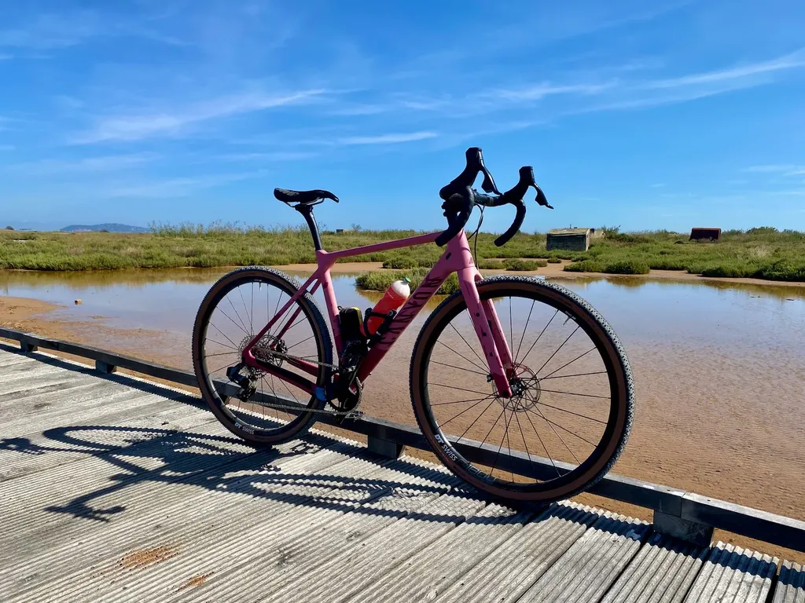
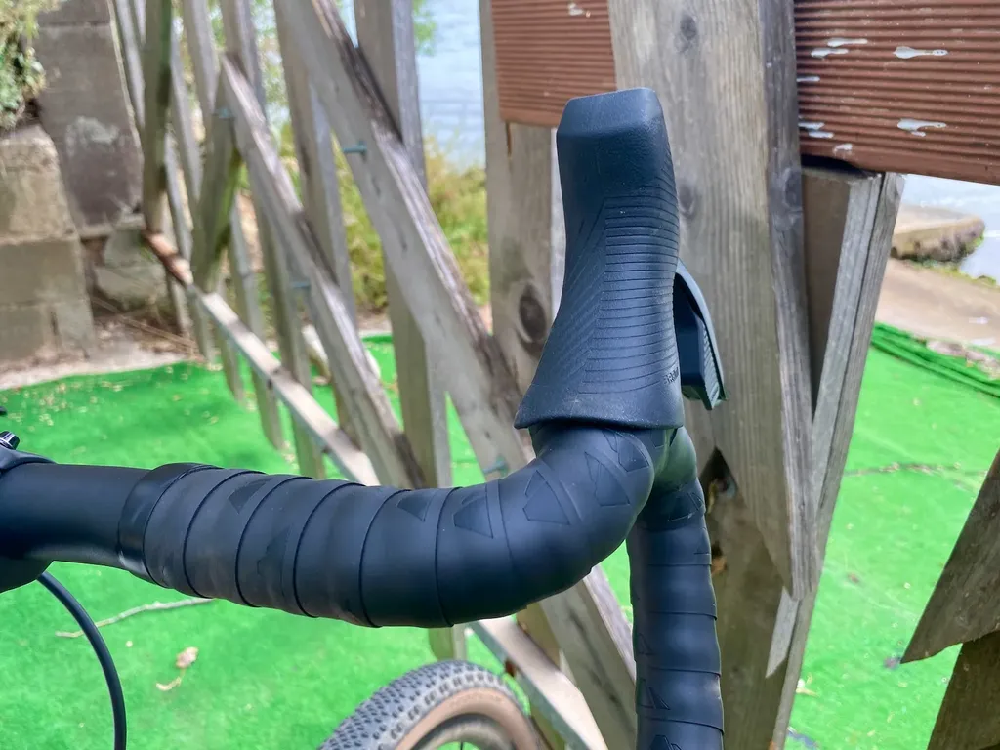
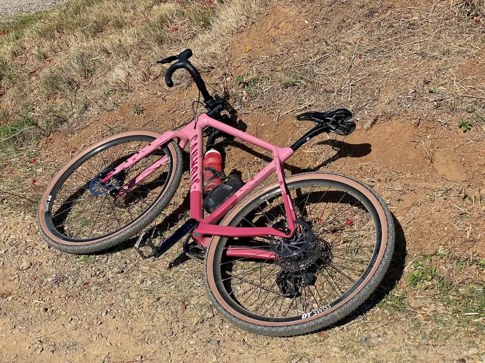
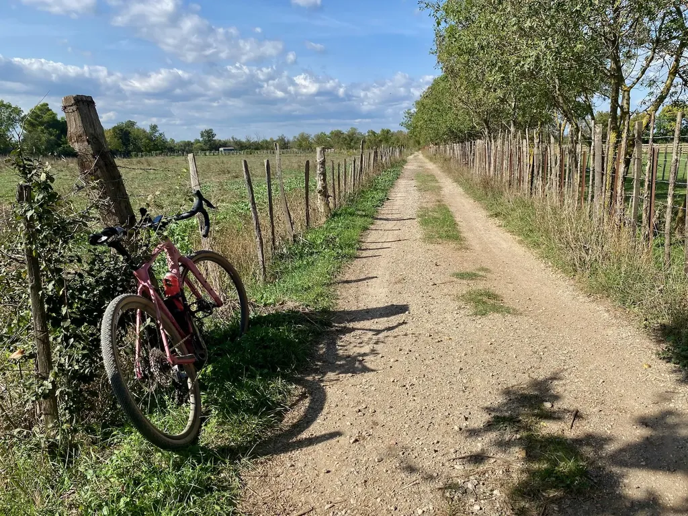
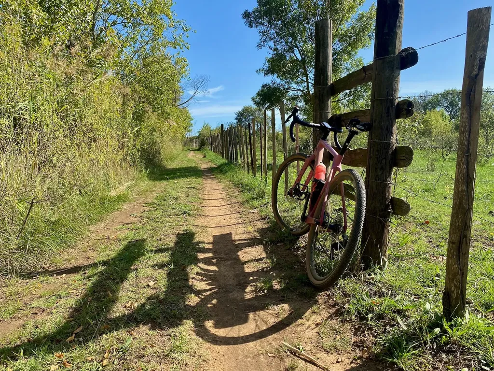
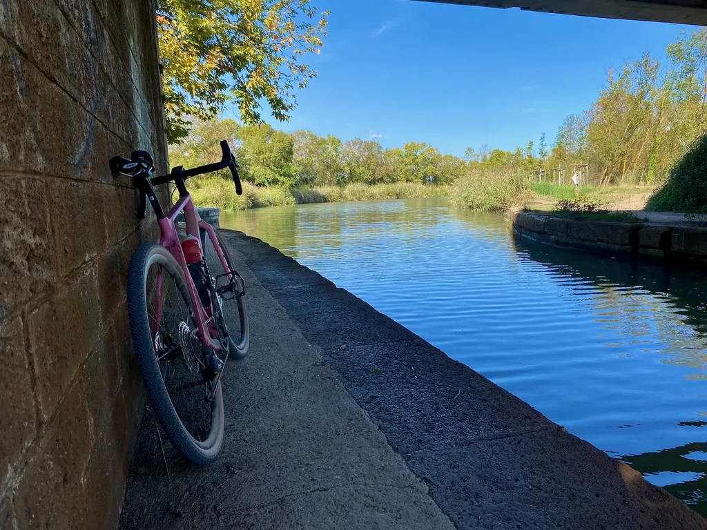
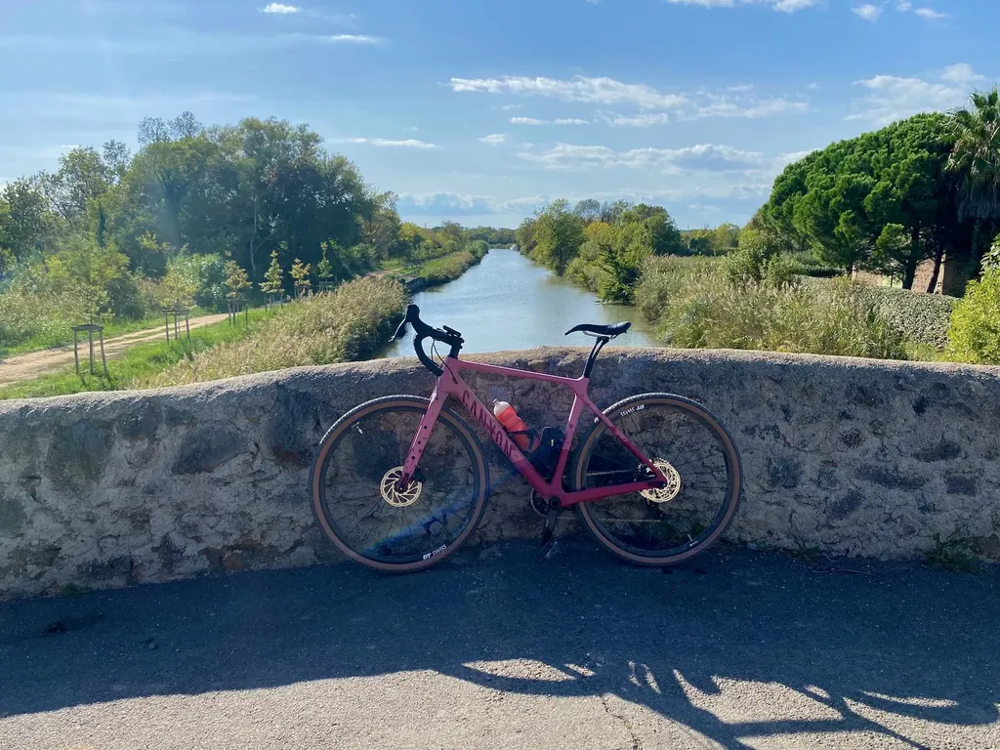

# Prise en main du gravel Canyon Grizl

Depuis dix jours, [mon nouveau gravel](https://www.canyon.com/fr-fr/velos-de-gravel/bike-packing/grizl/cf-sl/grizl-cf-sl-7-etap/3106.html?dwvar_3106_pv_rahmenfarbe=RD%2FRD) m’attendait dans son carton. J’ai enfin pu l’assembler, puis rouler avec. Premières impressions.

### Montage

En théorie, d’après la vidéo Canyon, le montage ne nécessite que dix minutes, puisqu’il suffit d’insérer le tube de selle, de fixer le cintre à la potence, de positionner la roue avant et de glisser la batterie dans le dérailleur (je le sais parce que j’ai déjà un AXS sur un VTT). Canyon fournit les outils nécessaires (mais la notice de montage est plus que succincte).

Dès le premier tour du pâté de maisons, je constate que la selle [Fizik Argo Terra](https://www.fizik.com/eu_en/terra-argo-x5.html) ne fera que me défoncer les fesses, car, avec ses 150 mm, elle trop large pour mes ischions (elle est à vendre). J’ai monté à la place, une [SMP Glider](https://www.sellesmp.com/eu_fr/glider.html), tout en la positionnant selon mes mesures déterminées il y a quelques années [lors d’une étude posturale](../../../../2019/4/etude-posturale-payer-ou-non.md). Une procédure qui mine de rien demande un peu de doigté.

Une fois le vélo accroché au pied d’atelier, je me suis attaqué aux roues. Je comprends les chambres à air chez les vélocistes, puisque les vélos peuvent rester en stock des semaines, mais chez Canyon le mot d’ordre est le flux tendu et les roues devraient être livrées en tubeless. Ils sont radins au point de ne pas fournir de valves tubeless (mais une ribambelle de catadioptres inutiles et même des pédales à sangles).

Second tour du pâté de maisons. Il me faut un moment pour comprendre le fonctionnement du [Rival etap AXS](https://www.sram.com/en/sram/road/series/rival-etap-axs), qui nécessite des impulsions à droite et à gauche, ce dont je n’ai pas l’habitude à VTT. Je note que l’habillage des leviers est mal positionné et ne colle pas à la guidoline (leviers montés trop haut sur le cintre). Un travail d’amateur. Je devrai virer la guidoline et tout reprendre, chose inconnue pour moi puisque je suis avant tout vététiste. Par ailleurs, il me faudra [régler le reach des leviers](https://www.youtube.com/watch?v=lKso8td2GGg), positionnés par défaut pour des mains de géants (autant de réglages indispensables, dont Canyon ne dit rien).

Il ne me reste plus qu’à dégraisser la chaîne et la cassette pour les lubrifier avec [de la cire d’abeille Squirt](https://squirtlube.fr/), puis de fixer mon support GPS et des porte-bidons, non fournis. J’aurais bricolé deux bonnes heures avant de m’élancer.

### Premières impressions

Je m’en vais par la piste cyclable et me dresse sur les pédales pour accélérer. Je n’ai pas roulé avec des roues alu depuis des années et je ressens immédiatement leur inertie. Je m’y attendais : [les DT Swiss G1800](https://www.dtswiss.com/fr/roues/roues-route/gravel/g-1800-spline) Spline DB25 sont plus lourdes que mes roues VTT. J’ai l’impression de devoir lancer du paquebot, sensation vite oubliée une fois le Grizl en vitesse de croisière.

En revanche, dès que je mords la terre, je constate que le Grizl est bien plus confortable que jadis mon Diverge 2019, et cela même en l’absence de système de suspension. Le cadre et les roues filtrent les imperfections du terrain.

Quand j’attaque des singles, le Grizl s’avère très joueur, très stable, et m’inspire confiance. Je prends du plaisir à rouler sur des secteurs familiers, qui me paraissent nouveaux même si j’en connais le moindre détour. Voilà pourquoi j’ai racheté un gravel, il renouvelle mon territoire, et j’en profite pour m’aventurer sur un secteur inconnu, supposé à raison inintéressant à VTT, mais superbe à gravel. [Tout cela ne me fait pas revenir sur mon idée du gravel comme objet de luxe pour qui possède un VTT](../7/jen-suis-revenu-du-gravel.md), mais oui, j’ai succombé au luxe.

Sur le retour par la piste cyclable du bord de mer, après déjà plus de 60 km, j’ai mal aux paumes des mains, sans doute à cause de la guidoline et de l’habillage approximatif des leviers, aussi parce que le cintre de 440 est un poil trop large pour moi, avec un reach et un drop trop importants, un sweep faiblard pour les passages techniques. Je le remplacerai au plus vite, sans doute par un [Deda Gera Alloy Handlebar en 420](https://dedaelementi.com/gera-alloy-handlebar), qui en prime a un rise de 10 mm, ce qui m’évitera peut-être de changer la potence (pour cette première virée, j’ai basculé le cintre vers le haut, pour réduire le drop).

Encore quelques réglages et optimisations et je me remettrai à tracer des itinéraires gravel, pourquoi pas un g727 ([un tour de l’Hérault plus roulant que la version VTT](https://727bikepacking.fr)).

#gravel #velo #y2022 #2022-10-7-19h13
