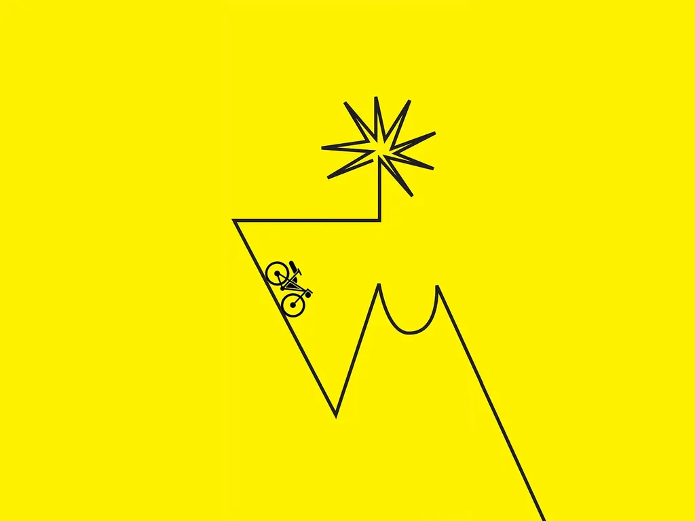
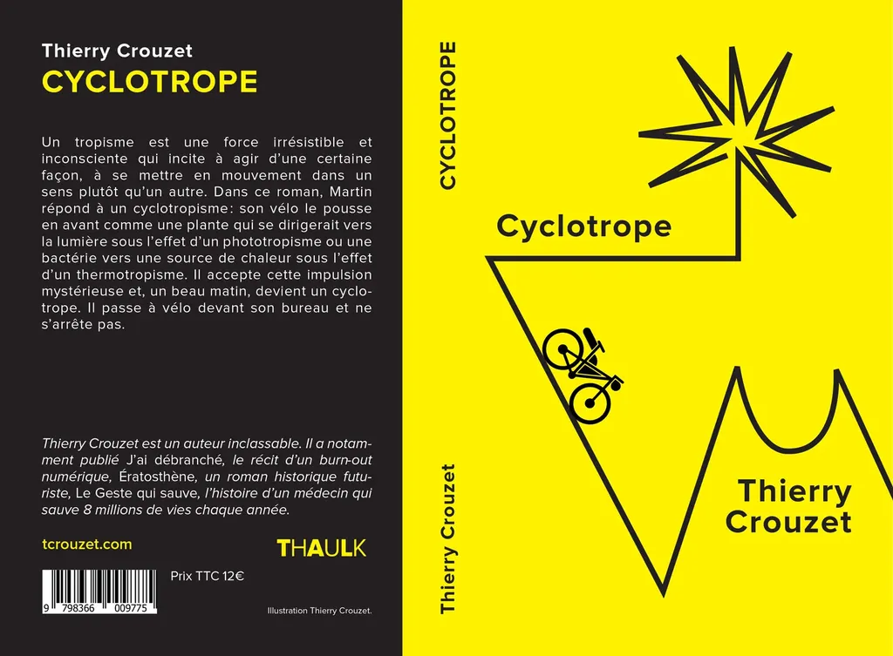

# Cyclotrope : mon cadeau de Noël

En cinq semaines durant l’automne 2021, j’ai écrit un roman initiatique, soudainement, sorti tout seul, avec délectation. Pierre, mon éditeur, a fait la fine bouche et j’ai remisé le texte, pour ne le relire et le retravailler homéopathiquement qu’un an plus tard, mais avec autant de plaisir que quand je l’écrivais. Je me dis qu’il intéressera peut-être quelques lecteurs. Alors, jusqu’à Noël, je diffuse gratuitement sa version électronique dans toutes les librairies *ad hoc* ([7switch](https://www.7switch.com/fr/ebook/9782919358205/cyclotrope), [Amazon](https://www.amazon.fr/dp/B0BNJHCGK1/), [Apple](https://books.apple.com/fr/book/cyclotrope/id6444769496), [Bookeen](https://www.bookeenstore.com/ebook/9782919358205-cyclotrope-thierry-crouzet/), [Google](https://play.google.com/store/books/details/Thierry_Crouzet_Cyclotrope?id=60ueEAAAQBAJ), [Kobo](https://www.kobo.com/fr/fr/ebook/cyclotrope)…). Si vous êtes allergique à la lecture électronique, je diffuse aussi une version papier ([Amazon](https://www.amazon.fr/dp/B0BMXMC6TB?ref_=pe_3052080_397514860)).

Pas plus que Stevenson parle sans cesse de son âne dans son *Voyage avec un âne dans les Cévennes*, je parle sans cesse du vélo. Il est un moyen de transport comme la voiture l’est dans un road book, à cela près que ce récit ne se joue pas sur les routes mais le plus souvent sur les chemins loin d’elles ([il me faudrait théoriser le single book](apres-le-road-book-et-le-cyber-book-le-single-book.md)).

Comme la plupart des road books, c’est un récit initiatique. Martin quitte sa vie insatisfaisante pour vivre des aventures qui le transformeront. Je ne fais que raconter ce que j’ai vécu depuis que je voyage à vélo. Si les récits initiatiques engagent le plus souvent de jeunes gens, j’ai voulu montrer qu’il n’y avait pas d’âge pour grandir.

Le titre vient d’Isa. Elle prétend souvent que je souffre d’un tropisme qui me pousse vers le vélo, et avec le vélo dans la nature loin des infrastructures bétonnées. Comme les plantes qui se dirigent vers la lumière sous l’action d’un phototropisme, j’obéis à un cyclotropisme, ce qui ferait de moi un cyclotrope, de même que Martin, mon héros.

J’ai fait relire ce texte à quelques amis, pour la plupart non cyclistes, ils m’ont encouragé à ne pas le garder pour moi. Ils m’ont aussi aidé à le corriger. Mais en aucune manière il ne s’agit d’un texte professionnellement édité. Des coquilles subsistent inévitablement. N’hésitez pas à me les signaler, je les corrigerai.

#mailing #y2022 #2022-12-1-11h57
