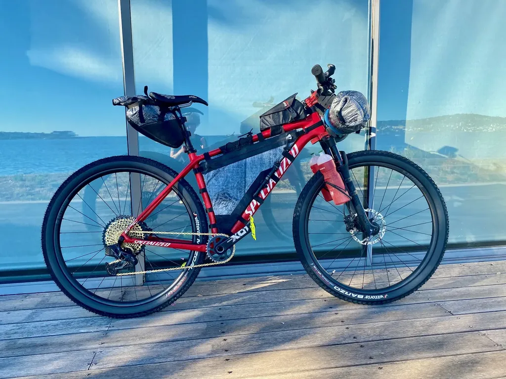
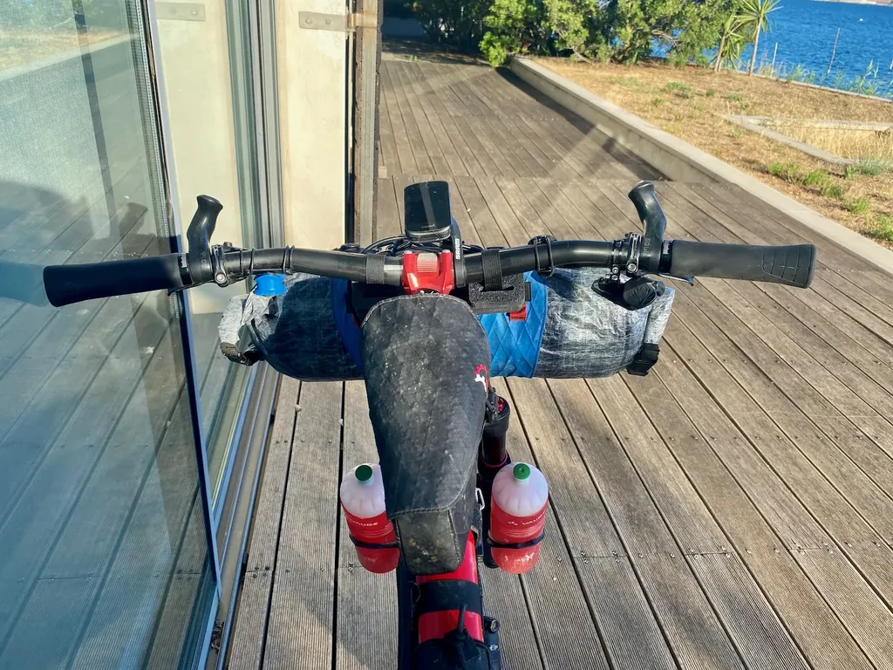
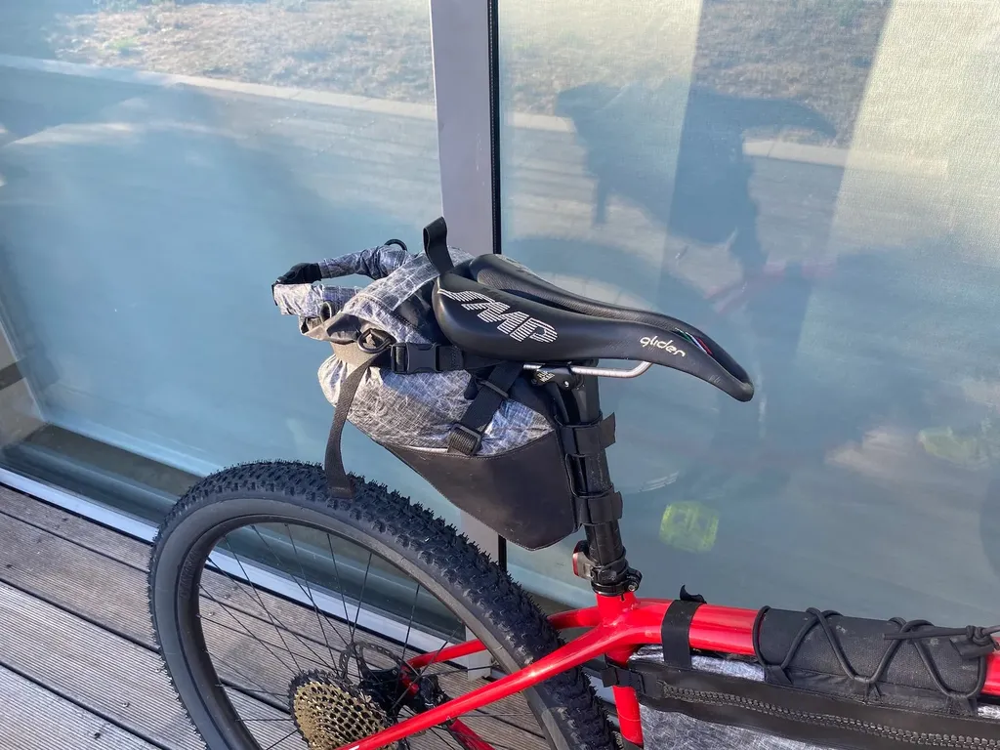
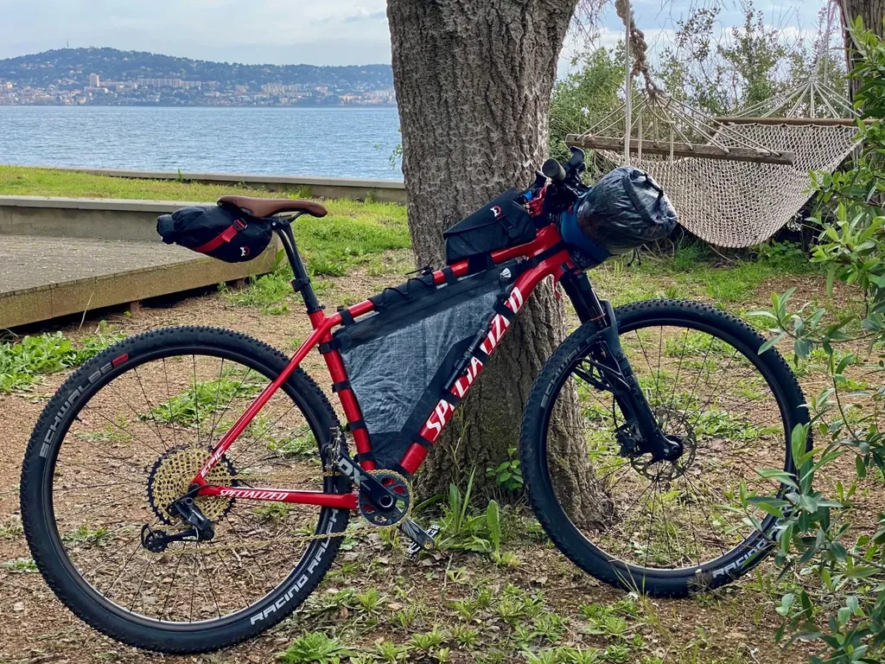

# Journal d'une config bikepacking

Plutôt que de publier de temps à autre ma configuration bikepacking, je tiens un journal de configuration, [résumé par un tableau détaillé](https://docs.google.com/spreadsheets/d/1Co6BJql8z7uWCvAokGcDrKaEyAMb-X_zLue6_id3nB4/edit?usp=sharing) (MAJ février 2023).

### Avril 2023

Configuration type pour un [727](/727tour/). Début avril dans l’Hérault, on peut se retrouver en été comme en hiver, donc il faut ajuster les fringues et le matos de bivouac au dernier moment. Souvent je pars avec la tente et le bivy. Par rapport à avril 2022, j’ai remplacé [la selle SMP Glider par sa version avec rails carbone](https://www.sellesmp.com/eu_fr/glider.html). C’est la première selle qui ne me rabote pas le pli des cuisses en longues distance ([testée et approuvée durant le P27](/2022/07/15/une-traversee-de-la-france-a-vtt/)). J’ai testé des portes bidons carbone ultra light [Zefal Pulse l2](https://www.zefal.com/fr/porte-bidons/496-pulse-l2.html) (18 g), mais installés sur la fourche ils éjectent les bidons à la moindre secousse (parfait en revanche sur mon gravel).

### Juillet 2022

Configuration estivale pour un [P27](../../../../page/p27.md) qui s’annonce ensoleillé et sec. J’évite la tente et me contente d’un bivy sans tarp. J’aime de plus en plus dormir à la belle étoile et apprécie la rapidité de mise en œuvre du bivy. En cas d’orage ou de forte humidité, nous rechercherons des abris.

Pour ramener du poids vers l’arrière et maintenir mon sac de guidon sous les 2 kg, j’ai choisi un sac de selle un peu plus grand, passant d’un 3 litres à un 8 litres. Comme il descend très bas le long du tube de selle, il ne m’empêche pas de passer les fesses derrière la selle lors des secteurs techniques.

J’ai monté un Vittoria Barzo TNT à l’avant ([30 Watts](https://www.bicyclerollingresistance.com/mtb-reviews/vittoria-barzo-tnt-g2-2019)), un Mezcal TNT à l’arrière ([28 Watts](https://www.bicyclerollingresistance.com/mtb-reviews/vittoria-mezcal-tnt-g2-2019)), tous deux en 2,25". Ce combo offre une des meilleures résistances au roulement pour des pneus XC. En revanche, par rapport à mon ancien montagne Schwalbe Racing Ray et Ralph en 2,1", je m’alourdis de 200 g. Je me sentais un peu juste avec ces 2.1", et tout aussi juste avec leur version 2.35" montée sur mon tout suspendu. En fait, je n’apprécie guère ces pneus, légers mais qui ne m’inspirent aucune confiance dans les secteurs caillouteux ou glissants. Les Vittoria me procurent une bien pus grande sensation de sécurité. Côté positif, en démontant les Schwalbe après trois mois de roulage intense, j’ai constaté avec surprise que le liquide tubeless n’avait eu à colmater aucune crevaison. En revanche, par temps chaud, ces pneus suintent (même défaut pour les pneus Specialized).

Comme j’en avais assez que mon sac de guidon écrase ma gaine de dérailleur, je suis passé à un Sram GX AXS, me voilà à transporter une batterie de secours et un nouveau chargeur en bikepacking. J’en suis encore à rechercher le chargeur idéal. J’avais cru trouver mon bonheur avec le [Anker 511](https://us.anker.com/products/a2038) (93 g), deux fois 20 Watts, mais j’ai eu l’idée saugrenue de le tester. J’ai découvert qu’il ne délivrait au mieux que 1 370 mA à mon iPhone, deux fois moins que le chargeur 20 Watts Apple (54 g). Avoir deux ports USC-C qui chargent deux fois moins vite, ça n’a pas beaucoup d’intérêt.

Le chargeur Apple mono port peut être remplacé avantageusement par un [Anker 711](https://us.anker.com/products/a2146?_pos=1&_sid=0e718e31e&_ss=r) 30 Watts de 40 g seulement et plus compact, qui lui charge à pleine puissance avec un câble *ad hoc*. Quand j’ai compris que deux chargeurs de 40 g valaient mieux qu’un seul de 93 g, il était trop tard pour le commander. J’ai alors testé tous les chargeurs de la maison. Aucun n’arrive à délivrer réellement 20 Watts sur les deux ports simultanément. J’ai donc décidé de ne partir qu’avec un chargeur 30 Watts. De son côté, ma powerbank délivre 1,3 A sur l’USB-A et 1 A sur l’USB-C. Il est donc toujours préférable de charger le téléphone en direct sur le chargeur 30W. Le GPS, lui peut être chargé indifféremment.

Fail : J’ai tenté un câble [USB-C avec trois têtes](https://www.amazon.fr/gp/product/B09N8RZP9Y/ref=ppx_yo_dt_b_asin_title_o02_s00?ie=UTF8&psc=1) (69 g), pour répartir la puissance entre trois appareils. C’est juste catastrophique, la puissance transmise n’excède même pas le 1 A en direction de mon iPhone. Vu le poids du machin, j’en reste à des câbles spécialisés.

### Avril 2022

À la veille du départ de l’[i727](https://tcrouzet.com/i727), je termine de préparer mon VTT pour ce raid exigeant et technique, de 500 km et pas loin de 9000 mètres de dénivelé, avec une météo qui s’annonce hivernale. Pas de révolution dans ma configuration, mais quelques améliorations.

Principale évolution : côté fourche, j’utilise des supports Tailfin pour mes gourdes, auxquels je pourrais en prime adjoindre des cargos cages. Je roule depuis octobre dans cette configuration et je la trouve parfaite, bien plus résistante que les simples [colliers King Cage](https://kingcage.com/products/universal-support-bolt) qui ont tendance à casser sur les terrains eux-mêmes cassants. Par ailleurs cette fixation est plus souple et les portes gourdes encaissent mieux les chocs.

Nous serons nombreux ainsi équipés sur l’i727. Certains ont choisi de rouler avec des cargos cages. Je suis curieux de voir ce que cela donne dans les singles techniques. Je trouve l’idée pas con du tout, d’autant que j’aime de moins en moins le sac de guidon parce qu’il a tendance à écraser les gaines (mais je préfère le sac de guidon aux géants sac de selle qui empêche de passer le cul derrière la selle dans les passages techniques). Alors pourquoi ne pas répartir le contenu du sac de guidon des deux côtés de la fourche ? Cela rabaisserait le centre de gravité, mais le déporterait de beaucoup en avant. Pas d’autres choix que d’essayer. [C’est en tout cas la configuration que préconise Tailfin.](https://www.tailfin.cc/product/cargo-cage-system/suspension-fork-mounts/sfm/?v=11aedd0e4327) Il me faudrait alors passer à un sac de selle un poil plus grand, un six litres suffirait. Après tests, les copains disent que le surpoids sur la fourche complique le pilotage dans le technique.

Pour les gourdes, j’ai abandonné les plastiques classiques, depuis que j’ai lu [un article alarmant au sujet des composés qu’elles crachaient dans notre organisme](https://newatlas.com/health-wellbeing/soft-plastic-bottles-chemicals-drinking-water/), même celles garanties sans BPA. J’ai découvert [des gourdes créées à partir de cane à sucre](https://www.vaude.com/en-INT/Company/Media/Media-Archives/2019/Eco-friendly-water-bottle-made-from-biobased-plastic). Solides. Sans mauvaise odeur. Je les recommande (même si demain une étude prouvera peut-être qu’elles aussi nous empoisonnent).

De plus en plus souvent, j’emporte mon bivy, parce que s’il fait très froid, il me sert de surcouche isolante, et surtout parce que, si une nuit s’annonce claire, je préfère dormir sous les étoiles et ne pas m’embêter à monter ma tente.

Enfin, j’essaie de m’habiller de façon plus détendue et plus polyvalente, avec un short VTT et sous short boxer, plutôt qu’avec un classique cuissard. Je suis en train de prendre conscience que plus je roule avec des cuissards épais et donc chers, plus j’ai mal au cul à cause des frottements à l’aine (mais j’attends de confirmer tout ça, l’i727 sera un bon test).

### Remarques

Chaque fois que le publie ma config sur Facebook, un ou deux petits malins me disent que je pourrais virer beaucoup de choses pour m’alléger. Soit oublier la moitié des outils, indispensables en cas de pépin, ou laisser à la maison les lingettes, le gel hydroalcoolique, la crème pour les fesses, la pharmacie. Je n’ai pas vraiment de réponse quand je demande « Quand tu chies dans la nature, tu t’essuies avec les mains ou avec des feuilles ? » Moi, je m’essuie avec des lingettes biodégradables qui en quelques jours sont bouffées par les bestioles (contrairement aux mouchoirs ou PQ classique). Je ne veux pas laisser ni de traces visibles, ni durables. Et après avoir chié, je me désinfecte les mains au gel hydroalcoolique, parce que je n’ai pas d’eau courante et de savon. Je n’ai aucune envie de m’auto-infecter. Après, le gel pour le cul, c’est parce que j’ai souvent mal au cul. La pharmacie : parce qu’on ne sait jamais ce qui peut arriver.

#bikepacking #velo #y2022 #2022-3-31-12h46
