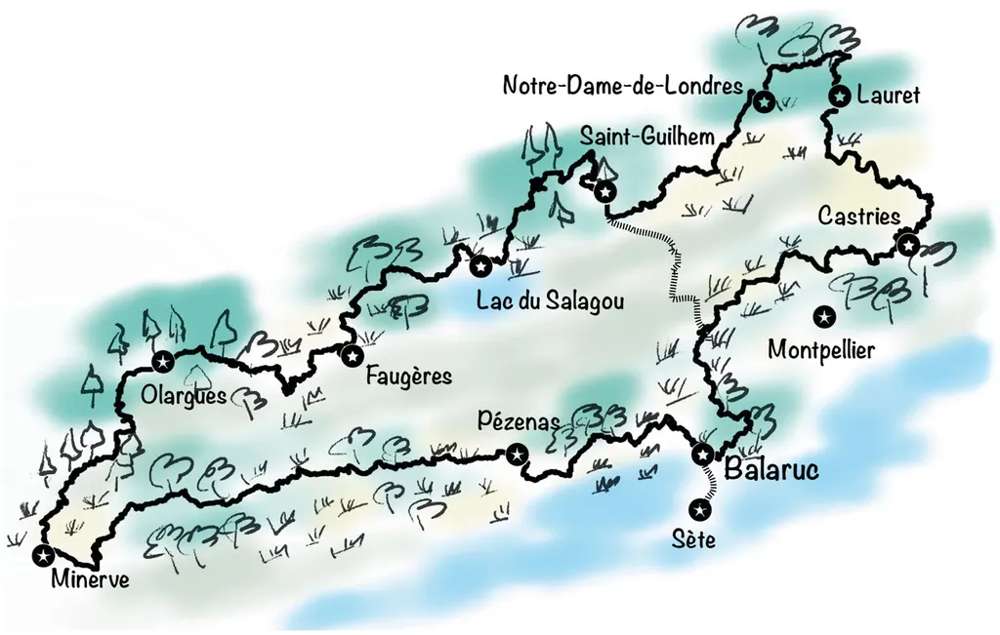

# Manifeste pour un bikepacking ouvert et roots

Quand j’ai publié la carte du [i727](https://tcrouzet.com/i727) pour annoncer notre virée du [1 au 5 avril 2022](https://www.facebook.com/events/410002283844207/), un commentateur a remarqué que son côté dessiné correspondait à l’esprit roots dont je me revendique.

Je n’y avais pas pensé, mais cette remarque m’a donné envie de parler de cet état d’esprit, partagé par exemple par Ernesto Pastor, le créateur des [Montañas Vacías](https://montanasvacias.com/), dont la carte a inspiré celle que j’ai gribouillée en cinq minutes.

### Ouvert

Dans le monde du logiciel libre et open source, les codes sont distribués gratuitement, peuvent être modifiés librement, intégrés à d’autres codes, à condition que leur licence initiale se propage par transitivité. Il y a l’idée qu’un code est un objet culturel et que l’accès à la culture ne doit pas être restreint, sans pour autant renoncer à la notion de paternité des œuvres ou de droits d’auteur.

J’ai longtemps milité pour le libre, j’ai publié de nombreux livres sous licence libre, parfois même renonçant à toute forme de royalties comme avec *[Le Geste qui sauve](../../comments/page/le-geste-qui-sauve.md)*. Il m’est tout de suite apparu évident que mon implication dans le monde du vélo ne pouvait s’effectuer que dans les mêmes conditions.

J’ai été heureux de découvrir que de nombreux traceurs travaillaient dans cet état d’esprit, désireux avant tout de partager leur passion pour un territoire et pour un art de vivre à vélo.

D’un point de vue logique, et même juridique, toutes les traces devraient se revendiquer open source, car toutes reposent sur des bouts de code préexistant, souvent déjà cartographiés, ou alors préalablement partagés par d’autres traceurs. La transitivité propre aux licences libres devrait alors s’appliquer aux traces qui les interconnectent. Quand on mixe des biens communs ont ne peut aboutir qu’à un nouveau bien commun (malheureusement la tentation est grande de déroger à cette règle — par exemple, Apple s’est appuyé sur l’Unix de Berkeley pour créer MacOs).

Un logiciel open source est libre d’usage, mais aussi gratuit, ce qui n’empêche pas de rémunérer le développeur par dons ou en monnayant ses services. La gratuité est la condition nécessaire de l’ouverture et de l’accès pour tous. Voilà pourquoi nous sommes nombreux à partager gratuitement nos traces, même si leur création nous demande un nombre incalculable d’heures sur nos écrans et nos vélos.

Nos choix sont évidemment politiques. Dans une époque où la tentation de se barricader est grande, où il faut payer des droits d’entrer pour tout, où toutes les activités deviennent marchandises et nous avec, nous choisissons d’offrir nos créations pour nous opposer au tout payant, surtout aux biens qui pourraient selon nous rester gratuits, sinon pourquoi ne pas finir par faire payer l’air que nous respirons.

Pour ma part, j’ai encore l’espoir que le bikepacking serve d’atelier pour expérimenter une autre forme d’entraide. J’imagine mes traces comme des biens communs.

### Roots

Dans « roots », j’entends artisanal, simple, brut, presque fruste, avec l’idée d’un retour à la terre, au propre (routes défoncées, pistes, chemins, singles…) et au figuré (retour à la nature, aux racines du vélo et du bikepacking tel qu’il a été inventé dès la fin du dix-neuvième siècle quand les routes asphaltées n’existaient pas encore).

Un évènement roots est auto-organisé : des copains et des copines se donnent rendez-vous à une date et se retrouvent pour un trip non compétitif (même s’il peut rester sportif, exigeant et entraîner une forme de dépassement de soi).

Ils voyagent en respectant l’environnement, en évitant les propriétés affichées comme privées, en étant responsables.

Ils n’ont pas besoin de traqueur GPS pour être localisés, leur nombre n’est pas limité, leurs intentions sont pacifiques, puisqu’ils ne veulent pas en découdre les uns avec les autres, mais vivre l’histoire que leur raconte la trace, en profitant des paysages et de la richesse culturelle des lieux traversés, sans date butoir ou autre couperet horaire.

La volonté d’être roots ne suffit pas à mettre de côté les contraintes sociétales. Dès qu’un groupe s’étoffe avant un départ, il vaut mieux prendre une assurance de groupe, pour que l’initiateur de l’évènement ne risque pas d’être poursuivi en cas d’accident (plus par l’assurance individuelle de l’accidenté que par l’accidenté lui-même).

Pour le reste, les coûts sont minimisés. Si nous transportons des sacs sur nos vélos, ce n’est pas pour dormir à l’hôtel, mais pour rester au plus près de la nature, dans l’esprit roots. Nous tentons de bivouaquer autant que possible, dans des campings, voire de préférence dans des coins retirés, loin des routes et des agglomérations, et le matin nous reprenons notre périple sans laisser la moindre trace de notre passage.

Un itinéraire roots reste roots. Son créateur ou ses créateurs ne peuvent en garantir l’intégrité tout au long de l’année et dans le temps. Par principe, quand on quitte l’asphalte, on se rapproche de la nature qui peut très vite se refermer sur des singles. La maintenance de la trace et son amélioration implique la coopération de tous ceux qui l’empruntent.

Le roots accepte une forme d’incertitude là où les évènements payants se veulent souvent rassurants, garantissant la roulabilité de leurs itinéraires et vendant la promesse aux participants de ne pas s’élancer seuls, tentant ainsi de chatouiller notre grégarisme congénital. Mais si les réseaux sociaux sont souvent toxiques, ils nous permettent aussi de dépasser ces craintes éventuelles et de nous regrouper, et en particulier de monter des projets roots.

### Bikepacking Roots France

J’ai évoqué l’idée de [créer une association elle-même roots qui aurait pour objet de promouvoir un bikepacking ouvert et roots](../1/backpacking-roots-france.md), nous nous sommes rassemblés dans [un groupe pour discuter de l’idée](https://www.facebook.com/groups/bikepackingrootsfrance/), nous avons même organisé un tchat vidéo et nous en sommes restés là pour le moment, sans doute parce qu’une telle entreprise ne peut fonctionner que si un noyau dur de trois ou quatre personnes se retrousse les manches.

Pour ma part, j’ai travaillé à peaufiner mes traces [Côte Sud](https://www.utagawavtt.com/randonnee-vtt-gps/De-Cerbere-a-Sete-36008), puis [Gravel Terres rouges](/page/gravel-terres-rouges), puis [i727](https://727bikepacking.fr/i727) et j’ai roulé. Je me dis que le préalable à la création d’une association est de s’entendre sur un manifeste, d’où ce texte. En organisant, un évènement i727 pour début avril 2022, après trois 727 en 2021, je mets en œuvre ce que j’ai dans la tête. Une association n’a une raison d’être que si nous sommes nombreux à créer de tels évènements, au moins aussi nombreux que ceux qui créent des évènements payants et fermés, ce qui est malheureusement loin d’être le cas en France.

Nous assistons plutôt à la surenchère de celui qui proposera l’épreuve la plus onéreuse, avec le plus de sponsors et le plus de dénivelé positif dans le moins de kilomètres possible. Avant même la compétition promise sur le vélo, la compétition commence par une bataille de chiffres.

Vous connaissez peut-être l’histoire de la crèche israélienne. Comme les parents arrivaient souvent en retard, une amende leur a été infligés. Alors les parents ont payé et n’ont plus respecté le moindre horaire. Payer, c’est en quelque sorte se donner le droit de ne pas être satisfait ou de n’en faire qu’à sa tête, quand la gratuité implique de donner de sa personne et de s’inscrire dans une communauté. Oui, payer c’est simple, c’est même pour ça que les transactions monétaires ont été inventées, pour faciliter les échanges, mais ce modèle n’est pas une fatalité et n’a pas que des avantages, car mécaniquement il entraîne la compétition, un besoin de réussite absolu, la nécessité de multiplier les coups de pub et d’entraîner des dépenses inutiles que finalement le bikepackers paye de sa poche.

En complément de cette approche, un bikepacking ouvert et roots aspire à la sobriété. Avant de créer une association pour le promouvoir, nous pouvons créer des évènements et démontrer qu’un autre bikepacking est possible, avec des itinéraires léchés et passionnants.

*PS : En France, le bikepacking ouvert et roots est-il à la traîne parce que l’État promeut d’habitude les activités gratuites ?*

#bikepacking #velo #y2022 #2022-3-12-17h12
