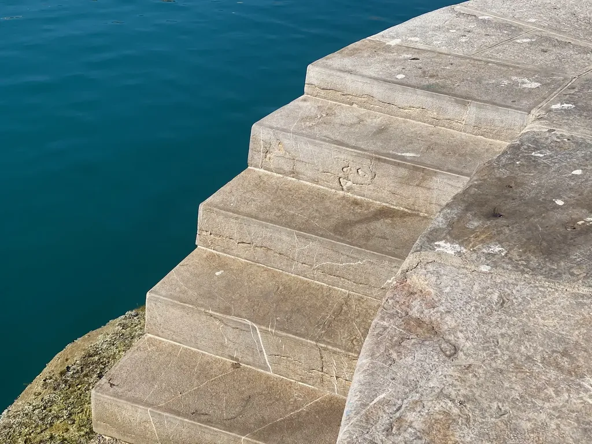

# Tentative d’épuisement d’un lieu sétois

Il y a au bout du quai Aspirant Herber, face à la criée, une pointe qui sépare les ports de pêche et de plaisance du port de commerce. Je me pose à cette extrémité, en haut des marches qui plongent dans l’eau, et déjà un pêcheur à la ligne arrive et se tient debout à côté de moi, les deux pieds à cheval sur le vide, comme s’il pissait, sa ligne d’un jet flasque tendue vers le bleu.

Il est treize heures, la ville somnole sous un doux soleil printanier. De l’autre côté du canal Royal, aucun bruit ne provient de la criée, qui ne s’éveillera que plus tard quand les gros chalutiers rentreront. Les thoniers sont restés accolés les uns aux autres, dans l’attente de l’ouverture de leur saison.

Des empilements de filets saupoudrent le quai au sol concave, aux pavés creusés. Un promeneur s’approche, jeune, chic, avec des chaussures de cuir souple, un simple chandail gris. Il frôle le pêcheur et s’en retourne. Sur un banc entre les filets, un homme et une femme, trop chaudement habillés, mangent un sandwich.

Pas de vent dans la darse, il souffle de l’est et ne fait que caresser le bassin où un goéland hurle et où s’avance, venant de la ville, un chalutier trimaran. Au bastingage, une affiche fait de la pub pour la conserverie Ligne de Mer. Les remous baignent les premières marches de l’escalier.

Quand j’écris dehors, j’attends une prise, comme le pêcheur. Son téléphone sonne, il discute avec une femme, qui l’attend pour déjeuner. Une famille déroule une couverture bleu gris au bord du quai. Jambes pendantes au-dessus de l’eau, ils commencent à piqueniquer. Un pigeon les a déjà repérés.

Je me suis installé à ce bout de la ville parce l’étang de Thau s’y termine et que la mer y commence. Je me tiens à un poste-frontière, entre mon monde et l’infini, encore chez moi et déjà à l’étranger.

Épuiser un lieu par l’écriture comme le faisait Perec, c’est aussi épuiser le narrateur, entrer en lui, parce qu’il fait partie du lieu et que de toute façon il ne peut traduire que ce qui le traverse. Nous serions plusieurs écrivains et nous écririons des textes différents, certains faisant référence aux autres écrivains et d’autres les ignorant.

J’ai choisi d’écrire sur mon téléphone, avec un clavier pliable peu confortable. Je rêve parfois de revenir au carnet, mais je n’ai plus les muscles de l’écriture manuscrite. La ville ronronne et moi avec elle, et avec quelques moteurs de plus en plus sourds.

En face de moi, un ponton flottant délimite le port de plaisance, bourré de voiliers et de petits bateaux de pêche. Il s’est agrandi démesurément depuis ma jeunesse, ne laissant plus qu’une étroite passe aux chalutiers.

Un second trimaran appareille et secoue l’eau jusqu’à la vase, ce qui explique la laitance de l’eau et sa teinte bleu baignoire oasis.

Le môle cache la mer qu’aperçoivent les maisons étagées sur les pentes du mont Saint Clair, avec au-dessus l’arrogant fort militaire dominé par ses paraboles, puis la pinède ponctuée de villas.

Dans la criée subsiste un ronflement, sans doute le compresseur d’une chambre froide. Une moto impose son rythme avant de se taire. Des goélands se disputent, une sterne passe avec élégance, quelques mouettes jacassent, aucune nécessité ne les oblige, sinon des désirs obscurs, alors elles s’envolent, dessinent de grandes spirales dans le ciel avant de revenir se poser, le plus souvent sur les pontons du port de plaisance.

Des voitures font demi-tour au bout du quai, à la recherche d’une place de stationnement ou parce que des touristes ne daignent pas mettre pieds à terre. D’autres, de plus en plus nombreuses, défilent au-delà de la criée, sur la rue qui mène au théâtre de la mer, puis aux plages.

Une partie du bout du quai m’est interdite par un portail qui s’ouvre le temps de laisser passer une camionnette. Un panneau indique « pôle de dragage ». Une dragueuse peinte de bleu marine et de bleu ciel pèse dans l’eau. Elle me paraît lourde, puissante, je l’imagine capable de rugir.

De petits bateaux de pêche appareillent, avec quatre hommes d’équipage. Ils ne rentreront au port que tard dans la nuit, voire au petit matin. Les ombres des goélands en vol plané filent sur les toits de tuiles rouges. Le rouge et le bleu dominent, quelques éclats de blanc, sous les verts presque noirs des pins au sommet du mont.

Je ne suis pas en train d’épuiser un lieu, à force de le décrire, mais une heure dans ce lieu, qui se transforme au fil du temps. Et il s’agit bien d’une tentative, car l’épuisement est impossible, même à l’aide de la photographie ou de tout autre moyen d’enregistrement. Perec aurait photographié, filmé, enregistré, il aurait utilisé toutes les technologies à sa disposition, mais je me restreins, parce que je recherche l’effet en moi de cette écriture du lieu dans le temps. La trace que je laisse et que je partage n’est que l’image d’un moment de méditation.

— Ça va ?

Je lève la tête. Mon copain Gilbert me fait signe depuis son chalutier qui prend le large, suivi de plusieurs autres, en même temps un chien me renifle les fesses et le clavier, posé à même le quai, alors que je suis accoudé sur le bras gauche, de manière inconfortable, mais cet inconfort aussi caractérise l’exercice.

J’aime écrire dehors, mieux désormais que dans les cafés, peut-être parce qu’ils ont changés, la plupart transformés en restaurant, surtout entre midi et deux. Les cloches de l’église Saint-Louis sonnent quatorze heures, j’ai écrit durant une heure, sans en saisir le mystère, sinon celui de vivre et me de sentir actif dans cette vie.

*PS : Texte écrit pour célébrer les 40 ans de la mort de Perec. J’avais célébré les 10 ans par une tentative d’épuiser une journée. Les années passent, mais certains passions ne prennent pas une ride.*

#vagabondage #y2022 #2022-3-3-19h48
