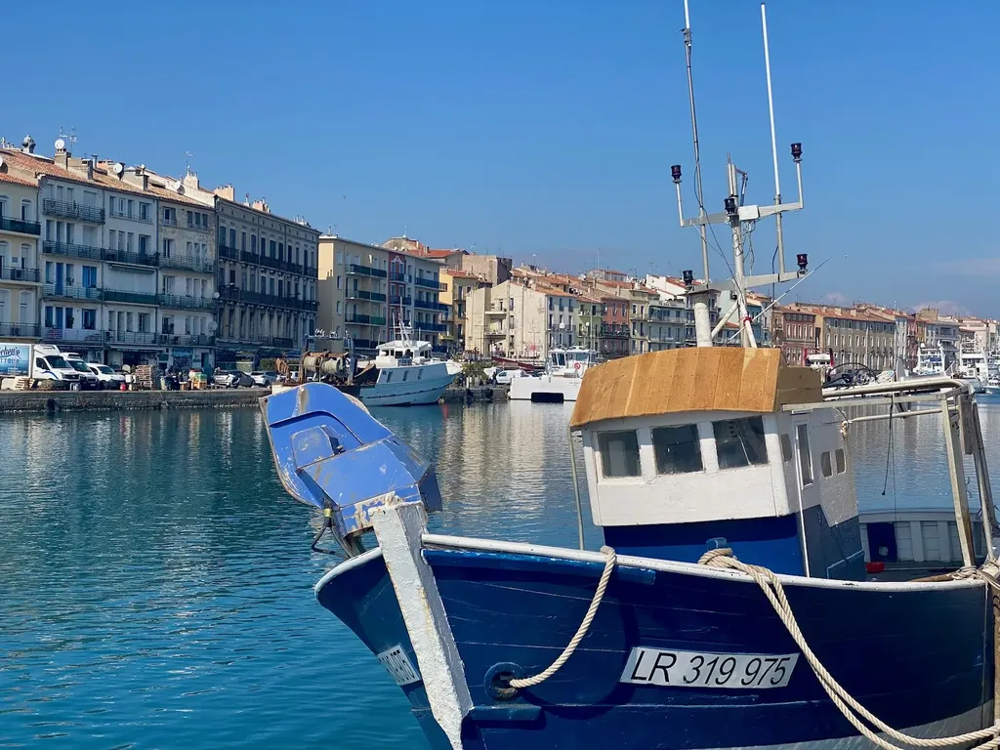
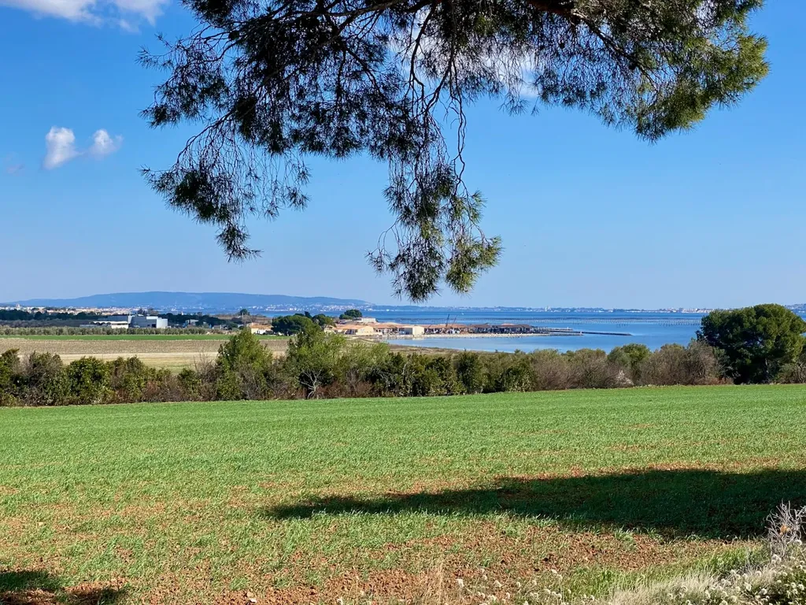
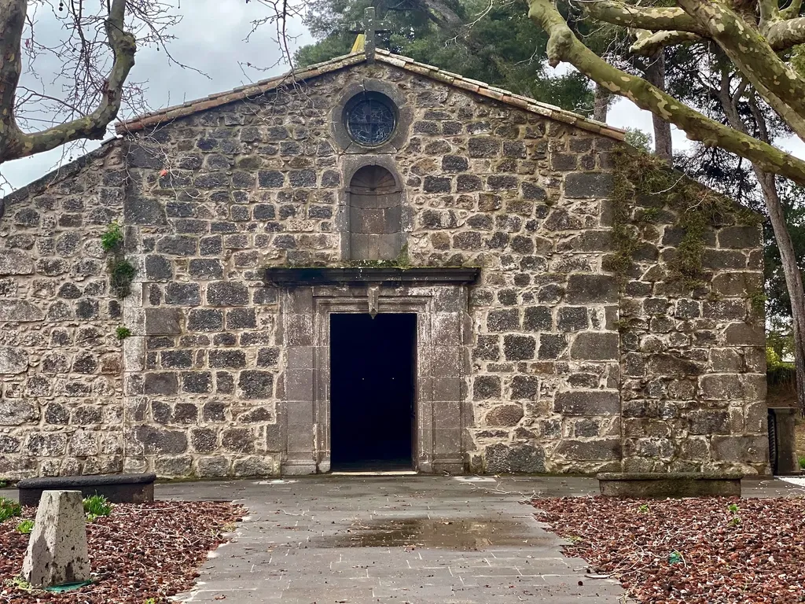
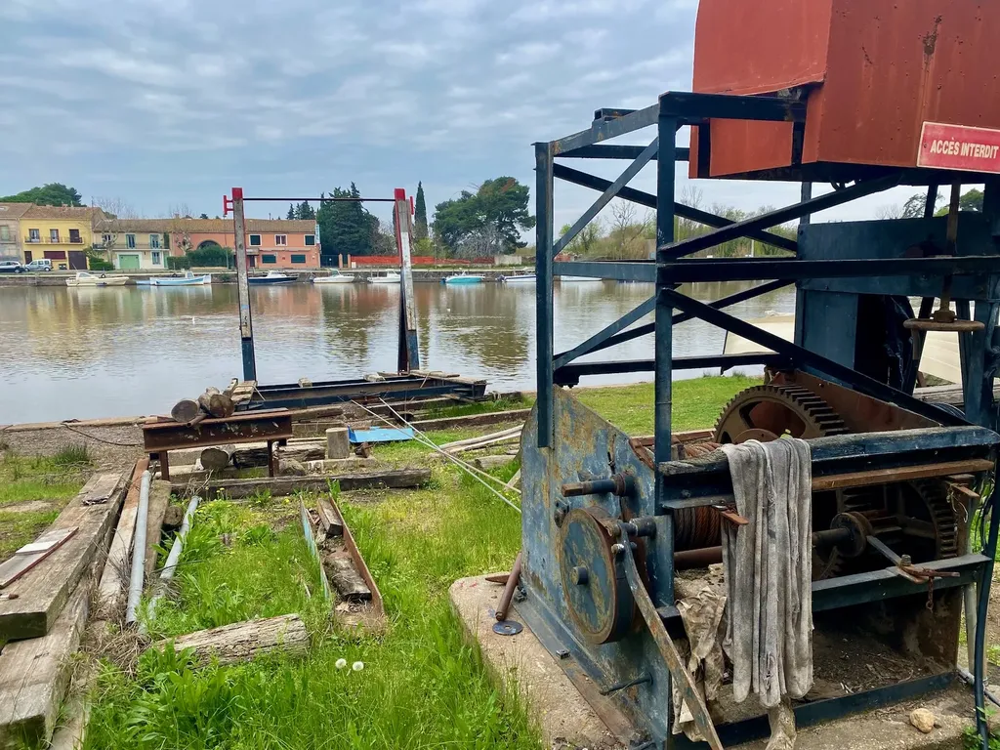
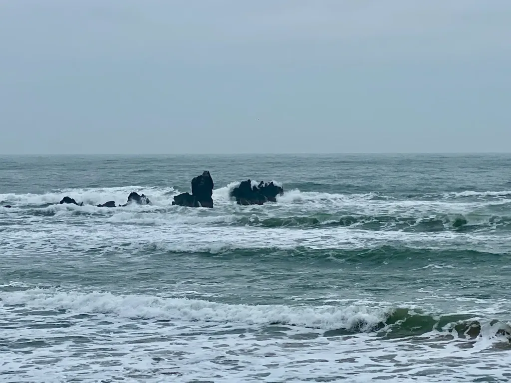
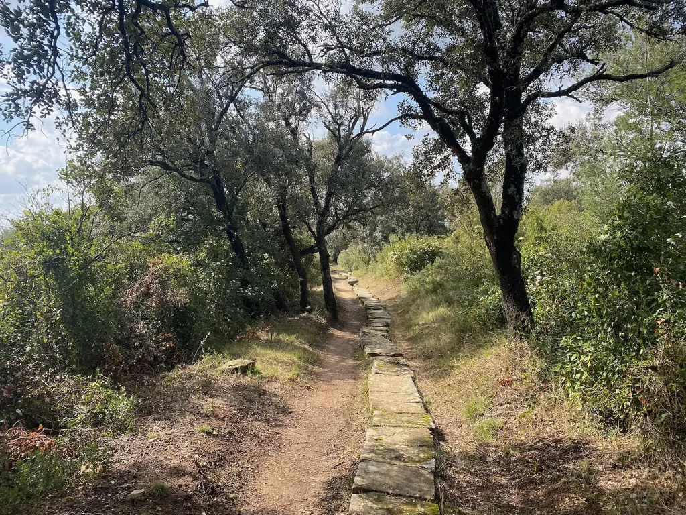

# Mars 2022

### Mardi 1er, Balaruc

Dans *L’Anomalie*, Hervé Le Tellier s’interroge ? « Trois personnages, sept, vingt ? Combien de récits simultanés un lecteur consentirait-il à suivre ? » Avec *One Minute*, j’ai voulu répondre trois cent quatre-vingts. Je vois quelques similitudes entre les deux romans, mais je n’ai pas eu le Goncourt ni des centaines de milliers de lecteurs. La version papier arrive bientôt, sept ans après la publication en feuilleton en 2015, et je n’attends rien d’elle, je sais par avance qu’il ne se passera rien. Je suis victime d’un fatalisme éditorial. J’ai trop attendu de la publication de mes livres et j’en ai trop vu sortir sans qu’il ne se passe rien. Un non-événement, même dans les cercles les plus discrets et infimes dans les replis d’internet.

### Mercredi 2, Balaruc

Dans mon journal de février, j’ai beaucoup écrit au passé parce que je me souviens. Un symptôme de l’âge.

---

Je consacre tant d’heures à lire sur la guerre en Ukraine que je me dis que je devrais tenir un journal de guerre, comment je la vis à deux mille kilomètres du front. Il m’est difficile de penser à autre chose, d’écrire autre chose, comme durant la crise covid. Quand l’Histoire s’impose, je ressens l’urgence de m’en saisir sur le vif, non pas comme un érudit, mais comme une éponge émotionnelle. Mais je résiste, et il est déjà trop tard.

### Jeudi 3, Balaruc

[J’écris en mémoire de Perec](../3/tentative-depuisement-dun-lieu-setois.md). Je lui dois beaucoup, peut-être trop.

### Vendredi 4, Balaruc

Virginia Woolf attribue une fonction aux livres beaucoup lus au moment de leur publication, puis que plus personne ne lit. C’est souvent le cas des roman populaire. Quel rôle ? Peut-être de raconter la mythologie de notre temps avec les mots de notre temps, ce qui leur interdit toute postérité, mais les rend présentement plus accessibles que les textes qui recherchent une postérité, et qui le plus souvent ne la trouvent pas.

Depuis quelques jours, j’ai attaqué le classique *The Power of Myth* de Joseph Campbell, voilà vers où penche le nouveau livre sur mon père, sur la fin des mythes que lui a connus sans que nous en invention de nouveaux. Ils me manquent, il me semble que la vie était plus vaste avec eux. Je navigue sur des intuitions, tout en ressentant la nécessité de gratter mon passé en même temps que le passé collectif.

« Greek and Latin and biblical literature used to be part of everyone’s education. Now, when these were dropped, a whole tradition of Occidental mythological information was lost. It used to be that these stories were in the minds of people. When the story is in your mind, then you see its relevance to something happening in your own life. It gives you perspective on what’s happening to you. With the loss of that, we’ve really lost something because we don’t have a comparable literature to take its place. These bits of information from ancient times, which have to do with the themes that have supported human life, built civilizations, and informed religions over the millennia, have to do with deep inner problems, inner mysteries, inner thresholds of passage, and if you don’t know what the guide-signs are along the way, you have to work it out yourself. »

Je veux écrire un roman sur cette perte, sur le fait que les histoires n’ont pas été transmises de mon père à moi, encore moins de moi à mes enfants, parce que je n’en connais que des bribes inutiles. « We tell stories to try to come to terms with the world, to harmonize our lives with reality. » Nous autres écrivains avons pour mission de réinventer des histoires.

### Samedi 5, Balaruc

### Dimanche 6, Balaruc

Je suis avec d’autres membres de ma famille et des inconnus, c’est la guerre, nous débarquons d’un train qui roulait sur un viaduc, nous nous retrouvons sous les armatures, nous déplaçons vers une rivière profonde, nous rampons sur le fête d’un mur, de plus plus en plus haut, nos jambes et bras ballants de chaque côté. Nous arrivons à un angle du mur, mais à ce coin arrive un pilier beaucoup plus haut. Nous faut réussir à franchir l’angle. La personne devant moi, peut-être mon père, réussit à passer, il est sauvé, parce qu’après c’est plus simple, mais j’étais distrait par la peur terrifiante, et je n’ai pas vu comment il avait fait pour franchir l’angle. Je ne vois aucun moyen, à part de me mettre debout, sur le mur de plus en plus étroit comme s’il s’amenuisait en même temps que je tergiversais. Je me réveille persuadé d’avoir déjà vécu un rêve semblable. J’ai le ventre lourd. Nous avons mangé hier soir chez des amis, j’ai grignoté, mais trop. La digestion m’envoie souvent ce genre de message désagréable. 4h20 du matin.

---

Joseph Campbell se propose d’étudier les similitudes entre les mythes, mais de laisser de côté leurs différences, tant il est persuadé de l’existence d’archétypes. Cette approche structuraliste m’a toujours laissé sceptique. Des hommes naissent, grandissent, vieillissent, puis meurent. Regardées à ce niveau, leurs histoires sont semblables, pourtant l’un meurt de vieillesse, un autre d’un accident, un autre est assassiné. Trois histoires différentes. S’intéresser qu’aux similitudes fait passer à côté des destins singuliers. Mais peut-être que se focaliser sur les points d’intersection entre toutes les histoires donne l’illusion de tendre vers l’universel.

### Lundi 7, Balaruc

Dans *Le héros aux mille et un visages*, Campbell cite le rêve d’une femme qui dit : « Je me promenais seule, dans les faubourgs d’une grande ville, par des rues misérables et boueuses, bordées de petites maisons tristes. » J’ai relu dix fois cette phrase parce qu’elle a raisonné puissamment en moi. Ces quelques mots parfaitement balancés, et le rythme n’y est pas étrange, mon plongé ailleurs.

---

J’écris peu, mais je me documente, le livre sur mon père se densifie, je gratte, plutôt que de foncer. Il ne s’agit plus de beaucoup écrire, mais d’écrire pour toucher à quelque chose que je ne connais pas.

### Mercredi 9, Balaruc

Dans *Le guide du scénariste*, inspiré de Campbell, je lis : « C’est amusant de conduire une voiture, mais c’est aussi excitant de se laisser conduire. En tant que passagers, nous profitons plus du paysage que si nous étions forcés de nous concentrer en choisissant ce qui va ensuite se passer. » Je ne suis pas d’accord. Quand je conduis, cherche mon chemin, je me souviens bien mieux de la route que si je suis passager. À vélo, je m’imprègne beaucoup plus des paysages quand je guide que quand je suis guidé. Conduire me procure plus de sensation qu’être conduit. Alors, oui, de temps en temps, le soir, quand je suis fatigué, j’accepte de m’abandonner à quelques fictions agréables, mais le reste du temps je préfère prendre le volant. J’écris pour les conducteurs.

### Dimanche 13, Balaruc

### Lundi 14, Balaruc

### Mercredi 16, Balaruc

J’écris d’après mon père, contre lui et avec lui, et le sujet se généralise, ce roman a pour thème la fiction dans la vie. D’habitude, j’écris d’un jet, puis reprends. Cette fois, j’ai un énorme bloc de marbre sculpté des pieds au nombril, avec juste une esquisse pour le buste et la tête, et je ne cesse de travailler aux détails des pieds et des jambes. Travail passionnant, avec beaucoup de lectures théoriques et formelles, pour que la forme réponde au fond, sans que cela soit perceptible.

---

Sur un coup de tête, malgré la grisaille, Gilbert et moi partons explorer l’ouest du département. Verdure éclaboussante sous une humidité galopante, plaques de calcaire transformées en patinoires, chemins noyés, mais du bonheur dans la solitude naturelle.

### Vendredi 18, Balaruc

Je suis dans mon roman, la nuit, le jour, quand je marche ou pédale. Les briques se mettent en place d’elles-mêmes et des ramifications imprévues jaillissent sans cesse. J’aime cet état qui me laisse peu de place pour d’autres écritures.

### Samedi 19, Balaruc

Virginia : « L’équilibre entre la fantaisie et la réalité doit être prudent. » Nouvelle phrase que je pourrais placer en exergue de mon roman en cours. Je l’appelle *Délit de vérité*, un titre trop sérieux, mais qui dit ce que j’ai à dire.

---

J’ai découvert que je pouvais diriger mon cerveau, le programmer pour une tâche, pour qu’il s’y adonne et finisse par engendrer de la matière spontanément, même si parfois il faut des semaines pour que le processus se mette en route. Virginia fait le même constat. Il s’agit donc d’un fonctionnement universel, qui exige une confiance sans faille en son instrument.

---

Depuis une dizaine de jours, nous n’avons pas vu le soleil. Nous le sentons au-dessus de la fine couche nuageuse. Il a plu, mais seulement le week-end dernier. Je préfère encore la pluie à cette camisole grise qui me donne l’impression que le reste de l’univers a disparu. Je me demande comment j’ai fait pour survivre à Paris et à Londres.

---

Un souvenir me revient, quand nous jouions au *martelet*. Nous tapions à toutes les portes d’une rue et nous enfuyons en riant. Parfois nous entrions dans des immeubles, c’était plus effrayant, comme si nous affrontions des montres. Depuis quand les enfants ont-ils perdu cette habitude ? Peut-être depuis que les gens sont si tendus qu’ils sont capables de leur tirer dessus.

### Dimanche 20, Balaruc

Virginia : « La seule vie qui soit passionnante est la vie imaginaire. » Elle aimait se perdre en elle, et j’aime explorer le monde. Le romanesque a pour fonction de me pousser à explorer. J’écris des romans pour pousser à l’exploration. Nous avons besoin de romanesque pour vivre de nouvelles histoires.

---

[Michel Eltchaninoff](https://www.telerama.fr/debats-reportages/avec-sa-voie-russe-poutine-prepare-un-monde-post-occidental-7009413.php) : « Quand Jean-Luc Godard était venu en Russie au début des années 1990, il avait eu cette formule : « La Russie est le dernier pays de la fiction », le pays où on se met à croire aux histoires que l’on raconte. » Voilà qui résume le sujet de mon roman. Parce que mon père a cru toute sa vie à la fiction, mais nous avons cessé d’y croire, et au passage nous avons perdu quelque chose. Est-ce le prix à payer pour vivre en paix ?

### Mardi 22, Balaruc

Je lis peu les vivants. Je préfère les morts qui ont survécu. Je perds moins de temps avec eux. Mais parfois je me laisse séduire par les sirènes contemporaines. [Jérôme Leroy](https://fr.wikipedia.org/wiki/J%C3%A9r%C3%B4me_Leroy_(%C3%A9crivain)), par exemple, peut-être parce que j’aime l’homme, sa gentillesse, sa culture, ses anecdotes, son style aussi, surtout, minimaliste sans être sec, en digne successeur de Manchette. J’avais lu *Le Bloc*, une plongée dans l’extrême droite, son nouveau roman, *Les derniers jours des fauves*, m’a fait toucher du doigt les psychopathes au pouvoir, de tous bords, obsédés par eux-mêmes et leur propre réussite plus que par des idées politiques. Une immersion dans des cerveaux malades. Dès les premières lignes, le ton est donné : la Présidente baise et en même temps se remémore son parcours politique. Invraisemblable ? Pour un humain sain d’esprit oui, mais pas pour ce genre d’animal politique. Alors on saute à un autre, tout aussi dingue, et on se dit que même le plus normal finira par succomber, parce que sa présence dans le jeu le qualifie comme psychopathe. *Les derniers jours des fauves* est un roman sur la psychologie du pouvoir, sur ce qu’il faut d’inhumanité pour briguer le pouvoir. C’est aussi une fiction palpitante qui donne à voir ces cerveaux déviants au travail et se corrompre les uns les autres pour que finalement leur intelligence incontestable se heurte au principe de complexité, à l’ingouvernabilité des sociétés modernes, sauf à la réprimer par la force pour tenter de les simplifier et de les reprendre en main. Jérôme montre à quel point nos libertés sont en danger tant que nous continuerons à vivre sous le joug des structures pyramidales, avec des chefs élus ou pas, que le pouvoir peut à tout moment enivrer. Un roman comme une démonstration d’une impossibilité politique dont plus personne ne doute. Nous avons beaucoup écrit sur cette impossibilité et elle ne cesse de se répéter, comme s’il n’y avait pas d’autres solutions. Alors les guerres intérieures et extérieures se perpétueront. Je me suis évertué durant des années à réfléchir à d’autres modèles, à publier des livres, des articles, mais en tant qu’espèce nous n’en voulons pas, comme si nous étions condamnés au tragique. Pour ma part, je suis aussi couillon que les psychopathes politiques : la complexité de notre connerie m’a terrassé. Dans quelques semaines, nous retournerons voter pour éviter le pire, et ce sera déjà catastrophique.

### Mercredi 23, Balaruc

Une fois de plus, je viens de constater que les géants du Net tentent de nous enfermer dans leurs solutions et de nous racketter . Un service gratuit depuis des lustres devient soudain payant, et pas à moindre prix, et j’ai dû trouver une solution de substitution, ce qui m’a pris beaucoup de temps, et ne s’est pas avéré d’une simplicité extrême, tant il a était difficile de trouver les informations adéquates.

Depuis des années, je possède deux noms de domaine, tcrouzet.com et icrouzet.com, un pour moi un autre pour Isa. J’ai aussi un serveur dédié, dont la location est pour moi la garantie d’une forme d’indépendance, en échange d’un abonnement annuel (je pourrais à la limite l’héberger chez moi maintenant que nous avons la fibre, mais je doute que ce soit économique).

En 2008, j’ai décidé de ne plus héberger moi-même mon serveur de mail qui croulait sous les spams quand ce n’était pas contre les attaques. J’ai profité d’une offre gratuite, G-Suite, qui me permettait de gérer la partie mail de mon domaine chez Google. En fait, je routais, mais mail au niveau DNS vers Gmail, donc sous le couvert de mon domaine.

[Ce service a été officiellement interrompu en 2012](https://support.google.com/a/answer/60217#faq), en fait pour devenir payant, mais continuait à être gratuit pour les abonnées historiques, sauf que cette fleur cesse à partir de juillet prochain. Pour continuer à posséder un mail à son nom sur Gmail, et non plus une adresse du type tcrouzet@gmail.com, il faut payer par moins 6 €HT/mois. Comme entre Isa, les enfants et moi nous utilisons une dizaine de mails, la facture serait devenue pour le moins excessive.

J’ai donc migré nos mails vers des comptes Gmail classiques. En théorie ça devait être simple, mais non en fin de compte. Il faut désactiver des systèmes de sécurité, réussir la connexion d’un compte Gmail sur un compte G-Suite avec domaine, puis aspirer les anciens messages en POP, ce qui au passage fait perdre les labels et les statuts qui leur sont associés (l’autre solution aurait été de tout télécharger en local à l’aide d’une messagerie, mais trop tard j’ai utilisé la technique POP).

Au cours de cette opération, j’ai découvert que Gmail par défaut ne supprimait aucun mail, même les spams. Voilà pourquoi la taille de nos boîtes ne cesse d’enfler. Une façon astucieuse de nous pousser à payer pour une extension de nos disques cloud. Bien sûr, une fois informé de ce travers, on peut le contourner (et ce n’est pas simple encore une fois). Mais impossible pour moi de repasser les 90 000 mails téléchargés pour retrouver ceux qu’au fil des années j’ai déjà supprimés et qui désormais se retrouvent dans ma nouvelle boîte aux lettres.

Les choses ont aussi été compliquées pour transférer nos Google Drive entre la version G-Suite et la version gratuite. Tout va très bien avec les fichiers standard, mais pas avec les documents cloud, dont il est impossible de transférer la propriété à un utilisateur extérieur à un domaine. C’est comme si on vous interdisait d’ouvrir votre maison à un étranger. La sécurité a parfois bon dos. Pas d’autre solution que de copier ces fichiers, et donc de perdre leur identifiant unique (ce qui cassera tous les articles où je pointe vers ce type de fichier).

Pour que je sois toujours accessible avec mon mail historique et réponde sous son couvert, j’utilise désormais un service de redirection de mails au niveau DNS. Mais gratuit jusqu’à quand ? Cette mésaventure ne me dit rien de bon. Internet devait être ouvert, transparent, mais un déplorable travers humain tente de nous transformer en esclaves.

En bon adepte du libre, je devrais cesser d’utiliser Gmail, mais à ce jour je n’ai découvert aucune autre solution qui filtre les spams de manière aussi efficace, offrant un protocole IMAP transparent sur tous mes appareils. De même je suis accro à Google Map, Doc et consorts. Au non de la facilité, je m’enchaîne à Google. Je suis un peu comme ceux qui au sujet du réchauffement climatique attendent que les autres agissent.

Je vois un lien entre cet enchaînement à Google et la guerre en Ukraine. Une fois enchaîné à la Russie, on a du mal à la boycotter, parce qu’alors on se fait mal à soi-même. L’interdépendance, créatrice de liens qui libèrent, implique une sorte de permissivité éthique. Nous devrions tous nous efforcer de réduire nos liens de dépendance. Ce serait bon pour la paix, pour le climat, sans doute pour notre bonheur aussi.

### Vendredi 25, Balaruc

Cadeau symbolique pour les dix-sept ans de Tim : un compte en banque et une carte de crédit. Je suis tout heureux, ému. Et le soir, après une belle après-midi vélo, une vague d’angoisse me rattrape : ma carrière littéraire est en pièces dans un monde en pièces.

### Samedi 26, Balaruc

Virginia : « Je vais écrire ces lignes pour mon plaisir personnel. Mais cette phrase m’arrête. Car si l’on n’écrit que pour son propre plaisir, je me demande ce qui en résulte. Je suppose que le plaisir d’écrire est détruit et qu’on finit par ne plus écrire du tout. »

Je n’écris ni pour me faire du bien, ni pour moi. J’écris pour me battre avec le monde, tenter de m’en dépêtrer, nouer des liens sociaux dont je suis par ailleurs incapable et faire jaillir de la beauté malgré tout.

J’écris pour voir le monde, pour écarquiller les yeux sur son énormité, et dire cette énormité, qu’elle soit sublime ou horrible. Peut-être que je devrais commencer par me voir moi-même. Mais comment l’œil pourrait-il se regarder lui-même ? C’est au-delà de ses forces.

---

Je ne comprends pas les auteurs de genre. Être dans un genre n’est-ce pas faire ce que le genre veut ? Ou est-ce en accepter la contrainte et jouer avec ?

### Dimanche 27, Balaruc

Matinée à cuisiner, pour fêter Tim, après-midi à désherber la pelouse, puis à la tondre. Grande satisfaction devant le travail accompli. L’écriture est rarement autant gratifiante.

### Lundi 28, Balaruc

J’appelais mon roman en cours *Délit de vérité* et cette nuit m’est venu le plus poétique *Quelques atomes de vérité*, après avoir lu une phrase de Virginia avec « atome de vérité ».

---

Je commence ma journée à la décharge et croise l’ancien pharmacien. Nous parlons d’un ami commun dont le père perd la boule. Il me dit « Il y avait chez lui des prémices de la folie. Il racontait toujours des histoires… » Moi : « Mon père n’était pas en reste. » Lui : « Purée, oui. Mon père me disait que c’était le plus gros menteur du village, mais l’air de rien. » Voilà une scène qui finira dans *Quelques atomes de vérité*.

### Jeudi 31, Balaruc

Demain, nous partons à une quinzaine pour cinq jours de bikepacking. Temps de chien annoncé, mais ces conditions me donneront à raconter et à photographier. Je pédalerai et j’oublierai tout le reste, la guerre en Ukraine, la littérature, mon âge, je serai dans les nuages.

#carnets #y2022 #2022-4-8-18h57
