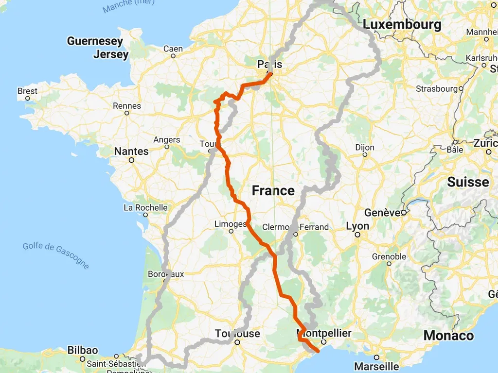
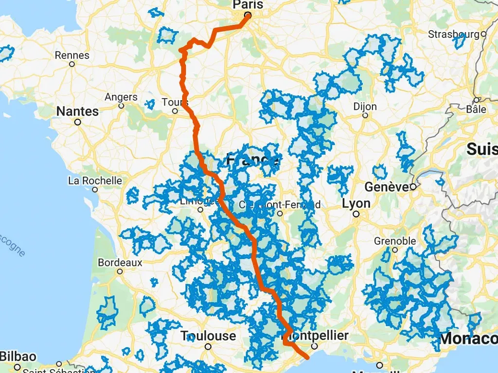

# Paris to Sète 2022, c'est parti

Après [le 727](https://tcrouzet.com/727tour) et [le i727](https://tcrouzet.com/i727), je me lance dans la création d’un Paris to Sète (P27), [qui partira le 4 juillet pour s’achever autour du 15 juillet](https://www.facebook.com/events/1126486894583418/). Contrairement aux deux autres traces, celle-ci ne reposera sur aucune reconnaissance, mais sur la compilation de traces récoltées sur le Net, entrecroisées, interconnectées, socialement renforcées par des expertises locales. Mon but reste de minimiser l’asphalte et de dénicher des singles le plus souvent possibles, tout en sachant que ce ne sera pas toujours facile. À l’issue du voyage, la trace sera révisée pour que d’autres puissent la suivre.

Au départ, je comptais tracer droit vers le sud depuis Paris pour créer une French Verticale, mais je suis vite tombé sur une zone plate et monotone entre le sud du [parc régional du Gâtinais](https://www.parcs-naturels-regionaux.fr/les-parcs/decouvrir-les-56-parcs/parc-naturel-regional-du-gatinais-francais) et [le parc régional des Volcans d’Auvergne](https://www.parcs-naturels-regionaux.fr/les-parcs/decouvrir-les-56-parcs/parc-naturel-regional-des-volcans-dauvergne), soit entre Nemours et Moulins dans l’Alliers, environ 200 km à vol d’oiseau. J’ai aussi consulté la liste [des plus beaux villages de France](https://www.les-plus-beaux-villages-de-france.org/fr/nos-villages/) et constaté qu’un seul se trouvait dans la moitié nord de cette verticale (Yèvre-le-Châtel). Par ailleurs, j’ai noté que les traces VTT et gravel étaient rares dans ces secteurs, dédiés le plus souvent à l’agriculture intensive. Assez décourageant.

Pour ne pas retomber sur la GTMC et la French Divide en tirant vers l’est, je travaille sur une trace plus à l’ouest, qui a l’avantage de traverser plusieurs parcs naturels : Haute Vallée de Chevreuse, Perche, Brenne, Millevaches, Volcans d’Auvergne, Aubrac, Grands Causses, Haut-Languedoc, sans oublier quelques châteaux de la Loire et la Creuse. Elle avoisine les 1 200 km pour 15 000 mètres de dénivelé positifs. Elle culmine au [Plomb du Cantal](https://fr.wikipedia.org/wiki/Plomb_du_Cantal), à 1 855 m. Nous y grimperons avec la télécabine depuis [Le Lioran](https://www.lelioran.com/).

Si vous êtes intéressés par le P27, [rejoignez le groupe pour en discuter](https://www.facebook.com/groups/727tour). Si vous êtes tenté pour rouler la trace, [j’ai crée un évènement sur le groupe](https://www.facebook.com/events/1126486894583418/). Retrouvez la trace [sur Google Map](https://www.google.com/maps/d/edit?mid=1aOpTpVoErEH4ktaOHay-1oC6GkurIRJO&usp=sharing) et [sur ma page dédiée](../../../../page/p27.md).

#p27 #velo #y2022 #2022-4-30-14h53
