# VisuGPX a révolutionné ma technique de traçage

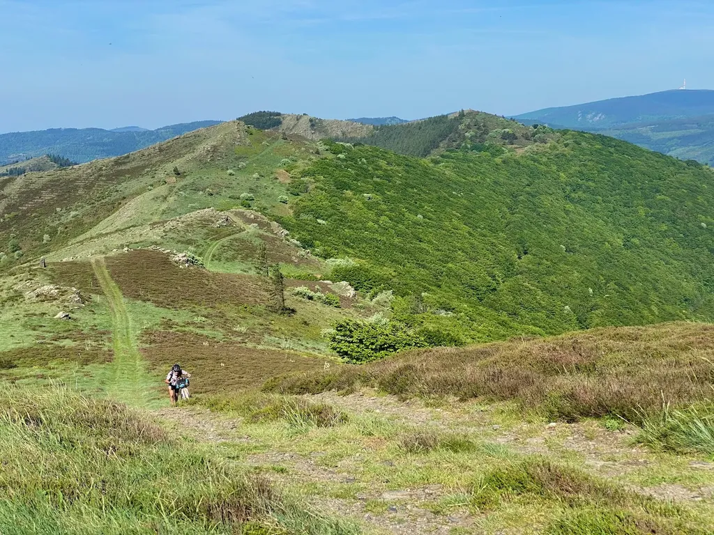

[Comme je publie souvent des traces bikepacking, gravel ou VTT](../../../../page/traces-gravel-et-vtt.md), on me demande souvent comment je trace. Quand j’explique que je le fais à la main, on me répond que c’est fastidieux. Oui, mais ainsi j’anticipe mon voyage, je le commence déjà dans ma tête, repérant des endroits où j’aimerais passer, des singles joueurs, des hauts lieux culturels et ainsi de suite. Tracer est pour moi autant un plaisir que de rouler la trace.

Une analogie. On peut photographier un paysage en un instant, vite fait, ou le dessiner durant des heures. Je photographie beaucoup, mais j’ai beaucoup dessiné, et je suis toujours sorti de mes séances de dessin avec une intense intimité du lieu (à laquelle le photographe arrive aussi à condition qu’il déambule en prenant son temps et en multipliant les prises de vues). Prendre du temps me permet de m’immerger dans un paysage, prendre du temps sur les cartes est une façon de me préparer et de provoquer une attente, un désir.

Une autre analogie. On peut décongeler une pizza puis l’avaler. On peut aussi passer la matinée à cuisiner et puis doublement se régaler durant le repas. Ma pratique du vélo suit la seconde philosophie. Je cuisine longuement ma trace pour que le repas soit le plus savoureux possible. Utiliser un robot pour construire une trace, c’est comme décongeler une pizza. Ajuster la trace créée par le robot, c’est comme arroser la pizza décongelée d’huile d’olive pimentée. On peut en renforcer le goût, mais on ne changera ni la texture de la pâte ni la qualité des ingrédients. À la décongélation, je préfère encore aller au restaurant, c’est-à-dire rouler une trace dessinée par un traceur méticuleux. Quand à improviser avec le contenu de mon frigidaire, je m’en satisfait pour mes sorties habituelles, mais pas pour mes voyages bikepacking, qui assez exceptionnels tout au long de l’année méritent que je les concocte avec soin.

En ce printemps 2022, je trace [un Paris-Sète VTT (P27)](https://www.google.com/maps/d/edit?mid=1aOpTpVoErEH4ktaOHay-1oC6GkurIRJO&usp=sharing). Voici comment je m’y prends et comment la version pro de [VisuGPX](https://www.visugpx.com/) est devenue mon couteau suisse indispensable.

### 1. L’esquisse

Dans un premier temps, c’est comme me lancer dans l’écriture d’un roman dont je n’ai qu’une idée générale, en l’occurrence du point de départ et d’arrivée, avec une infinité de trajectoires possibles. Par où partir, droit vers le sud, dévier vers l’est ou l’ouest ? Et ainsi de suite à chaque étape.

VisuGPX m’est alors déjà indispensable. Son module de création de traces propose plusieurs calques (IGN, OSM, Open Cycle, satellite…), dont HMap, autrement dit la [Heatmap Strava](https://www.strava.com/heatmap), qui me permet de savoir où mes collègues cyclistes roulent. Alors quand je repère des zones peu irriguées, de deux choses l’une, soit elles sont très peu peuplées, soit très peu intéressantes.

Pour m’en assurer, je zoome sur ces secteurs avec en fond OSM ou IGN et par-dessus la HMap. Quand je la fais disparaître et réapparaître, si je ne perçois guère de différences, cela implique qu’il n’existe pratiquement pas de secteurs VTT/gravel et que tous les cyclistes empruntent les routes (cas de la Beauce) et, inversement, si la carte se colore, j’ai l’assurance de disposer de nombreuses possibilités hors asphaltes (cas chez moi, par exemple).

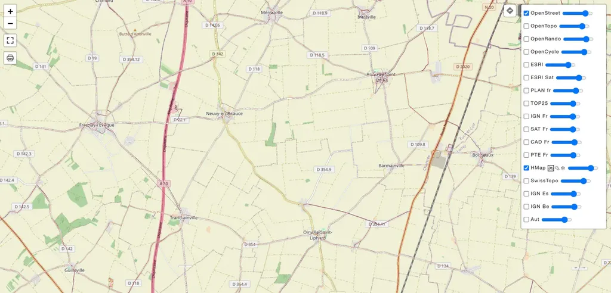
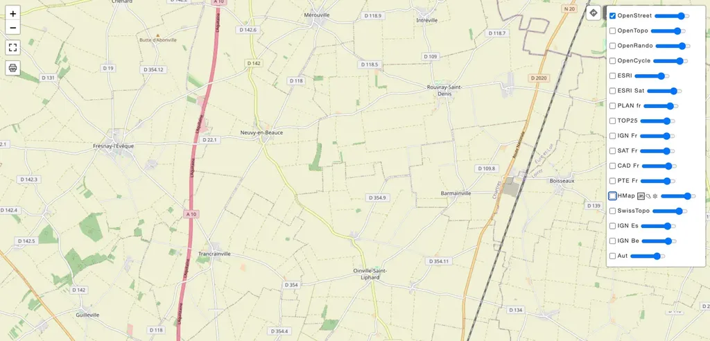
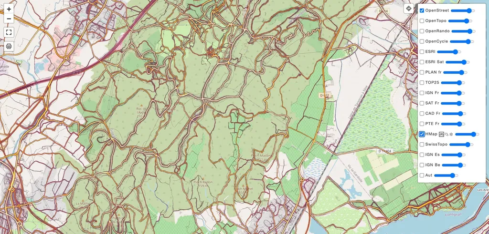
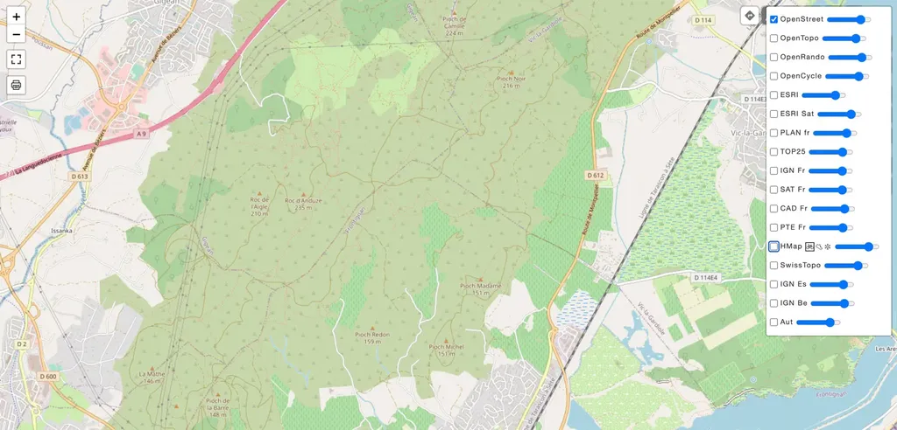

Dans l’hiver, cette technique m’a permis de dénicher un beau secteur VTT à une trentaine de kilomètres de mon terrain de jeu habituel. Je traçais un parcours et j’ai aperçu une suractivité dans un bois. Quand je m’y suis rendu, j’ai découvert un petit coin de paradis pour vététistes. Mes traces tentent d’interconnecter de tels secteurs irrigués par les VTT/gravel. Assez rapidement, j’ai choisi les grandes lignes de mon P27, m’orientant vers l’ouest pour contourner les régions peu inspirantes.

### 2. Les POI

Pour parfaire l’esquisse, surtout pour une trace comme la P27, je tente aussi de connecter des points d’intérêt (POI) : parcs régionaux ou nationaux, beaux villages, lieux patrimoniaux, sommets emblématiques.

Je commence par enregistrer l’esquisse tracée sur VisuGPX et [l’importe dans Google Map](https://www.google.com/maps/d/edit?mid=1aOpTpVoErEH4ktaOHay-1oC6GkurIRJO&usp=sharing), qui tout au long de mon travail me sert d’archive et de sauvegarde. Je recherche autour de l’esquisse les POI et les matérialise sur la carte. Sur Google Map, j’ai également chargé un calque avec les bassins de vie hyper ruraux, souvent gage de tranquillité, même quand on pédale sur l’asphalte. Je peux ainsi ajuster mon esquisse.

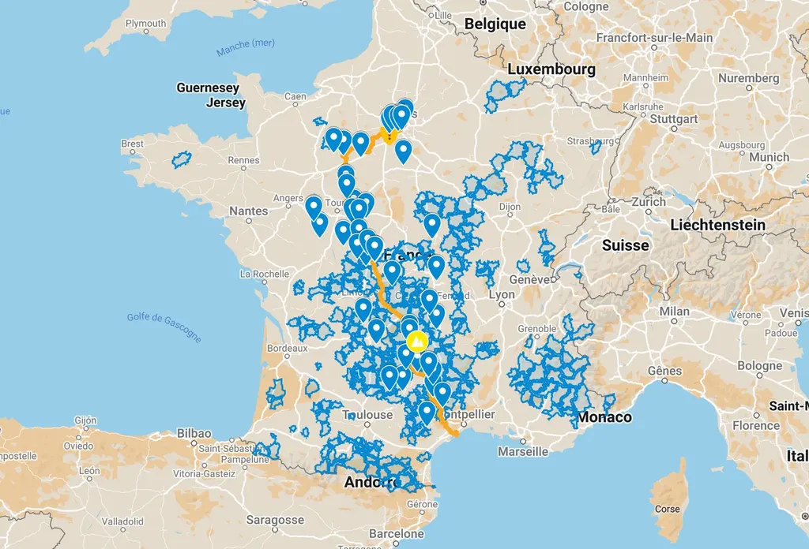

### 3. La compilation

Commence alors une phase fastidieuse. Je cherche des traces dans les sites de partage qui pourraient croiser ou suivre mon esquisse, et je les charge dans Google Map. [VTTrack](http://www.vttrack.fr/#) me facilite la vie (et aussi parfois le logiciel [Land](https://www.twonav.com/fr/logiciels/land) de TowNav). J’y charge mon esquisse, puis y déniche les traces qui l’avoisinent, notamment celles de VisuGPX et [Utagawavtt](https://www.utagawavtt.com/randonnee-vtt-gps/De-Sete-a-Sete-un-tour-de-l-Herault-a-VTT-24330). Le tout atterrit dans un calque de ma Google Map.

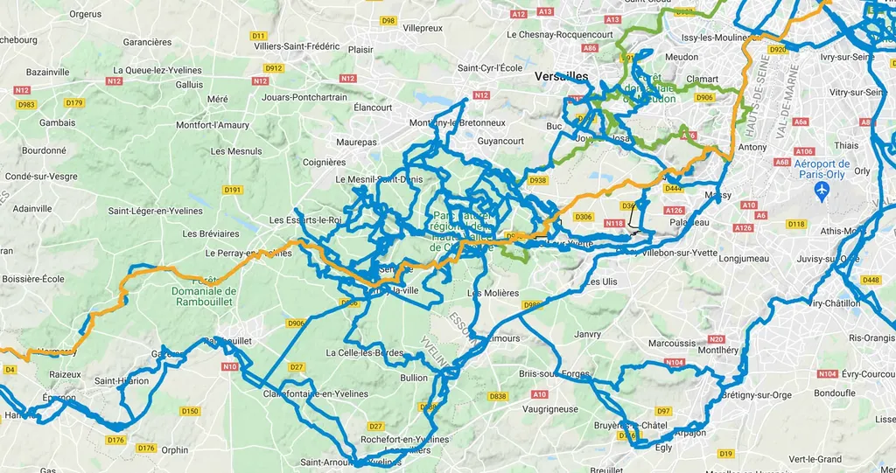

### 4. Le fignolage

Commence alors le traçage proprement dit, tronçon par tronçon. Dans un calque Google Map, je rassemble les traces qui concernent le tronçon en cours. J’exporte le calque au format KML, puis le convertis en GPX avec [GPSvisualizer](https://www.gpsvisualizer.com/convert_input), puis l’importe dans VisuGPX. Je modifie alors mon esquisse point après point pour qu’elle suive les traces découvertes ou les secteurs que me révèlent la HMap, mais aussi les images satellites.

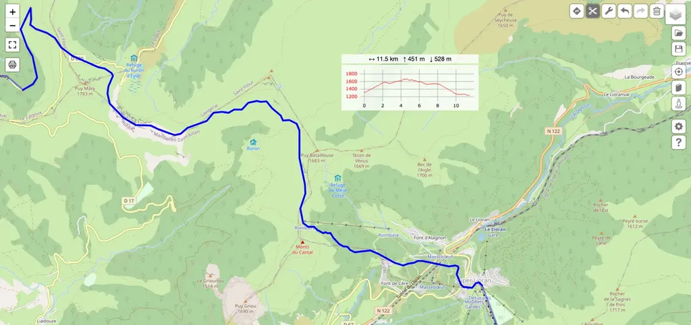
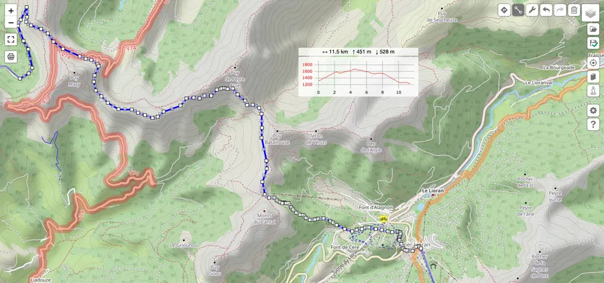
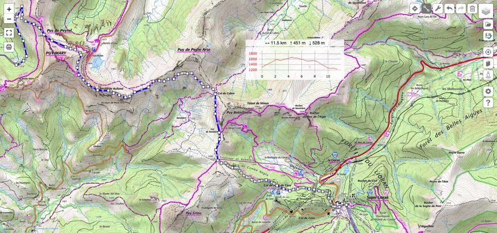
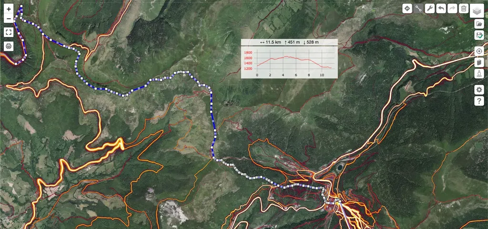

Les courbes de niveau IGN m’aident à ne pas foncer dans des murs ou des descentes vertigineuses. J’ai toujours un œil sur le profil que VisuGPX peut tracer en temps réel. De même, les images satellites m’aident à deviner les passages les plus sauvages. Je ne cesse de basculer entre les fonds proposés.

Parfois une trace existante me séduit, alors je la parcours en mode zoom, virage après virage, tout en vérifiant qu’elle suit la HMap. Des traces anciennes deviennent souvent impraticables par endroits et la HMap me permet d’éviter ce genre de piège.

J’adore l’outil gomme de VisuGPX, avec lequel j’efface en un instant des pans entiers d’une trace, avant de lui faire prendre une nouvelle direction. Ainsi de suite, en m’inspirant des traces partagées, en les interconnectant, en m’inspirant de la HMap, j’avance peu à peu. C’est un travail long pendant lequel je ne cesse de me raconter des histoires, comme si j’étais déjà sur mon vélo.

### 5. La vérification

Ce n’est qu’à la fin de ce travail que j’utilise parfois les robots de traçage de VisuGPX ou de Komoot. Ils arrivent qu’ils me donnent de nouvelles idées. Mais, comme avec tous les routeurs, les cartes OSM exploitées les limitent. Les GR sont qualifiés de VTT, alors qu’y rouler est souvent un calvaire. Plus embêtant, contrairement à la HMap, OSM ignore un grand nombre de singles, ce qui pénalise les routeurs quand on trace pour le VTT. Je préfère de loin partager la trace, demander l’aide aux vététistes locaux, m’appuyer sur l’intelligence collective.

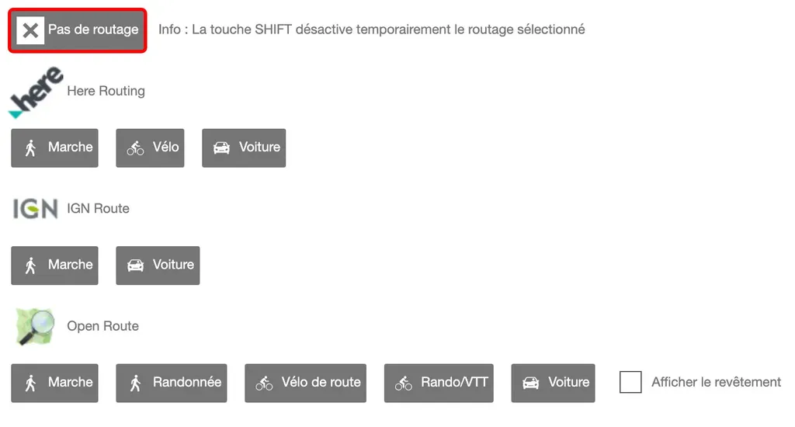

Je repasse en suite plusieurs fois sur la trace, tentant de l’améliorer, tout en sachant qu’elle ne sera jamais parfaite. Pour la parfaire, il faut la rouler plusieurs fois, l’ajuster dans cesse comme je le fais avec mes 727 et i727.

Cette méthode de traçage n’empêche pas les galères, les surprises et les belles découvertes. Loin de diminuer mon plaisir de rouler, elle l’augmente. À coup sûr, je passe parfois à côté de secteurs géniaux, mais j’arrive ainsi à produire des traces qui correspondent à mes goûts, c’est-à-dire à me tenir aussi loin que possible de l’asphalte.

### 6. Le traçage selon Jeroen

Jeroen a créé VisuGPX pour son propre usage, parce que les autres services ne le satisfaisaient pas. Pour tracer, il utilise une autre technique que la mienne. Il applique l’outil routage automatique sur des tronçons très courts, genre 200 m, puis édite les traces quand il veut les faire sortir de la carte. Cette technique est plus rapide, sans laisser une totale autonomie au robot, comme sur la plupart des autres plateformes. À mes yeux, son seul défaut est de produire des traces avec un trop grand nombre de points (ce qui impose alors de les découper pour les rouler, [surtout avec certains Garmin qui plantent quand une trace comporte plus de 8 000 points](../../2021/10/quand-la-trace-perd-des-points-sur-les-gps-garmin.md)). Mais je suis sûr que Jeroen règlera ce défaut en proposant [un système de réduction de points intelligent](http://be4.free.fr/map/GPX_Simplifier/index.htm). Comme il est passionné, il ne cesse d’améliorer son service et reste à l’écoute des utilisateurs.

*PS1 : [OSM ne demande qu’à être améliorée](https://areskidrissa.cc/2022/01/21/openstreetmap-pour-les-cyclistes/), mais malheureusement je ne dispose pas d’assez de temps pour y contribuer. Je suis déjà engagé dans le mouvement open source jusqu’aux oreilles, [en diffusant et entretenant plusieurs traces gratuites et ouvertes](../../../../page/traces-gravel-et-vtt.md), ainsi qu’en diffusant de nombreux textes, ceux de mon blog, mais aussi des livres comme [Le Geste qui sauve](https://tcrouzet.com/le-geste-qui-sauve/?swcfpc=1). Si de votre côté vous avez un peu de temps, n’hésitez pas à enrichir la topographie OSM, les rooteurs n’en seront que plus performant.*
*PS2 : [Nakarte](https://nakarte.me/) offre aussi une HMap, cette fois à l’échelle mondiale. Mais je trouve ce service moins avancé pour l’édition que VisuGPX. De même [gpx.studio](https://gpx.studio/l/fr/), [un projet open source d’origine francophone](https://github.com/gpxstudio/gpxstudio.github.io), mais, lui aussi, moins avancé que VisuGPX.*
*PS3 : Non, Komoot ne permet pas de faire la même chose que VisuGPX quand on trace VTT, ou même gravel, et qu’on aime sortir des sentiers battus par la cartographie OSM : pas de HMap, pas de carte topo IGN, interface de traçage beaucoup plus contraignante, sauf quand on fait confiance au robot sur de longues distances (ce qui ne garantit pas d’éviter les secteurs inroulables ou les nationales). Komoot, c’est l’équivalant de la pizza décongelée, avec un peu d’huile pimentée.*

#gps #velo #y2022 #2022-5-25-14h51
