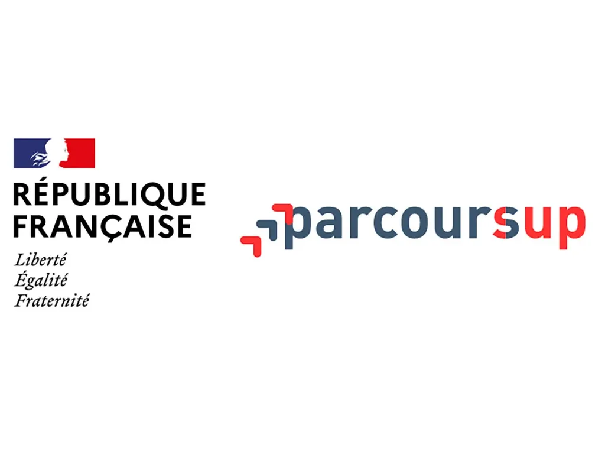
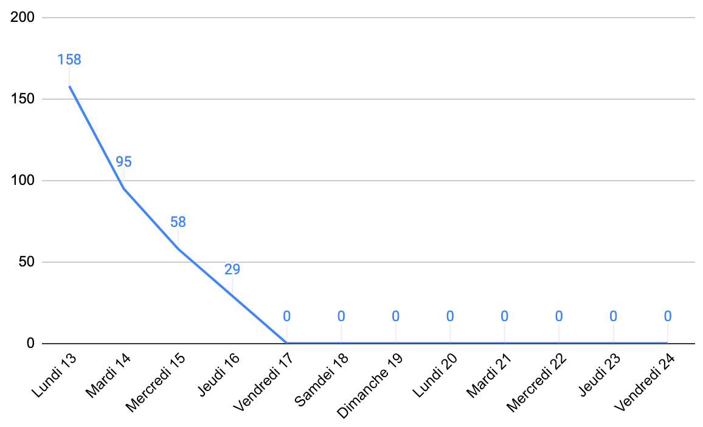

# Mon expérience de parent avec Parcoursup

J’ai entendu la députée Clémentine Autain déclarer : « Si nous sommes élus, nous supprimerons Parcoursup. » Depuis son lancement, le service d’orientation soulève des critiques virulentes dans les médias, les parents le craignent et les élèves encore plus, comme s’il s’agissait d’un monstre abominable, aveugle et impitoyable. Dans notre famille, quand Tim a commencé sa Terminale, nous avons craint le pire, essayant de nier aussi longtemps que possible qu’il faudrait en passer par cette épreuve tant redoutée. À reculons, à partir de fin février 2022, nous avons dû nous retrousser les manches pour dompter la bête, et même finir par l’apprivoiser, découvrant des astuces pour nous éviter les effets de surprise et diminuer le stress lors de l’attente des résultats. Je voudrais partager notre expérience.

### Une offre surabondante

Première découverte : le moteur de recherche des formations de Parcoursup est remarquable. En fonction de la zone géographique affichée, on réduit ou étend le champ de recherche. Il suffit de saisir le mot clé « Informatique » pour voir apparaître les formations qui proposent de l’informatique. De même quand on recherche des formations génériques comme « IUT » ou « PCSI ».

Revers de la médaille, l’offre est pléthorique. Parcoursup met en évidence la diversité du système pédagogique et nous l’étale sous les yeux. C’est au premier abord effrayant, surtout quand le futur bachelier n’a pas d’idée précise de ce qu’il fera plus tard. Il me semble que par le passé les possibilités étaient beaucoup plus opaques. Il était facile de passer à côté de certaines opportunités. Non, ce n’était pas mieux avant.

Cette transparence a toutefois pour désavantage de mettre en concurrence tous les bacheliers, quelle que soit leur région d’origine. La sélection s’effectue au mérite. Mais était-ce différent par le passé ? Non puisque les formations n’ont jamais pu accueillir plus d’étudiants que leur capacité. Parcoursup est une immense gare de triage, où heureusement les élèves ont davantage de pouvoir que de simples trains abandonnés à eux-mêmes.

Pour commencer, ils sont prévenus : leur Première et surtout leur Terminale seront décisives quant à leur avenir. Ils le savent, leurs parents le savent, c’est la règle du jeu. On peut le déplorer, nous l’avons longtemps déploré dans notre famille, jugeant Tim bien trop jeune pour effectuer un choix aussi critique, mais nous avons fini par voir Parcoursup comme un rituel initiatique, ce que le bac en revanche n’est plus, un rituel adapté à l’âge numérique, qui exige de plonger dans une immense base de données pour en tirer parti.

La métaphore pourrait être filée assez loin. Dans les sociétés anciennes, les jeunes partaient dans la forêt épaisse ou des grottes où ils affrontaient leurs pires cauchemars avant d’en revenir adultes. Aujourd’hui, la jungle est informationnelle et les lycéens s’y perdent avant d’en ressortir avec le titre d’étudiant. Parcoursup s’est substitué au rituel de passage du bac. Nous n’en prendrons collectivement la mesure que dans quelques années quand les futurs étudiants se souviendront de Parcoursup comme nous-mêmes nous souvenons du bac. Il y a beaucoup de nostalgie dans l’opposition à Parcoursup, un outil de notre temps pour notre temps encore mal compris, et qui, comme tous les services contemporains, et contrairement au bac, devra sans cesse évoluer et se réinventer.

### Vœux et sous-vœux

Nous avons commencé par découvrir la règle des dix vœux et des vingt sous-vœux. Par exemple, si un élève choisit une prépa MPSI, et consomme un vœu, il lui faut ensuite choisir spécifiquement les MPSI visées (jusqu’à dix sous-vœux). Pour d’autres formations, qui consomment un vœu, on peut choisir des dizaines de sous-vœux, sans qu’il soit comptabilisé dans les vingt initialement alloués (par exemple pour le concours Polytech il y avait plus de soixante sous-vœux). Tim a fini par avoir cinquante vœux au total.

Au départ, nous nous sommes dit que la limitation des vœux et sous-vœux était arbitraire, puisque des algorithmes effectuent l’essentiel du triage, mais à l’usage, nous avons fini par ajouter des vœux parce que nous en avions la possibilité plus que la nécessité. La règle des dix vœux et vingt sous-vœux nous est apparue adaptée. Elle nous a poussés à sélectionner avec attention les formations.

Le plus difficile a été de ne pas dilapider les vœux sur des formations inaccessibles. À ce sujet, Parcoursup n’est guère prolixe. Si les formations indiquent les prérequis académiques, elles ne disent pas explicitement quelle moyenne elles attendent. Il serait plus transparent d’annoncer la couleur. Pour le moment, nous ne connaissons que le pourcentage des élèves admis par rapport au nombre de vœux.

Par chance, j’ai découvert [un site compagnon de Parcoursup](https://data.enseignementsup-recherche.gouv.fr/pages/parcoursupdata/?disjunctive.fili) qui offre en open data des statistiques précieuses sur les années antérieures. Pour toutes les formations, on peut connaître le nombre de vœux, le nombre de candidats qui ont reçu une offre, le rang du dernier qualifié… On peut aussi découvrir l’origine des bacheliers, série générale, technologique ou professionnelle, ainsi que les mentions au bac. Nous avons vite compris qu’il était inutile de viser trop haut comme trop bas.

Nous avons aussi tenté de répartir les vœux en fonction du classement des formations par [le site de l’Étudiant](https://www.letudiant.fr/), optant pour des positions plus ou moins risquées. À ce titre, Parcoursup s’apparente à une place de marché.

Cette étape nous paraît déjà lointaine, mais nous y avons consacré beaucoup d’énergie. Il était question de temps de transport, de solution d’hébergement, de proximité familiale. Nous avons pris en compte beaucoup de paramètres pour peser le pour et le contre avant de sélectionner des formations.

### Les résultats

Quand les résultats sont tombés le 2 juin, nous avons eu une bonne surprise. On nous avait dit qu’il ne fallait pas espérer avoir des offres avant plusieurs jours, mais Tim en avait déjà douze, certes pas celles dont il rêvait, mais un bon panachage dans les diverses directions choisies. Nous n’avions donc pas trop mal visé. Bien sûr, certaines formations n’avaient même pas daigné le placer dans leur liste d’attente. Pour certaines très sélectives, pour lesquelles nous avions pris un risque, nous n’étions pas surpris, pour d’autres, le rejet était plus difficile à comprendre, et bien sûr pas de justification. Là, ça nous a tout de suite posé problème. Autant l’offre est transparente, autant le processus de sélection est opaque.

Par exemple, Tim a reçu des offres d’établissements qui les années passées ont accepté uniquement des mentions bien ou très bien, mais il a été refusé dans d’autres qui, au mieux, n’ont accepté que quelques mentions assez bien. Pourquoi ? Impossible de savoir. Est-ce parce qu’il a été jugé trop bon élève par ces formations ? Et s’il avait tenu absolument à les choisir ? Pas de réponse, pas d’explication, c’est le gros point faible de Parcoursup (et qui devra être corrigé).

L’attente a alors commencé. Là encore, nous avions entendu dire tout et n’importe quoi, comme s’il s’agissait d’un processus irrationnel et imprévisible. Il n’en est rien. Pour les vœux en attente, on connaît le nombre initial de places offertes (PO) à comparer à la capacité d’accueil (CA). Le plus souvent, les formations proposent un PO supérieur au CA, faisant ainsi du surbooking. Certaines écoles d’ingénieurs avec un CA=140 affichent un PO=2999, parce qu’elles anticipent que la plupart des sélectionnés rejetteront l’offre.

Dans chaque formation, les élèves candidats sont classés avec un rang (RG), dont la méthode de calcul n’est encore une fois pas explicite. Si RG<PO, le candidat reçoit une offre, sinon il est en liste d’attente. Sa position initiale dans la liste (PA0) est annoncée, puis elle évolue jour après jour (PA). En théorie PA0=RG-PO, mais cette formule ne fonctionne pas toujours avec les sous-vœux (dans ce cas, le RG annoncé est parfois commun à tous les sous-vœux et Parcoursup affiche alors un RG non spécifique à chacune des formations, cas pour les concours nationaux, genre Polytech).

Une dernière information capitale est publiée : le RG du dernier élève sélectionné l’année précédente (RG2021). Avec ces infos, nous avons très vite estimé les vœux qui tomberaient et ceux qui ne tomberaient pas, avec une petite frange incertaine, entre les deux. Par exemple, si RG=2000 pour une formation avec RG2021=2500, l’élève a de fortes chances de recevoir une offre. Inversement, les chances diminuent plus on s’éloigne du dernier reçu. Il est intéressant de regarder sur l’open data le rang du dernier reçu l’année antépénultième (RG2020).

Ainsi pour une école d’ingénieur avec prépa intégrée, Tim avait un RG-RG2021=-25, mais un RG-RG2020=100. Il a ainsi fini par recevoir une offre après deux semaines d’attente. Nous avons vite pris l’habitude de traduire RG-RG2021 en pourcentage, ce qui est plus parlant que les valeurs absolues, et permet de comparer les vœux en attentes indépendamment de la longueur de leur liste d’attente.

Tous les jours, nous avons mesuré la progression des attentes, avec la formule (PA0-PA)/PA0. Nous avons ainsi pu anticiper les formations qui seraient offertes, celles qui nécessiteraient une très longue attente et celles qui jamais ne tomberaient. Les graphiques de l’open data indiquent la vitesse de remplissage des formations et nous ont aidé à prendre notre mal en patience (et nous continuons à patienter même si la situation pour Tim s’est bien décantée).

Nous avons observé un phénomène surprenant. Après deux semaines, dans de nombreuses formations PA0-PA est déjà largement supérieur au RG2021 et au RG2020, ce qui implique que ces formations font des offres à des élèves moins bien classés que les deux années antérieures. Est-ce parce que les élèves ont boudé les formations scientifiques choisies par Tim ou, plus généralement, parce qu’il y a moins d’élèves pour autant de places offertes ? Nous n’avons pas la réponse, mais cela donne espoir pour tous les candidats de gratter quelques offres et qui leur auraient échappées en 2020 et 2021.

Bien sûr nous avons commis quelques erreurs. Pour des formations loin de la famille, nous avons souvent sélectionné uniquement les offres avec internat. Nous avons découvert a posteriori qu’il valait mieux valider les deux options car elles sont traitées indépendamment comme deux sous-vœux, ce qui fournit davantage d’information et permet de mieux anticiper l’issue de la sélection.

D’une manière générale, Parcoursup pourrait offrir beaucoup plus d’aide lors de la phase finale. Des graphiques de remplissage pourraient être proposés en temps réel. Les familles y verraient plus clair et pourraient se faire une idée de ce qui se passe en arrière-plan. J’en suis venu à me dire qu’il y avait de la place pour un business : une app payante pourrait rendre Parcoursup plus lisible.

J’ai beaucoup parlé de rangs, de pourcentages, de classements… une démonstration en quelque sorte de notre entrée dans le monde numérique. Il me semble vain d’en tenir à l’écart le système éducatif. En revanche, numérique ne rime pas avec inhumain. Il reste beaucoup de travail pédagogique à effectuer, beaucoup d’améliorations à apporter à Parcoursup, mais il pourrait au fil des années se substituer au bac dans l’imaginaire collectif.

J’ai conscience que nous sommes une famille plutôt scientifique, que nous avons fini par dompter Parcoursup parce que nous avons entrevu sa mécanique cachée et n’avons pas hésité à créer un tableur pour compiler et digérer les données à notre disposition. À ce titre, Parcoursup n’est pas encore aussi égalitaire qu’il devrait l’être, mais il ne faut pas jeter le bébé avec l’eau du bain. Parcoursup a le mérite d’exister, il doit maintenant se bonifier.

#netculture #y2022 #2022-6-20-17h56
