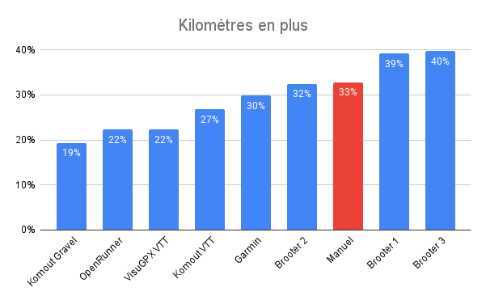
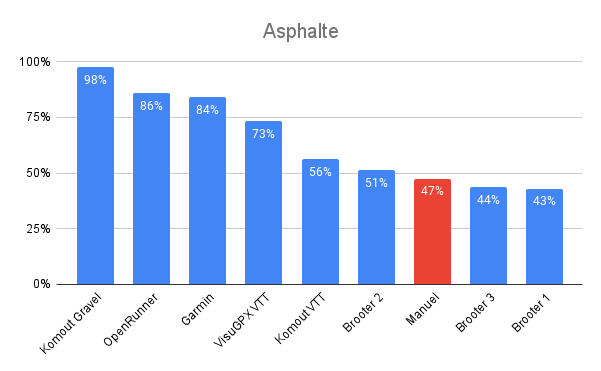

# Comment tracer gravel ou VTT à l’arrache

Le week-end dernier, un de mes cousins et moi nous sommes fait déposer à Bergerac avec nos bécanes, lui avec un VTT 26" tout rigide, autant dire un gravel à la mode années 1980, et moi avec mon tout suspendu. L’occasion s’est présentée à la dernière minute et j’ai eu à peine plus d’une heure pour tracer un parcours pour nous ramener au village de Montagnac sur Lède, fief de ma belle famille, situé à 42 km à vol d’oiseau.

Si je connais bien le final, j’ignore tout du secteur Bergerac, sinon la N21 au trafic épouvantable et la non moins épouvantable D14 qui vient s’y brancher. Pour ne pas perdre de temps, je me suis dit que c’était l’occasion de tester une nouvelle fois quelques outils de traçage automatique, [mon test de 2019 ne m’ayant guère impressionné](../../../../2019/9/vtt-gravel-bikepacking-que-vaut-le-routage-automatique.md).

### Komoot

Mon premier réflexe a été de me tourner vers [Komoot](https://www.komoot.fr/), souvent plébiscité comme le meilleur service du genre. En mode gravel, j’obtiens tout simplement 98 % d’asphalte, dont 11 km sur la D14. En mode VTT, l’asphalte tombe à 56 %, avec 9 % de singles, mais avec toujours autant de kilomètres sur la D14 et près de 3 sur la N21 ! Bon point, il me fait passer par les vignobles de Monbazillac.

Connaissant la nature des sols dans la région, peu caillouteux, je sais d’avance que cette trace est gravel, même s’il n’est pas question de la suivre puisqu’elle emprunte des routes à fort trafic (une spécialité de Komoot). En mode enduro, Komoot ne fait pas mieux qu’en mode VTT, ce qui est logique dans ce secteur de collines.

L’algorithme de Komoot est trop peu imaginatif. En mode gravel, il reste trop proche de la trace à vol d’oiseau et tente de minimiser la distance, ce qui n’a aucun sens quand on fait du vélo pour le plaisir et surtout cherche à rouler dans la nature.

### VisuGPX

Je charge la trace Komoot VTT dans [VisuGPX](https://www.visugpx.com/) et la compare à la trace VTT générée par VisuGPX, beaucoup plus asphaltée (73 %), mais qui a le mérite d’éviter la N21 et la D14, preuve que c’est possible, ce qui me rassure.

### Manuel

Comme je manque de temps, je bascule en mode manuel sur VisuGPX. En m’inspirant des deux traces calculées et [selon ma technique de traçage désormais habituelle](../5/visugpx-a-revolutionne-ma-technique-de-tracage.md), je combine le mode routage de proche en proche et le mode point à point sur les secteurs non cartographiés que me révèle la [Heatmap Strava](https://www.strava.com/heatmap). J’aboutis ainsi à une trace avec 47 % d’asphalte, presque que des voies communales. Mieux, j’arrive à 28 % de chemins et surtout à 25 % de singles. Voici une véritable trace VTT. Nous y avons pris du plaisir, surtout en forêt. Sur les portions asphaltées, nous n’avons croisé qu’une dizaine de voitures.

### Google

Je n’ai eu l’idée d’écrire cet article qu’une fois de retour. J’ai demandé à tout hasard à Google un tracé, qui s’est avéré catastrophique, l’essentiel se jouant sur la N21.

### OpenRunner et Garmin

Résultats sans intérêt, respectivement 86 % et 84 % d’asphalte.

### BRouter

En revanche, [BRouter](https://brouter.damsy.net/) s’est avéré beaucoup plus intéressant. Il m’a proposé une trace plus à l’est qui quitte Bergerac en suivant la rive de la Dordogne. Plus longue que les autres, plus audacieuse, elle va chercher les chemins loin, avec un faible taux d’asphalte, au prix de davantage de kilomètres.

Le service propose de nombreuses options de paramétrage. On peut se construire des profils sur mesure ([ici une version dédiée au gravel](https://cxberlin.com/routenplaner/cxb-routenplaner/) ou [là](https://bikerouter.de/)). J’ai effectué deux autres tests tout aussi intéressants que le premier. Si je dois refaire ce parcours, ou un autre avec peu de temps de préparation, je prendrais l’habitude de travailler avec BRouter, avant de basculer en manuel sur VisuGPX pour un rapide fignolage à fin d’ajouter des singles et vététiser la trace. Dans ce domaine, il est impossible de battre le mode manuel, parce que nous pouvons alors quitter les sentiers cartographiés pour explorer ceux révélés par la Heatmap.

### Notes sur les statistiques

Je charge les traces dans Komoot et récupère les stats calculées. Elles sont bien sûr très approximatives, vu que la cartographie OSM utilisée par Komoot est elle-même approximative, mais je n’ai pas trouvé de meilleure solution pour qualifier rapidement une trace et les comparer entre elles (BRouter propose des statistiques incomplètes). Dans mes calculs, je suppose que les pistes cyclables se jouent à 50 % sur l’asphalte.

#gps #velo #y2022 #2022-8-25-16h45
