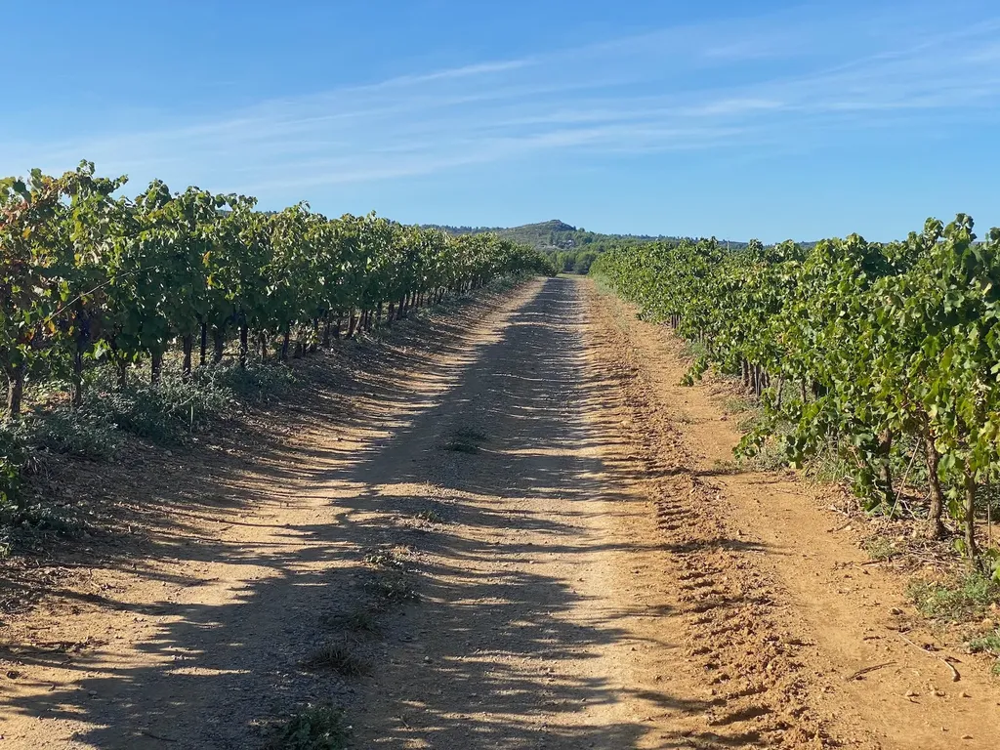
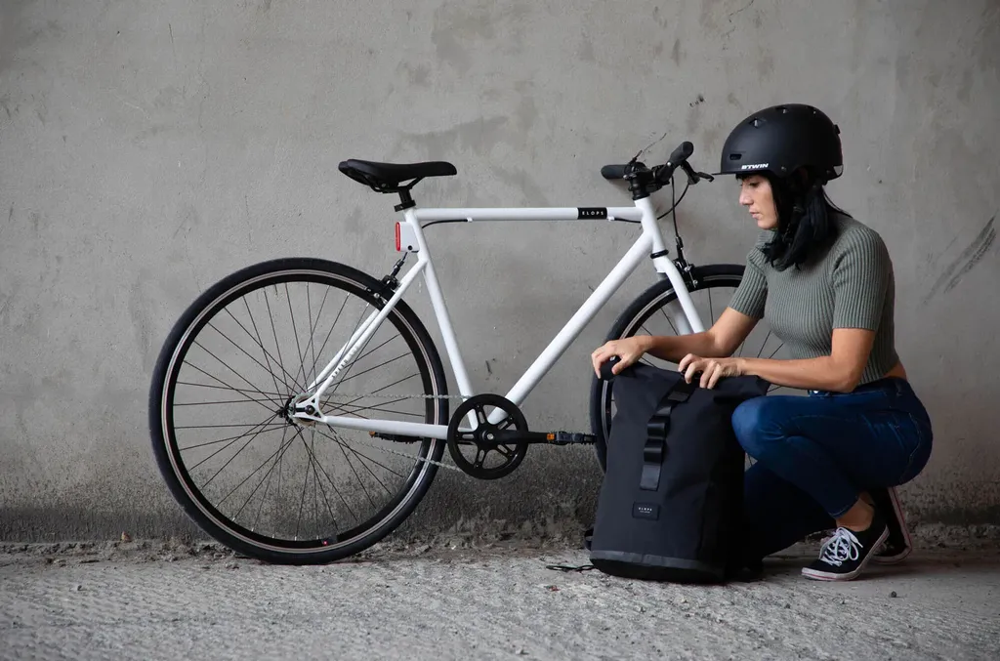
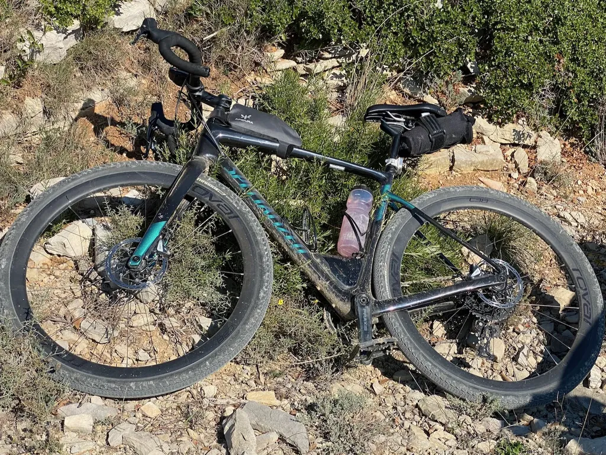
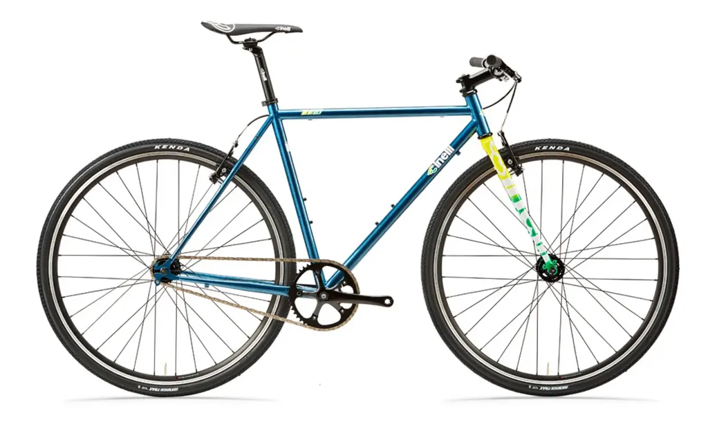
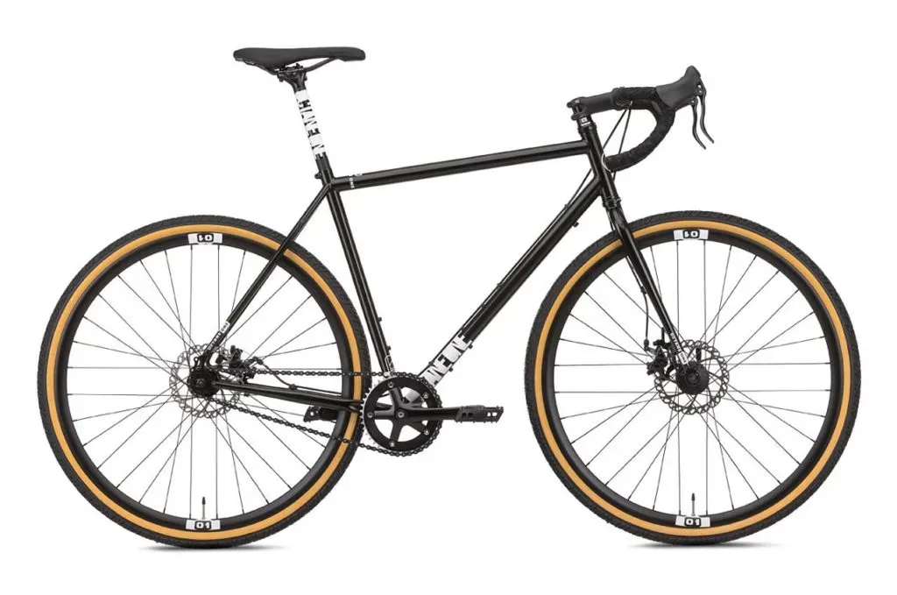
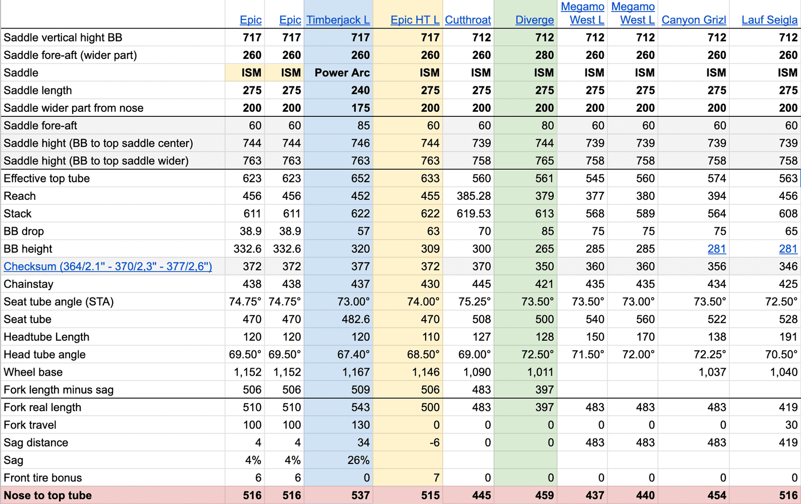
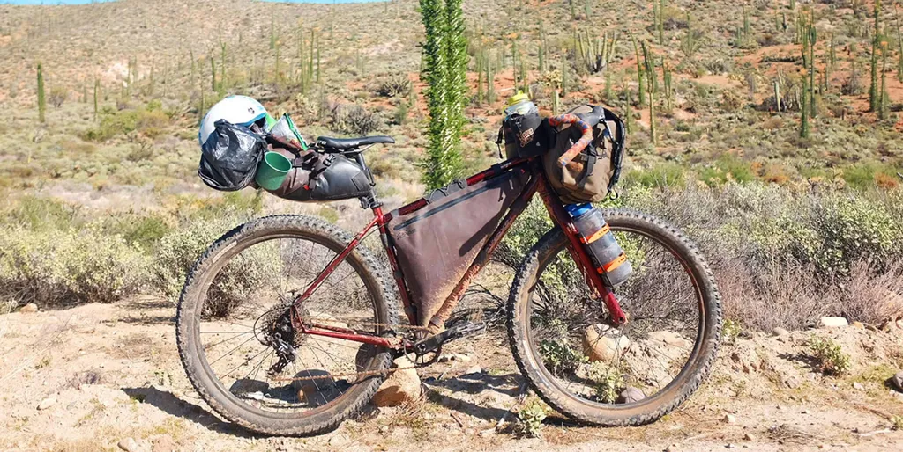
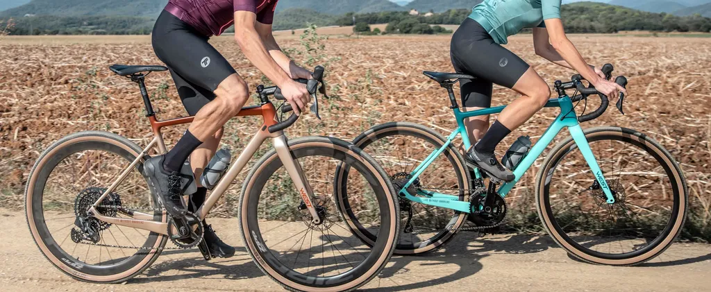
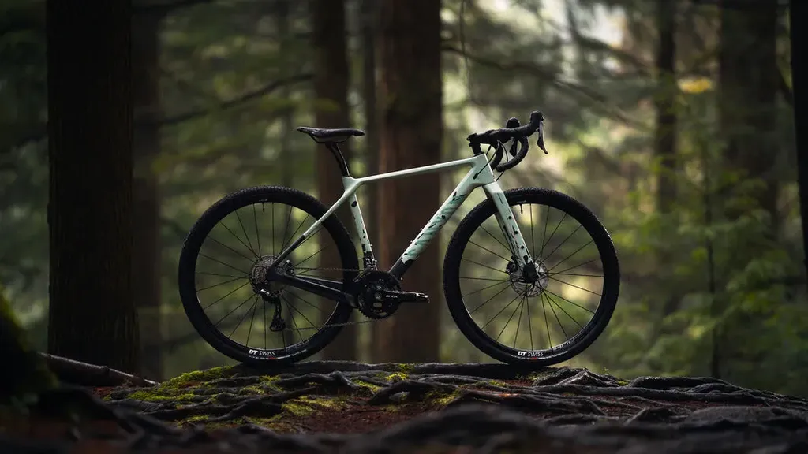

# Comment j’ai choisi mon nouveau gravel

Pour moi, avant tout vététiste et bikepacker, [le gravel est un objet de luxe](../7/jen-suis-revenu-du-gravel.md), un vélo en rien indispensable, puisque moins passe-partout qu’un VTT, moins propice à l’exploration, malgré son rayon d’action théoriquement plus grand. J’aurais pu continuer à m’en passer, pourtant j’ai à nouveau succombé à ses charmes, non à cause d’un désir soudain, mais d’un petit changement dans ma vie.

En ce moment, je séjourne une dizaine de jours par mois à Paris et je deviens dingue sans vélo, surtout que je ne cesse de voir des cyclistes. Je n’ai qu’une envie : pédaler avec eux et pourquoi pas m’échapper vers la campagne.

Un copain cycliste parisien m’a suggéré d’opter pour un [Brompton](https://fr.brompton.com/), le vélo selon lui idéal pour la ville, puisqu’on peut le transporter partout avec soi. Mais je ne suis pas assez citadin pour investir près de 2 000 € dans un vélo pliable, dont je n’aurais le plus souvent aucun usage. Reste que la graine était semée. Pour la première fois, j’entrevoyais la possibilité de posséder un vélo à Paris.

J’ai alors envisagé d’acheter un single speed [Elops de chez Décathlon](https://www.decathlon.fr/p/velo-ville-single-speed-500/_/R-p-306292), à un prix imbattable de 269 €. Pas peur de me le faire piquer, grande simplicité mécanique, le moyen parfait de locomotion en ville, sauf que j’ai peu de rendez-vous, pas de nécessité d’aller vite, la marche et le métro me vont très bien. En prime, je n’ai pas besoin de cadenas pour mes baskets.

À Paris, je ne veux pas un vélo pour me déplacer, mais pour pédaler et voir du paysage. J’ai besoin d’un vélo rapide sur l’asphalte pour me le faire quitter au plus vite, puis d’un vélo à l’aise sur les chemins. Par mégarde, j’ai établi le profil type du gravel. Voilà comment je me suis inventé une raison pour transformer un objet de luxe en objet de première nécessité, au nom de ma santé mentale.

**J’ai alors établi mon cahier des charges.**

J’ai un VTT tout suspendu de 12,5 kg, un semi-rigide dédié au voyage de 9,8 kg, mon gravel devait être assez éloigné de ces deux vélos pour m’offrir des sensations différentes.

Le cintre tordu s’imposait, question d’adopter une autre position, en prime plus aérodynamique dans la perspective de fuir l’asphalte. Autre avantage, il est plus compact, ce qui facilite le transport dans le train. De même, le poids du vélo devait rester contenu, toujours pour faciliter le transport. Un gravel plus lourd qu’un VTT n’a pas beaucoup de sens pour moi.

Côté transmission, je suis un inconditionnel du monoplateau. Je ne me voyais pas revenir en arrière : ne jamais être sur le bon plateau dans les terrains accidentés et devoir jouer avec deux manettes en même temps. Ce qui ne pose pas de problème sur la route en pose hors asphalte, quand on n’a parfois qu’une seconde pour passer de la descente à la montée, sans être capable de l’anticiper.

Au printemps 2021, j’ai vendu mon [Diverge](https://www.specialized.com/us/en/mens-diverge-expert-x1/p/154313?color=227313-154313) parce qu’il n’acceptait que les pneus de 42 mm, et encore par temps sec. La boue empêchait vite les roues de tourner et le cadre était déjà bien poncé. Sur le Diverge, il m’a toujours manqué quelques millimètres pour être à mon aise sur les chemins gravillonnés exigeants du Midi, aussi pour réduire la pression de gonflage et rouler plus confortablement. Mon nouveau gravel devrait pouvoir chausser du 50 mm.

Mon Diverge avait une suspension [Future Shock](https://www.specialized.com/ca/fr/stories/future-shock) de seconde génération, efficace, mais moins que des pneus plus amples. Je n’ai rien contre un gravel suspendu, sans que ce soit une condition indispensable, vu que je possède deux VTT.

Je ne faisais ainsi que décrire un gravel classique de 2022. Il me restait à le choisir.

**J’ai commencé par me fixer un budget de 1 000 €.**

Pour réduire les coûts, j’ai pensé à partir sur un gravel single speed. J’ai un moment hésité entre le magnifique [Cinelli Tutto Plus](https://cinelli.it/en/prodotti/tutto-plus-en/) monté avec un cintre tordu et l’[Octane One Kode](https://octane-one.com/bike/kode-single-speed-commuter/), finissant par préférer le dernier pour sa position moins agressive, ses freins à disque, ses roues tubeless ready. Quand j’ai regardé plus en détail les caractéristiques de ce vélo, j’ai découvert qu’en plus de proposer un développement bien trop grand pour moi, il pesait plus de 12 kg, soit le poids de mon tout suspendu !

Ce que j’aimais avec mon Diverge était sa nervosité, sa capacité à accélérer au moindre coup de pédale, je ne voulais pas d’un gravel aussi pataud qu’un VTT, et qui en plus n’aurait ni vitesses, ni suspension. Partir sur un Octane One Kode aurait été réunir le pire des deux mondes (dans ma situation, bien sûr).

Mon cerveau chauffait, je n’en dormais pas (sans doute parce que je n’avais pas un budget illimité, et donc pas le droit de me tromper). Je passais mon temps à étudier des dizaines de vélos et à comparer leur géométrie dans un tableur. Il me permet de calculer la distance entre la selle et le cintre ainsi que le drop, la même distance mais verticalement, sachant que j’aime les vélos avec un drop proche de zéro et une distance du nez de celle au cintre contenue. Ces deux exigences me poussent à choisir des cadres L plutôt que M, alors qu’avec mon 1,79/83 je suis entre les deux tailles (souvent je dois raccourcir la potence). Ma position n’est pas efficace, mais c’est ainsi que je pédale aujourd’hui, sinon mes cervicales ne le supportent pas et je n’éprouve aucun plaisir.

J’ai songé à m’acheter un cadre et monter un vélo en puisant dans mon stock de pièces réformées. Mon choix s’est alors tout naturellement porté sur le [Salsa Fargo](https://www.salsacycles.com/bikes/2019_fargo_steel_frameset), cadre acier réputé un des plus confortables jamais dessinés, qui a l’avantage d’accepter des roues VTT au standard boost. J’ai calculé que je pouvais me construire une belle bécane pour 1 700 €, mais sans réussir à passer sous la barre des 11 kg. Même en cassant ma tirelire, je n’aurais jamais été moins lourd que mon semi-rigide.

Une autre chose me gênait. Le Fargo est un drop bar moutain bike, un VTT avec un cintre gravel (tout comme le [Surly Ghost Grappler](https://surlybikes.com/bikes/ghost_grappler) ou le [Kona Sutra LTD](https://konabikes.fr/product/b22sul/)). Un vélo en son temps unique, précurseur, positionné entre deux mondes, mais trop proche de mon VTT de voyage, et pas assez gravel à mon goût. J’ai renoncé à cette piste (qui aurait été idéale si je n’avais dû garder qu’un seul vélo).

J’ai alors passé plus d’une semaine à essayer des gravels dans les boutiques autour de Montpellier. Ils pesaient tous plus de 10 kg, voire plus de 11 kg, même certains gravels carbone comme le [Megamo West 10](https://www.megamo.com/fr/velos/gravel/west/west-10-(22)), à déjà presque 2 500 €. Sans m’en rendre compte j’avais basculé d’un budget minimal à un budget plus conséquent, c’est-à-dire celui d’un vélo de luxe, en rien indispensable, mais dont les caractéristiques me feraient plaisir. Dans ma tête, je pensais à mes fréquents séjours dans le Lot-et-Garonne chez mes beaux-parents, terrain de jeu parfait pour le gravel.

Il n’était plus question d’acheter un vélo et de le laisser à Paris dans une cave, avec tous les risques que cela comporte. J’ai décidé que je transporterai ce vélo à chacun de mes voyages. Avant même de le choisir, j’ai commandé une sacoche [Buds, compatible SNCF](https://www.buds-sports.com/housses-velo-pour-train-au-standard-sncf/), avec les accessoires de protection.

Faute de trouver chaussure à mon pied autour de moi, j’ai décidé de commander en ligne. J’ai assez d’expérience et de maîtrise de la géométrie des vélos pour savoir si un cadre peut me convenir en jouant avec ses côtes. Par exemple, j’ai vite constaté que le Cinelli Tutto Plus ne ferait pas l’affaire parce qu’il était trop agressif, imposant un style coureur du tour de France arc-bouté.

J’ai longtemps regardé le nouveau [Lauf Seigla Weekend Warrior](https://www.laufcycling.com/eur/product/lauf-seigla), annoncé à 2 440 €. C’est un gravel révolutionnaire, capable d’accepter des pneus de 2,1", avec une longueur de chaîne digne d’un VTT. Il est réputé rapide, annoncé à moins de 9 kg. Plutôt destiné à la compétition, [il semble inconfortable, même équipé d’une fourche](https://www.youtube.com/watch?v=iu5G_Fidzf8&ab_channel=CyclingTips). Par ailleurs, le prix annoncé n’inclut pas les taxes d’importation depuis l’Islande, et le prix grimpe à 3 000 €. Au moindre problème, je me retrouverais coincé avec ce vélo, sur lequel je n’avais aucun retour de première main.

J’ai fini par me tourner vers une valeur sûre, un [Canyon Grizl](https://www.canyon.com/fr-fr/velos-de-gravel/?hideSelectedFilters=true&prefn1=pc_familie&prefv1=Grizl&srule=sort_master_availability), que j’ai remarqué dès sa sortie en 2021 et que depuis [Grand Fondo](https://granfondo-cycling.com/the-best-gravel-bike-review/) a célébré. Un copain gravelliste expérimenté en possède un et n’en dit que du bien. Il ne s’agit pas d’un choix très original, mais ce vélo répond à mon cahier des charges. Je pourrais éventuellement lui ajouter une fourche hydraulique [RockShox Rudy 30](https://www.sram.com/en/rockshox/models/fs-rudy-ult-a1) et des roues carbone pour faire passer son poids allègrement sous les 9 kg. Qui plus est, c’est un gravel de bikepacking, muni de nombreuses fixations sur le cadre. En termes de rapport qualité/prix, je n’ai pas trouvé mieux. Chez Canyon, je suis assurément en taille M et non L. D’après mes calculs, il me faudra sans doute raccourcir la potence de 2 cm, peut-être lui donner un peu d’angle, mais rien d’énorme.

J’ai raconté ce cheminement pour montrer qu’il n’existe pas de gravel idéal. Les autres vélos que nous possédons déterminent notre décision autant que des préférences et des contraintes personnelles. Est-ce que j’ai effectué le bon choix ? Je vous le dirai quand j’aurai un peu roulé avec mon nouveau gravel. Pour le moment, je ronge mon frein à Paris, ce qui me laisse le temps d’écrire.

#gravel #velo #y2022 #2022-9-25-11h1
