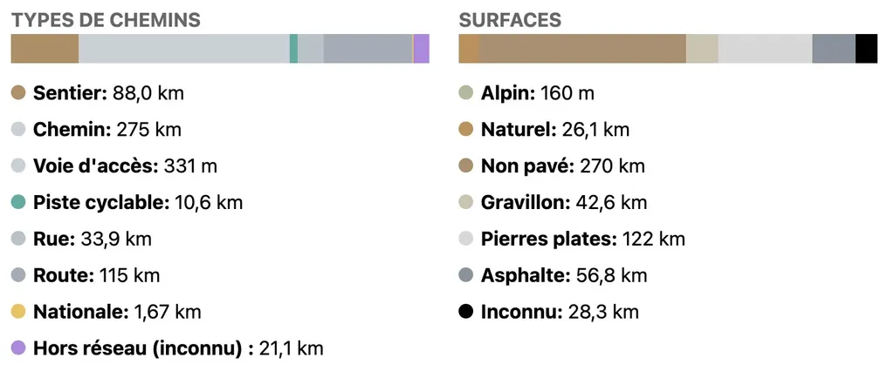
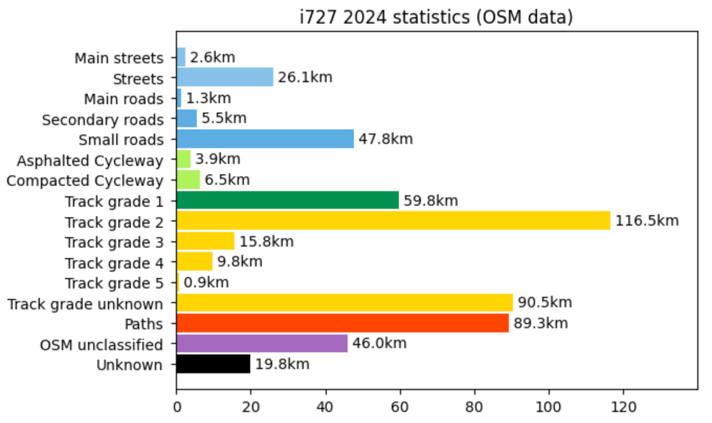
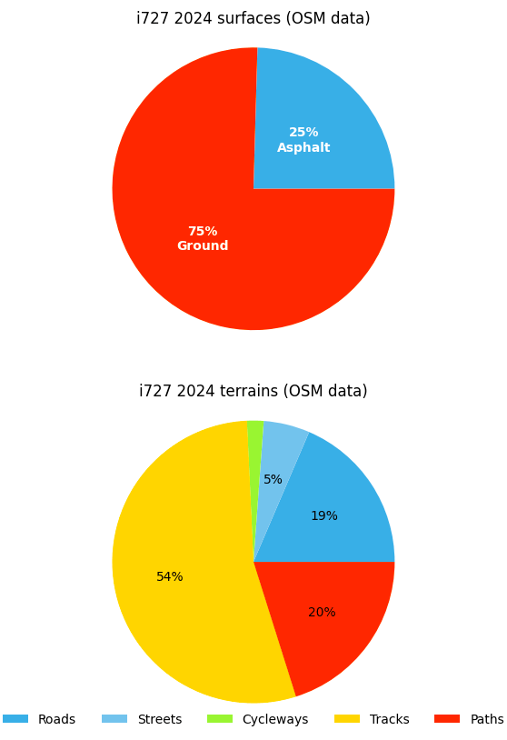
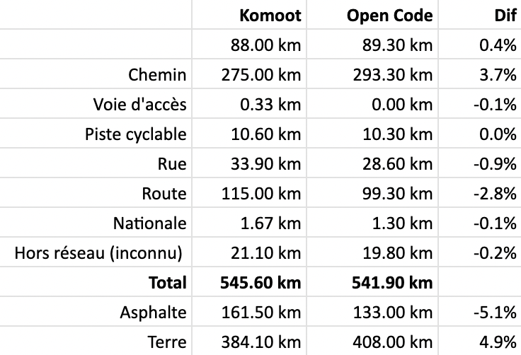
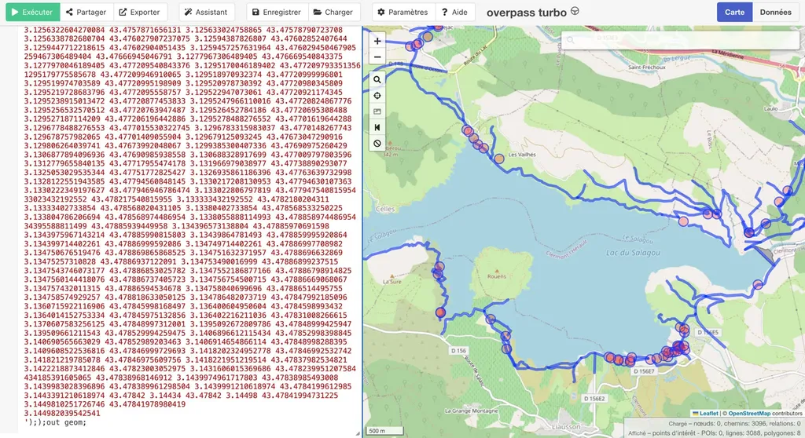
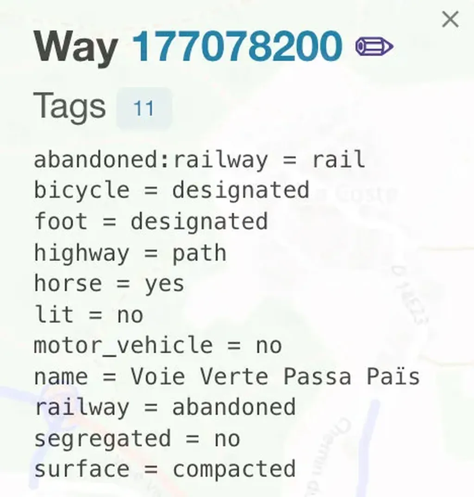
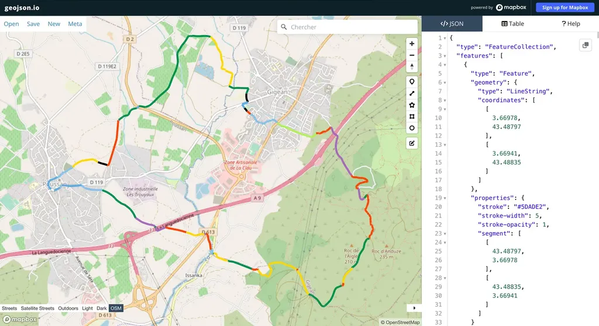
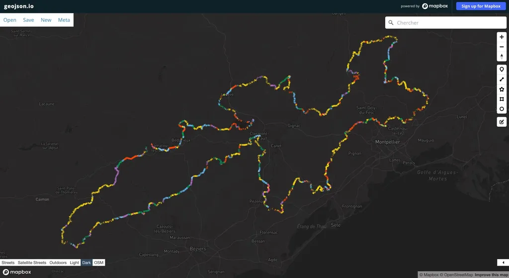
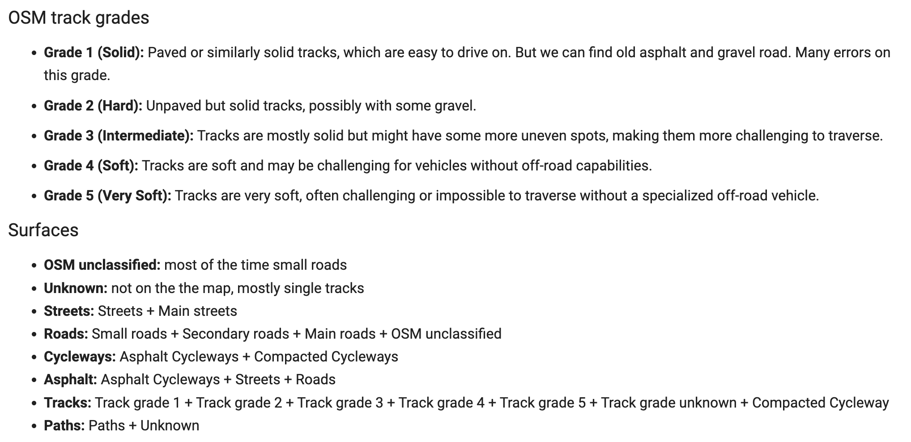

# Asphalte, gravier ou terre ?

Je profite d’une crève tenace, qui m’empêche d’écrire autant que de pédaler pour pondre du code, potentiellement utile aux gravellistes, vététistes et bikepackers. C’est ma façon de me détendre. En bricolant [mon système pour remonter les POI d’une trace GPX](enrichir-automatiquement-vos-itineraires-avec-des-points-dinteret.md), j’ai découvert une méthode pour établir des statistiques précises sur la nature des terrains parcourus.

[Jusqu’ici je me fiais à Komoot](../../2022/12/comment-evaluer-le-pourcentage-dasphalte-dune-trace.md), sans trop comprendre ce que le service fabriquait (en plus de modifier mes traces). Pas fan de leur manque de transparence comme de leur code propriétaire, je me suis toujours dit qu’il faudrait une solution open source pour arriver à un résultat du même type, selon une méthode qui aurait l’avantage d’être transparente pour que la communauté puisse en discuter.

J’en arrive presque au bout de ma crève et je tiens un code Python que [je partage dans Google Colab](https://colab.research.google.com/drive/1OnIlVr7_iI2cLBQp10XpMCKpOhJtJOcc?usp=sharing). Pour l’exécuter, on lance *Exécution/Tout exécuter*, puis descend tout en bas jusqu’au bouton *Upload*. Si vous chargez une trace GPX, elle sera analysée, puis les stats s’afficheront.

Attention de ne pas charger une trace brute issue d’une très longue sortie. Vos GPS enregistrent des points tous les quelques mètres, ce qui génère des fichiers très lourds. Vous pouvez [réduire le nombre de points avec VisuGPX](https://www.visugpx.com/), par exemple. La trace provisoire [i727 2024](https://727bikepacking.fr/i727/) contient presque 14 000 points pour 545 km. Le code a eu besoin de près de 12 minutes pour générer les statistiques (le processus irait beaucoup plus vite sur un serveur dédié).

Mes résultats sont proches de ceux de Komoot, logique puisque nous utilisons la même source OSM, malheureusement fautive. Mais on peut pallier ses erreurs avec un peu de pratique. Lors de l’exécution du code, j’affiche un bouton *Overpass Query*. Il permet de télécharger un fichier texte contenant une requête à coller dans la fenêtre de gauche d’[Overpass Turbo](https://overpass-turbo.eu/). Quand on la lance, les voies rencontrées par votre trace s’affichent.

Quand on clique sur une voie, les données la décrivant apparaissent. Parfois très complètes, parfois succinctes, parfois fausses. Dans ce dernier cas, on peut cliquer sur le crayon et aller directement modifier la cartographie OSM.

J’ai rencontré beaucoup de problèmes avec les Pistes de grade 1. Par exemple, une route de vigne de 2 km avec seulement dix mètres de gravier devient une piste de grade 1, au même niveau qu’une belle DFCI. Comme les informations de surface manquent souvent, impossible de les différencier. C’est une invitation pour améliorer OSM. De même, beaucoup de sentiers (paths dans OSM) sont classifiés comme pistes (tracks dans OSM).

Pour vérifier la pertinence des statistiques et repérer les erreurs OSM, j’affiche également un bouton *Geojson Query*. On peut télécharger un fichier json et l’ouvrir dans [Geojson.io](geojson.io). On visualise ainsi la trace avec les segments colorés en fonction de leur nature. J’ai beaucoup utilisé cette possibilité lors du débogage. Cette approche permet également d’avoir une idée d’une trace rien qu’en regardant son trajet coloré.

Enfin, tout en bas du notebook Codelab, j’ai indiqué comment j’avais rassemblé les données, extraites par la fonction find\_terrain de la section OSM Analysis (assez simple, donc lisible sans une trop grande maîtrise de Python). On doit pouvoir améliorer ce point. Vous pouvez jouer avec le code.

#gps #velo #y2023 #2023-10-29-12h21
