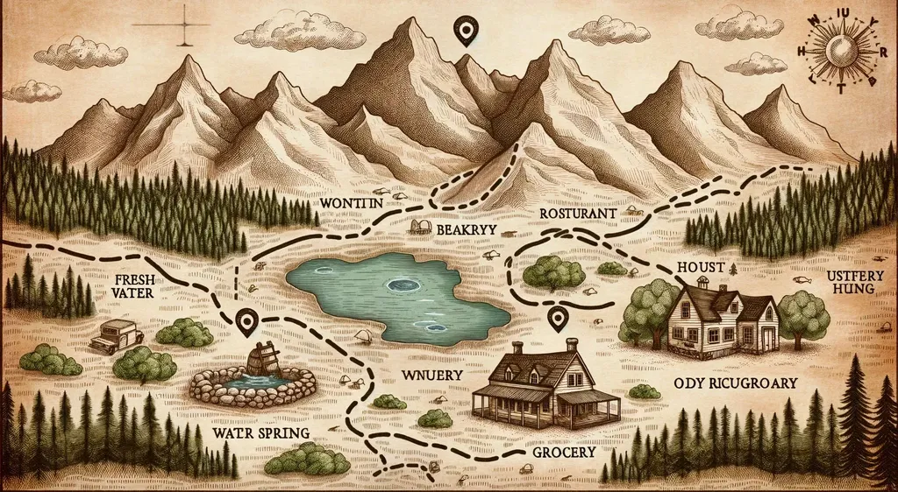
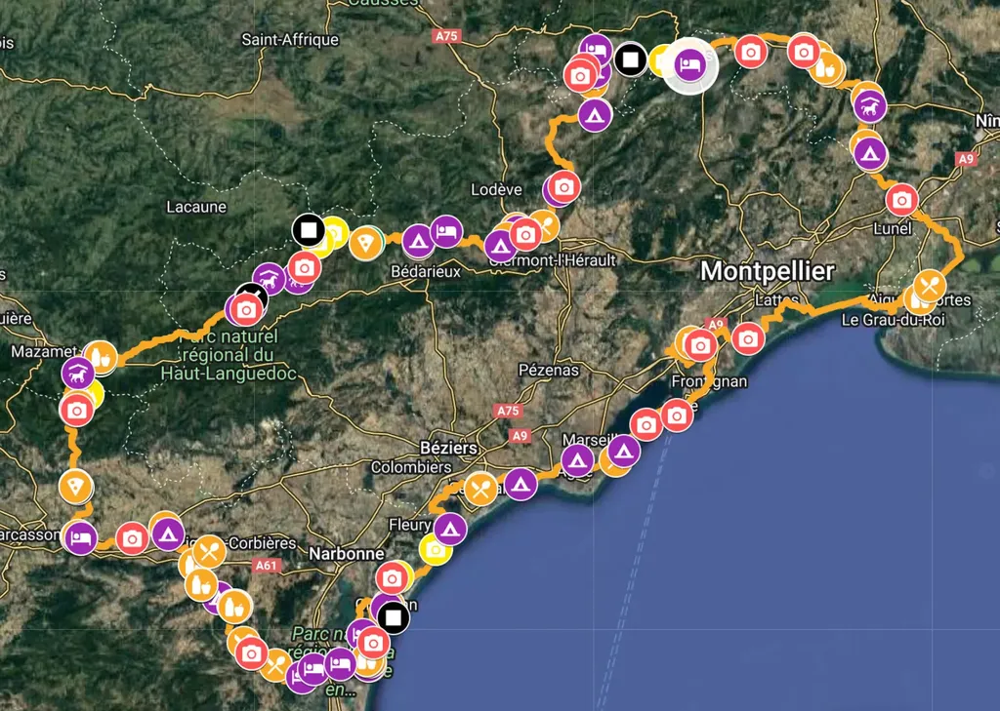
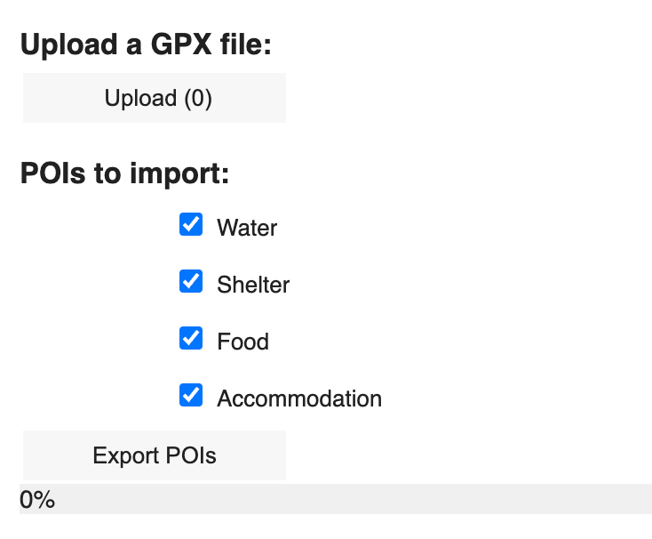
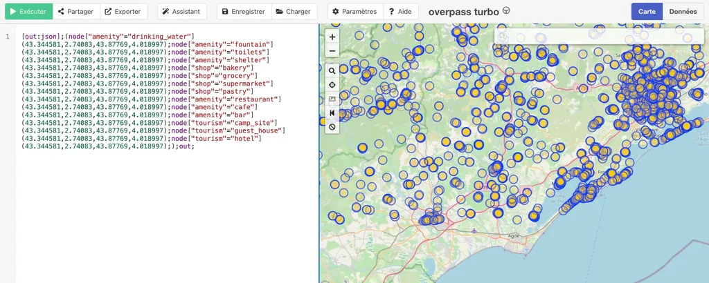

# Enrichir automatiquement vos itinéraires avec des points d’intérêt

Lors des grosses journées à VTT ou gravel dans la cambrousse, notamment en bikepacking, je me sens toujours mieux quand j’ai une vague idée de quand je pourrai me ravitailler. J’évite ainsi de me surcharger, de trop acheter ou d’en venir à manquer. Quand je reconnais [les 727](https://727.tcrouzet.com), j’ai pris l’habitude de photographier les points d’eau, les boulangeries, les restaurants, les éventuels spots de bivouac, puis de reporter ces POI (points d’intérêt) sur GoogleMap et VisuGPX.

C’est devenu un réflexe. Sans perdre beaucoup de temps, j’offre un service aux participants des 727 que peu d’organisateurs proposent (et dans les recoins de l’Hérault, mieux vaut savoir anticiper les ravitaillements). Si certains organisateurs ne maîtrisent pas les arcanes des GPX et autres KML, d’autres s’abstiennent de lister des POI au nom de l’aventure. Ne rien savoir d’une trace ne ferait qu’en augmenter la difficulté. Comme je ne m’intéresse pas au vélo masochiste, je préfère fuir ces évènements qui ont pour ambition première de nous faire souffrir.

Mais en juillet dernier, [à l’occasion du TMV](../7/tour-du-massif-vosgien-le-bikepacking-a-ne-pas-manquer-en-juillet.md), je me suis retrouvé face à une trace non enrichie à cause d’un manque de compétence technique de l’aveu même de l’organisateur Pascal Chabanse. J’avais une première solution : sur VisuGPX avec en fond la cartographie OSM, j’aurais pu suivre virtuellement le tracé et relever à la main les POI à proximité. Je m’étais payé ce luxe fastidieux lors de la création du [P27](../../../../page/p27.md), aussi parce qu’il s’agissait d’une trace théorique sans reconnaissance, et que je voulais la suivre sur la carte pour la valider.

Je n’avais ni le temps ni le courage de recommencer pour le TMV. Avec l’aide de ChatGPT, j’ai pondu un bout de code en PHP pour remonter automatiquement les POI. Je viens de convertir ce code en Python et je peux désormais vous [le partager sur Codelab](https://colab.research.google.com/drive/14TTY1j3InZca3ShhdHWWrfcoDUeyFmTR?usp=sharing). Tout en bas du document, on peut uploader un GPX, lancer l’exportation des POI, puis récupérer un fichier KML compatible GoogleMap.

À partir du GPX, mon code crée une requête [Overpass](https://overpass-turbo.eu/), récupère tous les POI dans le parallélogramme défini par le GPX, puis recherche ceux qui sont à moins de 250 mètres de la trace (paramètre défini en haut du code). Je n’utilise pas l’API Google Places parce qu’il est très vite payant.

Des outils comme [GPSVisualizer](https://www.gpsvisualizer.com/convert_input) permettent de convertir les KML en GPX. [On peut également les importer directement dans Garmin Basecamp pour les transférer aux GPS.](../3/comment-je-prepare-mon-gps-pour-un-bikepacking.md) Pour ma part, j’aime envoyer les GoogleMap enrichies à l’application [MapOut](https://mapout.app/) sur iPhone, à laquelle je me reporte très souvent quand je roule. J’espère que ce petit bout de code vous aidera dans vos périples hors des sentiers battus.

#gps #velo #y2023 #2023-10-23-19h38
