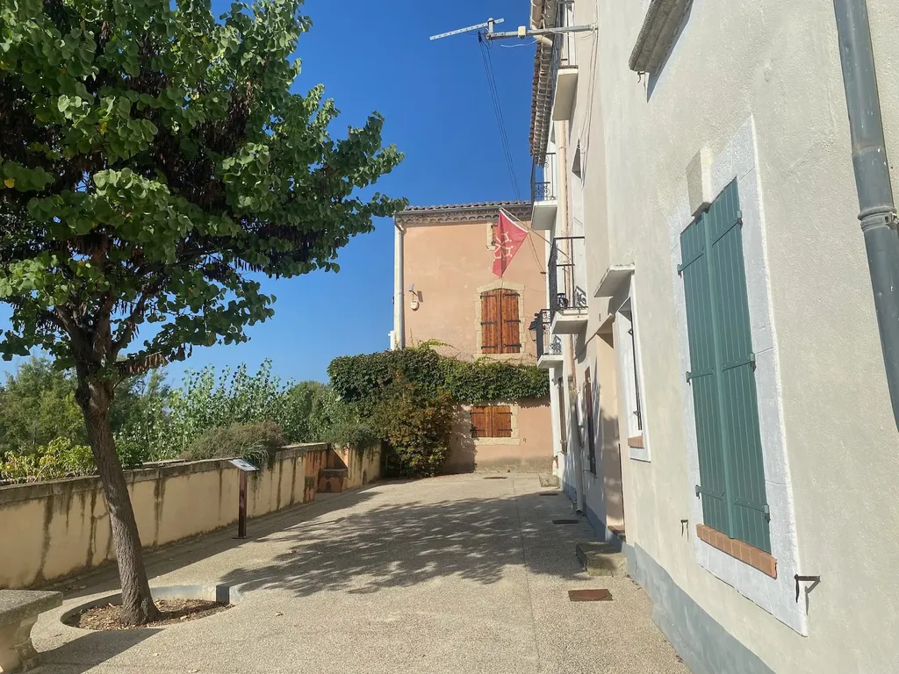

# Octobre 2023

### Dimanche 1er, Balaruc

[Jérôme Leroy se moque gentiment des joggers qui passent devant lui pendant qu’il lit sur un banc.](https://www.facebook.com/cornelius.rouge/posts/pfbid02e5aLjCRUaxAtHMCKugkfZGJ7qX9sj4N9FjGQBfTXk5H5HaGBvVY27DsExktxwumPl) Il oublie un détail : celui qui court gagne de l’énergie pour quand il ne court pas, et il peut l’utiliser pour lire, écrire, rêver… Mais celui qui n’a jamais couru, ou fait un autre sport d’endurance, ne peut pas comprendre cette subtilité. C’est un paradoxe, mais faire du sport me donne plus de temps pour vivre, là, tout de suite (sans même parler du plaisir de faire du sport). On a tout à gagner à se bouger les fesses.

### Lundi 2, Balaruc

Durant l’été 2022, j’ai écrit un petit roman, *Épicènes*, qui sera publié l’année prochaine, chez un nouvel éditeur. Pendant que Pierre lit *Le Code Houellebecq*, je tente de voir ce que les IA pourraient dire de ce texte. J’ai créé un bout de code Python pour le vectoriser avec Langchain, chargeant le tout sur Pinecone. Je suis dès lors capable de discuter avec mon propre roman, sans être ébloui par ce qui en sort. ChatGPT le comprend mal, au point d’être incapable de le résumer.

---

Je ne suis pas sorti de ma crève, qui se porte sur mes entrailles. Je n’ai jamais ressenti aussi puissamment ma nature liquide : j’ai l’impression de me dissoudre à grands coups de sabre douloureux.

### Mardi 3, Balaruc

J’ai beau avoir confiance dans *Le Code Houellebecq*, je suis dans l’attente de la réaction finale de Pierre, aussi fébrile que s’il s’agissait de mon premier texte. Je devrais regarder tout cela avec distance, mais j’en suis incapable : après avoir écrit pour moi, j’écris pour les autres, et l’éditeur est un autre notable, puisqu’il doit aimer un texte au point d’investir quelques milliers d’euros.

---

Mes premières expériences avec Langchain me déçoivent. Quand je demande quels sont les dix points forts de mon *Épicènes*, ChatGPT me répond « Je ne sais pas. » Mes petits jeux avec les API me coûtent 5 € (plus rien n’est gratuit, sauf la plupart de mes textes).

### Mercredi 4, Balaruc

J’attends, retourne pédaler autour de l’étang, fais un peu d’admin, nettoie mon matos de bikepacking, j’attends que Pierre me réponde, j’attends, je déteste attendre. La vie blesse, l’animal a peur. Je génère des images avec les IA, c’est tout aussi étourdissant que les textes. Je lis aussi. Je regarde le bleu étonnant de ce mois d’octobre, qui enfin nous propose une lumière de septembre. Je lis, je me repose, je crois que j’ai besoin de me reposer. Entre le vélo et l’écriture, je n’ai pas arrêté depuis fin mars. C’est presque suspect de ne rien faire.

### Jeudi 5, Balaruc

Deux fois Pierre m’a dit oui pour un roman, avant de se rétracter. Comment mon attente pourrait être sereine ?

### Vendredi 6, Balaruc

Le bleu, d’une pureté éblouissante. Pas assez détendu pour le goûter pleinement. Pierre m’appelle mardi. Quand il tarde, c’est qu’il hésite, quand il hésite, c’est non.

### Samedi 7, Balaruc

J’essaie encore de lire Marthe Robert, mais ses références incessantes à Freud et à la psychanalyse me désespèrent. Construire une œuvre sur un échafaudage branlant, et elle s’écroule avec lui.

---

Je rêve d’écrire avec les IA depuis toujours. Isa me dit que j’ai été long avant d’expérimenter. J’ai effectué mes premiers essais [en janvier 2022 avec le playground d’OpenAI](../../2022/1/lecriture-assistee-par-la-machine.md). Puis, plus rien jusqu’au lancement de ChatGPT à l’automne. J’ai testé, sans encore réussir à voir en quoi l’outil pourrait m’inspirer, me transformer, me pousser dans de nouvelles directions. Puis début 2023, alors que j’étais à Paris, il m’a pris la lubie de séparer mon blog d’un serveur dédié. J’ai commencé à interroger ChatGPT pour qu’il m’aide à coder mon convertisseur, et j’ai compris que nous changions d’époques. Si je n’avais pas codé cet outil de conversion, puis Geogram, je n’aurais pas senti à quel point les LLM bouleversent notre rapport à la création intellectuelle.

En avril, j’ai commencé à écrire un space opera. Comme je le faisais avec le code, j’ai interrogé ChatGPT : pour les noms des personnages, les descriptions, les situations… L’IA devenait mon assistante, sans encore être consubstantielle de la narration. Le 11 mai, je suis à Paris, je fais une démo de ChatGPT à Pierre, puis une autre à Tim, et l’idée préliminaire au *Code Houellebecq* s’affiche sous nos yeux éberlués. Je me presse de boucler *Le Roman de mon père*, puis début juin je me lance. J’aurais écrit le roman en quatre mois, quatre mois du matin au soir et même la nuit, à finir par perdre le sommeil. Jusqu’à ce que samedi dernier je le boucle et l’envoie à Pierre, et me retrouve béat face au bleu, avec encore du mal à prendre du recul sur cette aventure.

Comme j’ai débranché, viendra le moment où je ne voudrai plus entendre parler des IA, où j’aurai besoin de revenir à ma seule sensibilité, comme dans ce journal. De nombreux auteurs feront ce choix du 100 % bio, tandis que la majorité des autres se convertira aux IA. C’est déjà le cas pour les médias en ligne. Tous les articles structurés de la même façon : accroche l’alléchante avec une promesse faramineuse, puis des rappels barbants, avec vers la fin une vague information sans saveur enterrée pour qu’il soit difficile de la retrouver en lecture rapide. Des articles déjà écrits pour que des IA les résument et en extraient les quelques mots utiles.

Je doute que l’avenir de la littérature soit flamboyant. Quand je demande des conseils à ChatGPT ou à Claude, il tente systématiquement de me ramener à une forme grand public, une espèce de norme best-seller. « Ajoute des dialogues… » Alors que je les maîtrise mal et ne les aime guère. Il ne m’incite pas à l’exploration ou à l’invention formelle. Je ne sais vraiment pas où nous allons, à part que de plus en plus de livres seront écrits, sans doute d’un niveau moins médiocre que par le passé, mais sans pour autant nous éblouir.

### Dimanche 8, Balaruc

### Lundi 9, Balaruc

[L’IA influence aussi la mode.](https://wwd.com/fashion-news/designer-luxury/xander-zhou-spring-2024-designer-spotlight-1235865622/) Les créateurs utilisent pour attirer l’attention. Comment tenir un autre discours ? Quand j’ai écrit avec Twitter, c’était pour le plaisir de la contrainte, non pas parce qu’écrire avec Twitter était branché, mais les journalistes n’ont rien vu d’autre. J’écris avec des IA parce que ma technique narrative se réinvente (comme mon style s’est réinventé avec Twitter). J’aimerais ne pas avoir à parler des IA, mais seulement de mon texte. Je pourrais dire : « Vous ne demandez pas aux autres auteurs pourquoi ils écrivent avec Word, alors pourquoi vous me demandez pourquoi j’écris avec des IA ? J’écris avec tout ce que je trouve. Rien de plus. L’important, c’est ce que j’écris, pas comment je l’écris. Ce comment n’intéresse que les autres écrivains. C’est important, mais un sujet de spécialistes. On peut en parler, mais je doute que ça intéresse beaucoup de lecteurs. » Bon, moi ça me passionne, voilà pourquoi j’en parle ici. Aussi parce que c’est le lieu.

### Mardi 10, Balaruc

Appel de Pierre, ambiguë, ni ou ni non. Il doute. Ma seconde partie le met mal à l’aise, parce que je le mets en scène. Toute l’architecture du roman repose sur cette mise en abîme (et elle est plus forte si l’éditeur du roman est l’éditeur qui publie le livre, même si dans le fond ça ne change rien au propos ni à l’histoire si l’éditeur s’appelle Duchmol).

Pierre évoque la possibilité de ne publier que la première partie. Mais alors le texte viendra sans sa mise en perspective et il apparaîtra comme un pastiche de Houellebecq, ce qu’il n’est pas, ce que je ne veux pas qu’il soit. C’est hors de question.

Tout cela un peu décourageant. Difficile de ne pas se contenter d’écrire un énième polar. Une énième histoire déjà écrite (comme une vulgaire IA). Je peux m’autopublier, mais je n’en éprouverai aucune satisfaction. Je suis juste dans une urgence, parce que de nombreux autres auteurs comme James Frey, s’apprêtent à tirer.

### Mercredi 11, Balaruc

Je viens de terminer les révisions d’*Épicènes* et d’envoyer le roman à mon éditeur.

---

Message à Pierre. On ne se comprend plus.

« Je n’aurais pas écrit *Le Code Houellebecq* sans l’aide des IA. Déjà parce que l’idée du livre est venue de ChatGPT, non de moi. Parce que jamais je ne me serais amusé à mettre en scène Houellebecq et écrire en partie à sa manière. Les pastiches ne m’ont jamais intéressé. Puis j’ai découvert que c’était l’occasion rêvée de questionner le rôle des IA dans la création littéraire (et de généraliser à leur rôle dans nos vies). C’est ce qui m’a décidé à m’attaquer au projet. Voilà pourquoi la seconde partie est essentielle. Toute la première n’est construite que pour servir de support à cette seconde partie.

« J’ai donc utilisé l’IA pour l’idée de départ, puis pour sculpter chaque paragraphe, chaque phrase, lui demandant de l’aide pour les descriptions, les dialogues, les citations, les articles de presse. Infatigablement, j’ai soumis mes textes à la critique de ChatGPT et Claude. J’ai fini par ne plus savoir ce qui était de moi ou d’elles. J’ai fusionné avec elles.

« J’ai souvent pensé au travail que faisait Flaubert avec Louis Bouilhet, à qui il soumettait tous ses textes pour qu’il les critique sans pitié. Les IA auront été mon Louis Bouilhet pour ce projet (en plus d’être le sujet même du texte). »

### Vendredi 13, Balaruc

La littérature compte peu dans notre monde agité. Mes soucis éditoriaux, mes questions esthétiques, ne sont que de la rigolade.

### Samedi 14, Balaruc

« Il faut être absolument moderne. » Une injonction impossible. Rimbaud me paraît si peu moderne, ses mots datés, des couleurs d’un pourrissement ancien, sans rapport avec celui qui nous dévore aujourd’hui. Une injonction impossible. Plus on se veut moderne, plus on se démode vite. Je prends conscience que mon peu de culture classique m’a protégé de fantômes pesants. Et quand j’écoute les littérateurs sur France Culture, j’ai l’impression d’entendre des morts-vivants. Nous n’habitons pas la même époque. Le temps se partage en deux, se déchire, et nous jette sur des rives trop éloignées pour que nous nous parlions de l’une à l’autre.

Des mots datés : empesté, mendiant, briguant, damné, dieu… qui mis ensemble me renvoient au moyen-âge et non à une quelconque modernité, mot lui-même daté. Il ne reste qu’un présent qui me glisse entre les doigts, surtout quand je manque du courage pour m’y baigner. Alors ce matin, je traînasse, lis un roman de science-fiction sans saveur, médiocre de part en part, mais dont l’histoire me divertit (parce qu’elle se déroule dans un monde qui me plaît). Je prends conscience que j’ai esquissé un monde dans *Épicènes*. Je pourrais le développer.

### Lundi 16, Balaruc

Je déteste passer de l’hyperactivité à l’attente. L’impatience me pousse à prendre des décisions hâtives, souvent contre mes propres intérêts. Le plus difficile est de savoir qu’il me reste encore tout à faire dans l’exploration des IA littéraires. Et je me retrouve entravé par des réticences marchandes. Des désirs de monter un site marchand me viennent. M’occuper de gagner un peu d’argent pour me payer des plaisirs, et laisser tomber mes combats esthétiques. Quel sens ont-ils dans notre monde ? Une profonde contradiction traverse ma vie. Je n’en finis pas d’être à cheval entre deux époques.

---

J’ai décidé de rester intransigeant sur les deux parties de mon roman. Pierre me répondra vendredi, alors que j’attends une discussion, non un oui/non. Du coup, je sais déjà que sa réponse est non. Je ne peux pas lui en vouloir. Je travaille une matière qui lui est étrangère.

---

Je médite, appuyé à la fenêtre de la cuisine, du côté jardin. Je regarde l’écureuil ramasser des pignons sous le pin. Plus tard dans la matinée, je ratisse les aiguilles de pin, et je tombe sur le cadavre de l’écureuil, recroquevillé, rigide. Notre chatte ne l’a pas tué. Elle aurait joué avec son cadavre. L’écureuil est mort tout seul. Empoisonné ? Tombé du pin ? Ou victime d’un arrêt cardiaque ? Une mort naturelle, en quelque sorte.

---

[J’essaie de générer avec ChatGPT des images de vététistes et il leur colle systématiquement un sac à dos.](../10/promo-devenements-velo-avec-les-ia.md)Quels que soient mes prompts, les sacs restent. Je me demande ce que cela implique : dans la conscience collective, le vététiste porte-t-il un CamelBak ? Combien d’autres travers norment les LLM ?

### Mardi 17, Balaruc

J’utilise les IA pour écrire comme j’utilise internet. Impensable de faire autrement. J’ai écrit *Le Code Houellebecq* comme tout le monde s’apprête à écrire. Je veux bien en parler, mais ma technique d’écriture ne peut être un argument de vente (et la seule raison de publier mon texte). Mon roman parle d’une transition dans l’histoire de la littérature.

Je dis « impensable de faire autrement » et pourtant l’année dernière j’ai écrit *Épicène* sans pratiquement utiliser internet. C’est un texte venu du passé. Une histoire qui se joue dans des lieux innommés, des époques floues. Il n’y a pas d’obligations, juste des possibilités.

### Mercredi 18, Balaruc

[Sur France Info](https://www.francetvinfo.fr/replay-radio/le-choix-franceinfo/temoignages-face-a-l-intelligence-artificielle-le-cinema-francais-encore-dans-le-flou_6099573.html), une scénariste croit encore que les IA ne sont pas créatives. Elle ignore comment les utiliser, puis s’étonne d’avoir des résultats médiocres. Ou comment fermer les yeux face à l’impensable. Mon roman dérange peut-être Pierre parce que j’y reconnais la puissance créative des IA. C’est un dérangement inconscient, un petit caillou au fond de la chaussure. Mais qu’est-ce que la créativité ? Quand est-ce que je suis créatif ? C’est un phénomène électrique : deux lignes parallèles soudain se rejoignent et produisent des étincelles dans mon cerveau. Cette capacité à connecter le dissemblable est une compétence de tous les réseaux, notamment les réseaux numériques. La créativité n’est qu’une graine (comme l’idée de mon roman soufflée par ChatGPT). Le plus difficile reste de la faire germer, puis fructifier. À ce stade, les IA pèchent encore, même si elles peuvent nous aider tout au long du processus.

---

Si Pierre me publie, ne se met-il pas en porte à faux avec ses autres auteurs ? Est-ce que me publier ne revient pas à casser la niche sur le dos des chiens ? Ça passerait s’il s’agissait d’une expérience amusante, un pastiche, une blague, juste une fois. Mais reconnaître que le monde ne sera jamais plus comme avant est une autre affaire. Cela reviendrait à dire à tous les auteurs : « Vous faites comme Crouzet ou je ne peux plus vous publier. » Mais que Pierre le dise aujourd’hui, ou dans un an, cela est déjà en train de se produire. Je n’y suis pour rien. J’accepte la situation et m’en saisis avec passion.

Ou je délire. J’attache beaucoup plus d’importance à ces histoires d’IA que Pierre. Ses interrogations sont essentiellement marchandes. S’il était sûr de vendre 10 000 exemplaires de mon roman, il l’aurait déjà annoncé. Mais alors, s’il ne voit pas de potentiel commercial, quel autre éditeur sera capable de prendre le risque ? Mon nom n’a aucune valeur marchande. C’est bien le cœur du problème, mais c’est peut-être aussi pourquoi je me permets d’essayer des trucs avant mes collègues.

---

Petit tour de vélo. J’avise sur un large chemin une promeneuse, au milieu, comme pour en prendre possession, avec son chien non tenu en laisse sur sa gauche. Je décide donc de passer sur la droite, grand vent humide dans le nez, donc je ne roule pas bien vite. Le chien me fonce dessus, je freine, mes disques hurlent et la femme sursaute, se retourne et m’insulte, parce que je lui ai fait peur. Je tente de lui expliquer que son chien m’a attaqué. Elle me traite de tous les noms alors que je m’éloigne. La violence traverse le monde.

### Jeudi 19, Balaruc

J’attache de l’importance à la publication parce qu’elle justifie de nouvelles expérimentations. Mais, dans un monde éditorial de plus en plus timoré alors que le marché se durcit, les expérimentations sont de plus en plus difficiles à publier.

Expérimenter pour expérimenter n’est qu’un solipsisme. J’ai besoin de perspectives autres que me dire que mes bafouilles finiront sur mon site. Les perspectives me poussent à me dépasser, à aller au bout des projets. Je dis ça, mais je recommence malgré tout, un truc me prend et m’emporte. Je suis simplement dans le creux après un travail d’une intensité jamais connue.

### Vendredi 20, Balaruc

Je commence *Faith, Hope and Carnage* de Nick Cave. Il parle de l’improvisation en musique et je prends conscience que nous autres écrivains ne connaissons que l’improvisation. C’est notre façon de vivre. Notre art ne se conçoit pas autrement. Nous n’avons jamais l’occasion de nous reposer. Nous sommes sans cesse sur la corde raide.

---

Pierre ne me répondra que lundi.

### Samedi 21, Balaruc

Je ne parle pas de la vie du monde comme si elle ne m’affectait pas, mais sans doute est-ce parce que tout le monde en parle, et que je ne vois pas pourquoi ajouter des remarques inutiles. Je suis dans la plus grande incompréhension des violences collectives. Je ne comprends pas pourquoi les uns les perpétuent contre les autres. Ou je le comprends trop bien : quand une promeneuse décide avec son chien de s’approprier un chemin, toutes les appropriations sont envisageables, et toutes les violences légitimes du point de vue de celui qui les perpètre. J’en viens à être traversé de bouffée de violence contre tous les accapareurs, à commencer par ceux qui gangrènent l’espace public : les promeneurs qui se croient seuls, les restaurateurs dont les terrasses envahissent les promenades et les trottoirs, les sagouins qui déversent leur ordures dans la nature, les propriétaire qui posent des panneaux interdiction de passer alors qu’il n’y a rien à protéger ou à défendre, les adeptes du camping-cars qui défigurent les paysages avec leur inélégantes carrosseries blanches…

---

Je lis le début de deux romans de James Frey, parce qu’il défend l’usage des IA. De l’esbroufe, de la violence, de l’air du temps survitaminé. Une collection de clichés. Rien de plus que ce qui est balancé partout, aucun décalage, aucune rupture qui pourrait faire date, mais qui en attendant fait vendre. Avec les IA, il va tout défoncer, parce qu’elles sont expertes pour se conformer. Elles ramènent à la probabilité maximale, alors que notre travail d’artiste est de toujours chercher les improbables les plus extrêmes, pour faire jaillir des beautés nouvelles.

---

J’ai publié hier une illustration pour une de mes aventures bikepacking et beaucoup de gens me disent l’adorer. Mais qui est l’auteur ? ChatGPT. Ils ont du mal à le croire. Qu’ils adorent cette affiche me fait mal. Parce que depuis quelques années je ne cessais d’en fabriquer avec mes dix doigts sans jamais recevoir autant de bravos. En ira-t-il de même avec les textes purement IA ? Que c’est bien écrit ! J’ai d’ailleurs remarqué que les IA génèrent des textes avec des indices de lisibilité bien supérieurs aux miens, et même à ceux de tous les auteurs avec qui je les ai comparées. Plus lisibles que les humains, vont-elles imposer une nouvelle prosodie ? Vont-elles imposer le degré zéro de l’écriture ?

---

Quand je demande à ChatGPT de me corriger, avec un prompt maison que je considère désormais comme une extension indispensable d’Antidote, il me suggère souvent de nombreuses corrections. Aujourd’hui, nous le testons sur un texte traduit par Isa à l’aide des IA. ChatGPT ne trouve rien à redire, alors que le texte nous apparaît boursouflé.

### Dimanche 22, Balaruc

Désormais, la vérité est dans la bouche des IA (qui mentent souvent, mais parfois résument avec une froideur effrayante la pensée collective).

---

Suis-je libre ? Pour exercer ma liberté, ici et maintenant, je pourrais décider d’autopublier *Le Code Houellebecq*, plutôt que d’attendre la décision de Pierre. Mais je peux tout aussi bien décider d’attendre un jour de plus. Me mettre à la place de Pierre m’aide à regarder ma situation avec philosophie. Je ne suis qu’un auteur parmi la centaine avec qui il travaille, je ne suis que quelques instants dans sa vie, et son temps avec moi est infime comparé à mon temps avec lui, et nos perceptions de ce temps sont inconciliables. Dans la brièveté des jours qui filent, il ne peut concevoir l’éternité dans laquelle il m’a plongé.

---

J’aime découvrir dans mes mails de petits messages littéraires. Ce matin, [Caroline Diaz m’invite à l’une de ses promenades](https://lesheurescreuses.net/2023/10/22/jaurais-aime-que-mon-sourire-lui-en-dise-plus/). Quand je manque de force, quand je doute, j’ai besoin de mots posés avec la vie en arrière plan pour me remettre en route.

---

[Dixit le patron du théâtre du Châtelet chez François Bon](https://www.facebook.com/francoisbonperso/posts/pfbid036S6HD5xsiQzYkRJoV2QKMFPN8YFHFodZSo3RKSYnxSrQD4UHEbFWhEWtEiUzn8jMl) : « La maison vit dans une relative sobriété. Je gagne 12 000 euros brut par mois. J’ai toujours accepté ce qu’on me donnait en salaire dans le théâtre public et je ne me suis jamais augmenté nulle part. J’ai accepté ce poste en assurant que je ne ferais aucune négociation. » Un monde d’apparatchiks inconscients de leurs privilèges. Je déteste ces bonzes de la culture (et ils me l’ont toujours bien rendu par leur silence méprisant). À choisir, je crois que je préférerais me jeter dans les bras d’un capitaliste. Ne me parlez plus jamais de subvention, de bourse, de résidence d’auteur. Je ne veux plus jamais avoir à faire à vous. Que vous existiez encore est un des grands échecs de ma génération. Je me suis contenté de vous fuir. J’aurais dû vous combattre avec davantage d’acharnement. Il n’est peut-être pas trop tard.

---

[Céline Curiol aussi expérimente avec ChatGPT.](https://aoc.media/fiction/2023/10/21/ce-nest-pas-le-langage-qui-fait-le-langage/) Je fais l’inventaire pour me sentir moins seul. Mais quelle idée de se sentir seul quand nous sommes innombrables à labourer la moindre parcelle du langage. Phrase étrange avec « se », « on », « nous ». Pourtant ChatGPT n’y trouve rien à redire.

### Lundi 23, Balaruc

Je devrais me faire davantage confiance. J’anticipe toujours assez clairement les choses. Comme le revirement de Pierre. Il refuse *Le Code Houellebecq* après m’avoir poussé à le tronçonner. Ne plus jamais écouter un éditeur tant qu’il n’a pas fait un chèque.

Sa réponse : « Je suis très embêté après l’enthousiasme que j’avais sur l’idée (TC : correction ce n’était pas sur l’idée, mais après la lecture de la première partie), je ne sens pas le projet (TC : ce n’est pas un projet puisque le manuscrit est bouclé). Je le trouve trop dans l’air du temps et donc à la fois très moderne et qui risque de vite vieillir (TC : j’ai du mal à saisir, comme si La Manufacture ne publiait que des indémodables…). Je ne sais pas, c’est peut-être le sujet d’un essai avec des extraits, des analyses de textes, des explications techniques, des projections philosophiques sur ton cheminement avec la machine, mais dans le texte on ne voit pas où intervient l’IA et où intervient ta réécriture (TC : parce qu’on s’en fiche, parce que ça n’a aucune signification, parce que même moi je ne le sais pas). Ensuite la partie où la manufacture figure est trop autocentrée. Je viens de faire l’exercice avec *Le Livre de la rentrée* et hors le succès d’estime de la mise en scène métadiégétique, cela reste un exercice un peu confidentiel (TC : c’est sûr, mais mon texte ne règle pas ses comptes avec le milieu littéraire, il traite d’un sujet universel qui n’est pas prêt de se démoder).

« Je dois être très limité dans mes parutions et je vois mal comment je pourrais vendre l’idée : est-ce un roman purement écrit par l’IA et alors on est dans une machine à pastiche (TC : tu sais bien que ce n’est pas le cas, une IA est incapable d’écrire un tel texte). Est-ce que l’IA a des choses à dire ? Ou alors est-ce un outil technique pour aider les écrivains et l’imagination ? (TC : les outils techniques sont les prompts, dans ce texte il y a un seul prompt dans la seconde partie.) Auquel cas c’est plus un essai avec des exemples concrets, des textes écrits plusieurs fois avec des styles différents qui serait intéressant, mais pour quel public ? (TC : tout cela pullule en ligne.)

« Peut-être que l’idée est bonne, mais ne tient pas sur tout un roman ?

« Bref je ne le sens pas vraiment ou alors je n’ai pas compris ton propos. Ça m’ennuie parce que cela t’a pris du temps. »

Que l’écriture m’ait pris du temps n’a pas beaucoup d’importance, parce que j’ai rarement éprouvé autant d’excitation en travaillant sur un texte. Ce qui me dérange c’est le oui initial, puis le revirement. Ce putain de livre parle du grand remplacement des humains par les machines, avec un prisme sur l’édition. J’ai fusionné avec la machine. Je suis devenu un cyborg. Ce qui est de moi ou d’elle n’a aucune importance. Cela n’a plus le moindre sens. Je suis bien incapable de pourvoir répondre à cette question.

Pierre s’intéresse à l’anecdote, pour lui l’IA est une anecdote. Moi, je m’augmente avec l’IA (comme avec mes lunettes, mes ordis, mes livres…). C’est ici dans ce journal que je parle de mon travail, de sa progression, de mes doutes et de mes combats. Tout cela n’a rien à faire ailleurs.

Des centaines d’auteurs prennent les IA en main ([suffit de regarder ce qui se passe](https://www.geeky-gadgets.com/write-books-using-chatgpt-4/)). Nous sommes à l’avant d’un nouveau front. Seul compte ce que nous avons à dire, c’est comme avant, rien n’a changé. L’IA est un outil de plus à côté de nos dictionnaires. Peut-être que cette évidence ne peut nous toucher qu’une fois que nous avons pactisé avec elles. Je suis un collabo de la première heure.

Mais est-ce que Pierre a raison ? Je fais lire le roman à un copain, parmi les moins complaisant que je connaisse, puis lui donne le message de Pierre. Réponse : « En effet, il n’a rien compris. » J’ai écrit un roman avec de l’IA qui s’immiscent subrepticement partout. Pas un essai sur l’écriture avec elles. Que de contorsions pour justifier un non.

Le plus drôle : la plupart des titres que publient les éditeurs aujourd’hui pourraient être déjà écrits par des IA, tant ils ne s’écartent en rien de ce qui a déjà été écrit. Moi, je tente d’utiliser les IA pour écrire ce qui n’a pas encore été écrit.

---

Une anecdote qui remonte du passé alors qu’avec Isa nous nous demandons à qui proposer le roman. Surtout pas Laurent Laffont qu’elle a rencontré une fois chez Lattès. Il lui a dit « Isabelle Crouzet, comme Thierry Crouzet ? C’est un écrivain qui ne sait pas écrire. » Je l’avais croisé quand je travaillais sur Ératosthène. Voilà peut-être qui résume ma vie littéraire et ma relation au monde littéraire.

### Mardi 24, Balaruc

Depuis hier, fiévreux, malade, le cerveau en compote, ce qui m’évite des réactions intempestives comme balancer mon roman en ligne et qu’ils aillent tous se faire foutre. Ce n’est pas le covid, rien que ma trachéite du début du mois qui ne s’est jamais vraiment résorbé et qui dégénère. Antibios.

### Mercredi 25, Balaruc

Je dors, transpire, incapable de penser à mon roman, alors que je dois remettre le projet sur ses rails initiaux, avant que Pierre ne le fasse dérailler. En fait, je suis un bon bougre, je veux faire plaisir, je me fiche d’avoir raison au regard de la postérité, je n’accorde d’importance qu’aux récompenses immédiates. Je passe la journée à coder, c’est moins exigeant que la littérature.

### Jeudi 26, Balaruc

J’ai créé un compte [crouzet.bsky.social](https://bsky.app/profile/crouzet.bsky.social). Mais je me demande à quoi bon créer un nouveau réseau social pour y dire la même chose que sur Twitter. J’ai fui Twitter, mais là je le retrouve plus ou moins identique, en juste moins populaire. Si l’outil est identique, et identique dans ses ambitions capitalistiques, il créera les mêmes usages. Je ne suis même pas sûr que la nature financière d’un service influence beaucoup ses usages. Seule l’impopularité garantit un certain élitisme.

### Vendredi 27, Balaruc

Poussé par un copain, j’envoie mon manuscrit à un premier éditeur. Extraits de mon mail : « *Le Code Houellebecq* est un roman sur les IA, écrit avec les IA (mais pas par les IA). (...) Le sujet du roman est de la plus haute importance (et urgence). Il s’agit du grand remplacement des humains par les machines, avec un focus sur le monde de l’édition. « Pour obtenir le prix Goncourt 2025, un éditeur ambitieux demande à Zola, une IA, de lui écrire son livre de la rentrée. » (...) Le pitch initial était sensiblement différent : « En panne d’inspiration, Michel Houellebecq demande à Zola, une IA, d’écrire son prochain roman. » Je compte reprendre le texte en ce sens. »

### Samedi 28, Balaruc

Je suis sorti de mon trou pour marcher jusqu’au village et j’ai rejoint notre miraculeuse librairie Nomade. Soirée signature pour la sortie d’un sublime livre sur l’histoire des palettes de couleurs : [*Nuanciers*](https://www.seuil.com/ouvrage/nuanciers-anne-varichon/9782021476798). Je demande à l’autrice pourquoi elle n’a pas parlé des nuanciers Web ? Pourquoi elle a stoppé son histoire avant l’immense production contemporaine ? Réponse : par rejet des écrans, parce qu’ils écartent de la matière, de la subtilité des nuances. Moi qui croyais que l’histoire avait pour vertu de nous aider à comprendre le présent. Reste que le livre est magnifique et qu’il aurait été impossible sans les technologies contemporaines.

---

Depuis que Pierre m’a dit non, je suis plus tranquille, je redeviens moi-même. Je supporte le rejet avec philosophie parce que je m’y suis habitué depuis l’enfance. C’est l’attente que je déteste, être à la merci d’un tiers, alors que j’ai passé ma vie à éviter de me retrouver dans cette situation.

### Dimanche 29, Balaruc

[Un artiste pêche et met ses poissons dans un sceau. Une IA arrive et vient pêcher dans son sceau.](https://www.facebook.com/xavier.besse/posts/pfbid02oqQg8vNYXknGQz3u9gHQAWogBK7oLX6oNnbvvoccpXXVWqxTVKMNZWXGhntedPgQl) Cette illustration exprime ce que la plupart des gens pensent. Mais un commentateur joue avec l’image. À la place d’une IA, un deuxième artiste arrive qui pêche dans le sceau du premier, puis un troisième, et ainsi de suite, avant qu’éventuellement une IA arrive et ne fasse pas autre chose. La seule différence : elle est plus rapide, infatigable. C’est ça qui fiche la trouille à beaucoup, alors que ça m’ébouriffe le cerveau. Une autre illustration postée sur le fil montre des artistes pêchant dans les sceaux d’IA qui elles-mêmes pêchent dans ceux des artistes. Nous vivons un brassage extraordinaire ou les limites de qui fait quoi se brouillent. Nous devrions nous en réjouir. Mettre notre ego de côté. Prendre tout cela, le démultiplier avec passion. Je vois surgir des arguments religieux pour défendre l’artiste qui irait chercher son inspiration auprès du divin. Il y a une grande trouille chez beaucoup de gens. Utiliser les IA comme nous sommes des millions à le faire devient presque une provocation.

### Lundi 30, Balaruc

Un petit geste, inscrit dans une longue logique, je viens de supprimer de mon site les icônes Facebook et Twitter. Si quelqu’un veut partager un article, il lui suffira de copier l’URL et de le coller ailleurs. J’ai aussi lancé le backup de Twitter.

### Mardi 31, Balaruc

Je récupère mon archive Twitter et ferme mon compte, sans même un message d’adieu. Je n’y interagissais plus depuis longtemps. Personne ne se rendra compte de ma mort. Personne ne me pleurera.

#carnets #y2023 #2023-11-1-8h0
