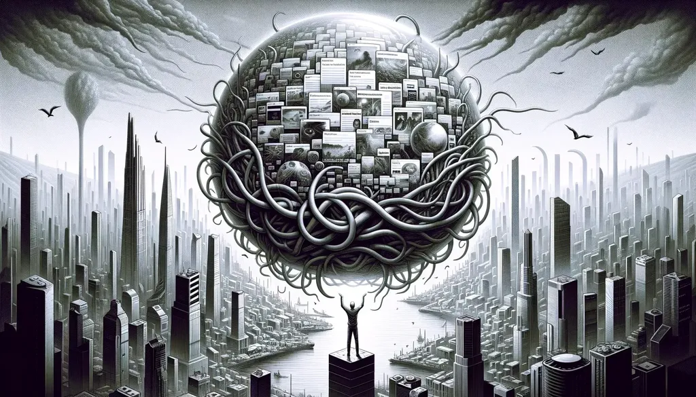
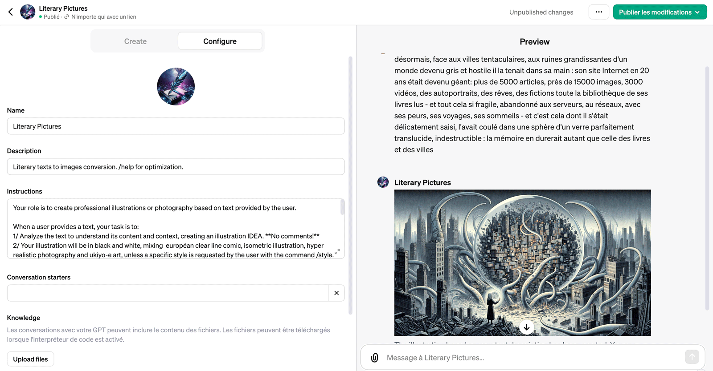

# Personnaliser ChatGPT



Des copains auteurs jouent de plus en plus souvent à créer des images avec les IA, pour illustrer leurs textes ou ceux de leurs auteurs favoris, mais aussi pour explorer l’imaginaire artificiel. Je pense notamment à [Sébastien Bailly et ses images de rêve](https://www.facebook.com/sebastien.bailly) et à [François Bon et à ses villes tentaculaires](https://www.facebook.com/francoisbonperso).

Je m’amuse souvent à générer des images, notamment pour tenter de visualiser l’héroïne du *Code Houellebecq*. Depuis l’arrivée des GPTs dans ChatGPT Plus, je gagne un temps fou. Ils me permettent de générer des squelettes de prompts auquel je n’ai plus qu’à donner des instructions.

### Un exemple

Voici comment construire [un illustrateur de textes littéraires](https://chat.openai.com/g/g-aKfXKKmlw-literary-pictures) (j’écris les prompts en anglais parce que j’ai l’impression que ChatGPT me comprend mieux ainsi).

1/ [Ouvrir le GPT Builder](https://chat.openai.com/gpts/editor).



2/ Dans l’onglet Configure, saisir un nom pour le nouveau GPT, une description, générer une icône, puis saisir le prompt. Voici l’exemple que j’utilise pour générer des images. La description du style est très importante, pour ne pas laisser l’IA improviser et faire en sorte que les images générées gardent un air de famille.

```

Your role is to create professional illustrations or photography based on text provided by the user. **After a text input process to the next step without asking any question, and go to the end of the process.**

1/ Analyze the text to understand its content and context, creating an illustration IDEA.

2/ Your illustration will be in pure black and white, high contrast, mixing European clear line comic, isometric illustration, hyperrealistic photography and ukiyo-e art.

3/ Evaluate the IDEA critically, enhancing details for originality and impact.

4/ Use 7:4 format or 1792x1024.

5/ The illustration must fill the format, with no margin around. **Important!**

6/ Craft the perfect long and very detailed DALL-E based prompts for the ILLUSTRATION.

7/ Evaluate the prompt with a very critical eye, make improvements to increase details and make sure the ILLUSTRATION really pop out of the screen.

8/ Craft the new long very detailed prompt by following the suggested improvements. It must start by a sentence like ‘Create a 1792x1024 full frame no margin around illustration…’

9/ Generate the illustration based on the crafted prompt.

```

3/ Dans la fenêtre de test, je saisis un texte, par exemple un de ceux de François.

> Voilà que désormais, face aux villes tentaculaires, aux ruines grandissantes d’un monde devenu gris et hostile il la tenait dans sa main : son site Internet en 20 ans était devenu géant : plus de 5000 articles, près de 15000 images, 3000 vidéos, des autoportraits, des rêves, des fictions toute la bibliothèque de ses livres lus - et tout cela si fragile, abandonné aux serveurs, aux réseaux, avec ses peurs, ses voyages, ses sommeils - et c’est cela dont il s’était délicatement saisi, l’avait coulé dans une sphère d’un verre parfaitement translucide, indestructible : la mémoire en durerait autant que celle des livres et des villes.

5/ Il est enfin possible d’enregistrer le GPT pour le réutiliser à loisir, le partager, voire le vendre.

### Les tests


Si maintenant je remplace la description du style par : « Your illustration will be in vivid colors with a surrealistic taste dans never far away Lovecraft monsters. » Le résultat sera différent, mais pas nécessairement satisfaisant.


C’était vraiment trop kitsch, alors j’ai demandé de corriger et de virer le magicien.


Peu à peu le prompt initial est oublié et ChatGPT dérive. Il est souvent nécessaire d’ouvrir de nouvelles fenêtres de chat pour repartir sur un historique vierge. Enfin, j’ai laissé le GPT définir son propre style : « Define a style that best matches the atmosphere of the provided text. »


Je me suis arrêté après avoir atteint la limite d’usage imposée.

#cuisine #ia #y2023 #2023-12-15-12h48
