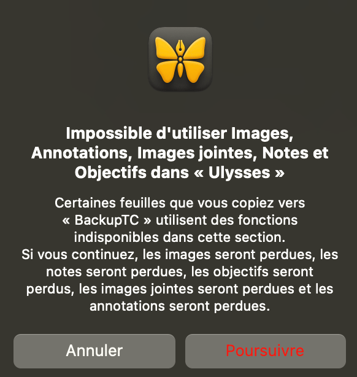
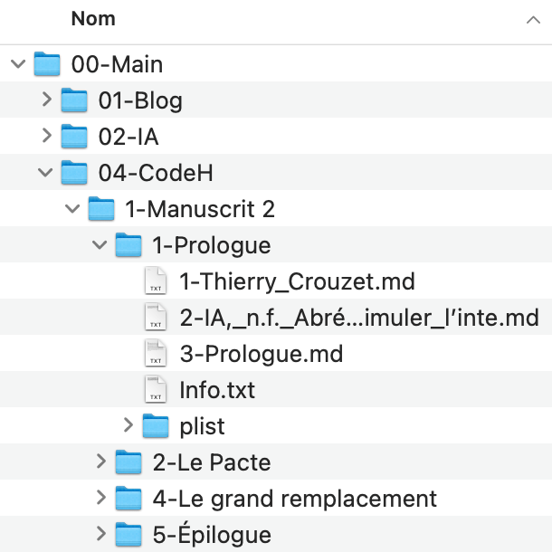

# Pris en otage par Ulysses App

Plus que mon ordinateur, mon éditeur de texte est l’outil auquel j’attache le plus d’importance. Il me facilite ma vie d’écrivain et j’entretiens avec lui une intimité de tous les instants. Quand il plante, je me sens trahi. C’est ce qui vient de m’arriver avec [Ulysses](https://ulysses.app/).

Si durant de longues années j’ai utilisé Microsoft Word, j’ai compris à la fin des années 2000 que cet outil n’avait jamais été pensé pour les écrivains. Bon à tout faire, il n’était excellent pour rien en particulier.

En 2013, j’ai écrit *Le Geste qui Sauve* avec [Scrivener](https://www.literatureandlatte.com/scrivener/overview), pour mieux gérer l’abondante documentation, sans être séduit par cet éditeur qui, bien que puissant, me paraissait aussi lourd que Word, entremêlant de façon encore trop étroite le texte et sa mise en forme. J’avais envie de quelque chose de plus minimaliste. À cette époque apparaissaient les outils d’écriture sans distraction, très proches des éditeurs de code, privilégiant la syntaxe [Markdown](https://fr.wikipedia.org/wiki/Markdown). Il m’a suffi d’y goûter pour comprendre que je ne reviendrais jamais en arrière.

Début 2014, j’ai basculé sur Mac rien que pour pouvoir travailler avec Ulysses, qui depuis 2003 faisait de plus en plus parler de lui. C’était un pur éditeur Markdown destiné à écrire et seulement écrire, optimisé pour la saisie et la structuration du texte, sa mise en forme éventuelle étant dévolue aux fonctions d’exportation. Le coup de foudre a été immédiat.

Depuis dix ans, je lui suis fidèle [malgré quelques crises de nerfs](#ulysses). Mais il y a quelques jours, au moment de relire un texte sur Ulysses iPhone, la synchronisation avec iCloud s’est mise à tourner sans fin. Bientôt, j’ai constaté que sur mon Mac les noms des dossiers et sous-dossiers disparaissaient, ainsi que des fichiers. [Je ne semblais pas être le seul avec ce problème.](https://www.reddit.com/r/ulyssesapp/comments/18k4wsa/i_think_my_library_just_got_wiped_is_there_any/)

Quand le support d’Ulysses a fini par me répondre (niant la généralité du bug), on m’a suggéré de restaurer mes fichiers depuis les sauvegardes automatiques. C’est bien beau, mais jusqu’à quand remonter, depuis quand y a-t-il un problème ? Je ne le sais pas. Et j’ai continué à travailler sur plusieurs projets entre-temps. C’est à tâtons, après plusieurs heures, que j’ai réussi à restaurer mes fichiers, du moins je le suppose. Mon architecture de travail a vacillé durant plus d’une journée.

Alors que même Microsoft s’est rallié à des structures de fichiers ouvertes, Ulysses range mes données dans une arborescence inutilement obscure. C’est comme si des serrures avaient été installées sur tous mes tiroirs. Pourquoi ce choix ? Je n’y vois aucune raison technique, sinon une mauvaise décision prise à l’origine.

Les créateurs d’Ulysses ne semblent pas s’en émouvoir. Quand je leur ai signalé cette anomalie il y a quelques années, ils m’ont répondu qu’il me suffisait de faire glisser mon arborescence d’iCloud vers un dossier extérieur, sur Dropbox par exemple, pour retrouver mes dossiers et sous-dossiers en clair. En vérité, durant cette opération, les images, les annotations et d’autres données de contextes sont perdues, sans que cela soit techniquement justifié. Non moins grave, l’ordre des dossiers et sous-dossiers est lui aussi perdu, remplacé par l’ordre alphanumérique. Très gênant parce que les dossiers correspondent aux parties de mes livres. Cette technique d’exportation est donc pour le moins incomplète.

En comparaison, un outil comme [IA Writer](https://ia.net/writer), avec lequel j’écris cet article, est beaucoup plus transparent. En plus de respecter scrupuleusement la syntaxe Markdown, de tourner aussi sous Windows et Linux, d’être beaucoup moins onéreux, il ne joue pas à l’apprenti sorcier avec mes données. Pour autant, je reste attaché à Ulysses, à sa simplicité, à son ergonomie, mais il est hors de question que je lui sois définitivement assujetti, au prétexte que je serais incapable de me débarrasser de sa structure de données.

J’ai donc passé quelques jours à décrypter les fichiers Ulysses et [à développer un script python qui exporte en clair l’arborescence, sans ne rien en perdre](https://github.com/tcrouzet/ulysses-tools). Ce script suffit à démontrer qu’Ulysses aurait pu dès le début être beaucoup plus transparent. Il n’y a aucun obstacle technique à stocker des documents en clair et à enregistrer les paramètres annexes dans les fichiers json par exemple. Je devrais pouvoir éditer mes fichiers de façon transparente, tantôt avec Ulysses, tantôt avec un autre outil. Si Ulysses ne nous offre pas cette transparence, est-ce de peur que nous allions voir un de ces concurrents ? Si Ulysses n’annonce rien en ce sens dans les jours qui viennent je le quitterai avec regret, mais sans avoir d’autre choix, et je vous conseille de faire de même. Mes données, dans leur absolue intégralité, doivent rester ma propriété.

*PS1 : J’ai écrit cet article le jour de Noël, après qu’une soudaine douleur dans le dos m’ait poussé à quitter les pistes de ski. C’est mon cadeau à l’équipe Ulysses. En espérant qu’ils réagiront, enfin.*

*PS2 : Je n’ai pas publié cet article qu’à nouveau ma destruction aléatoire de dossiers se répète. Je découvre que le mal est profond, je dois remonter de six mois en arrière pour retrouver des dossiers propres. Ma confiance en Ulysses est totalement ébranlée. OK, le problème vient peut-être d’iCloud, mais alors Ulysses doit établir des pare-feu pour ne pas crasher quand iCloud crashe.*

#cuisine #ulysses #y2023 #2023-12-25-16h4
