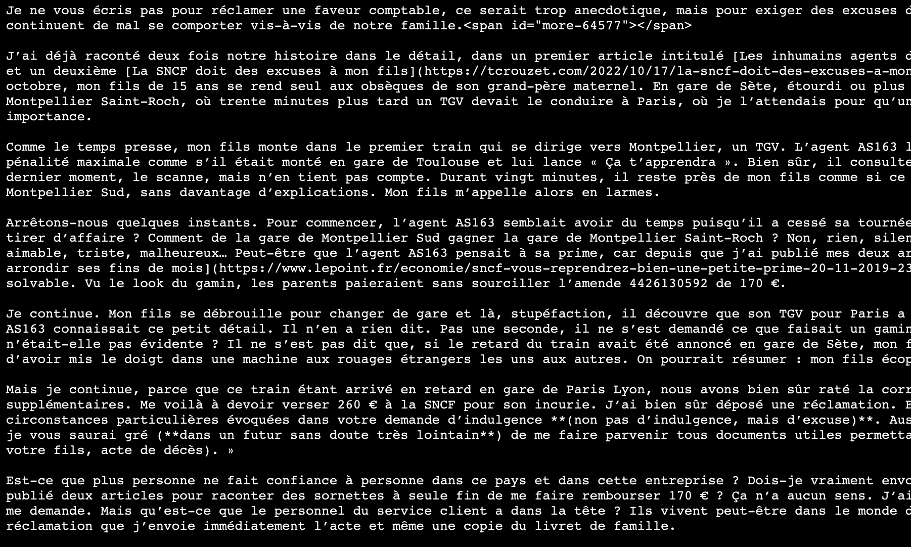
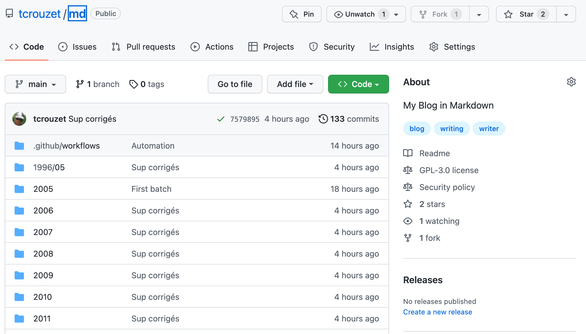
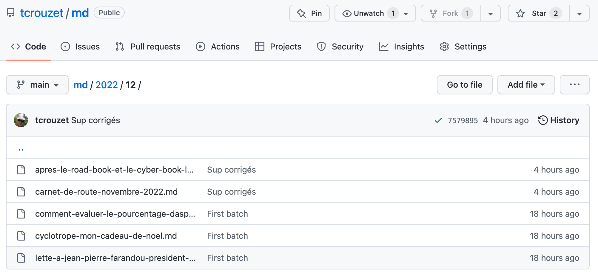
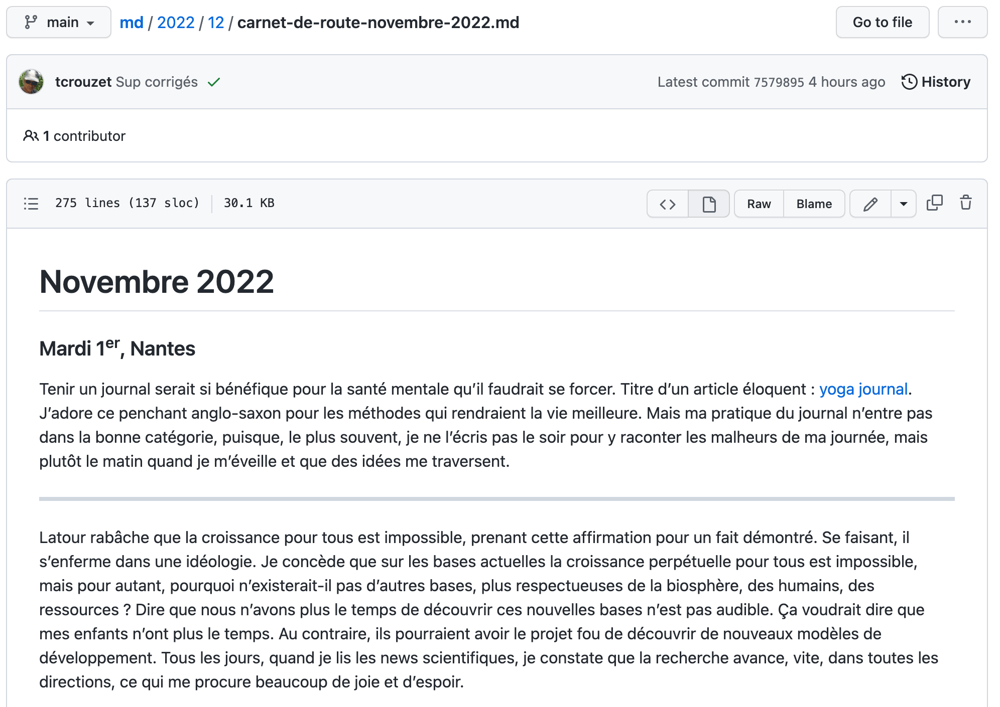

# Archivage littéraire sur GitHub

Après avoir transformé [mon blog en version statique](../1/mon-blog-nest-plus-un-blog.md) qui, à terme, ne nécessitera quasiment plus de maintenance, je me suis attaqué à une patrimonialisation plus radicale. Terminé le HTML, je me contente de publier les textes bruts, [au format Markdown](https://www.markdownguide.org/), format dans lequel j’écris depuis que j’ai abandonné Word il y a plus de dix ans.

J’aurais pu utiliser des outils comme [Mkdocs](https://www.mkdocs.org/) ou [Jekyllrb](https://jekyllrb.com/), voire adopter [le protocole Gemini](https://geminiquickst.art/), mais j’ai plutôt bricolé mes templates et plugins pour générer une archive textuelle purement chronologique. Le sommaire est disponible à l’adresse [md.tcrouzet.com](https://md.tcrouzet.com/) ou directement sur le repository [github.com/tcrouzet/md](https://github.com/tcrouzet/md). De là, il est possible de lire les billets, de les télécharger, éventuellement de les annoter, voire de les corriger. L’ensemble des textes est disponible au format Zip (n’hésitez pas à récupérer le packet pour le garder au chaud dans un coin de votre disque dur).

Ces textes peuvent être ouverts dans des traitements de textes comme Ulysses, remis en page, convertit en PDF, en ePub, en je ne sais quoi, pourquoi pas un nouveau site Web. Seules les images ne sont pas archivées sur GitHub, la taille des repositories étant limitée à 1 Go (je cherche une solution autre que AWS, peut-être [Imagekit](https://imagekit.io/)).

#netlitterature #y2023 #2023-2-2-13h28
