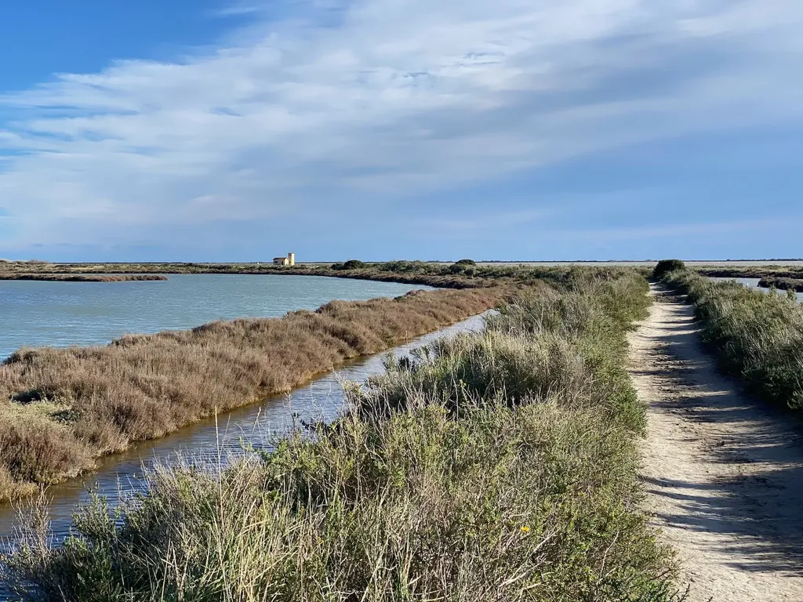
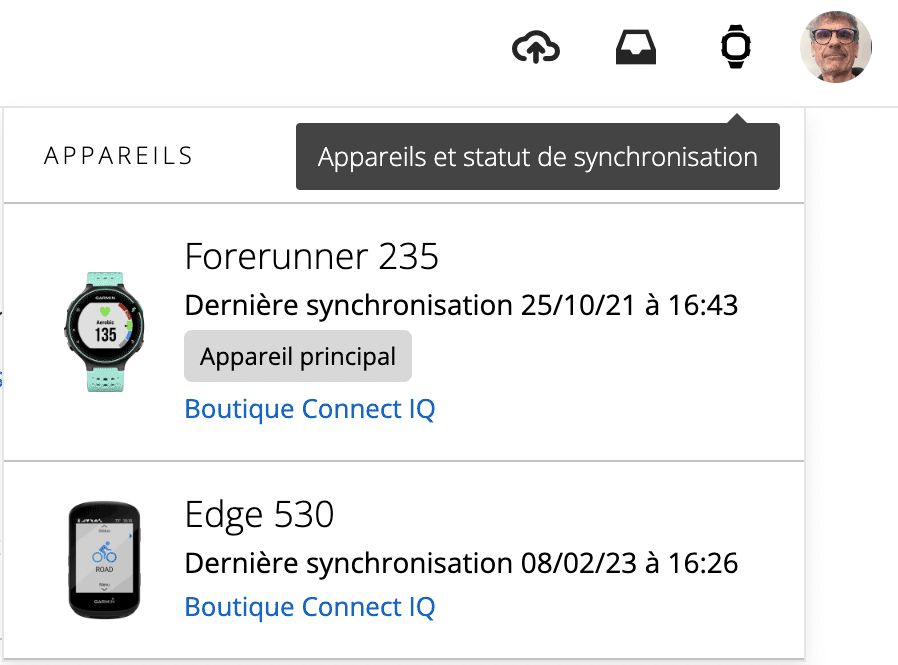
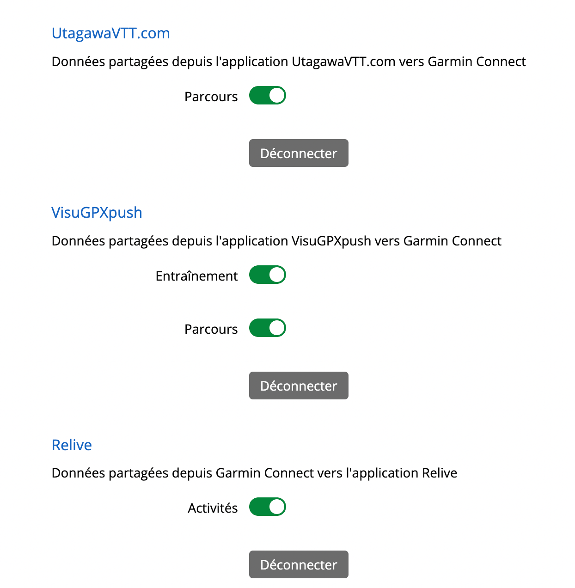
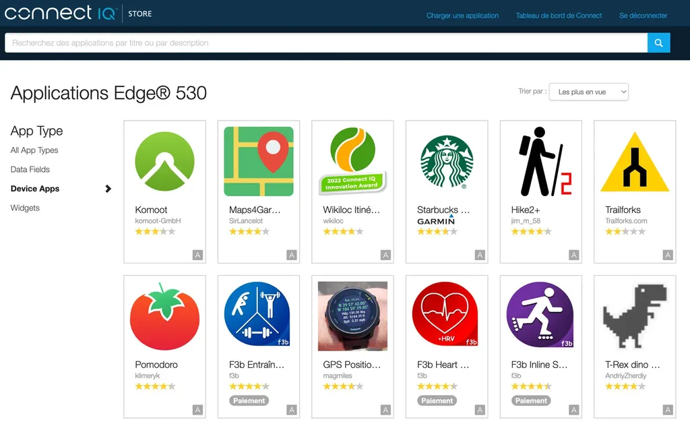
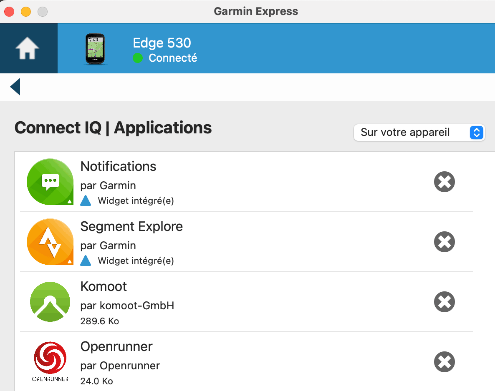
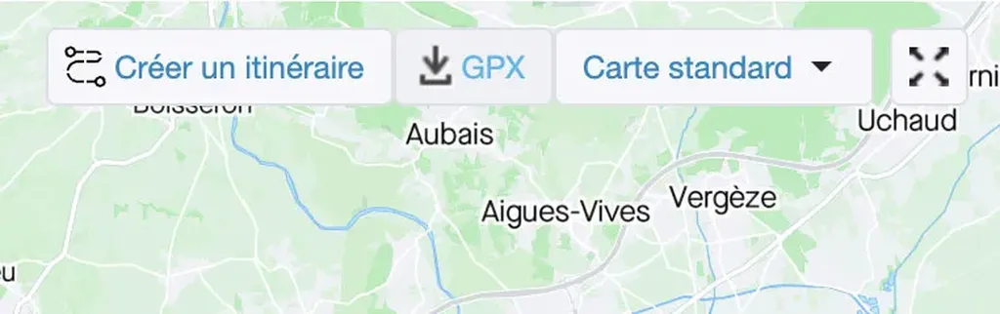
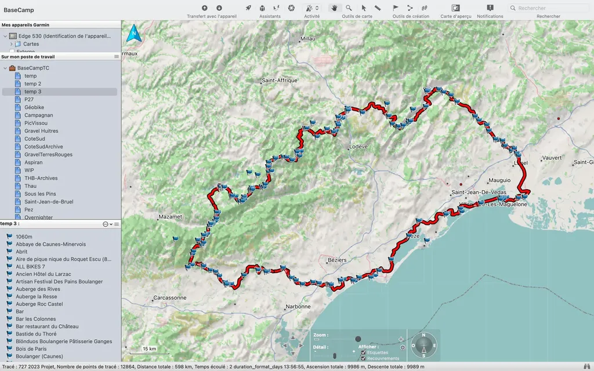
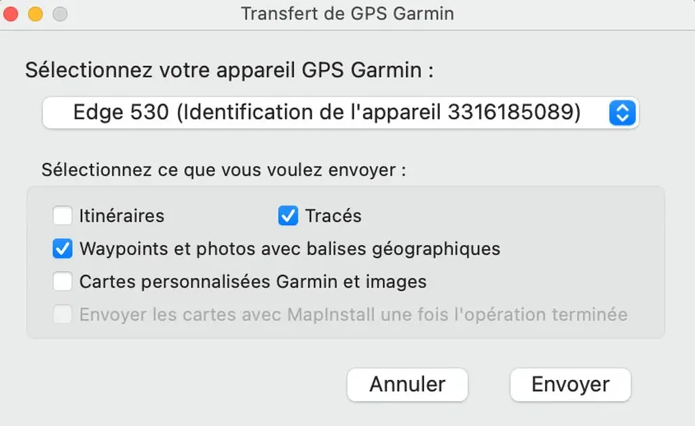
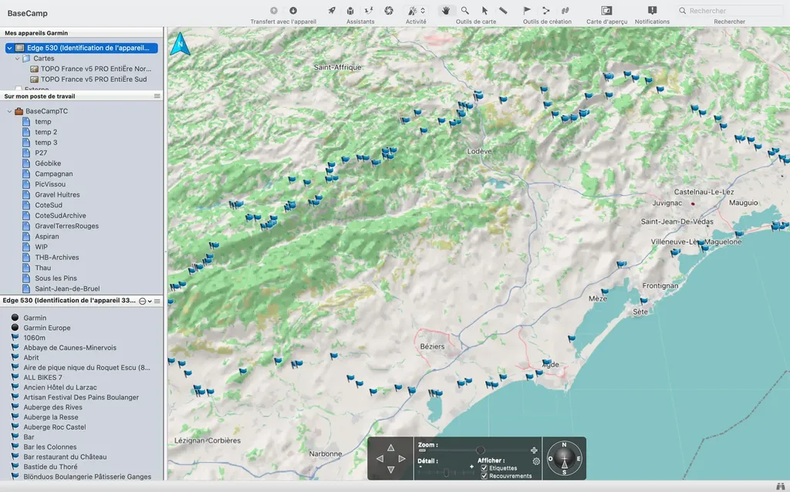
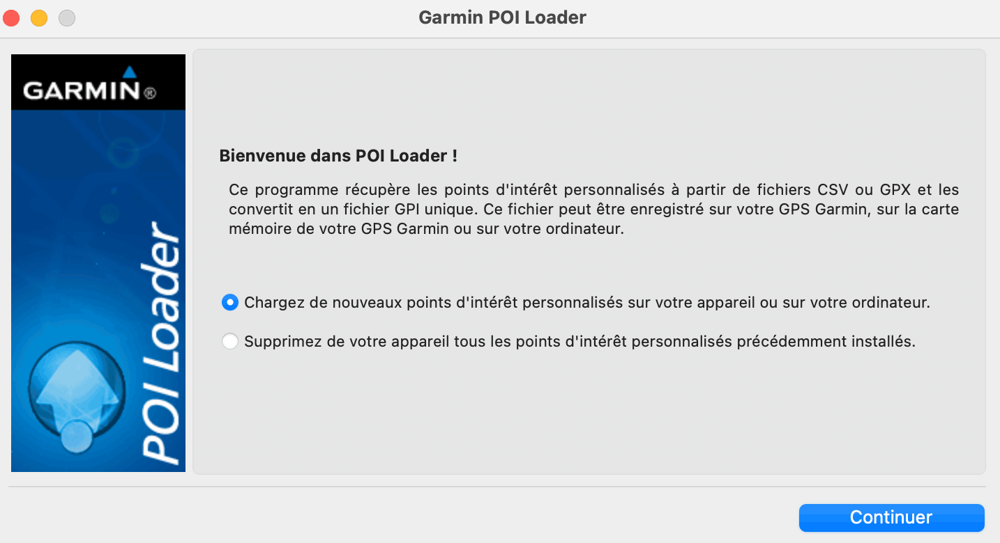

# Comment installer une trace sur un Garmin

On ne cesse de me poser cette question. La procédure n’est donc pas intuitive. Je ne suis pas le roi des pédagogues, mais je vais vous présenter les différentes méthodes que j’utilise. Pour être pragmatique, je m’appuie sur [la trace du 727 hébergée sur VisuGPX](https://www.visugpx.com/XvU1OlWJ6Z). C’est une trace techniquement intéressante parce qu’elle s’étend sur près de 600 km et comporte des dizaines de POI (points d’intérêt ou waypoints). Elle pose donc plus de difficultés de synchronisation qu’une trace courante, ce qui me permettra d’explorer diverses possibilités.

### 1. Synchro par site de partage

[Garmin Connect](https://connect.garmin.com/) est à la fois un site web et une app pour mobile. Dès qu’on utilise un GPS Garmin, on se doit de créer un compte Garmin Connect auquel associer son appareil, cette association s’effectue via l’application [Garmin Express](https://www.garmin.com/fr-FR/software/express/) ou via l’app mobile.

Sur le site, en haut à droite, le symbole « montre » déroule la liste des GPS connectés. Si votre GPS n’apparaît pas, Garmin Connect ne pourra pas vous aider à synchroniser. Supposons cette étape franchie.

Si vous avez créé des comptes sur Strava, Komoot, [VisuGPX](https://www.visugpx.com/), [RideWithGPS](https://ridewithgps.com/) ou autres, vous pouvez connecter ces services à votre compte Garmin. En général, on clique sur un lien, accepte la connexion, puis le tour est joué. [Garmin Connect liste les applications connectées.](https://connect.garmin.com/modern/settings/accountInformation) Chaque nouvelle sortie enregistrée par votre GPS pourra se retrouver sur les sites de partage. Inversement, vous pourrez récupérer des traces que vous enverrez depuis ces sites.

Voici la procédure sur [VisuGPX](https://www.visugpx.com/), sensiblement identique sur les autres services :

1. [Création du compte et connexion](https://www.visugpx.com).
2. [Gérer la connexion des appareils.](https://www.visugpx.com/membres/connexions.php)
3. Se rendre sur la page d’une trace, [par exemple celle du 727](https://www.visugpx.com/XvU1OlWJ6Z).
4. Dans le menu Action, choisir Envoyer la trace vers…, ce qui revient à transférer la trace dans Garmin Connect.
5. Sur votre mobile, la trace atterrit dans l’écran Parcours ([et dans le menu équivalent du site](https://connect.garmin.com/modern/courses)). On peut l’ouvrir, puis le menu en haut à droite permet de l’envoyer au GPS, voire à un autre GPS à proximité.

Notez que ces transferts ne s’effectuent que si votre GPS n’enregistre pas une sortie. De même, les POI ne sont pas transférés. Par ailleurs, j’ai observé que [les traces comportant plus de 8 000 points ne sont pas correctement rendues par les Garmin](../../2021/10/quand-la-trace-perd-des-points-sur-les-gps-garmin.md), du moins par mon 530 ([les traces Garmin semblent limitées à 10 000 points](https://support.garmin.com/en-US/?faq=M9VDdat3qW5q1Yl6qD7b89)). Voilà pourquoi je découpe la trace du 727 en une [partie 1](https://www.visugpx.com/L0EoIityZJ) et une [partie 2](https://www.visugpx.com/xLsQri0tKT).

### 2. Synchro par plugin

Depuis [Boutique Connect IQ](https://apps.garmin.com/fr-FR/devices/edge530/apps) du site ou de l’app Garmin Connect, on peut ajouter des plugins à son GPX.

On trouve notamment, les plugins de Komoot et d’OpenRunner (je n’ai jamais réussi à faire fonctionner ce dernier).

Une fois un plugin installé, on le retrouve dans le menu Connect IQ du GPS, on peut le lancer, s’y connecter et récupérer des traces, mais à condition que le GPS ne soit pas en train d’enregistrer un parcours.

Via Komoot, cette méthode pose deux problèmes : [les traces sur Komoot ne sont souvent fautives](../../2021/5/gaffe-komoot-est-bugue.md), les traces de plus de 8 000 points doivent aussi être prédécoupées.

Cette méthode nécessite une connexion à internet, donc soit un téléphone à proximité, soit un Wifi ouvert, ce qui en limite grandement l’intérêt. Si J’ai un téléphone, autant gérer les traces avec lui selon la méthode 1, plutôt que m’embêter avec l’écran minuscule du GPS.

### 3. Synchro par Garmin Connect

C’est une variante de la première méthode, utile notamment pour les traces maison, non destinées à être partagées. Plutôt que d’envoyer directement une trace depuis un site de partage, on télécharge une trace sur son ordinateur ou son téléphone, on l’importe dans Garmin Connect ([depuis le site Web](https://connect.garmin.com/modern/courses#import-course) ou en ouvrant le fichier avec l’app Garmin Connect sur mobile). La trace se retrouve alors dans la liste des parcours et on peut la transférer au GPS.

Astuces : les non abonnés premium sur Strava peuvent télécharger les traces en installant l’extension [Strava GPX downloader](https://chrome.google.com/webstore/detail/strava-gpx-downloader/pnglhfabfkchkadgnkfacoakincdpeeg) sur Chrome. Une nouvelle icône de téléchargement apparaît sur la carte en haut à droite. On m’a signalé [une app pour télécharger les traces Strava sur Android](https://play.google.com/store/apps/details?id=ee.glops.traxappst).

Quand je pars en bikepacking, j’ai pris l’habitude de toujours charger ma trace sur Gamin Connect, ainsi que d’éventuelles variantes. Je peux les envoyer à nouveau au GPS en cas de plantage. En cas d’urgence, en territoire inconnu, quand il me faut abréger une sortie ou éviter une inondation, il m’arrive d’utiliser l’app Komoot pour créer une nouvelle trace, puis je l’envoie vers Garmin Connect, depuis lequel je la transfère au GPS.

### 4. Synchro par BaseCamp

Les méthodes précédentes n’exigent pas un ordinateur, mais perso, je suis un geek ordi centric. Soit je télécharge les fichiers GPX sur mon ordi depuis les sites de partage, soit je les crée avec VisuGPX et les enregistre en local. Je les ouvre alors avec [Garmin BaseCamp](https://www.garmin.com/fr-FR/software/basecamp/), le logiciel d’édition de traces de Garmin, que je n’utilise plus que pour trois tâches élémentaires.

1. Envoyer à mon GPS des traces GPX (GPX connecté en filaire à l’ordinateur).

- Vérifier le nombre de points des traces et éventuellement les découper en plusieurs parties (ce qui n’est utile que pour les traces de bikepacking de plusieurs jours).

- Transférer les POI, ce que les méthodes précédentes ne savent pas faire.

Quand j’ouvre avec BaseCamp le GPX du 727 téléchargé depuis VisuGPX, je retrouve la trace et les POI. Je peux les envoyer vers mon GPS.

Pour éviter que BaseCamp ne plante, j’envoie la trace, puis les POI qui se retrouve dans un fichier Waypoints.FIT du dossier NewFiles.

Pour vérifier le transfert, je sélectionne le GPS et des les POI s’affichent sur la carte. Quand je roule, ils apparaissent sur l’écran du GPS, sans toutefois être attachés à la trace (supprimer la trace, ne supprime pas les POI). Utile pour ne pas manquer un point d’eau ou une bonne boulangerie.

### 5. Synchro directe

Il s’agit d’une variante de la méthode précédente. Quand le GPS est connecté à l’ordinateur par câble USB, il apparaît comme un disque externe, avec un dossier garmin, et, dans ce dossier, un sous-dossier NewFiles, dans lequel on peut déposer des fichiers GPX. Quand le GPS redémarre après avoir été débranché, les GPX sont transformés en fichiers FIT et déplacés dans le dossier Courses. Cette méthode évite d’installer BaseCamp (et elle ne plante pas). Les POI sont transférés, mais les icônes sont souvent altérées au passage (pour les supprimer je passe par BaseCamp). J’utilise également cette méthode pour nettoyer le dossier Courses. J’évite de stocker trop d’itinéraires sinon dérouler la liste avant le début d’une sortie est trop pénible. J’en profite pour purger le dossier Activities qui liste mes sorties enregistrées.

### 6. POI Loader

Garmin propose l’utilitaire [POI Loader](https://www8.garmin.com/support/collection.jsp?product=999-99999-12) pour charger ou effacer les POI. Il travaille à partir de fichier GPX ou CSV, notamment ceux exportables directement depuis les cartes GoogleMap. On peut ainsi de créer des POI sur GoogleMap, exporter le CSV, l’importer dans le GPS. On les retrouve dans le dossier garmin/POI dans un fichier gpi. Je trouve cette méthode assez aléatoire (ne fonctionne pas avec les POI du 727 par exemple).

Suivant les situations, j’utilise l’une ou l’autre de ces méthodes de synchronisation. Si vous n’êtes pas geek, la première sera sans doute la plus pratique.

*PS : [dans un autre article](../../2021/3/comment-suivre-une-trace-gps-en-bikepacking.md), j’ai présenté ma méthode pour suivre une trace bikepacking.*

#velo #gps #y2023 #2023-2-10-9h37
