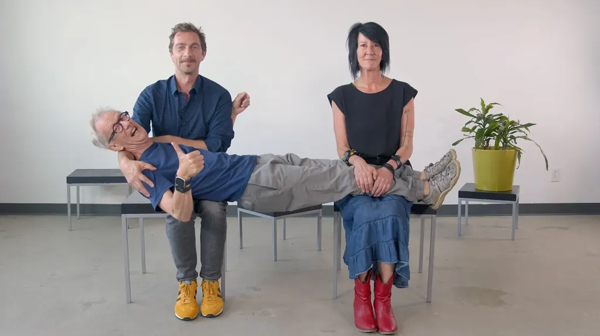
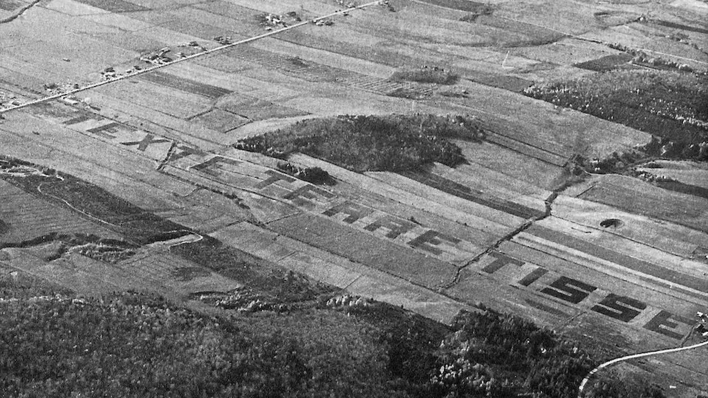
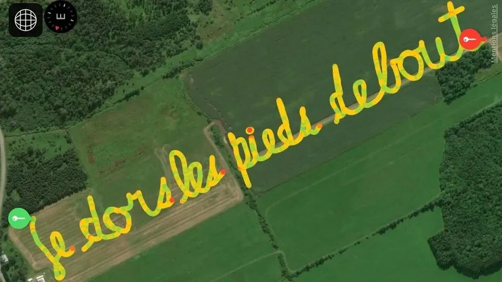

# Écrire sur le territoire

[Jean-Yves Fréchette](https://fr.wikipedia.org/wiki/Jean-Yves_Fr%C3%A9chette) est génialement fou. Depuis les années 1980, il écrit dans les champs canadiens. Ses stylos : des tracteurs qui labourent après la moisson. En visionnant la vidéo qui raconte son aventure, je n’ai pu m’empêcher de penser à ma propre activité d’écriture sur le territoire, qui me devient de plus en plus obsessionnelle.

J’ai connu Jean-Yves [à travers la twittérature](../../../../2013/3/investir-les-espaces-numeriques.md) dont il était un des apôtres, puis [nous nous sommes rencontrés lors de son passage à Montpellier](../../../../2015/12/carnet-de-route-novembre-2015.md), et de temps à autre nous échangeons des messages. Jean-Yves est une lumière généreuse, heureuse, inspirante, un modèle pour moi. Je ne veux pas vieillir autrement que lui, je ne veux pas sombrer dans le désespoir comme mon père, je veux continuer à célébrer la vie.

Aujourd’hui, Jean-Yves écrit avec ses pieds, au fil de promenades dont les circonvolutions tracent des lettres géantes sous le grand ciel canadien. Les traces GPS relevées automatiquement par ses deux montres témoignent de ses poèmes qui ont la particularité d’être électroniques et en même temps attachés à la terre, encrés/ancrés au sol, à sa matérialité physique, une façon d’arracher la littérature à l’abstraction où elle se complaît souvent.

Ses œuvres textuelles d’arpenteur évoquent les œuvres dessinées de façon semblable par les cyclistes sur Strava, notamment par [Stephen Lund](https://www.instagram.com/roadrashyyj/). Mon écriture territoriale est plus abstraite, plus proche de l’arabesque que du réalisme ou de la typographie, mais inventer des itinéraires est un art narratif à part entière, une variante du romanesque.

À la fin de la vidéo, Jean-Yves conçoit l’artiste comme un déclencheur d’œuvres collectives. L’artiste comme scénariste, les spectateurs/lecteurs/auditeurs comme créateurs. Une variante du jeu de rôle. Quand je partage une trace vélo, je livre le scénario que les cyclistes interprètent à leur façon, et dont ils témoignent ou non par des photos, des vidéos, des textes, des souvenirs. Ils deviennent les héros de ma trace. Et nous pouvons tous devenir les héros de l’écriture imaginée par Jean-Yves.

Sa méthode ne nécessite qu’un abonnement gratuit à un service comme Strava. Nous pouvons nous essayer à calligraphier numériquement le territoire. La contrainte ne peut qu’entraîner des découvertes, que ce soit en ville ou dans la nature. Former des lettres dans l’espace pousse nécessairement à porter sur lui un regard nouveau. L’exercice dirige l’attention et stimule l’imagination.

Jean-Yves juge bénéfique le retrait de l’artiste. Il m’écrit qu’il se demande si l’écrivain est toujours nécessaire. Puisque les IA écrivent, l’écrivain doit se réinventer. Pourquoi pas jouer de son corps tant que les IA en sont incapables. Mais l’écrivain est-il toujours nécessaire ? Est-ce que je peux vivre sans la littérature de mes contemporains ? Pour répondre, il me faudrait tenter une expérience : ne plus lire que des morts durant un an. Je crois que j’étoufferais. Je ne sais donc pas si les écrivains sont toujours nécessaires maintenant que les IA peuvent écrire des romans. En revanche, je sais que j’ai toujours besoin d’écrire, de m’exprimer, de faire émerger de la clarté par les mots. L’écriture m’est nécessaire, même si sa nécessité ne dépasse pas ma personne. Et c’est exactement de cette nécessité dont parle Jean-Yves. Marcher lui est devenu aussi vital qu’écrire, et même davantage. C’est une écriture qui commence par être bénéfique à son auteur, qui de fait a déjà emporté une immense victoire, quel que soit son destin populaire.

#netlitterature #y2023 #2023-2-21-11h54
