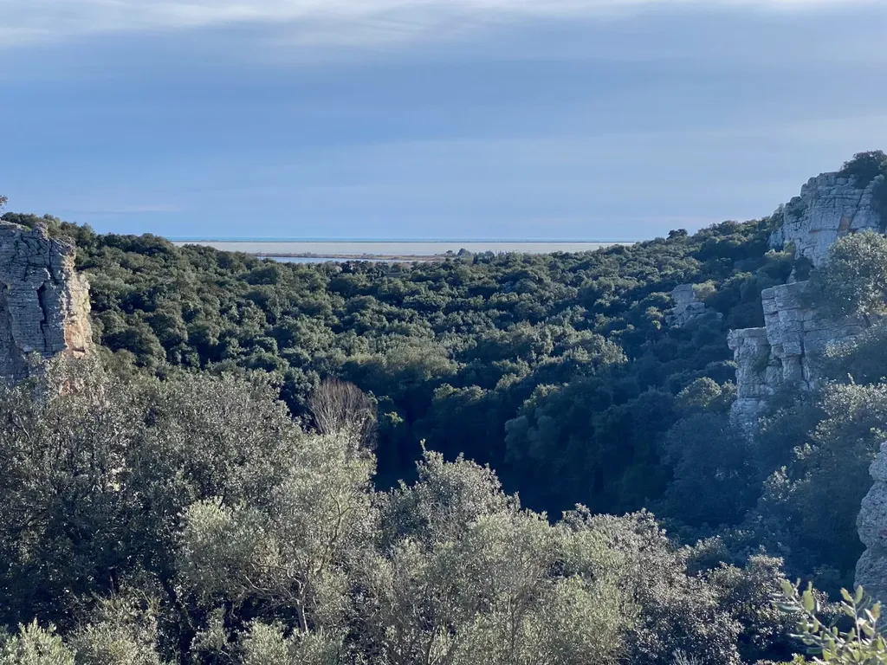
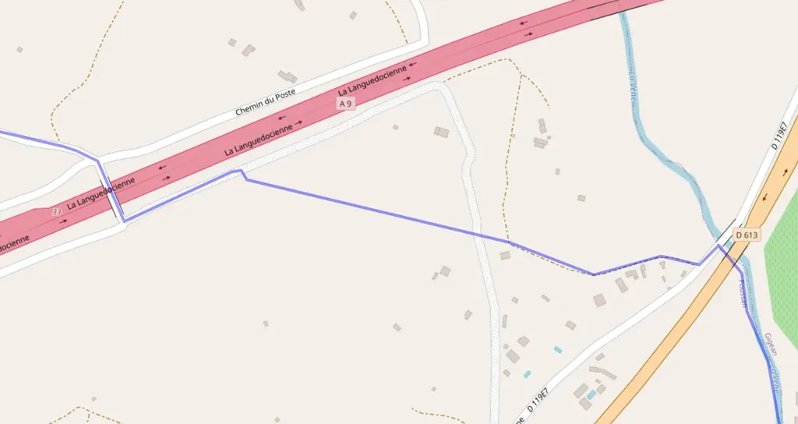
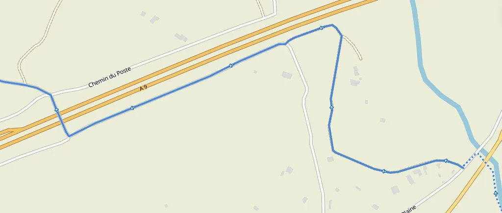
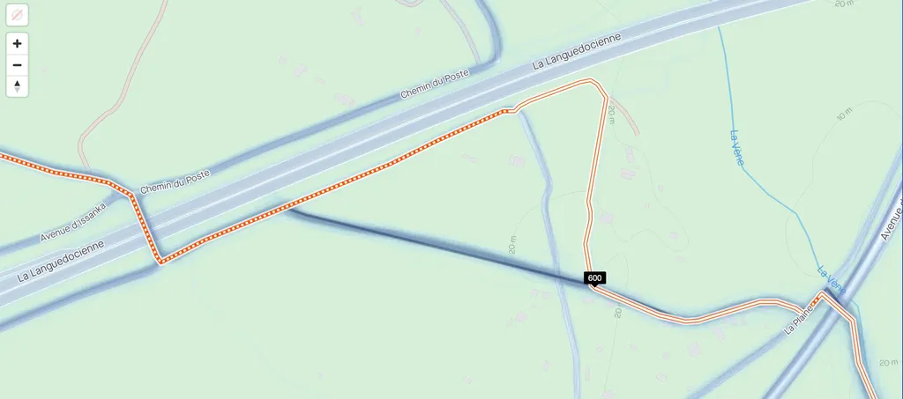
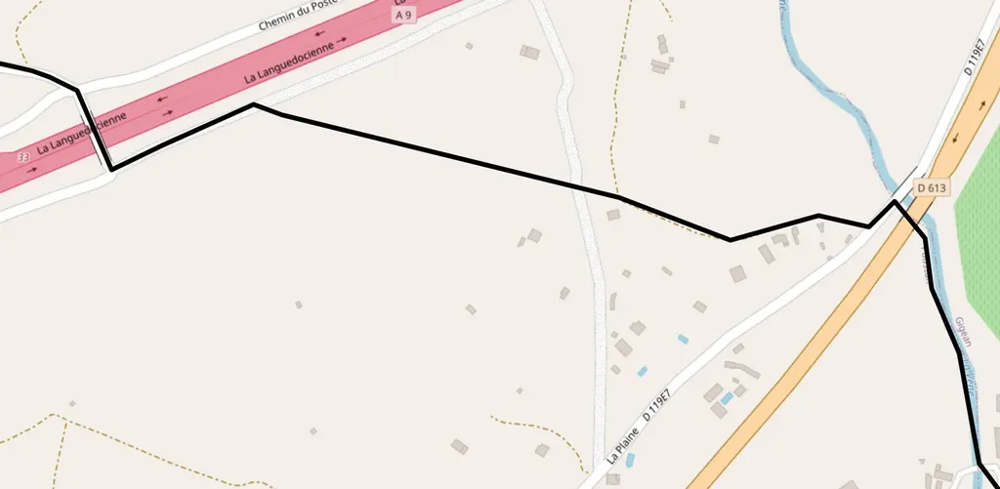
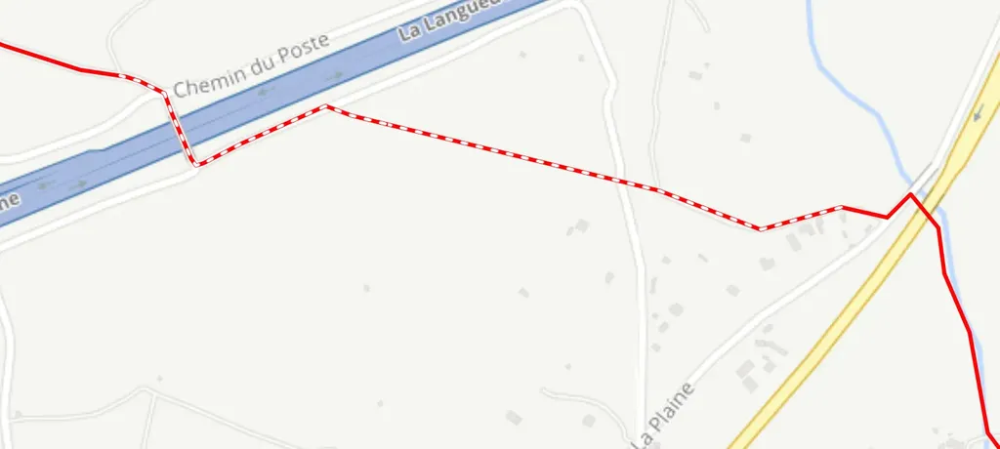
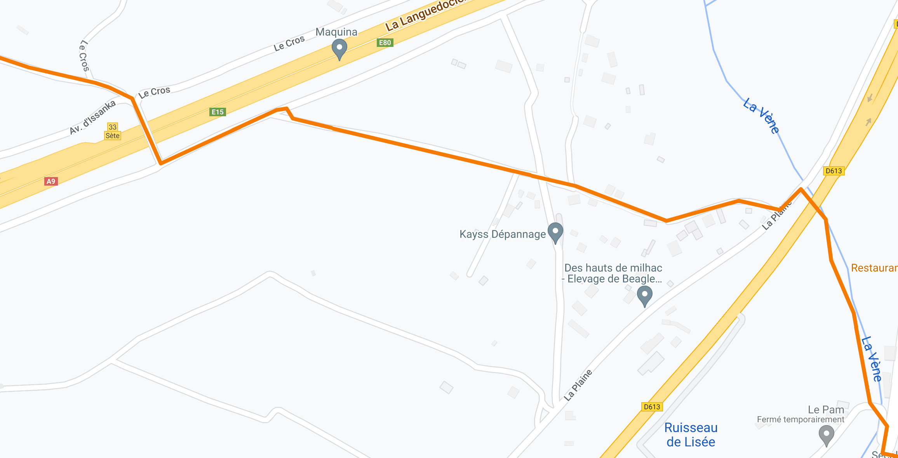
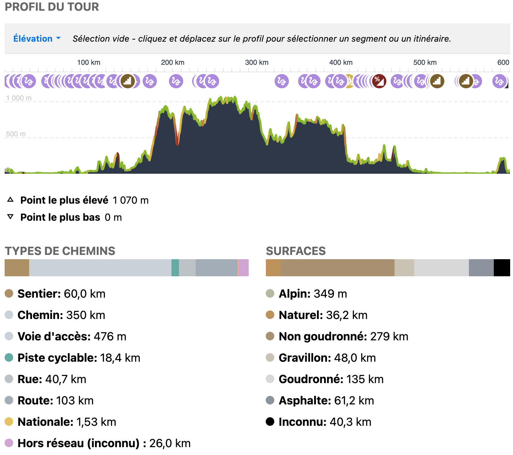
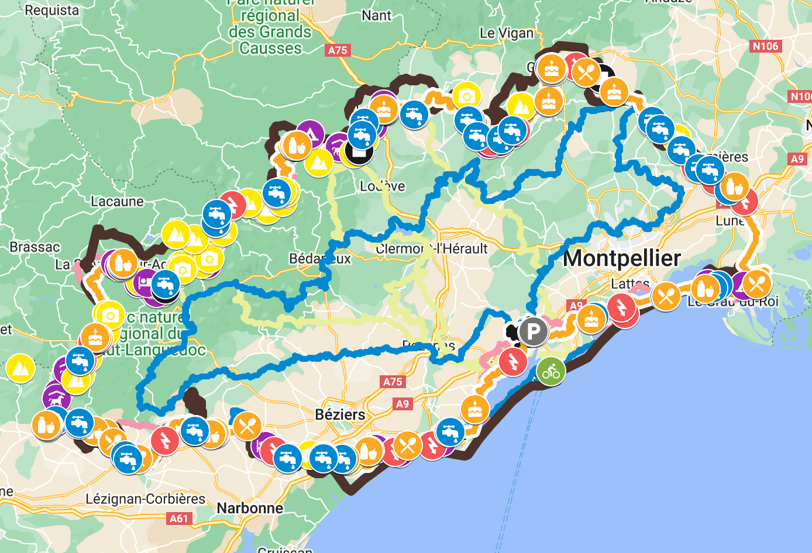
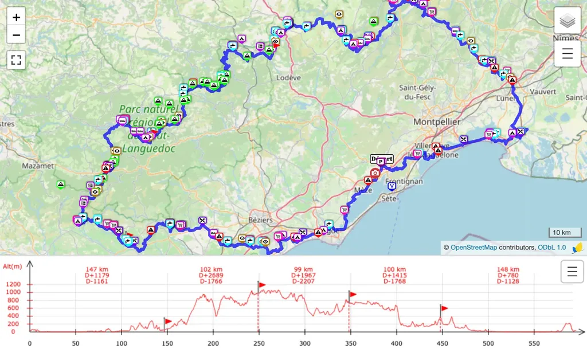

# Quel est le meilleur site de partage de traces ?

Depuis que je roule avec un GPS, que j’enregistre mes traces et les partage, j’ai la sensation de participer à une mise en valeur du territoire et de collaborer à une œuvre collective. Il existe une multitude de sites de partage. J’en ai testé beaucoup, j’en retiens peu.

Pour partager les sorties quotidiennes, des services comme Strava ou Komoot s’en sortent à merveille, mais sont-ils aussi performants pour partager des traces peaufinées à longueur d’année, des traces écrites par opposition à celles improvisées ou rabâchées, des traces imaginées comme des romans avec des rebondissements, des cliffhangers, des climax ? De telles traces mitonnées aux petits oignons ne peuvent pas atterrir n’importe où. Un service de partage digne de noms doit être fidèle à l’original, gérer les points d’intérêt (POI) et faciliter les téléchargements, en prime offrir des statistiques.

### Fidélité

Quand nous publions des photos, nous ne nous attendons pas à ce que le ciel change de couleur, que des arbres disparaissent et que d’autres apparaissent. C’est la moindre des choses. J’ai la même attente quand je publie une trace, malheureusement des sites prennent des libertés inacceptables.

J’ai constaté ce problème [lors d’un 727](https://727bikepacking.fr). Devant moi, des copains partaient dans la mauvaise direction. J’ai mis du temps avant de découvrir que ceux qui se fourvoyaient n’avaient pas récupéré la trace sur le même site que les autres.

Ci-dessus, l’exemple d’une trace sur [VisuGPX](https://www.visugpx.com/), mon outil de traçage préféré. Elle arrive du coin inférieur droit, suit un chemin, traverse une route, rejoint un single non cartographié, avant d’atteindre une autre route.

Sur Komoot, la trace a été modifiée automatiquement lors de l’importation pour éviter la zone blanche sur la carte, ce qui est un crime de lèse-majesté ([Komoot a bien une option pour ne pas altérer les traces, mais elle ne fonctionne pas ou mal](../../2021/5/gaffe-komoot-est-bugue.md)).

Strava est plus honnête, puisqu’il altère la trace tout en indiquant son trajet original, reste que cette modification est inacceptable.

En revanche aucun problème avec [UtagawaVTT](https://www.utagawavtt.com/).

Pas d’avantage de problèmes avec [RideWithGPS](https://ridewithgps.com/), qui a même la bonne idée de qualifier ce secteur de non asphalté.

GoogleMap voit le chemin que la cartographie OSM (Open Street Map) ne voit pas. Quant à [OSM](https://www.openstreetmap.org/) lui-même, je trouve son usage si rébarbatif que j’évite de l’utiliser (en prime, le service plante quand, par exemple, je tente d’y charger ma trace [x727](/727-english/) de plus de 1 000 km). De même, si j’ai longtemps utilisé OpenRunner pour partager mes traces, je m’en passe désormais, car il me demande de payer pour uploader mes traces. J’ai beau avoir expliqué que mon travail bénévole ne pouvait que profiter au site, puisque j’envoyais vers lui des clients potentiels, je n’ai pas obtenu gain de cause, là ou chez RideWithGPS on m’a tout de suite offert un abonnement premium.

Pour le partage, j’en reste donc avec cinq candidats : [VisuGPX](https://www.visugpx.com/), [UtagawaVTT](https://www.utagawavtt.com/), [RideWithGPS](https://ridewithgps.com/) et GoogleMap (j’en ai testé bien d’autres que j’ai écartés de longue date).

### Statistiques

Comme je roule le plus possible hors asphalte, j’aime avoir une idée des terrains qui m’attendent. La plupart des sites évoqués estiment le dénivelé cumulé, affichent le profil, mais seuls Komoot, Strava et RideWithGPS [proposent des statistiques sur la nature du terrain](../../2022/12/comment-evaluer-le-pourcentage-dasphalte-dune-trace.md) (je crois que c’est aussi le cas pour OpenRunner). Malheureusement ces statistiques restent tributaires de la carte OSM, très souvent mal qualifiée. D’une manière générale, on trouve moins d’Asphalte qu’annoncé.

Je suppose que les modules statistiques sont en partie responsables des altérations de trace (puisqu’elles ne surviennent jamais sur les sites sans module statistiques). Si RideWithGPS s’en tire, c’est la preuve que Komoot et Strava pourraient faire de même.

Les statistiques étant de qualité discutable et engendrant souvent des altérations de trace, je n’en fais pas un critère déterminant pour le choix d’un outil de partage. Pour mes traces, je pointe vers les statistiques Komoot tout en conseillant de ne jamais les télécharger depuis ce site.

### L’enrichissement

Sur mes longs périples, quand je découvre des points d’eau, des spots de bivouac, des restaurants sympas ou des boulangeries incontournables, je les repère sur la carte à l’aide de POI (point of interest). Trop de sites de partages oublient de proposer cette fonction. Elle manque cruellement sur UtagawaVTT, mais est disponible sur GoogleMap, VisuGPX et RideWithGPS.

GoogleMap est ma base de données. Sur une seule carte, j’empile des centaines de traces et des centaines de POI, répartis dans des calques que j’affiche au besoin. Autant tracer avec GoogleMap est un calvaire, autant je ne pourrais pas m’en passer pour organiser mes connaissances topographiques.

Le problème : GoogleMap ne travaille pas en GPX. Il faut exporter les données au format KML, [puis les convertir pour les importer dans les autres services](https://www.gpsvisualizer.com/convert_input), bien souvent perdant au passage de précieuses informations. Conclusion : si GoogleMap est un excellent outil de travail, ce n’est pas réellement un outil de partage.

[Je me suis donc bricolé un script pour convertir mes traces et POI GoogleMap](https://bikepacking.000webhostapp.com/gpx/) de façon à pouvoir les importer sur [VisuGPX](https://www.visugpx.com/) et [RideWithGPS](https://ridewithgps.com/), les deux seuls services à mes yeux qui possèdent toutes les fonctions indispensables.

* POI, repérés par des icônes.

* Possibilités de créer des étapes sur la trace (sur VisuGPX, les drapeaux visibles sur le profil indiquent les étapes).

* Parfaite intégration sur les sites externes.

* Différents modes de visualisation, avec différents fonds cartographiques.

* Analyse fine du parcours par sélection sur le profil.

J’utilise toutes ces fonctions pour présenter mes traces, avec une petite préférence pour VisuGPX, parce que c’est une solution française, parce que le fonds cartographique IGN est disponible, parce qu’en prime l’outil de traçage est tout simplement sans équivalent ailleurs.

### Téléchargement

S’il est fastidieux avec GoogleMap, il est transparent avec VisuGPX comme RideWithGPS. Une fois un compte créé sur ces services et les GPS attachés, on peut leur envoyer directement les traces. Mais le problème n’est résolu qu’en première approximation [comme le l’ai expliqué dans un autre article](comment-installer-une-trace-sur-garmin.md).

En conclusion, si RideWithGPS est d’un usage intuitif et d’un design épuré, VisuGPX est une machine de guerre, dont je ne cesse de découvrir les possibilités. Je suis désormais incapable de m’en passer. En plus d’être mon premier choix pour la création de traces, il est désormais aussi mon premier choix pour le partage. Il offre des possibilités que je ne trouve pas ailleurs, comme le choix des paramètres de lissage pour le calcul du dénivelé, ce qui me permet de tenir compte des particularités du terrain. Côté utilisateur, téléchargement et synchronisation GPS sont immédiats, avec la garantie d’obtenir une trace impeccable et potentiellement enrichie.

Vous pouvez même flasher ce code pour lancer le téléchargement du 727 sur votre mobile.

#velo #y2023 #2023-2-10-12h41
