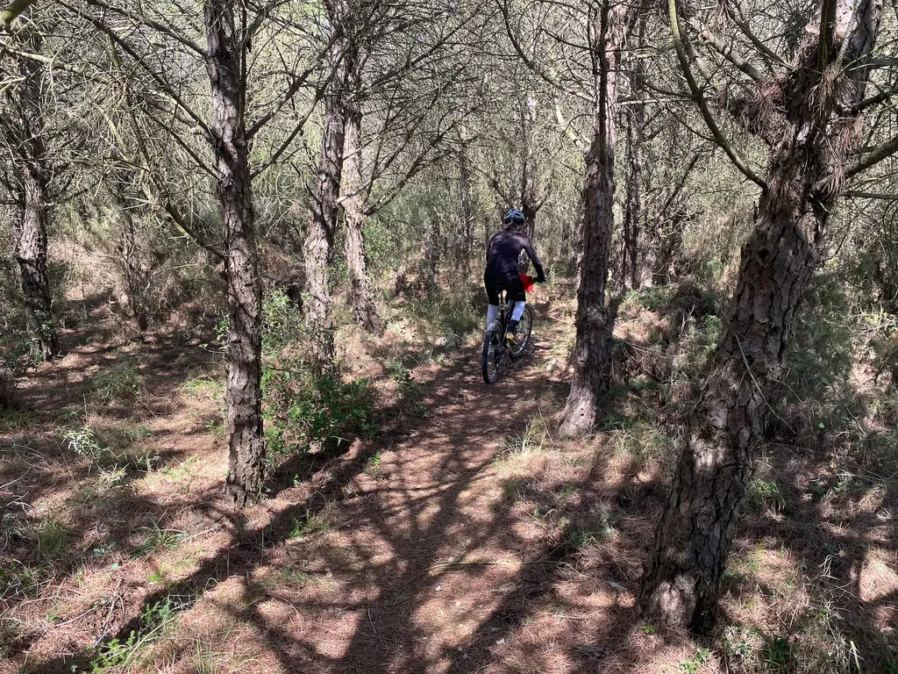

# Comment je prépare mon GPS pour un bikepacking

[Le 727 approche](https://727bikepacking.fr). Comme nous serons une cinquantaine au départ, pas tous experts en GPS, je vous raconte comment je prépare mon Garmin 530, ce qui vaut pour tous les Garmin ([ce texte résume et complète un texte de 2021](../../2021/3/comment-suivre-une-trace-gps-en-bikepacking.md)).

1. Je désactive les services inutiles pour suivre une trace (comme les fonctions de routage qui en plus d’être lentes et fautives, pompent la batterie). [J’ai décrit cette procédure en long en large à la fin d’un article qui me sert de pense-bête.](../../2020/10/pourquoi-jai-rachete-gps-garmin.md)
2. Une fois le Garmin connecté à mon ordinateur, je vais dans le dossier garmin/Activities et je détruis tous les fichiers (ils sont automatiquement sauvegardés sur Strava, Komoot, RideWithGPS… à la fin de mes sorties).
3. De même, dans le dossier garmin/Courses, je supprime toutes les traces dont je n’aurais aucun usage durant le voyage.
4. Avec BaseCamp, je transfère mes GPX vers le GPS. [Aucun ne doit comporter plus de 8 000 points](../../2021/10/quand-la-trace-perd-des-points-sur-les-gps-garmin.md) ([je diffuse mes traces prés découpées en sections de moins de 8 000 points](https://727bikepacking.fr/)). Je pourrais tout aussi bien déposer les fichiers dans le dossier garmin/NewFiles ([j’ai décrit toutes les méthodes de transfert vers un Garmin dans un autre article](../2/comment-installer-une-trace-sur-garmin.md)). Quand je récupère une trace de plus de 8 000 points, je la découpe avec BaseCamp.
5. Je n’oublie pas de transférer d’éventuelles variantes ou traces alternatives, en cas d’inondation par exemple. Sur le 727, [il y a deux traces de ce type](https://727bikepacking.fr).
6. [Je transfère les POI de la même manière](https://tcrouzet.com/2021/03/24/comment-suivre-une-trace-gps-en-bikepacking/), ce qui me paraît la méthode la plus fiable (elle ne fusille pas les icônes).
7. Pour avoir les traces sous la main en cas de plantage GPS ou autre, je me les envoie par mail. Sur mon mobile, je les ouvre dans Garmin Connect et les sauvegarde dans l’application. Ainsi je peux les renvoyer à tout moment vers mon GPS.
8. J’envoie également les traces et POI à [MapOut](https://mapout.app/), une app cartographique iPhone qui fonctionne sans connexion. Je peux ainsi me situer sur la trace, connaître la distance et le dénivelé restant avant une destination visée, repérer plus facilement les POI, trouver un chemin alternatif en cas de difficultés météorologiques ou autres.
9. Pour suivre une variante, la première possibilité est d’arrêter la trace principale, de lancer la variante, puis de revenir à la trace principale. Une autre solution : depuis le menu Find a Course du GPS, on choisit une trace et, plutôt que la lancer, on ouvre Settings et active l’option Always Display. Ainsi la trace sera toujours affichée à l’écran, même quand on ne la suit pas.
10. Je me tiens prêt à utiliser mon téléphone pour suivre la trace si mon GPS venait à planter (mon Garmin a rendu l’âme en 2021 sur le 727). Dans ce cas extrême, j’utilise Komoot (voilà pourquoi j’y publie encore mes traces). Mon iPhone est équipé d’une coque QuadLock pour que je puisse le fixer à mon cintre.

Un allergique à la technique regrettera le temps des cartes, mais pour suivre le 727 et le i727, c’est une valise de cartes au 25 000 qu’il faudrait trimbaler (et de nombreux singles n’y seraient même pas repérés). Pour ma part, tout cela m’amuse, et même stimule ma créativité.

#velo #y2023 #2023-3-24-12h15
