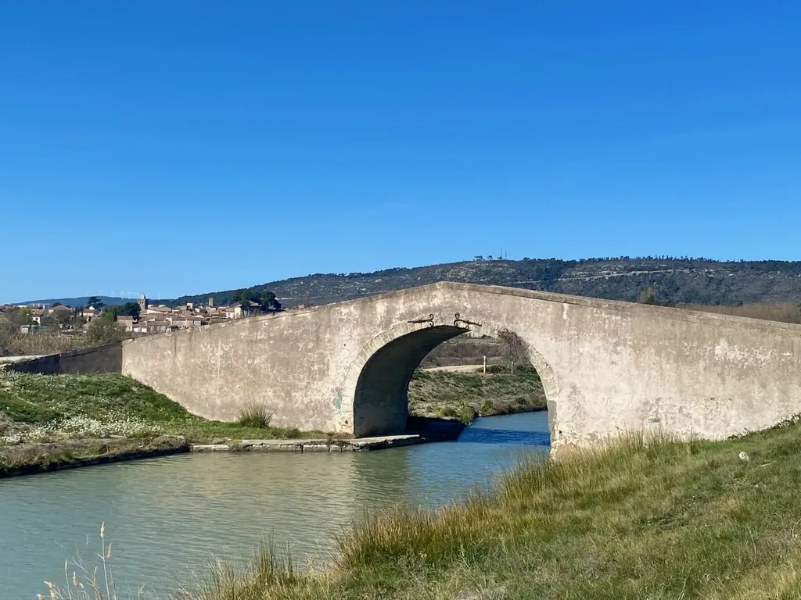
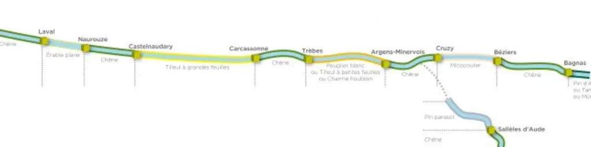
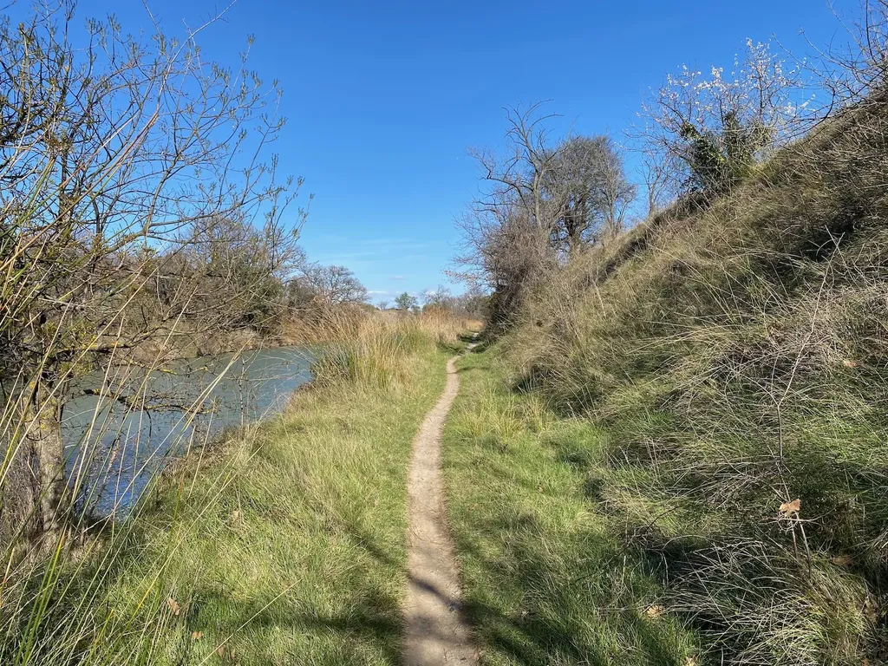
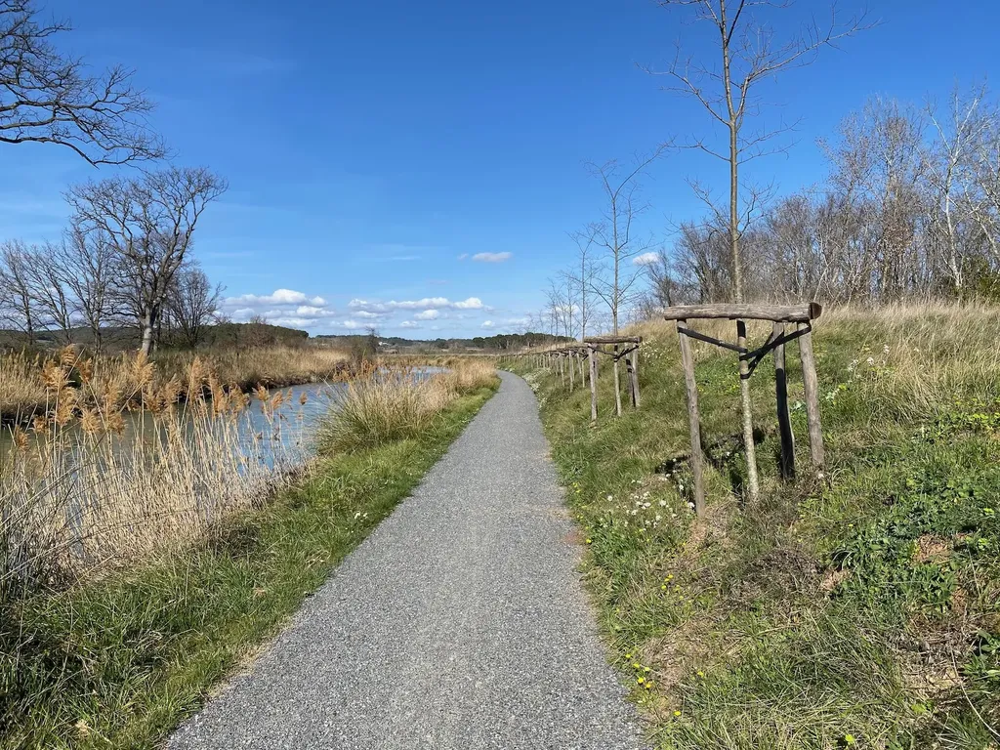

# Destruction en règle du canal du Midi

« Quatre mille euros la semaine », nous dit le patron du snack Minigolf, à l’entrée d’[Argeliers](https://fr.wikipedia.org/wiki/Argeliers), une charmante bourgade audoise à la frontière de l’Hérault, où nous avons l’habitude de nous arrêter sur le [727](/727tour). Il nous montre l’énorme péniche qui mouille le long du canal. « Quand je la vois passer, je pense trente-deux mille euros. » Il nous explique que, durant la saison, elle embarque huit passagers fortunés qui arrivent de partout, surtout de l’étranger. [Le canal du Midi](https://fr.wikipedia.org/wiki/Canal_du_Midi), classé au patrimoine mondial de l’UNESCO, est un des joyaux touristiques d’Occitanie, ou l’était, devrais-je dire, en tout cas pour nous autres cyclistes.

Parce que nos politiques ont entrepris de rénover le canal. Les platanes étaient malades, ils ont presque tous été abattus, remplacés par des moignons de chêne alignés sur des kilomètres. On dirait que la leçon n’a pas été retenue. Les prochaines maladies sauteront d’arbre en arbre et les décimeront. Aucune barrière de biodiversité ne freinera leur propagation. On nous répondra qu’après des kilomètres de chênes, on retrouve de kilomètres de micocouliers ou de tilleuls, mais aucune diversité à l’échelle locale. Pourtant nous savons que les haies qui mêlent différentes espèces évitent la propagation des maladies et offrent des habitats variés aux insectes et aux oiseaux.

Que nenni, tout a été réfléchi, soit disant pour préserver « l’homogénéité des essences sur de grands tronçons ». C’est absurde. À rénover le canal, il fallait le réinventer. « C’est ce qui a été fait », répondra un responsable. Il expliquera que tout a été repensé pour le plaisir des cyclistes. Mais les maîtres d’œuvre ont-ils un jour posé leur cul sur une selle ? Ont-ils un jour pédalé le long du canal ?

Il était merveilleux. Une ligne de terre battue entre les herbes sauvages, les joncs, les roseaux, à l’ombre des platanes centenaires. Parfois il y avait des ornières, des racines, mais rien de bien méchant. C’était un plaisir pour les yeux, un plaisir de sentir nos pneus épouser la terre. On pouvait rouler vite, zigzaguer. C’était sublime, surtout au printemps. Le sentier a été détruit, remplacé par une piste cyclable. Une autoroute monotone, souvent gravillonnée, sur un substrat asphalté, qui l’été faute d’ombre se gorge de chaleur.

En voulant faire des berges du canal du Midi un itinéraire familial, on les a transformées en un Disneyland abominable, dans un esprit de vacances de carton-pâte. Le canal paraissait authentique, une reprise en main d’un espace humain par la nature. Désormais, on se retrouve sur les berges d’un canal quelconque dans une ville quelconque. Uniformisation, homogénéisation. On n’est plus en Occitanie, mais n’importe où ailleurs, sur le même sol pétrochimique. On ne pédale plus au contact de la terre, mais séparé d’elle par une couche aseptisée, mais même pas suffisamment pour que les cyclistes sur route soient heureux. Je me demande qui éprouvera du plaisir au bord du canal du Midi. Il est condamné pour les cinquante ans à venir à cause de l’incurie d’incompétents sans doute bien intentionnées.

Partout le même désastre se répète. Les platanes meurent à cause du chancre coloré et nos chemins crèvent à cause de trop d’asphalte. Pourquoi ne pas les laisser respirer, les laisser se patiner au fil des années, se désherber seul, par un dialogue incessant avec ceux qui les empruntent. Des chemins centenaires traversent nos campagnes sans que personne n’ait besoin de les policer. Mais dès que les services publics y posent leurs pattes, c’est au prix de l’imperméabilisation des sols, des mauvaises odeurs de goudron, des gravillons qui mitraillent nos vélos, de trous de poule inévitables à brève échéance. Très vite rouler sur ces voies devient pire que sur les chemins sauvages, et alors pas d’autres issues que de nouvelles couches de bitume.

Tout ça pourquoi ? Pour que les promeneurs du dimanche puissent y poser leurs roues avec un confort de canapé ? Vous croyez donc que c’est de ça que rêvent les gens ? Vous avez pas noté que nos pneus s’élargissent ? Qu’ils acceptent désormais les sols imparfaits ?

Sans doute pas. Vous pensez dans une logique du moindre effort, aussi du moindre plaisir. Tout devient édulcoré, même les chemins. On nous vend de fausses impressions de nature, mais on veut nous garder dans la ville, sur les voies balisées, contrôlées, surveillées. Résultat : le canal du Midi n’est plus que l’ombre de lui-même. Par chance, il reste souvent l’autre berge, celle non officielle, où encore courent parfois des sentiers, mais jusqu’à quand ? Le single de l’étang du Bagnas a été saccagé par un tracteur de nettoyage qui l’a élargi il y a quelques semaines. On y filait à plus de 30 km/h et désormais on s’y fait démonter les articulations à 15 km/h, tout ça pour éviter quelques chicanes et virages en dévers.

#velo #y2023 #2023-3-19-11h21
