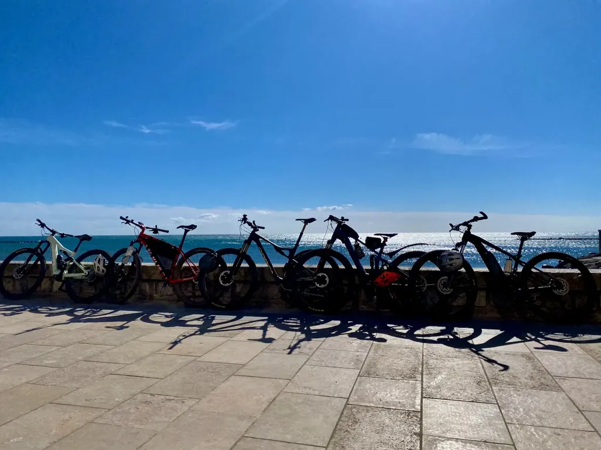
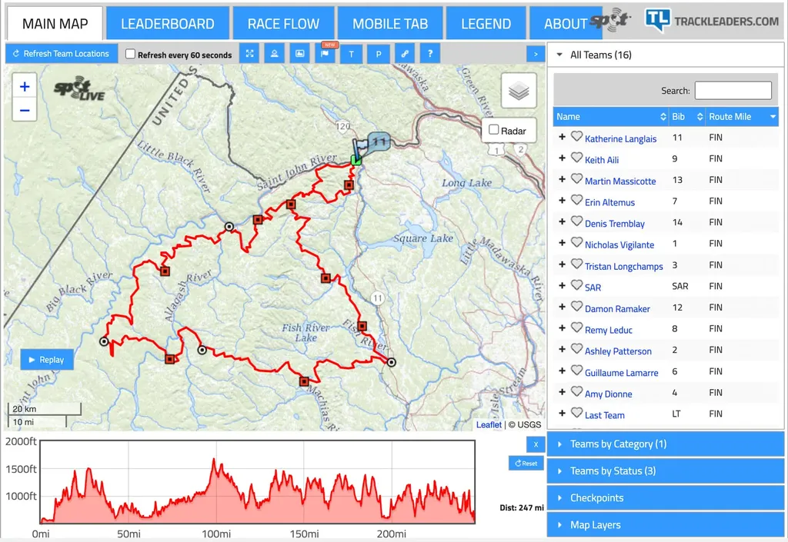
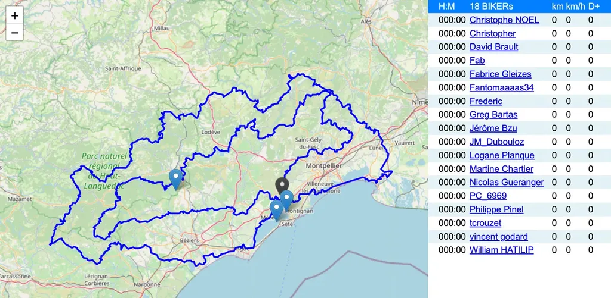
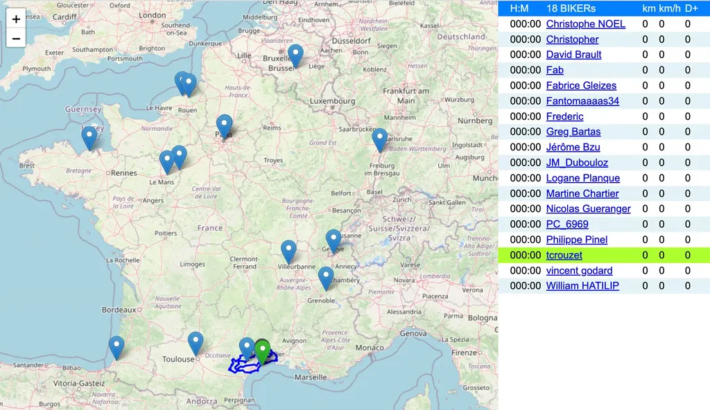

# Le bikepacking pour les pauvres

En organisant [le 727](https://727bikepacking.fr), tout en faisant payer [une dîme symbolique](../../../../page/727gd.md), je n’ai sacrifié à aucun service (hébergement, petit-déjeuner, apéro à l’arrivée, assurance…). À l’exception des goodies et autres chinoiseries, j’ai coché toutes les cases sauf une : je n’ai pas proposé une solution de tracking satellite de type [Trackleaders](http://trackleaders.com/), contrairement à beaucoup d’épreuves onéreuses.

Dans les pays avec une bonne couverture mobile, je ne suis pas sûr que de tels systèmes apportent un énorme bénéfice côté sécurité, du moins à vélo. Il ne bouge plus ? Il est tombé ? Il fait une sieste ? Très difficile à dire, à moins que le signal d’alerte ait été déclenché (comme il peut l’être via un GPS classique par l’intermédiaire d’un téléphone). Bien sûr, donner l’alerte peut-être salutaire dans certaines situations. Je ne le nie pas, mais la meilleure sécurité en bikepacking, si on est sensible à cette dimension, reste de rouler à plusieurs. Ça vaut toutes les technologies de SOS. Si on veut des épreuves hypersécure, il faut imposer le roulage en équipe.

Mais des raisons plus pertinentes militent selon moi en faveur des systèmes de tracking collectif avec représentation cartographique. Les amis, les proches, les curieux peuvent suivre l’épreuve et en partager à distance les péripéties. Ces services étirent les randonnées, ils les montrent à différents échelons, avec les costauds devant, les dilettantes derrière. Ils disent l’aventure. Par leur pouvoir fédérateur, ils contribuent à ce que les cyclistes isolés continuent de se sentir liés à ceux qui les précèdent et les suivent. La cartographie introduit une dimension narrative et remplace les retransmissions radio de l’époque héroïque du tour de France. Des points sur une ligne suffisent à stimuler l’imagination.

Donc j’aime Trackleaders, même si je le trouve rébarbativement désuet, mais sur le 727, c’est niet. Aucune envie de multiplier par cinq le tarif rien que pour avoir un suivi, quand après tout nous pouvons partager des photos et des vidéos en les agrégeant avec des hashtags. Pas davantage envie de louer des balises Spot, de les commander, puis de les renvoyer, de verser des cautions, de demander des cautions… Je recherche la simplicité, la fluidité, tant pour l’organisation que pour les participants. Je reste fidèle à mon approche minimaliste : [je mets en avant le partage](../2/le-727-partager-pour-le-plaisir.md). Et justement, il est sympathique de partager une aventure avec ceux qui ne peuvent pas la vivre. J’ai alors commencé à réfléchir à un Trackleaders du pauvre.

1. Nos téléphones sont de merveilleux GPS.
2. Sur le 727, et en France en général, ils captent presque partout, du moins assez souvent pour pouvoir donner des nouvelles à intervalles réguliers.
3. Il n’est pas nécessaire de donner des nouvelles plus souvent que les proches ne les consultent. On n’attend pas d’eux qu’ils restent rivés à leurs écrans.
4. Sur WhatsApp, GoogleMap et bien d’autres services, on peut se géolocaliser en temps réel, mais en bikepacking ces fonctions épuisent trop rapidement les batteries. D’autre part, les informations de tous les participants ne peuvent pas être consolidées automatiquement sur une carte publique (du moins sans de lourds développements et investissements).
5. [Wayward](https://app.wayward.travel/) est censé offrir une solution à la Trackleaders via mobile. J’ai tenté de l’utiliser avec des copains sans trop de succès. Qui plus est, elle devient vite payante si la taille du groupe augmente (nous serons une cinquantaine sur le 727). J’ai l’impression qu’elle n’a guère de succès. Il existe d’autres services comme [MapProgress](https://maprogress.com/), mais je les laisse aux organisateurs beaucoup plus ambitieux que moi.
6. J’ai donc écarté toutes ces solutions, partant du principe que mon téléphone sait me géolocaliser gratuitement et que quelques lignes de code permettent de générer une belle cartographie OSM (merci à la communauté open source, qui travaille pour le bien commun).
7. J’ai essayé de partager ma géolocalisation avec des photos Instagram, mais Instagram supprime désormais les balises GPS des images diffusées. Twitter fait de même. WhatsApp est totalement fermé, sauf à passer par WhatsApp Business.
8. J’ai fini par trouver mon bonheur avec la messagerie [Telegram](https://web.telegram.org/), une application dont le client est dans le domaine public. On ne présente plus Telegram puisque la messagerie est populaire dans tous les pays où règne la censure (je l’ai utilisé pour la première fois en Iran). Nous devrions la préférer à WhatsApp ou Messenger. Au lieu de nous enfermer dans un environnement propriétaire, elle nous offre des portes de sortie.
9. J’ai ainsi découvert qu’il était possible sur les groupes Telegram d’inviter des bots qui peuvent traiter automatiquement les messages, du moment qu’on leur accorde les droits d’administration.
10. J’ai alors créé un groupe 727 dans lequel j’ai invité les participants du tour 2023 et leur ai proposé de publier au fil de l’épreuve leur géolocalisation (en évitant d’activer le suivi temps réel, mais cela pourrait aussi fonctionner).
11. Pour ma part, en bikepacking, j’ai l’habitude de pédaler avec mon téléphone en mode avion et de ne le réveiller que lors des pauses ravitaillement. Elles seront de bonnes occasions de signaler où je me trouve, tout comme le soir au moment du bivouac.
12. Si nous nous prêtons à cet exercice peu contraignant, la carte se peuplera de nos balises mouvantes.
13. Dès que mon Bot verra une nouvelle géolocalisation sur le groupe Telegram, il déplacera le curseur associé au bikepacker. Rien de plus compliqué. Le Bot calculera en même temps la distance parcourue et le dénivelé escaladé.
14. Les participants pourront même diffuser des photos et des textes, puisque Telegram sait le faire. Autant de fonctionnalités interdites avec Trackleaders.
15. Enfin, [une carte publique peut dore et déjà être consultée](http://geogram.tcrouzet.com/). Elle sera surtout intéressante à partir du 1er avril quand nous roulerons sur les chemins de l’Hérault.
16. La géolocalisation n’est pas obligatoire. Chacun fera selon ses désirs et sa philosophie, à la fréquence qui lui conviendra. Telegram permet l’anonymat et le recours à des pseudos. Il va sans dire que le but de ce Geogram, comme je l’ai appelé, n’est pas de fliquer les participants, puisqu’ils décident librement de se géolocaliser quand ils en éprouvent le besoin.

Je parle de ce bidouillage parce qu’il m’a rendu heureux. Il m’a montré qu’il était encore possible d’être inventif avec des bouts de ficelles dans le monde numérique. C’est un paradoxe, puisque j’ai abondamment utilisé ChatGPT durant les trois jours de développement, ce qui m’a fait gagner un temps dingue.

Et la suite ? Pour que la bidouille soit utilisable par d’autres organisateurs, il faudra quelques améliorations :

1. Peut-être également prendre en charge la messagerie [Signal](https://signal.org/fr/), elle aussi distribuée sous forme de logiciel libre, et elle aussi dotée d’une fonctionnalité Bot.

- Les organisateurs créeraient des groupes Telegram associée à leurs évènements. Ils y inviteraient leurs participants avec un lien de partage.

- Ils y inviteraient mon Bot et lui accorderaient les droits d’administration (lire et supprimer les messages).

- Ils posteraient sur le groupe la trace GPX de l’épreuve.

- Le Bot la téléchargerait et créerait la carte sur laquelle il commencerait à géolocaliser les bikepackers. L’adresse web de la carte serait partagée sur le groupe par le Bot.

- À l’heure du départ, une commande START sur le groupe l’ancrerait le décompte du temps.

- D’autres commandes permettraient de piloter et configurer le Bot directement depuis Telegram.

- Un écosystème libre et ouvert pourrait grandir, sans de trop grandes complications. Il va sans dire, le code devrait être ouvert et publié sur GitHub.

- Le rêve : une version custom du client Telegram, qui disposerait d’une fonction de géolocalisation automatique toutes les x minutes.

N’hésitez pas à me contacter si améliorer le bazar vous intéresse. Je me sens mieux après ce petit travail, tant je suis fatigué de mettre sans cesse en avant Facebook, Twitter, YouTube, WhatsApp, des solutions de plus un plus étouffantes à mes yeux, qui nous laissent de moins en moins de liberté avec nos données.

Le 1er avril, avec le départ du 727, vous aurez droit à un test grandeur nature. Comme je serai sur mon vélo et non derrière mon écran, personne ne sera là pour remettre le système en marche en cas de crash. À minima, j’espère que cette cartographie vous donnera envie de voyager dans l’Hérault et ailleurs.

### Cahier des charges pour évaluer d’autres solutions

1. Gratuit.
2. Immédiat pour les cyclistes (contexte familier : Telegram fonctionne comme WhatsApp).
3. Carte partageable (avec trace GPX et une icône par cycliste).
4. Ne ponctionne pas la batterie du téléphone.
5. Aucune contrainte (pas d’obligation, pas de lieux particuliers type CP, pas de fréquence imposée…)

#velo #y2023 #2023-3-7-10h52
