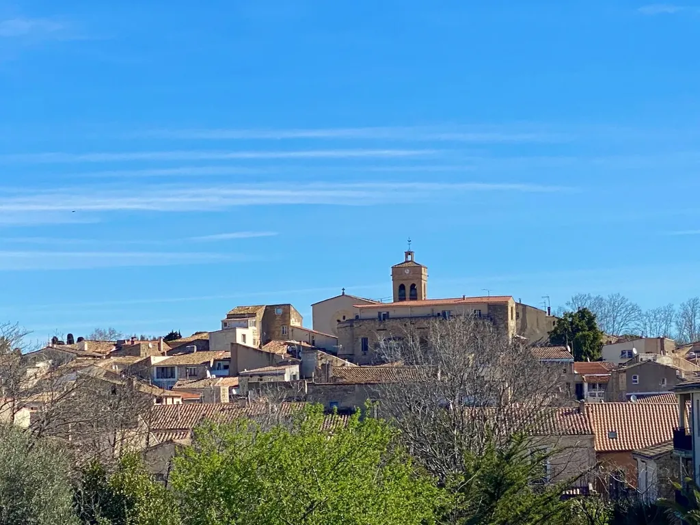
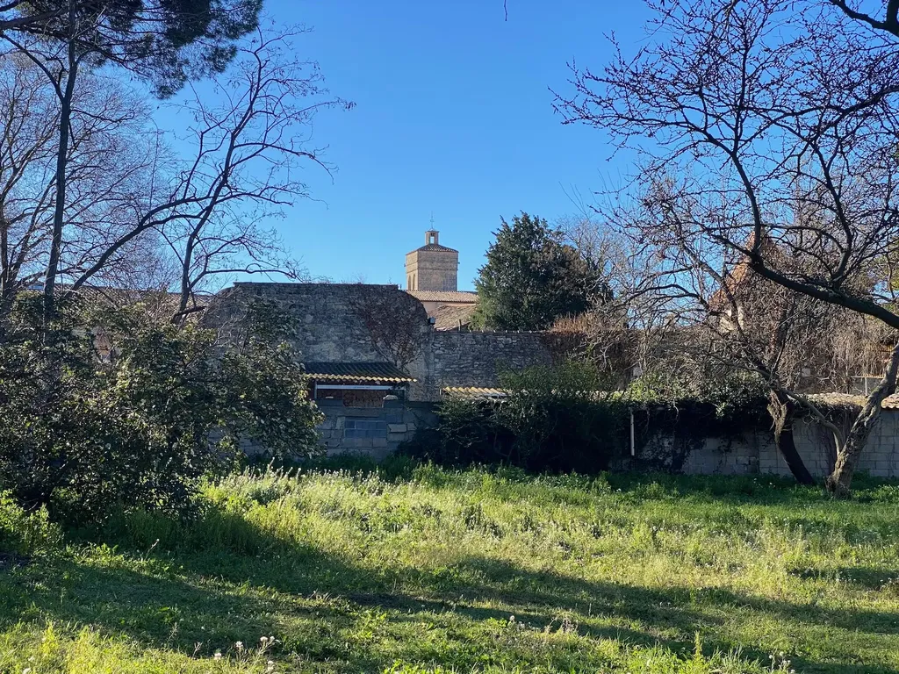
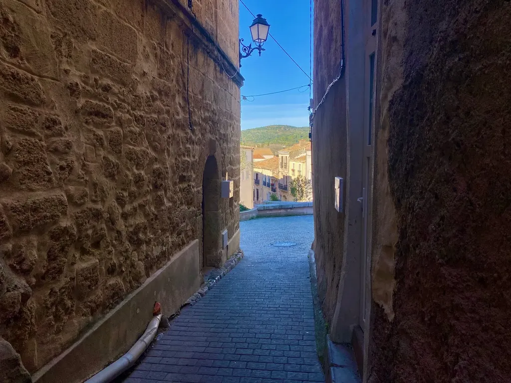
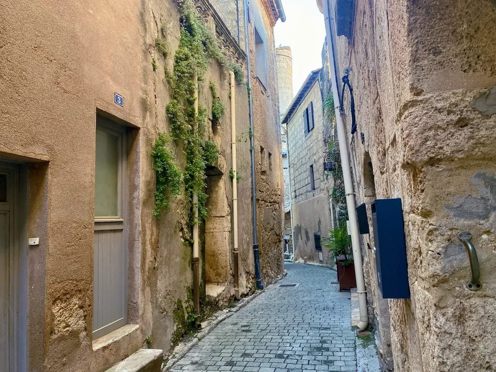
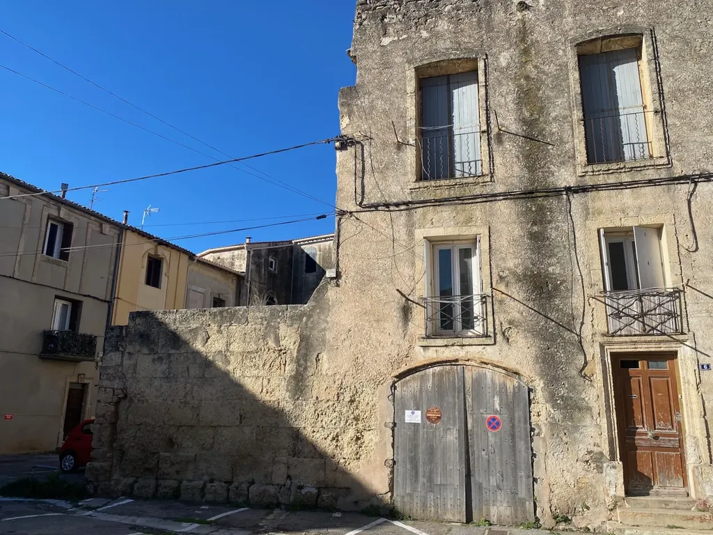
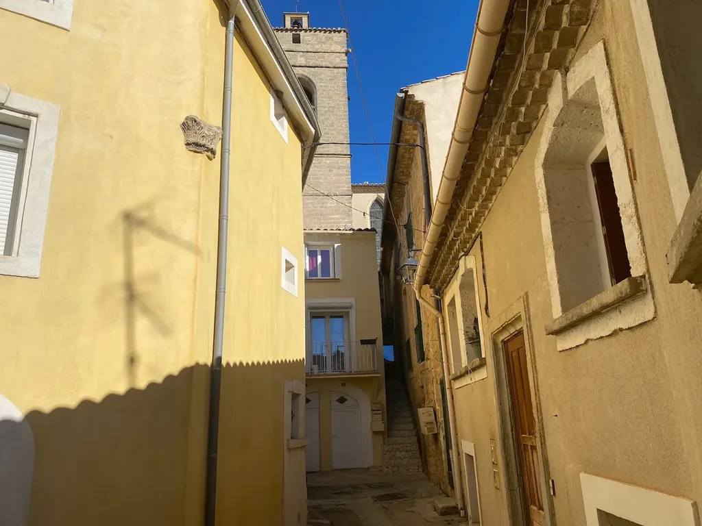
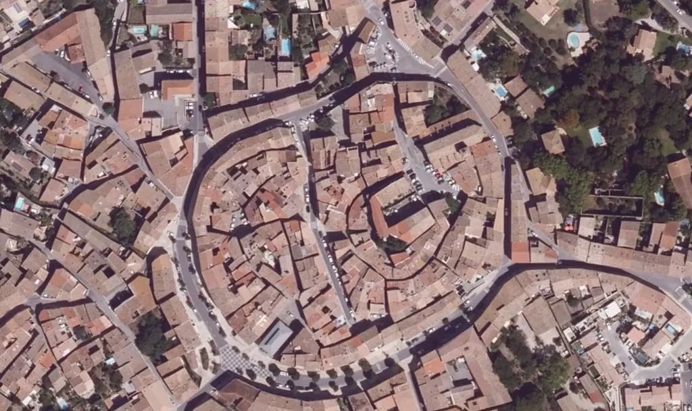

# Poussan : départ des 727

Si on m’avait dit il y a quelques années que j’organiserais [une randonnée bikepacking](/727tour) au départ de [Poussan](https://fr.wikipedia.org/wiki/Poussan), je ne l’aurais pas cru. J’entretiens une relation ambiguë avec le village de ma famille maternelle.

Je suis un enfant des berges de l’étang de Thau, des plages de coquillages, des étendues bleues. Mon regard s’est toujours tourné vers Sète, la mer, le large, les destinations lointaines. Quand mes parents me laissaient à Poussan pour quelques jours chez mes grands-parents, j’avais l’impression de remonter dans le temps. Tout me paraissait vieux, délabré, dépassé.

Les vignes aux pieds des collines. Les routes et les rues défoncées. Les façades lépreuses d’un jaune pisseux. L’égout à ciel ouvert où se jetaient des eaux grises et où couraient des rats. L’étroitesse des ruelles médiévales, enroulées sur elles-mêmes pour compliquer les déplacements. Les processions religieuses entre l’église et la grotte du jardin des Pères. Les pierres brûlantes en été, transpercées par le mistral en hiver. J’éprouvais une aversion insondable pour cet empilement désordonné de toits de tuiles. Mon grand-père n’avait pas le permis de conduire. Je l’implorais de me ramener chez moi avec son tracteur ou sa mobylette. Un jour, je me suis échappé et on m’a rattrapé en bas de l’avenue de Sète.

Le temps s’éternisait. Tôt le matin, les chants incongrus des coqs me réveillaient. Je me réfugiais dans la lecture, souvent cloîtrée dans le grenier rayé de soleil, avec la collection de *Pif Gadget* de mon oncle. Quand je m’en lassais, je fonçais au tabac du boulevard Riverain me ravitailler en revues, faisant une halte à la Coop où j’achetais des Malakoff. L’après-midi, avec ma grand-mère, nous rejoignons à pied l’une des vignes de mon grand-père, où nous promenions autour du village, entre les vergers au pied du cimetière, puis au flanc des collines. Quand nous nous élevions, j’apercevais l’étang, la mer, mon pays n’était pas loin, et le voir me rassurait. Cinquante ans plus tard, ma perspective sur ce coin du monde a changé du tout au tout.

Le bord de mer a été souvent défiguré à force de bétonnage, alors que l’intérieur des terres conserve un temps à l’écoulement indolent. Même si des pavillons ceinturent le village, il a préservé son âme ancienne, son passé médiéval présent dans ses ruelles pentues, où se dissimulent les frontons des vieilles bâtisses prestigieuses. J’aime m’y promener comme ce matin, dans le bleu du printemps. J’ai la sensation d’entendre des voix vénérables me chuchoter des paroles de sagesses. Alors je marche jusqu’au cimetière, m’appuie contre le cyprès devant la tombe de mes grands-parents et de mon oncle, et je pense à eux, à un monde qui n’est révolu qu’illusoirement.

Poussan est un de ces villages au potentiel touristique inexploité. Un joyau de bric et de broc, mais qui dans chacun de ses recoins dit une longue histoire. Des galeries d’art auraient pu s’installer sous les voûtes médiévales, les façades auraient pu être rénovées, les adjonctions désobligeantes détruites, et le village serait devenu un autre Saint-Guilhem-le-désert, énième abattoir pour moutons de Panurge.

Autant j’ai détesté Poussan, autant je l’apprécie désormais, avec son grand café à la terrasse parfaitement ensoleillée, son dédale de ruelles qui me désoriente toujours, ses points de vue sur les collines, ses recoins qui conservent pour moi une part des mystères de l’enfance. J’y suis chez moi et perpétuellement étranger. Je ne pouvais trouver mieux comme point de départ et d’arrivée du [727](/727tour).

Le bikepacking implique de suivre une trace, et cette trace autour de l’Hérault est aussi celle du temps qui passe, celle des chemins gravés dans la pierre par nos ancêtres. Nous roulons à la recherche d’une ligne de vie, d’un fil qui nous relie au passé et nous ancre dans un présent que nous espérons débarrassé de tout superflux. À vrai dire, je n’ai pas choisi Poussan, puisque j’y ai été attiré par les amis de l’ECP (Entente Cycliste Poussannaise). Une espèce de gravitation sentimentale m’y a ramené.

Et ce matin, quand je suis entré dans le jardin des Pères pour la première fois depuis cinquante ans, parce que les participants au 727 y dormiront, je n’ai pas tout de suite pris conscience qu’une boucle se refermait, non seulement [celle du 727 autour de l’Hérault](/727tour), mais aussi de mon propre parcours de vie. Rien de tel avant de nouvelles aventures.

#727 #velo #y2023 #2023-3-20-13h12
