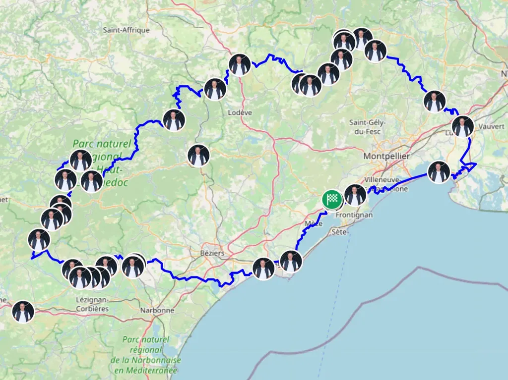
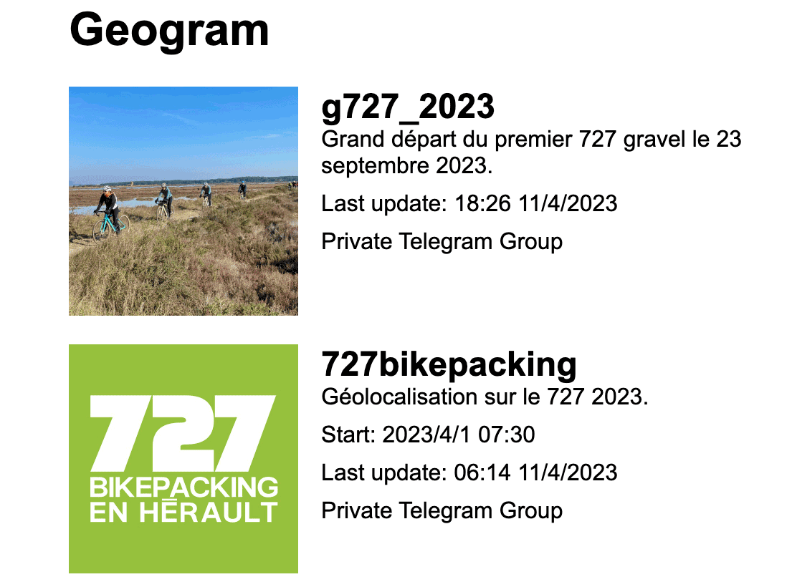
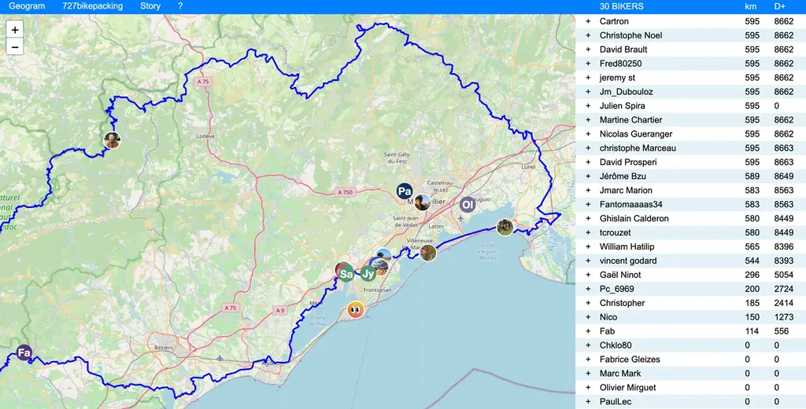

# Suivi gratuit d’aventures Bikepacking

J’aime suivre cartographiquement les courses ou les randonnées bikepacking. Quand j’y suis engagé, c’est pour mieux me repérer par rapport aux autres participants. Quand je suis spectateur, c’est pour voir où en sont mes amis. Mais je trouve prohibitifs les tarifs des solutions de type Spot (en plus d’être d’une puissance disproportionnée pour la plupart de nos escapades). À l’occasion du [727 2023](quelques-notes-post-727-2023.md), je me suis donc décidé à développer [Geogram](https://geogram.tcrouzet.com/), une solution gratuite, et non moins efficace, voire plus efficace dans certains domaines.
[Je vous en ai déjà parlé au moment où l’idée ne faisait que prendre forme](../3/le-bikepacking-pour-les-pauvres.md), désormais je crois que le système peut-être testé par d’autres, qu’ils soient organisateurs d’évènements ou amis qui partent en balades et souhaitent donner des douvelles à leurs proches. L’astuce consiste à utiliser la messagerie Telegram, de rejoindre un groupe créé pour l’aventure et d’y partager sa géolocalisation de temps à autre, ainsi que des commentaires et des photos. Si vous voulez expérimenter, [je vous laisse découvrir l’aide](https://geogram.tcrouzet.com/help).

Il n’est même pas nécessaire d’être dans une zone couverte pour se géolocaliser, Telegram étant capable d’envoyer des messages en différé quand il retrouve du réseau. D’ailleurs, pour ma part, je roule le plus souvent en mode avion et ne réveille mon mobile que par intermittence. C’est justement dans ces moments que je me géolocalise et publie quelques photos sur le groupe.

Pour que les informations publiées soient contextualisées et cartographiées, j’ai créé le robot GeoBikepacking, un compte Telegram qui toutes les dix minutes scanne les groupes où il a été invité comme administrateur. Il peut alors repérer les randonneurs sur la trace et pour chacun établir [un historique de leur progression](https://geogram.tcrouzet.com/727bikepacking/user/6254152278), avec un fil de leurs messages. Il est même possible de consolider tous les messages pour créer [une story de l’aventure](https://geogram.tcrouzet.com/727bikepacking/story).

Par rapport aux solutions de type Spot, je vois deux inconvénients :

* La géolocalisation nécessite de temps à autre du réseau, ce qui est le cas dans de très nombreux pays.
* La géolocalisation n’est pas en temps réel, mais en pseudo temps réel, puisqu’il faut se géolocaliser volontairement (le mode temps réel de Telegram est très gourmand en énergie, ce qui n’est guère compatible avec le bikepacking).

L’approche Geogram est donc pas idéale dans les coins perdus de la planète et pour ceux qui organisent des courses.

Une petite parenthèse à ce sujet : en France, il est quasi impossible d’organiser des courses bikepacking, car il faut alors déclarer l’itinéraire en préfecture et demander des autorisations à tous les propriétaires chez qui nous roulons. L’utilisation d’outils comme [Trackleaders](http://trackleaders.com/) est alors illégale, puisqu’elle établit mécaniquement un classement des participants. Pour le moment, les organisateurs de courses s’en tirent sans poursuite, mais le jour où un grave accident se produira, ce sera une autre histoire.

Il serait toutefois assez simple d’ajouter un mode course à Geogram. Il suffirait que les participants connectent l’application à leur Strava. Lors des points de contrôle, qui seraient purement numériques, ils enregistreraient leur parcours Strava qui serait automatiquement récupéré par Geogram et matché avec la carte. On obtiendrait ainsi un suivi temps réel rétroactif. Rien de très compliqué à mettre en œuvre.

Mais pour ma part, je vais lever le pied sur cette affaire. Il faudrait désormais transformer mon code en projet open source et le publier sur GitHub, pour que quelques développeurs puissent le faire vivre. Par exemple, il serait possible de créer un client Telegram sur mesure, qui travaillerait en tâche de fond et publierait toutes les heures la série des géolocalisations mémorisées. Ce serait une autre façon d’avoir du temps réel rétroactif, sans pour autant grever la batterie de nos mobiles.

Sur le 727, nous avons été nombreux à jouer le jeu, à nous retrouver grâce à Geogram lorsque nous nous étions perdus de vue et à vivre l’aventure avec tous ceux qui étaient sur la trace, que ce soit devant ou derrière nous. J’ai aimé l’expérience, qui ne nécessite que quelques secondes au cours de la journée. Nos proches étaient rassurés. Et je crois qu’ils se sont pris au jeu de nous suivre, surtout quand nous avons publié de belles photos.

#velo #y2023 #2023-4-13-21h2
