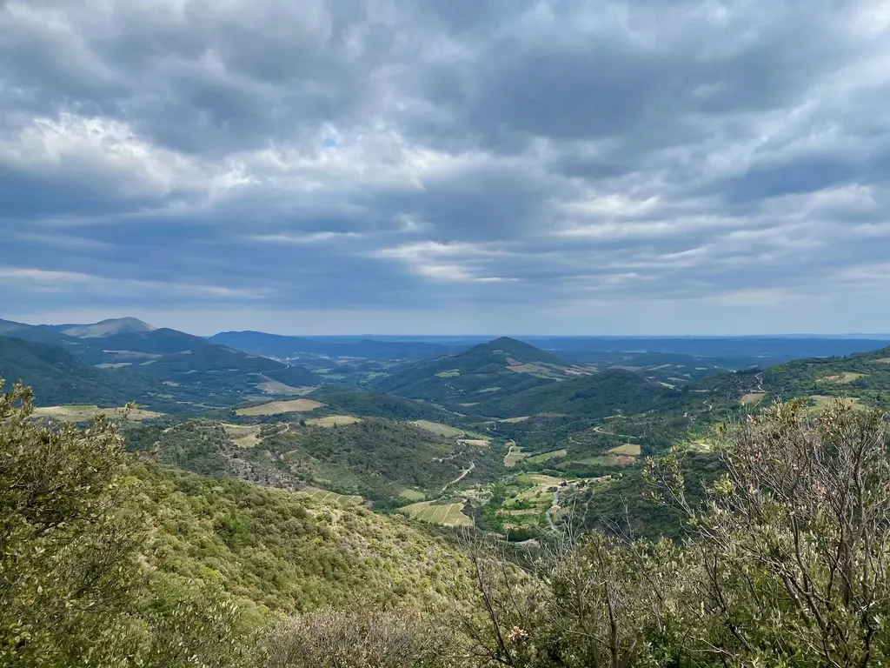
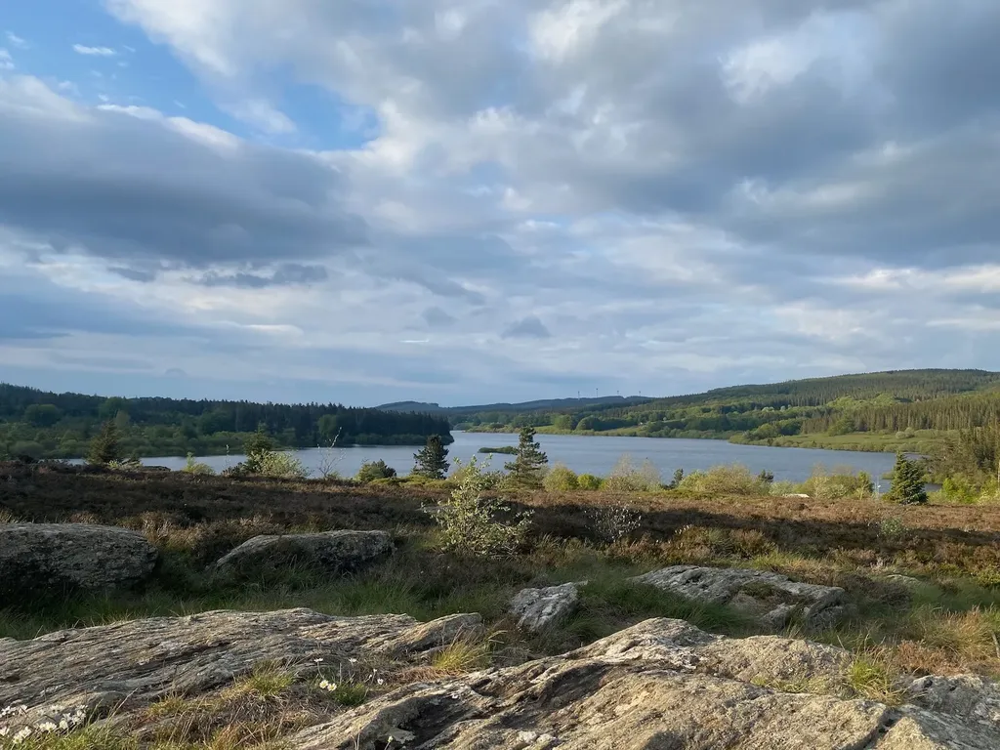
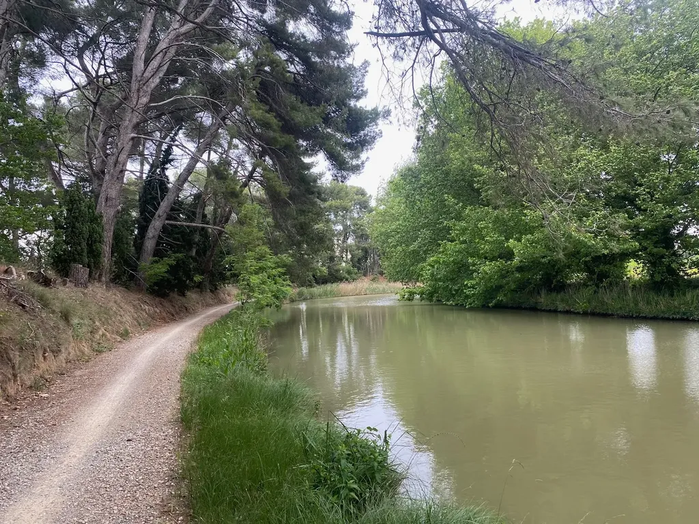
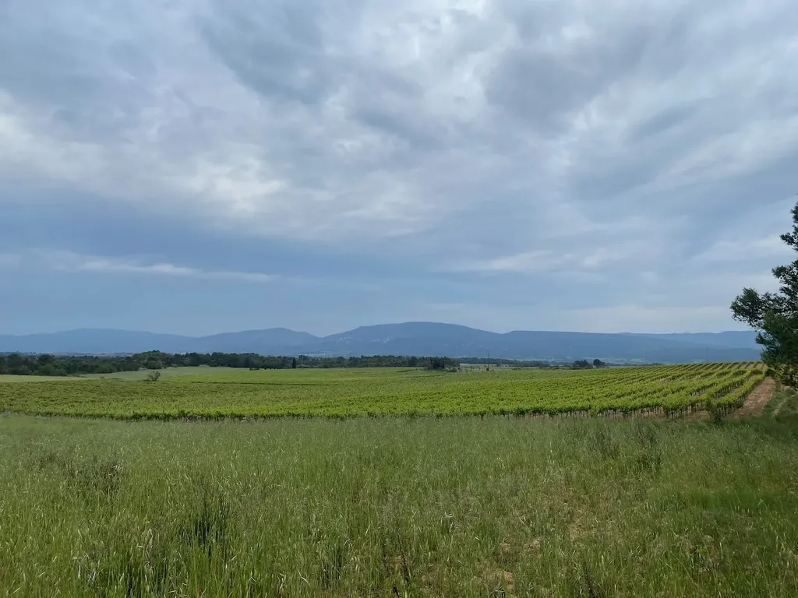
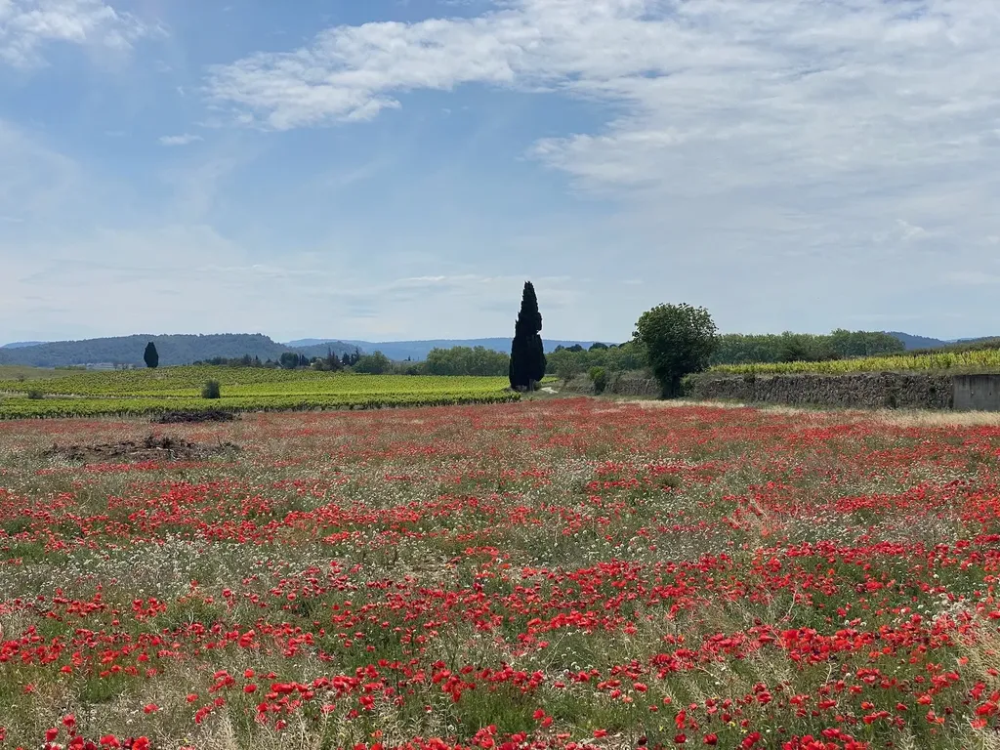
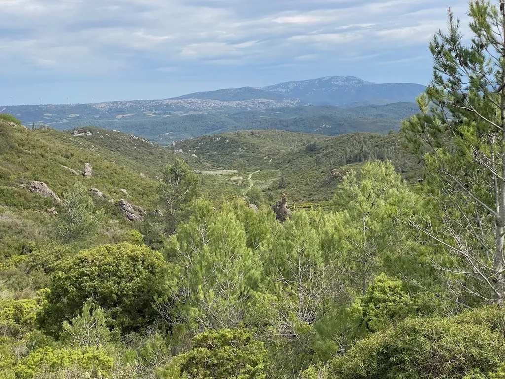
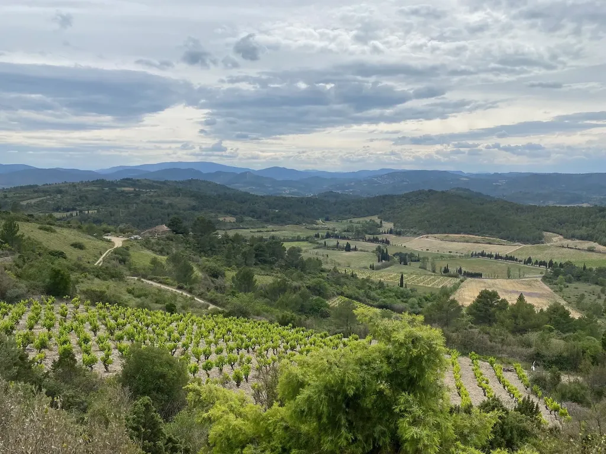

# Le gravel, un vélo pour voyages organisés

Vous allez me dire que c’est encore un titre provocant, du putaclic, sauf que je n’ai rien à vendre et rien à gagner que vous soyez dix, cent, mille ou dix mille à lire cet article. Définir le gravel comme un vélo pour voyages organisés n’est même pas péjoratif à mes yeux. Cette idée s’est imposée à moi alors que j’effectuais une reco pour [le g727](https://727bikepacking.fr/g727/), la version gravel [du 727](https://727bikepacking.fr/). J’étais justement à ce moment dans la peau d’un organisateur de voyages à vélo.

Mais nous étions sur nos VTT. Quand je trace, c’est aussi pour me faire plaisir, pour découvrir de nouveaux secteurs, donc j’aime me hasarder vers l’inconnu. Dans ce cas, j’ai beau analyser les cartes, les images satellites, la heatmap Strava, je reste incapable de savoir par avance si un chemin est gravel ou VTT, et je n’ai pas d’autre choix que d’aller y jeter un œil, ce que nous avons fait du 18 au 21 avril sur la partie ouest du tracé initial du g727.

Reste à définir ce qui est gravel ou ne l’est pas. Il y a sans doute autant de définitions que de pratiquants, mais je vous donne la mienne. Que ce soit à gravel ou à VTT, j’ai envie d’être dans la nature, le plus loin possible des villes et des voitures. À VTT, j’ai le désir obsessionnel de réduire le pourcentage d’asphalte et augmenter celui de singles. À gravel, cette contrainte tombe quelque peu, mais n’en rend pas le traçage plus simple pour autant.

La semaine dernière, [deux gravellistes au background enduriste ont effectué le 727 VTT](https://www.facebook.com/groups/1956177877969720/posts/3452294968357996/) et l’ont qualifié de gravel alors que certains vététistes lors de l’édition d’avril l’ont qualifié de difficile. Chacun place le curseur selon son âge, ses compétences techniques, sa force. Il est vrai qu’un bon pilote passe partout avec un gravel. Le problème n’est pas de passer une fois, mais d’enchaîner les passages engagés et qui secouent le pilote. J’ai atteint l’âge où mes articulations ne le supportent plus longtemps, sans une bonne suspension avant. À gravel, je recherche donc des chemins roulants, peu accidentés, qui permettent de maintenir une moyenne de 20 km/h ou plus. Je ne fais pas du gravel pour me faire secouer les puces, sinon je prends mon VTT.

Voilà pourquoi je commence toujours les reconnaissances à VTT. La trace est encore brute. Elle n’a pas été défrichée et tout y est possible. Durant notre reco, nous avons remonté des pistes gravels superbes jusqu’à plonger dans des descentes ou des singles purement VTT, où je n’aurais vraiment pas envie de me retrouver avec mon gravel et dans lesquelles je n’ai pas envie d’envoyer les participants du g727. C’est ainsi qu’une trace gravel demande un gros travail préparatoire, donc une organisation. Voilà comment j’en suis arrivée à l’idée du gravel comme vélo pour voyages organisés.

Pour préparer un voyage sur route, il suffit d’une bonne carte. Pour préparer un voyage VTT, il faut davantage de travail, mais on est prêt au pire, donc on peut tracer à l’arrache. Pour le gravel, et pour maximiser le plaisir, de nombreux arbitrages sont nécessaires, qui impliquent une bonne connaissance du terrain et de nombreuses reconnaissances.

Si sur les sorties d’un jour, j’accepte parfois à gravel quelques passages rugueux, je les limiterai sur le g727. Par exemple, dans les Corbières, après [Fontjoncouse](https://fr.wikipedia.org/wiki/Fontjoncouse), une belle piste nous a conduits au pied d’un single pentu, qui impliquait du poussage, même à VTT. Avec les copains, nous avons pris un bout de route pour découvrir une autre piste qui arrive au sommet du single. La descente par la suite est très belle. Nous plongeons dans un chaos calcaire jusqu’à rejoindre un passage difficile, non pas à cause des cailloux, mais d’un dévers glissant avec une ornière piégeuse. J’ai préféré la franchir à pied. Un des copains est tombé, sans gravité, heureusement. Les autres sont passés à fond. Au-delà se déroule une minuscule route merveilleuse, vraiment sublime, parfaite pour le gravel. Depuis je ne cesse de me demander si je conserve ce passage qui à gravel exige de marcher durant une centaine de mètres dans la descente pour éviter l’ornière.

Ces situations ne cessent de se répéter tout au long de la trace. Avant Trèbes, nous avons remonté un single des plus joueurs, avec quelques marches, quelques toboggans. Gravel ou pas ? Je suis sûr que les gravellistes du coin passent par là, mais avec une certaine tristesse j’ai écarté du g727 le secteur au profit de chemins plus sages. Même remarque au sujet de la descente depuis le sommet du pic de Nore. Le single est génial, mais pas gravel. Voilà comment un voyage gravel s’organise par retouches progressives.

[tcrouzet function="tcrouzet\_visugpx" map="https://www.visugpx.com/HhyJuC9nMP"]

En comparaison, [la trace VTT que nous avons suivie](https://www.visugpx.com/HhyJuC9nMP), tracée théoriquement sur écran, était d’emblée quasi parfaite. J’ai acquis une sorte de sixième sens cartographique, mais ce sixième sens fonctionne mal pour le gravel, car le gravel a beaucoup plus d’exigences que le VTT, même s’il en a moins que le vélo de route. Cet entre deux rend ce vélo intéressant et aussi en limite l’usage pour les voyages, sauf à suivre des itinéraires qualifiés de gravel, donc organisés pour le gravel.

#velo #y2023 #2023-5-28-10h43
