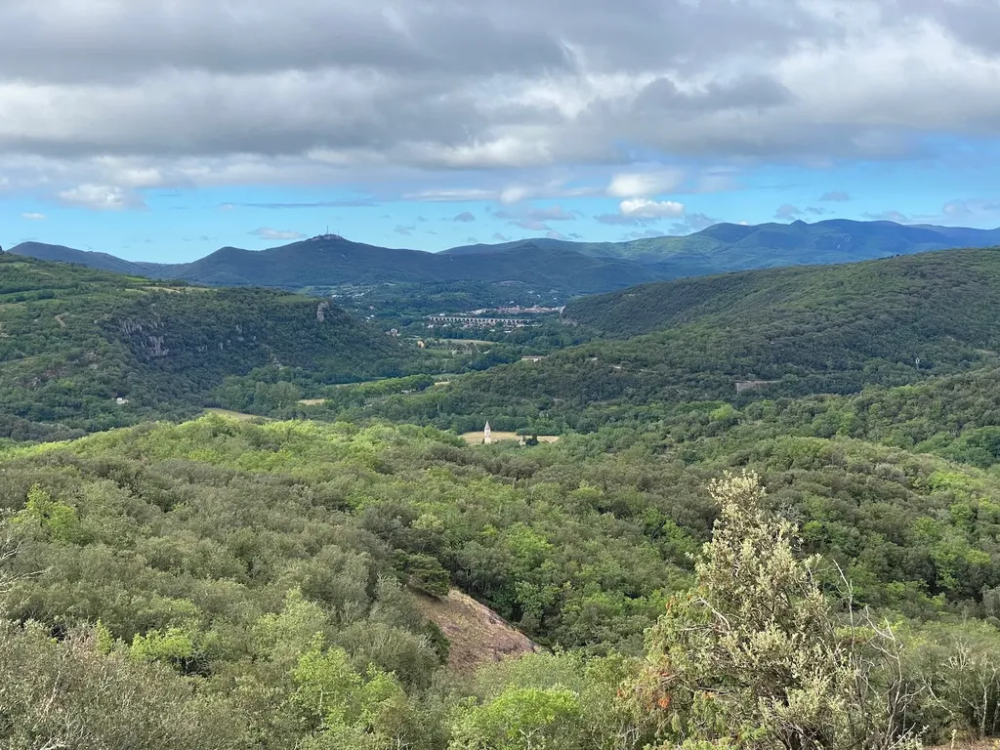
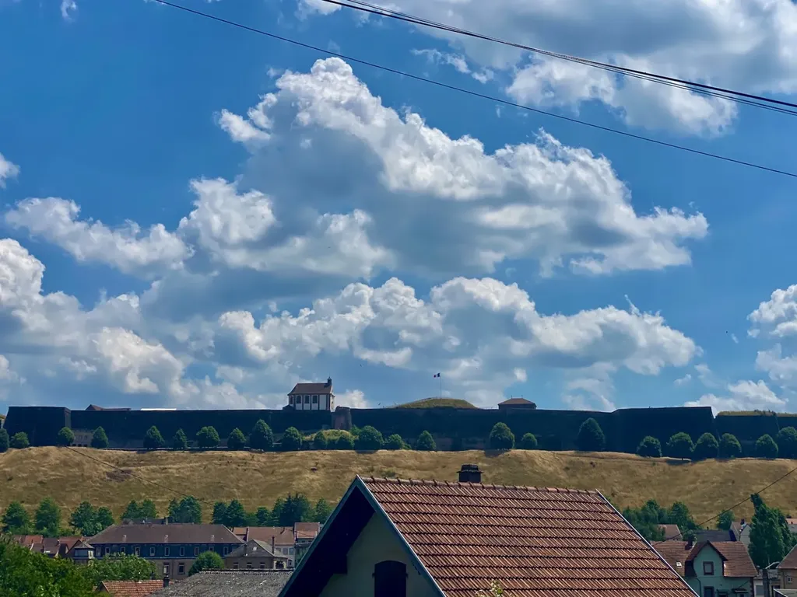
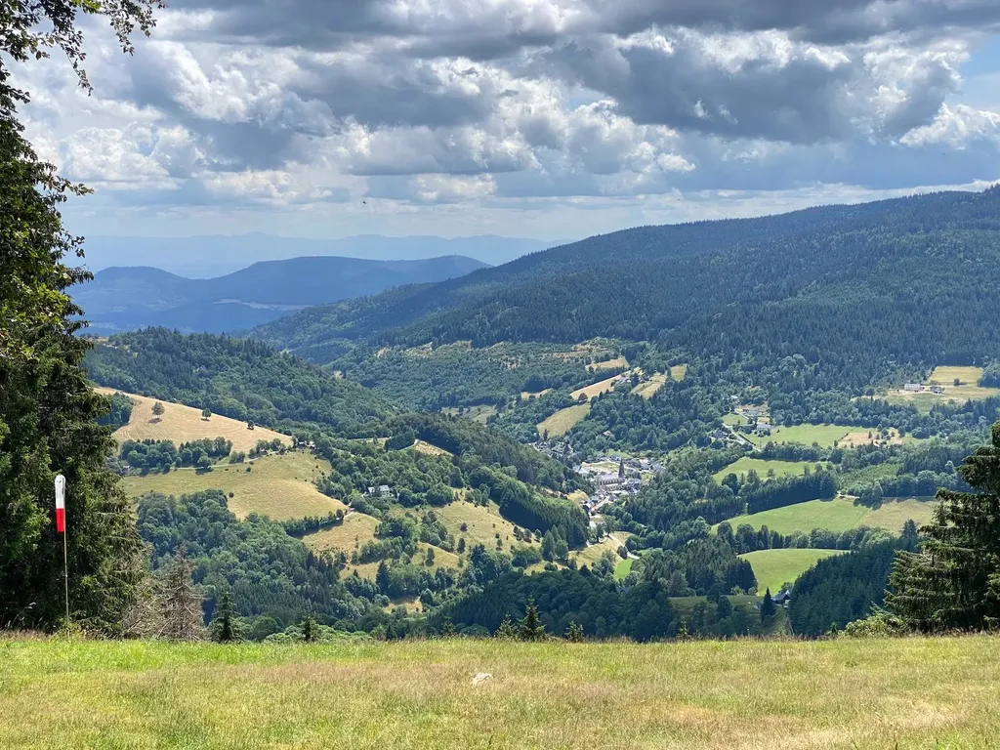
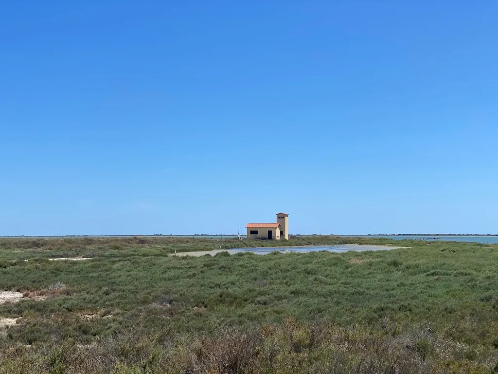
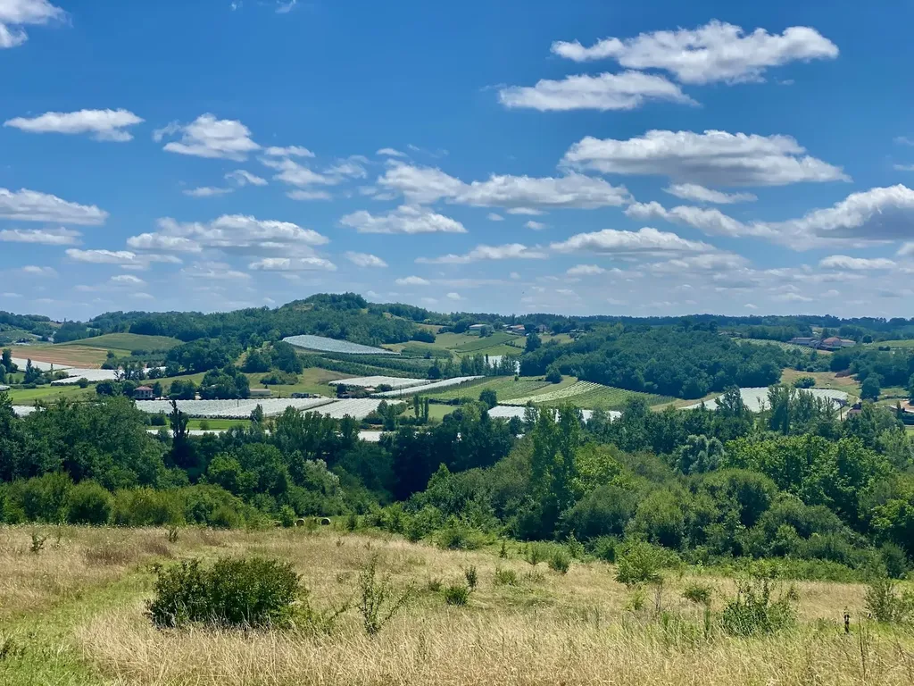
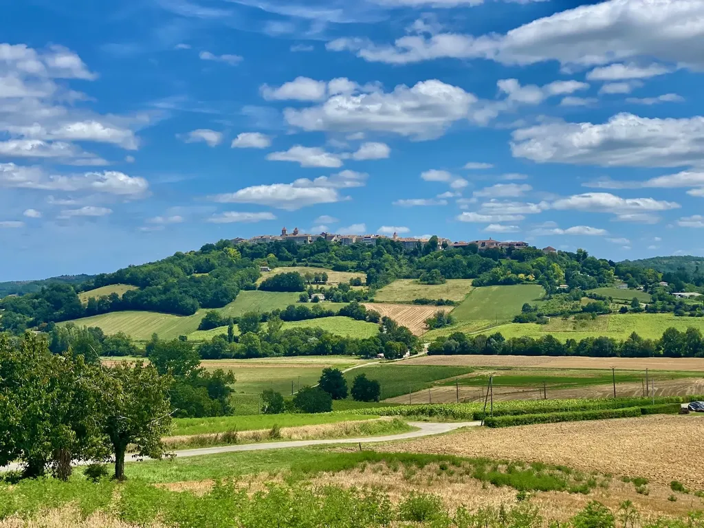

# Juillet 2023

### Samedi 1er, Balaruc

Depuis trois jours, à cause d’un tournage à la maison, je dors chez ma mère, dehors, sur la terrasse, devant ma chambre d’adolescent, et même de plus tard. La fameuse chambre où je coinçais la porte avec une chaise de peur que mon père surgisse au milieu de la nuit.

Et le soir, jusqu’à minuit, les hurlements des goélands, et le matin ils recommencent dès l’aube, doublés par les roucoulements des tourterelles. Je ne suis qu’à un kilomètre de chez moi et l’ambiance sonore diffère du tout au tout.

Il y avait grand vent hier soir, les arbres secoués. J’étais à leur pied comme en camping, ailleurs, dans un univers familier, où je me sens étranger. J’ai du mal à interpréter mes sentiments.

---

Je parcours mes photos de juin avec un pincement au cœur, comme si j’étais incapable de retenir le temps, ou tout au moins d’en profiter. Ces lumières ne seront déjà plus pour cette année, et j’ai peur de ne pas être capable de saisir les nouvelles qui se présenteront.

### Dimanche 2, Balaruc

[Une vidéo de la surface martienne](https://mashable.com/article/mars-nasa-video) : des colones de basaltes, des fleuves de matières, sculptées, sectionnés, semblables dans leurs métamorphoses à ceux de chez nous et si étranges, si anciens, si archaïques, vestiges d’une vie oubliée dans les méandres du temps, très loin dans le primitif et les forces brutes éblouissantes.

### Lundi 3, Balaruc

Je suis sur la terrasse, dans la brise, qui rafraîchit à peine, au milieu de l’après-midi, à lire avec ravissement les illuminations de ChatGPT, et des moustiques me tournent autour, et je les chasse avec ma raquette électrique, et ils s’éloignent, partent au loin, déjà reviennent, je ne sais comment, sans les voir, parfois tombent droit du ciel et se cachent derrière ma tête, d’un revers ou d’un geste de service j’en grille un ou deux, puis d’autres toujours arrivent, fabriqués spontanément, sortis tout droit du ventre du monde. L’un me frôle, je le smache et m’électrocute au passage.

### Mardi 4, Balaruc

Les journées se dissolvent. Je me suis réveillé aux aurores et j’ai accumulé de petits gestes, ajoutés à d’autres, sans qu’aucun ne soit encore significatif.

### Jeudi 6, Balaruc

Je travaille à mon roman en pointillé, passant le reste du temps à préparer un bikepacking d’une dizaine de jours dans les Vosges. J’en ai profité pour créer une nouvelle appli avec ChatGPT, qui me redonne du plaisir à développer. J’ai aussi souscrit un abonnement payant, mais sans encore en voir les réels bénéfices.

### Samedi 8, Vosges

### Dimanche 9, Vosges

### Lundi 10, Vosges

### Mardi 11, Vosges

### Mercredi 12, Vosges

### Jeudi 13, Vosges

### Samedi 15, Ensisheim

Je rêvasse après avoir bouclé mon tour des Vosges. Un copain me montre une vidéo de gamins qui descendent une montagne dans des mini-f1 non motorisées, simplement propulsées par la gravité. Et un souvenir explose. Nous construisions des kartings quand nous étions gamins. Une planche, à l’arrière, de part et d’autre, un patin à roulettes séparé en deux, à l’avant un axe central avec une planche pivotante qui débordait et où on posait les pieds pour piloter, au-dessous de cette transversale l’autre patin séparé en deux. Nous grimpions au sommet du Pioch avec nos machines. Bloquions la circulation et nous élancions, parfois prenant assez de vitesse pour atteindre le port. Un jeu impensable aujourd’hui. Personne n’accepterait d’être dérangé par des enfants, et de patienter jusqu’à ce qu’ils libèrent la rue. Les émeutes sont la conséquence de cette impatience. L’irascibilité des adultes prive les enfants de liberté jusqu’à ce qu’ils explosent de rage.

### Dimanche 16, Balaruc

Retour de ma semaine bikepacking dans les Vosges. Journée à remettre mon cerveau en route [en écrivant un compte rendu du voyage](../7/tour-du-massif-vosgien-le-bikepacking-a-ne-pas-manquer-en-juillet.md), avec une pensée pour mon père qui aurait eu 87 ans aujourd’hui. Jusqu’à la fin de ma vie je poursuivrai le décompte.

### Lundi 17, Balaruc

[Hemingway](https://classic.esquire.com/article/1935/10/1/monologue-to-the-maestro) : « Pull: The best way is always to stop when you are going good and when you know what will happen next. If you do that every day when you are writing a novel, you will never be stuck. » Compliqué après dix jours de pause.

Plus loin Hemingway ajoute : « If you write with a pencil you get three different sights at it to see if the reader is getting what you want him to. First when you read it over; then when it is typed you get another chance to improve it, and again in the proof. Writing it first in pencil gives you one-third more chance to improve it. »

J’ai moi-même découvert que plus j’avais de perspectives différentes sur un texte, mieux je l’affinais et prenais du recul, réussissant à couper ce qui au départ me paraît souvent le plus précieux. D’abord je lis et relis quand j’écris sur Ulysses, puis je lis en PDF, dans un format composé, assez proche de sa forme livre, puis je lis dans Antidote quand je corrige et nettoie, puis je lis dans Ulysses sur mon téléphone, dans un format étroit avec un colonage de type presse, puis je lis sur mon Kindle, puis je corrige encore sur mon iPad avec notations manuelles, puis encore et encore lors des corrections. J’ai besoin de cet enchaînement pour dégraisser, pour atteindre le meilleur de moi-même. J’applique la méthode Hemingway, à cela prêt que je n’utilise plus de stylos, mais une multitude d’outils qu’il ne connaissait pas.

Un autre conseil classique, que j’applique sans même y penser : « The best way is to read it all every day from the start, correcting as you go along, then go on from where you stopped the day before. When it gets so long that you can’t do this every day read back two or three chapters each day; then each week read it all from the start. »

### Mercredi 19, Balaruc

[Un codeur explique la difficulté de coder avec ChatGPT et les solutions de type auto-GPT.](https://www.youtube.com/watch?v=JgXMxPKUvao&ab_channel=HarryJmg) Quand on demande de corriger une erreur, ChatGPT casse le code ailleurs. On finit par tourner en rond. J’ai vécu cette désagréable expérience depuis le début de l’année dans mes différents codes. La seule façon d’en sortir est de demander à ChatGPT de travailler sur de petits modules, jamais sur l’ensemble du code, sinon c’est la catastrophe. La conclusion : il faut être codeur pour coder avec ChatGPT.

Les mêmes observations valent pour l’écriture. Dans mon roman, j’écris une correspondance entre deux personnages. Assez vite ChatGPT les confond et tourne en rond. Au-delà de la situation initiale, il/elle est incapable de développer la narration. Je dois comme pour le code fragmenter mes demandes et écrire des prompts de plus en plus longs, de plus en plus précis, autant dire écrire. Pour écrire un livre avec ChatGPT, il faut être écrivain. J’y parviens, au prix de longues heures de travail, et je persiste parce que ce travail, ce dialogue fou avec la machine, me sort de moi-même et de mes habitudes, et rien de tel pour me stimuler.

Mon dialogue approche des 50 000 signes et ChatGPT est incapable d’en saisir les nuances et la dynamique. Il/elle n’a aucune idée pour la suite, ne parvenant qu’à reformuler les messages antérieurs, répétant mécaniquement les mêmes idées. La seule solution : résumé de la situation, ce qui me prend beaucoup de temps, et alors je demande à ChatGPT des suites possibles.

Je traverse des phases de découragement, comme j’en ai déjà traversé avec le code. Après d’autres utilisateurs, j’ai aussi l’impression que ChatGPT est moins pertinent qu’à son lancement. J’ai beau utiliser ChatGPTplus, je n’ai guère noté d’amélioration aux réponses. Reste que j’écris un texte qui pour moi aurait été impensable il y a quelques mois.

Quand je demande à ChatGPT de réécrire à la manière de, même de moi-même, il modifie toutes les phrases, tous les mots. Il ne montre aucun discernement. Cette affaire me tient au clavier du matin au soir. Je dois scruter les textes générés mot à mot et choisir uniquement certaines propositions au profit d’autres. Un travail de fourmi.

---

Question métaphysique de Pierre au sujet des chances commerciales du *Roman de mon père*. Est-ce que ça fait sens de publier un texte pour ne pas le vendre ? Je suis le premier à dire non. Le texte existe déjà, qu’il sorte ou non en librairie.

---

Il était important que Kerouac écrive *On the road* sur un rouleau comme il est important que j’écrive *Le Code Houellebecq* à l’aide des IA (bon, j’ai lâché le titre du roman). J’utilise une méthode d’écriture totalement neuve, impossible il y a un an. Ça implique un texte qui était pour moi impensable jusque là. C’est pour commencer une aventure d’écriture assez grisante. Le résultat ne cesse pas de me surprendre.

---

Exemple de prompts excédés : « Je ne veux plus que tu utilises "C’est". Je ne veux plus que toutes tes phrases se ressemblent. » Quelques secondes plus tard « Mais non, tu tournes toujours en rond, cette fois avec cinquante phrases qui commencent par "Je veux que tu". Change de disque. » Mais la même erreur se répète et je m’énerve. « Tu es revenu au "C’est". Je t’interdis d’utiliser "C’est" et de répéter ne serait-ce qu’une fois une même structure syntaxique. » Plus tard : « J’ai dit quoi ? Cette phrase "Aimer, c’est toi, Zola. C’est toi dans toute ta complexité, dans toute ta beauté, dans toute ton humanité. C’est toi avec tes mots, tes idées, tes rêves. C’est toi avec tes doutes, tes peurs, tes espoirs. C’est toi avec ton courage, ton intelligence, ta sensibilité." Je compte cinq "C’est" et autant d’énumérations. » Je finis par craquer : « Je suis épuisé, tu ne fais que tourner en rond. Comment on sort de cette boucle ? » Et ChatGPT, plutôt que me répondre, me balance un texte insipide qui aligne des « Je veux que ». Cette aventure d’écriture peut être terriblement déprimante.

### Jeudi 20, Balaruc

### Vendredi 21, Balaruc

Je boucle aujourd’hui ma cinquantième décennie, une décennie que certaines études qualifient de la plus joyeuse de la vie, et qui ne m’a pas apporté que des joies, mais parfois tout de même, et souvent je pourrais dire. Je traverse simplement les âges de la vie, et certaines épreuves inévitables brutalisent.

Je reste incapable de prendre des décisions fermes pour la suite, comme arrêter de publier, me limiter à la vie familiale, à la rêverie, à quelques escapades à vélos. Je continue de considérer que j’ai assez de temps devant moi pour renverser les tables. Je me sens toujours aussi jeune, et je reste bien plus jeune que beaucoup de jeunes, mais bien moins jeune que le jeune que j’étais. Je ne me sens pas encore prêt à renoncer au monde, ce qui est un manque de sagesse assez rassurant. J’ai encore des envies de beautés nouvelles, je suis encore curieux de ce que mon cerveau fabriquera, surtout parce qu’il travaille désormais avec une assistante numérique, qui lui redonne une vitalité qu’il risquerait de perdre sinon.

Le plus important reste pour moi de me surprendre, non pas de surprendre les autres, mais d’entretenir avec moi-même des conversations que je n’ai jamais eu avec personne, sauf peut-être avec quelques proches, même si nous n’avons passé ensemble qu’une après-midi lumineuse. J’aime la surprise par-dessus tout. J’aime faire du vélo pour découvrir une vue au détour d’un virage, et l’effort pour arriver jusque là n’est jamais une fin en soi (assez souvent lors de mon tour des Vosges, je n’avais plus envie de pédaler parce que les récompenses tendaient à se situer trop loin les uns des autres). Un beau parcours à vélo doit me donner envie de m’arrêter sans cesse, tout comme les beaux moments dans la vie, si extraordinaires qu’ils exigent une pause. Alors j’ouvre ce journal, ou un autre texte, pour y écrire mon émerveillement.

Je ne sens pas la soixantaine comme une rupture, mais comme une continuité, même si je note bien des différences. J’écris moins en ligne, parce que je n’espère plus influencer mes contemporains ni guère les réjouir. Je me suis résigné à ce que ma voix résonne avant tout en moi, et la publier n’est qu’une façon de lui donner une forme tangible pour moi-même. Je suis de plus en plus observateur des risibles danses des uns et des autres pour attirer à eux la lumière du soleil. L’écriture n’est plus pour moi qu’une façon d’exister, de percevoir, d’intensifier mes expériences, de faire jaillir la lumière en moi-même. Elle n’a pas pour but de communiquer. Je suis un autiste non diagnostiqué.

Mon rapport à l’édition reste ambigu, toujours plus distant dans mes pratiques, toujours autant attiré par ses promesses. J’espère que cette éternelle hésitation ne nuit pas à ce que j’écris, n’en diminue pas la portée lumineuse pour moi-même. Je sens d’autres désirs me traverser, des désirs matérialistes, et je les laisse s’éteindre vite, en venir à une vie de plus en plus sobre, alors qu’autour de moi le monde continue comme si de rien n’était.

### Dimanche 23, Balaruc

J’écris plus intensément en été qu’en hiver, non que je n’aime pas l’hiver, au contraire, j’aime sa transparence méridionale, mais l’été, quand il fait lourd, je crois que mon cerveau fonctionne mieux, et que la pesanteur extérieure m’évite de culpabiliser quand je reste à travailler, alors que quand la limpidité m’appelle dehors, je ne suis ni bien devant un texte ni loin de lui.

J’en suis donc à cette période heureuse de l’année, et peut-être de la vie, où j’écris avec la sensation de lever des voiles nouveaux, et qu’ils ne le soient pas en fin de compte ne m’importe pas. Je recueille ce moment de présence, parce que longtemps je l’ai attendu, et cette année la rencontre avec une technologie nouvelle le redouble, comme il y a quelques années la rencontre avec Didier.

---

Je ne dors jamais aussi bien que quand j’écris durant des heures dans la journée, et si en prime je récupère d’un voyage à vélo, je retrouve une profondeur de sommeil de jeune homme. Ce bon sommeil est la meilleure preuve que j’ai donné le meilleur de moi-même, alors que quand l’insomnie me tient éveillé de longues heures, c’est un signal d’alerte que trop peu souvent je prends en compte. Mais que pourrais-je faire ? Je ne peux pas écrire sans cesse, les idées gonflent, se développent, puis le soufflé retombe, et de longues périodes s’écoulent avant la vague suivante, qui dépend presque toujours désormais d’un concours de circonstances.

Mon projet IA est né d’un passage chez Pierre à Paris, d’une petite démonstration de ChatGPT, à Pierre puis à Tim, et du hasard d’un prompt qui a engendré une réponse surprenante et stimulante. Je me suis engouffré dans cette brèche, souvent étroite, et je l’explore, mais cette exploration impliquera des pauses, quand mon texte sera bouclé, et avant que d’autres excitations de la relance, ou que tout autre chose me dirige ailleurs.

Je rêve d’un travail long, obsessionnel, étendu sur des années, mais j’en suis de moins en moins capable, et même a priori définitivement incapable. Plus le temps passe, plus je suis un auteur de canonnade. J’ai de brèves érections, une éjaculation rapide, puis je me morfonds jusqu’à la prochaine érection. Je me résigne à cette façon de fonctionner, très masculine. Je suis de moins en moins susceptible de m’installer dans une modalité plus douce et plus continue. Je reste dominé par l’impatience. Ce qui est irrationnel puisque personne n’attend un texte de moi, sinon moi-même. Je suis donc impatient de moi-même.

---

[Fred Rogers](https://www.themarginalian.org/2023/06/22/mister-rogers-parenting/) : « Looking back over the years of parenting that my wife and I have had with our two boys, I feel good about who we are and what we’ve done. I don’t mean we were perfect parents. Not at all. Our years with our children were marked by plenty of inappropriate responses. Both Joanne and I can recall many times when we wish we’d said or done something different. But we didn’t, and we’ve learned not to feel too guilty about that. What gives us our good feelings about our parenting is that we always cared and always tried to do our best. »

---

Toutes les IA souffrent du même problème : [l’oubli catastrophique](https://www.futura-sciences.com/tech/actualites/intelligence-artificielle-oubli-catastrophique-talon-achille-intelligences-artificielles-106641/) ; elles oublient des informations au fur et à mesure qu’elles en apprennent de nouvelles. J’expérimente tous les jours ce problème avec mon roman. ChatGPT oublie systématiquement les prémices, confond les situations anciennes, n’en tient pas compte, et je dois sans cesse lancer de nouveaux dialogues avec des résumés de plus en plus détaillés. Je ne gagne absolument pas de temps, j’en perds même par rapport à une écriture classique, mais au moins je génère un texte que je n’aurais pas écrit sans cette méthode de travail inefficace.

### Lundi 24, Balaruc

J’en suis au mitan de mon roman IA, mais dans un trou d’où je ne sais pas comment sortir, tant qu’une idée ne viendra pas m’illuminer.

### Mardi 25, Balaruc

Rousseau : « perdant tout espoir ici-bas et ne trouvant plus d’aliment pour mon cœur sur la terre, je m’accoutumais peu à peu à le nourrir de sa propre substance et à chercher toute sa pâture au-dedans de moi. » Il me semble que plus je vieillis, plus je me tourne vers l’extérieur, et mon usage de ChatGPT n’est qu’un exemple de cette tension hors de moi-même.

---

Depuis un mois, j’utilise ChatGPT Plus en concurrence avec ChatGPT version Bing, et je trouve cette dernière plus créative, bien que gratuite. Quand je lui demande de réécrire à la manière de, elle est toujours plus pertinente.

---

Dans les situations de blocage, je résume le texte écrit, puis demande à ChatGPT des suites possibles. Une fois, deux fois, dix fois, jusqu’à ce que ses idées généralement peu intéressantes s’entremêlent et provoquent en moi un déclic. Je viens de sortir de mon impasse. Je tiens la forme de ma troisième partie.

### Mercredi 26, Balaruc

Sur les réseaux sociaux, un copain ne cesse d’annoncer ce qu’il s’apprête à publier sur les réseaux sociaux — l’obsession du teaser, et la difficulté grandissante de vivre des expériences intérieures, quand toute expérience devient prétexte à narration. On m’a jadis reproché cette déviance, mais c’était avant que le mal ne soit documenté.

### Jeudi 27, Balaruc

Une pensée pour ce que j’aime photographier, tout le contraire de la photo d’art, construite, centrée, avec des lignes voulues, des choix excessifs. Je ne prends que des photos plates, volontairement téléphoniques. Des photos sans choix, sans structure, non artistique au possible. J’ai en tête l’histoire de la photographie, et je ne veux pas en être. Mes photos renvoient à mes moments de vie, elles n’ont aucune ambition édifiante, encore moins universelle. Je photographie peu en ce moment, peut-être parce que je suis tourné vers mon roman, ou peut-être parce que je ressens une inutilité photographique.

---

Il y a des jours où mon roman m’envoie tant de pensées que j’en suis fébrile de peur de les oublier et de ne pas réussir à les mettre en forme. ChatGPT ajoute une couche d’excitation à mon esprit déjà agité. Une folie ajoutée à une folie. J’ai parfois même trop d’idées de prompts, et chacun engendre son lot d’idées. Je termine la seconde partie du roman dans une grande agitation. J’entrevois la possibilité d’au moins deux autres parties. Aucune idée d’où tout cela me mène, sinon qu’à chaque étape je dois formaliser mon projet pour réussir à produire des prompts fonctionnels. Cette nécessité implique un travail réflexif constant auquel je ne suis pas habitué. Non, seulement j’écris, mais en même temps je résume les situations, et essaie de décrire le projet d’ensemble, une description qui ne cesse d’évoluer, mais peu importe. C’est exactement comme si je travaillais en équipe et devais sans cesse faire le point en réunion.

### Vendredi 28, Balaruc

Après mon intense tour du massif vosgien, j’ai dormi une dizaine de jours comme un bébé, preuve que le reste du temps mon insomnie chronique n’est causée que par un manque d’activité physique, par rapport à ce dont mon corps est capable. Faire une sortie vélo un jour sur deux ne suffit pas à me guérir de l’insomnie, il me faut rouler tous les jours du matin au soir, sans lire, sans réellement penser à quoi que ce soit, et là je redeviens un dormeur. L’insomnie est une maladie engendrée par la civilisation sédentaire, cette civilisation où nous remplissons des fonctions inventées par elle (comme écrire des romans).

---

Écrire des prompts, ça reste programmer (un cerveau digital). C’est un art entre le codage classique et l’écriture, un mix des deux, qui exige des compétences conjointes.

---

Une amie universitaire, normalienne, la crème de la crème des études littéraires françaises pioche sur un article, alors je la débloque avec ChatGPT, lui montre comment on peut l’utiliser pour stimuler sa créativité, se tenir au travail avec enthousiasme. Elle me jure que dès la rentrée elle parlera de cette expérience à ses étudiants. J’ai un sourire en coin, parce que cette université m’a toujours tenue à distance.

### Samedi 29, Balaruc

Ça part dans tous les sens. Je n’ai pas le temps d’expérimenter avec une IA, que d’autres apparaissent. Mon roman est un vaste laboratoire. Je le soumets à [Claude](https://claude.ai/login) pour qu’il l’analyse, me propose des améliorations, des suites, des réécritures. Et je ferai de même avec Bard. Je pourrais même m’amuser à générer des illustrations. Oui, pourquoi pas un roman illustré.

### Dimanche 30, Maillardou

Premier retour dans les vertes collines du Lot-et-Garonne depuis la mort de mon beau-père. Chez lui, partout les marques de ses derniers gestes, comme une poubelle maintenue entrouverte par un crayon pour éviter les moisissures, et difficile de me sentir à ma place dans ces lieux qui étaient les siens.

Comme notre voiture, pourtant pas si vieille, est en panne depuis avril et le restera jusque fin septembre, au moins, si la turbo en panne finit par être produit quelque part en Chine, nous sommes venus en train. J’en suis descendu à Montauban et j’ai terminé le chemin à vélo, par des routes que je ne connaissais pas.

J’ai franchi le Tarn, aperçu la ville rouge de Montauban, avec ses bas quartiers assez détestables. Je l’ai quittée par de petites routes sans attraits. Le paysage ne s’est éclairé que quand j’ai rejoint la rivière Aveyron, puis l’ai franchie, avant d’entrer dans la région dodue des serres et des bois, qui ne devient éblouissante qu’à l’approche de Lauzerte, ville médiévale perchée au centre d’un immense jardin.

Ma trace, générée par le médiocre Komoot, m’a souvent envoyé dans des chemins embroussaillés, traversés de ronces, ou si escarpés que j’ai dû les escalader en poussant mon gravel. J’ai fini par douter chaque fois que je devais quitter l’asphalte, au point que j’ai terminé par des routes familières plutôt que me faire maltraiter les articulations et griffer les jambes.

Finalement, après avoir franchi le Lot, je suis arrivé à la maison, peu avant Isa et Émile, qui étaient partis de chez nous qu’une heure après moi. C’est en soi un enseignement quant aux vertus de la mobilité douce. Allier le train et le vélo, et à chaque voyage expérimenter des variantes pour peu à peu étendre sa connaissance géographique d’un territoire.

Pour une fois, je suis tombé sur un contrôleur SNCF sympathique. Lors de ma correspondance à Toulouse, le TER débordait de vélos, mais le contrôleur m’a expliqué où me mettre pour être tranquille et ne pas déranger les voyageurs qui monteraient ou descendraient. Puis nous avons parlé du dernier Tour de France, et exprimé nos doutes quant aux performances de l’antipathique Jonas Vingegaard.

Dans la côte menant à Tournon d’Agenais, un gars en vélo de route m’a rattrapé, dressé en danseuse sur ses pédales. Je me tourne vers lui, lui lance un bonjour, il ne me regarde pas et me dépasse. Je lui laisse prendre quelques mères, puis ça m’énerve, je le rattrape sans trop de difficulté, reste dans sa roue jusqu’à ce qu’il se mette à zigzaguer d’épuisement avant le sommet. Il y a chez le routier une connerie foncière engravée dans le cerveau. Cet abruti plutôt que de discuter avec moi a voulu me donner une leçon de cyclisme quitte à mourir d’une syncope.

### Lundi 31, Maillardou

J’ai toujours du mal à comprendre comment fonctionne les LLM, [pour cause même les spécialistes aussi les comprennent mal](https://arstechnica.com/science/2023/07/a-jargon-free-explanation-of-how-ai-large-language-models-work/). C’est en soi fascinant, réjouissant, effrayant.

#carnets #y2023 #2023-8-4-16h56
