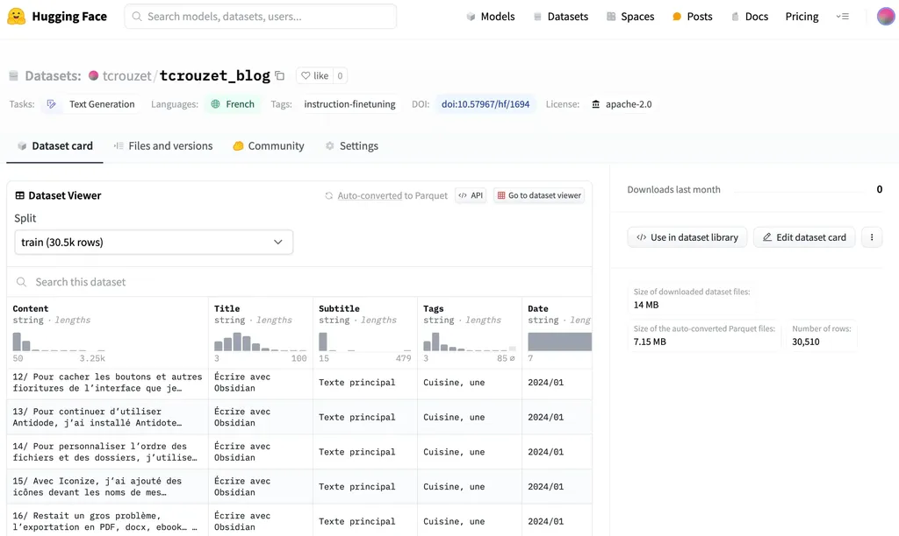

# Après les livres, les datasets

Pendant que des créateurs accusent les IA de les voler, et tentent de les empêcher d’accéder à leurs contenus, j’ai une démarche inverse.

Pour commencer, je diffuse depuis longtemps certains de mes textes en open source, notamment le contenu de ce blog. Il n’est pas né de nulle part, de mon génie, mais d’une multitude d’interactions, auxquelles il doit pour beaucoup, voire l’essentiel. Si je n’avais pas lu d’autres articles, d’autres livres, d’autres théories, mes textes n’auraient jamais vu le jour.

Je suis persuadé que plus nous partageons nos idées, nos émotions, nos histoires, plus nous avons de chances de nous enrichir mutuellement. Je ne suis ni pour fermer nos frontières avec des postes de douane, ni pour cadenasser nos œuvres. Je crois fermement que plus nous nous croisons les uns les autres, plus nous produisons du merveilleux. Au contraire, plus nous nous recroquevillons, plus nous nous inventons des fables malsaines.

Que les IA utilisent mes contenus pour en produire de nouveaux ne me dérange en rien, au contraire. J’ai même envie de pousser plus loin cette logique. Je suis curieux des liens qu’elles pourraient trouver entre mes textes et d’autres, tout comme je suis curieux de ce qu’elles découvriront en analysant nos ADN et une multitude de bases de connaissances.

Deux stratégies s’offrent à nous. Dresser des murs entre nos œuvres ou les ouvrir, aux machines, aux lecteurs, aux fécondations de toutes sortes, présentes ou à venir. Pour entraîner les IA, leurs promoteurs utilisent des datasets, des données plus ou moins structurées, que l’on retrouve sur le désormais incontournable [Hugging Face](https://huggingface.co). Soit les datasets sont construits en explorant le web, soit à partir de données structurées, potentiellement mieux qualifiées.

Un dataset est ni plus ni moins qu’une base de données. Je me demande si nous ne sommes pas en train d’inventer une nouvelle forme d’écriture : non plus écrire de longs textes linéaires, mais des jeux de questions et de réponses qui pourraient servir à entraîner les IA à écrire à notre façon, à s’imprégner de notre regard sur le monde, pour le généraliser. Un dataset littéraire serait une œuvre ouverte avec laquelle les lecteurs pourraient discuter sans fin. Ce serait une façon d’entrer dans un autre imaginaire, une autre temporalité, une autre époque.

Le dataset serait la version contemporaine de l’abécédaire. Nous ne sommes sans doute pas tout à fait prêts à les écrire consciemment, mais nous pouvons tout au moins en générer automatiquement. Je me suis donc amusé à créer un dataset avec le contenu de mon blog que [j’ai publié sur Hugging Face](https://huggingface.co/datasets/tcrouzet/tcrouzet_blog). Les créateurs de LLMs peuvent l’utiliser pour entraîner leurs modèles. J’ai bien tenté d’entraîner [Mistal](https://mistral.ai/) sur mes textes, mais j’ai mis à genoux mon Mac.

L’existence des IA ne peut plus être ignorée. Elles sont là pour durer, pour sans cesse nous étonner. Nous ne pouvons plus faire l’autruche et continuer d’écrire comme avant. Comme les développeurs créent des jeux vidéo avec des moteurs, nous pouvons créer des œuvres littéraires à l’aide de moteurs narratifs. Nous ne contrôlerons pas chacune des phrases produites, mais leur couleur, leur style, leur inclinaison psychologique, philosophique, politique… Nous sommes au-delà du livre dont vous êtes le héros, nous sommes face à une totale réinvention de l’écriture et possiblement de la lecture.

#ia #netlitterature #y2024 #2024-1-26-19h50
