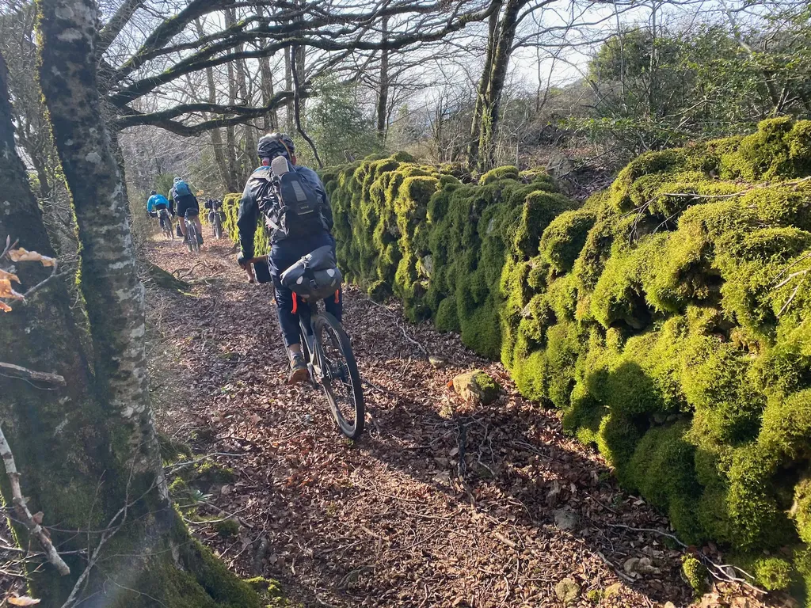

# Bikepacking ou cyclotourisme ?

En même temps que l’usage du mot cyclotourisme diminue, celui du mot bikepacking augmente. En Anglais, c’est plus flagrant : bike touring laisse place à bikepacking, ce qui semble insinuer une simple substitution du terme originel par le nouveau. Cette évolution, sans doute irréversible, n’est pas sans conséquence sémantique, car le mot bikepacking est initialement apparu pour désigner une forme particulière de bike touring : bike touring hors asphalte. Effacer la nuance ne peut qu’entraîner de l’incompréhension entre ceux qui, comme moi, utilisent encore le mot bikepacking dans son sens premier et ceux qui l’assimilent à cyclotourisme en général.

Exemple. [Sur Bikepacking France](https://www.facebook.com/groups/1396341304006680/posts/3190433804597412/), je vois un bikepacker dire qu’il recherche un vélo et sans trop me poser de question je lui dis que, dans son budget de 2 000 €, je peux lui vendre [une config de mon Specialied HT](../../2022/3/config-bikepacking-2022.md), avec sac de cadre sur mesure par [Lucy Rusjan](https://www.rusjan.eu/). Ce n’est qu’après plusieurs échanges, que je ne considère pas comme une perte de temps puisque j’en viens à les prolonger par cet article, que je comprends qu’il cherche un vélo pour la route.

Quand, je lui dis qu’il est cyclotouriste, ce qui n’a rien de péjoratif ni de ringard, il me demande, non sans ironie, si le bikepacking est uniquement hors asphalte. Pour moi, et pour l’étymologie, ça ne fait aucun doute.

Il n’aura échappé à personne que [le mot bikepacking a été construit sur la base du mot backpacking](../../../../2019/4/une-breve-histoire-du-bikepacking.md), pour dire la similitude des deux pratiques. Dans un cas, le matos est sur le vélo, dans l’autre sur le dos du marcheur. Mais l’analogie ne s’arrête pas là (sinon le débat serait clos). Dans la mesure du possible, le backpacker ne marche pas au bord des routes, mais dans la nature, en forêt, en montagne, dans les déserts, de préférence sur des sentiers et les GR. Il bivouaque à la belle étoile loin des villes et des bruits du monde thermo-industriel. Le bikepacker partage la même passion pour les espaces naturels, donc à l’écart de l’asphalte, des voitures, et de leurs nuisances conjointes. Ce qui implique pour lui un vélo peu chargé, agile, maniable, confortable, un VTT ou un gravel.

Si le même désir de découverte et de fraternité anime le cyclotouriste et le bikepacker, ce dernier recherche des endroits sauvages et isolés. Par ailleurs, il aime jouer avec son vélo, éprouvant un grand plaisir de pilotage quand il s’attaque à des singles. Avec en tête, ces dimensions essentielles au bikepacking, je trace [mes randonnées 727](https://727.tcrouzet.com/).

Alors si vous autres cyclotouristes continuez de vous définir comme des bikepackers, nous n’avons pas fini d’entretenir des dialogues de sourds. Si les grandes traces bikepacking françaises ([French](https://www.frenchdivide.com/), [TMV](https://tourmassifvosgien.fr/), [Sea to Peak](https://erminig.cc/epreuves/la-sea-to-peak/), [GTMC](https://www.la-gtmc.com/)…) et internationales ([Tour Divide](https://tourdivide.org/), [Silk Road Mountain Race](https://www.silkroadmountainrace.com/), [Montanas Vacias](https://montanasvacias.com/)…) sont toutes hors asphalte, ce n’est peut-être pas juste parce que je voudrais imposer ma définition du bikepacking. Nous avons simplement appris à nous comprendre et à partager un certain état d’esprit, pas nécessairement écologique, mais nous sommes soucieux de respirer à pleins poumons dans des espaces non urbanisés. Ainsi les participants aux [Race Across France](https://raceacrossseries.com/event-race-across-france/) ou autres [Transcontinetal Race](https://www.lostdot.cc/race-brand/transcontinental) ne sont pas non plus des bikepackers, mais des ultracyclistes sur route (le qualificatif d’ultra pouvant s’appliquer au bikepacking comme à beaucoup d’autres disciplines).

S’ajoute à ces différences un paradoxe : le bikepacker s’enfonce le plus loin possible dans la nature avec son vélo, mais il ne peut le faire qu’avec l’aide d’un GPS où il a chargé une trace amoureusement travaillée. Il n’a pas d’autre choix qu’utiliser la technologie parce l’asphalte a gangréné le monde et que le fuir exige de longs préparatifs. Il est difficile, voire quasi impossible, d’improviser une aventure bikepacking, alors qu’un cyclotouriste peut très bien se contenter d’une carte ou des panneaux signalétiques posés au bord des routes.

Je viens d’évoquer plusieurs conceptions du voyage à vélo, pas nécessairement exclusives ou antagonistes puisque certains passent des unes aux autres, mais qui chacune nous place philosophiquement et politiquement dans des postures propres. Certains esprits étroits se presseront de dire que ce qui compte c’est de pédaler (et de ne surtout pas faire marcher son cerveau). Si nous pensions majoritairement comme eux, nous n’aurions même pas inventé la roue, et encore moins le bikepacking. Nous aurions encore moins des dictionnaires et la nécessité de définir nos pratiques pour mieux nous comprendre. Mais comme l’étymologie compte peu par rapport aux usages, nous sommes presque obligés désormais de qualifier notre forme de bikepacking (route, vtt, ultra…) quand nous nous parlons.

*PS : En anglais, backpackers peut designer les routards, les globetrotters, les hickers. Si les hickers sont adeptes des randonnées dans la nature, les routards et globettroters voyagent avec un sac à dos mais ne passent pas leur temps à marcher — ils utilisent tous les moyens de transport à leur disposition. Quand on en revient à l’usage initial du mot bikepacking aux USA dans les années 1970, mais surtout à partir du début des années 2000, c’était bien pour désigner une pratique hors asphalte, avec backpacker = hicker (marcheur avec sac à dos à comparer avec pédaleur avec sac sur le vélo).*

#bikepacking #velo #y2024 #2024-1-15-19h41
