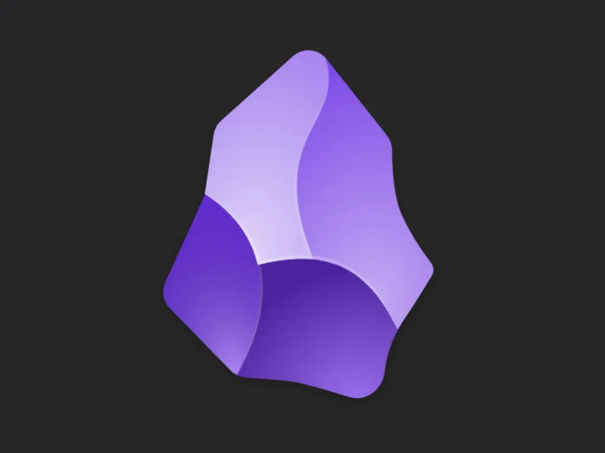
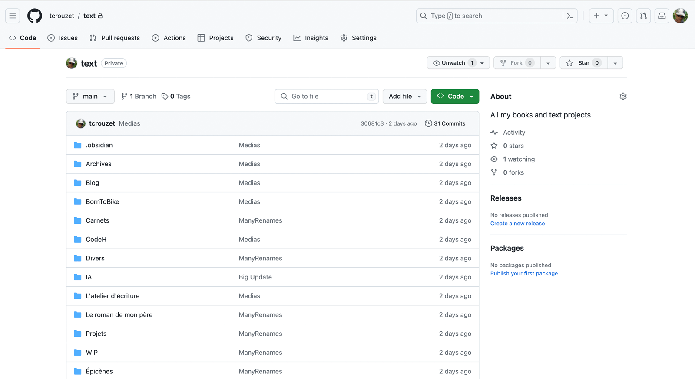
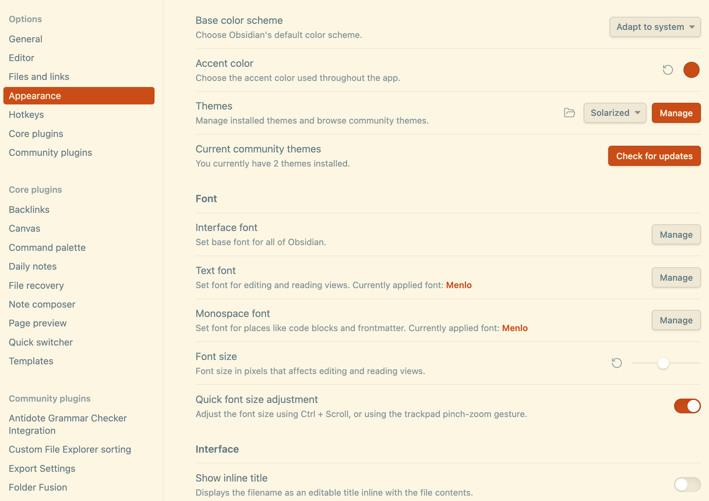
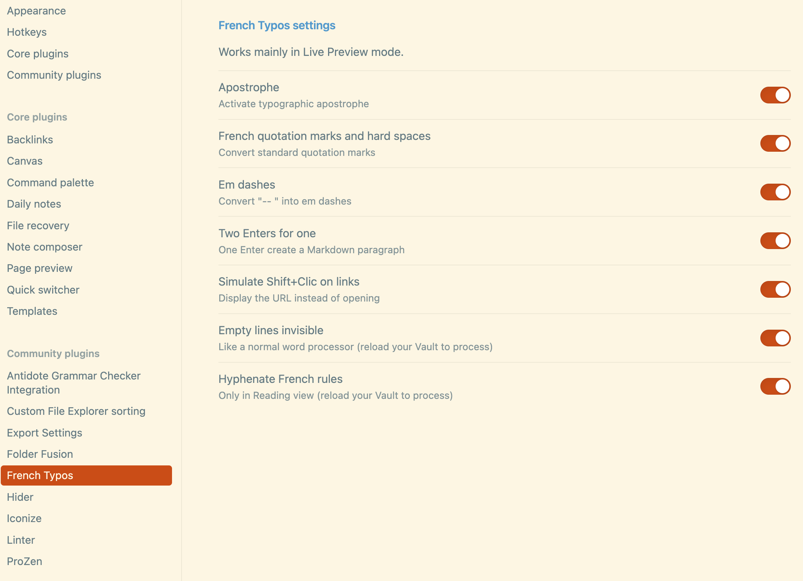
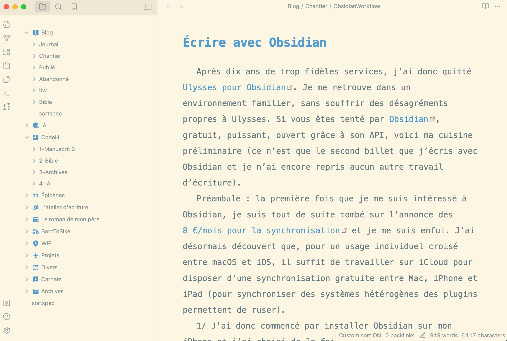
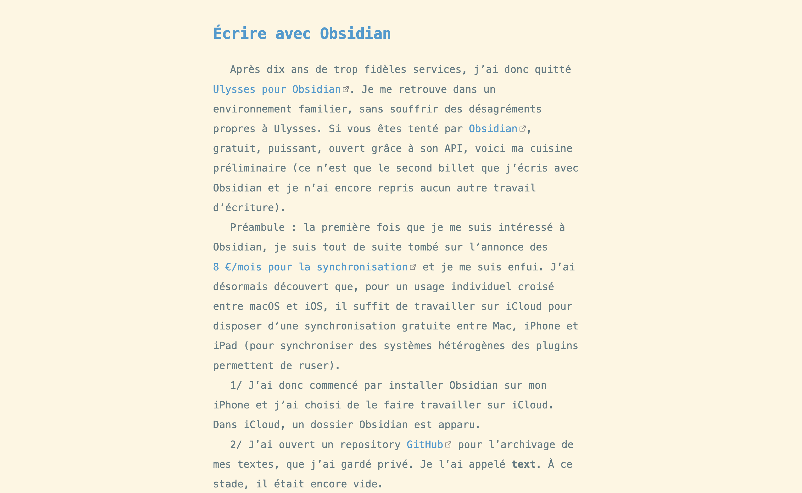

# Écrire avec Obsidian

Après dix ans de trop fidèles services, j’ai donc quitté [Ulysses pour Obsidian](../../2023/12/ecrire-a-la-recherche-de-lediteur-de-texte-ideal.md). Je me retrouve dans un environnement familier, sans souffrir des désagréments propres à Ulysses. Si vous êtes tenté par [Obsidian](https://obsidian.md/), gratuit, puissant, ouvert grâce à son API, voici ma cuisine.

Préambule : la première fois que je me suis intéressé à Obsidian, je suis tout de suite tombé sur l’annonce des [8 €/mois pour la synchronisation](https://obsidian.md/sync) et je me suis enfui. J’ai désormais découvert qu’il est [possible de synchroniser gratuitement via GitHub](https://desktopofsamuel.com/how-to-sync-obsidian-vault-for-free-using-git).

1/ J’ai donc commencé par installer Obsidian sur mon iPhone et j’ai choisi de le faire travailler sur iCloud. Dans iCloud, un dossier Obsidian est apparu.

2/ J’ai ouvert un repository [GitHub](https://github.com/tcrouzet) pour l’archivage de mes textes, que j’ai gardé privé. Je l’ai appelé **text**. À ce stade, il était encore vide.

3/ Sur Mac, avec [GitHub Desktop](https://desktop.github.com/), j’ai cloné le repository **text** dans le dossier Obsidian sur iCloud, ce qui est a entraîné la création d’un dossier **text** avec les fichiers cachés de GitHub.

4/ Toujours sur Mac avec Obsidian, j’ai ouvert ce dossier en tant que Vault (coffre-fort).

5/ Dans ce dossier, j’ai copié ma hiérarchie de fichiers Markdown ([exportée depuis Ulysses](../../2023/12/ecrire-a-la-recherche-de-lediteur-de-texte-ideal.md)). Toute autre hiérarchie Markdown est acceptée, bien sûr.

6/ Avec GitHub Desktop, j’ai synchronisé le dossier **text** sur iCloud avec mon repository GitHub. J’ai ainsi créé un backup de mes textes. Chaque fois qu’avec Obsidian je modifierai un fichier, en ajouterai ou en supprimerai, j’effectuerai des commits GitHub et conserverai un historique des moindres altérations. Je simulerai ainsi la synchronisation/archivage/versionning payante proposée par Obsidian. Entre-temps les commits, en cas de plantage, je pourrais toujours récupérer mes fichiers dans Timemachine. Avec le plugin [Obsidian Git](https://github.com/denolehov/obsidian-git), j’automatise la synchronisation.

7/ Depuis longtemps je suis fan du [mode d’affichage Solarized](https://ethanschoonover.com/solarized/) qui, en réduisant le contraste de l’écran, réduit la fatigue oculaire. J’ai tout de suite trouvé [un template Solarized pour Obsidian](https://github.com/harmtemolder/obsidian-solarized) (on installe les templates officiels depuis le fenêtre Settings/Appearance - [voir les raccourcis](https://keycombiner.com/collections/obsidian/)). J’ai aussi choisi ma police d’écriture et sa taille (le Menlo auquel Ulysses m’a fidélisé).

8/ Comme deux ou trois petites choses de ce template ne me convenaient pas, j’ai créé [un Snippet pour altérer les réglages du template](https://github.com/tcrouzet/obsidian-snippet) (titres en bleu, taille des titres, liens en bleu…). Les snippets se déclarent en bas de la fenêtre Appearance.

9/ J’ai commencé à écrire et tout de suite d’autres petites choses m’ont dérangé. Par défaut, Obsidian n’utilise pas les apostrophes typographiques, ni les guillemets français, encore moins les cadratins pour les tirets de dialogue ou les incises. J’ai donc créé un plugin [French Typos](https://github.com/tcrouzet/obsidian-french-typos) pour améliorer la saisie sous Obsidian (faut l’installer à la main tant qu’il n’est pas officialisé).

10/ Très vite une autre chose m’a dérangé. En Markdown standard, il faut saisir deux sauts de lignes en fin de paragraphe (un seul saut ne crée pas de paragraphe, mais une espace, même effet qu’en HTML). Comme j’ai bien du mal à me programmer pour saisir deux sauts quand j’écris, j’ai modifié mon French Typos pour que mes Entrées se redoublent automatiquement. J’ai ajouté la possibilité de rendre ces sauts invisibles pour que le texte ressemble à celui produit avec n’importe quel traitement de texte. Pour que la syntaxe Markdown sous-jacente reste impeccable, j’ai installé [Linter](https://github.com/platers/obsidian-linter), un plugin qui vérifie la bonne gestion des sauts et supprime les inutiles.

11/ Comme je suis fan du mode sans distraction, j’ai installé [ProZen](https://github.com/cmoskvitin/obsidian-prozen) et lui ai associé un raccourci clavier pour l’activer.

12/ Pour cacher les boutons et autres fioritures de l’interface que je n’utilise pas, j’ai ajouté [Hider](https://github.com/kepano/obsidian-hider).

13/ Pour continuer d’utiliser [Antidode](https://www.antidote.info/fr/), j’ai installé [Antidote Grammar Checker Integration](https://github.com/Heziode/obsidian-antidote).

14/ Pour personnaliser l’ordre des fichiers et des dossiers, j’utilise [Custom Sort](https://github.com/SebastianMC/obsidian-custom-sort). Il suffit d’ajouter un petit fichier sortspec.md dans un dossier pour y définir le type de classement, ou même de choisir manuellement l’ordre des fichiers. J’ai préféré cette solution au plus puissant [Make.md](https://github.com/Make-md/makemd), qui nécessite une base de données, et donc une structure non portable.

15/ Avec [Iconize](https://github.com/FlorianWoelki/obsidian-iconize), j’ai ajouté des icônes devant les noms de mes dossiers comme je le faisais sous Ulysses, ce qui me permet de naviguer plus vite entre mes projets.

16/ Restait un gros problème, l’exportation en PDF, docx, ebook… de mes textes longs. Par défaut, sur Obsidian, on ne peut exporter les notes qu’individuellement. J’ai donc créé un second plugin, [Folder Fusion](https://github.com/tcrouzet/obsidian-folder-fusion), qui compile toutes les notes d’une hiérarchie en une seule note. Il est alors possible de l’exporter grâce à un plugin Pandoc comme [Enhancing Export](https://github.com/mokeyish/obsidian-enhancing-export). C’est aussi un moyen d’archiver.

Il ne me reste plus qu’à me remettre au travail. Cette sortie d’Ulysses et de configuration m’aura pris une grosse semaine, où je n’aurais pas fait grand-chose d’autre.

#cuisine #obsidian #y2024 #2024-1-4-19h52
