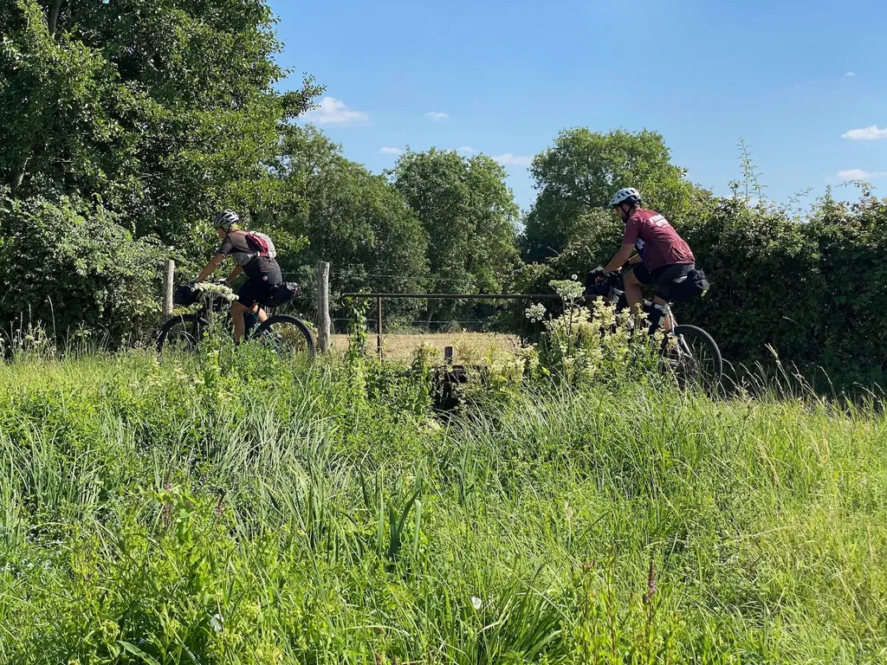
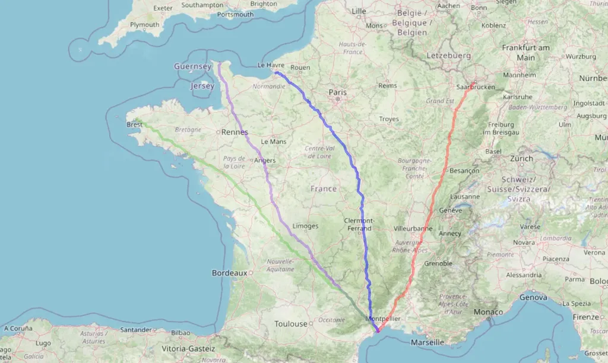
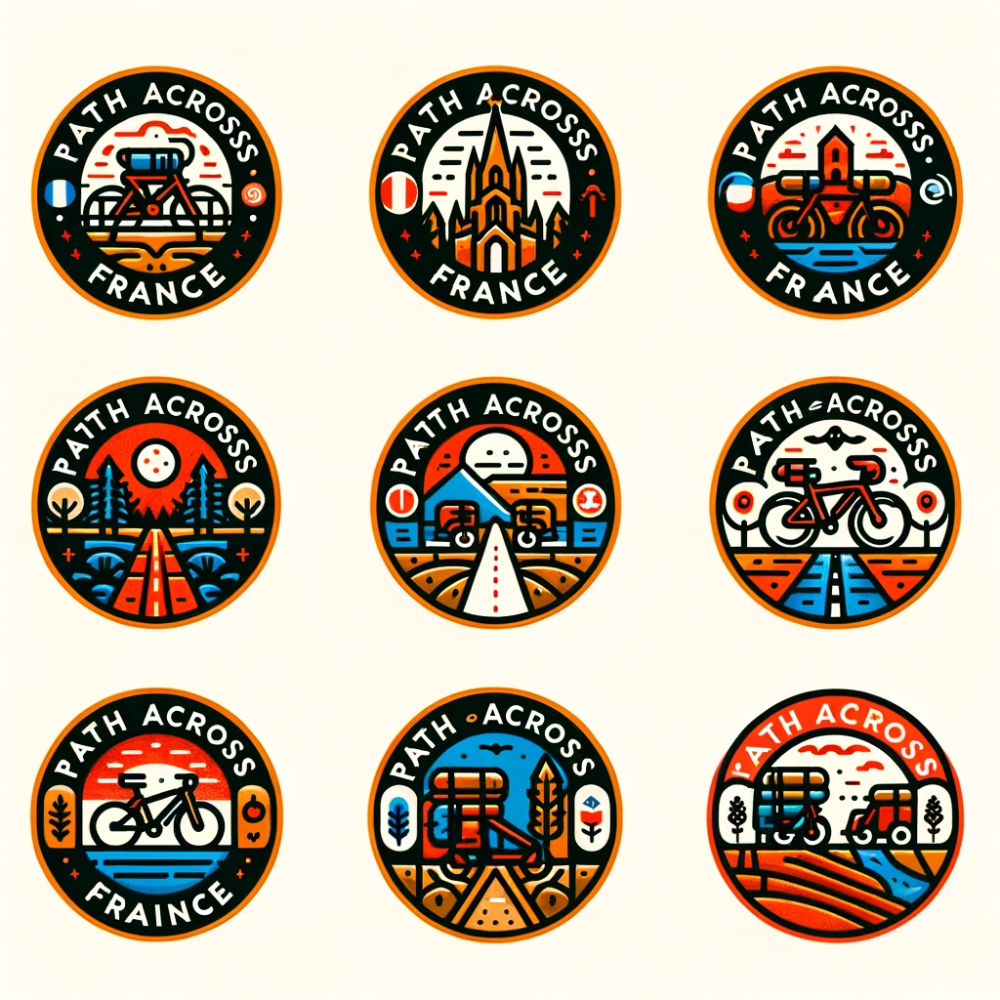

# Juillet 2024 : Path Across France

J’ai pris l’habitude d’effectuer un bikepacking VTT en juillet. Cette année j’aimerais [comme en 2022](../../2022/7/une-traversee-de-la-france-a-vtt.md) traverser la France en direction du Midi, en partant autour du 15 juillet d’une ville à définir. Si vous êtes intéressés, [signalez-vous sur l’évènement que je viens de créer](https://www.facebook.com/events/7057771327648143?ref=newsfeed) dans [le groupe 727](https://www.facebook.com/groups/727tour).

L’idée, c’est donc de renouveler l’expérience du [P27](https://727.tcrouzet.com/p27/). Elle a démontré qu’en mixant un intense travail cartographique et en remontant des conseils des vététistes des coins traversés, on pouvait créer une trace originale d’une fiabilité quasi irréprochable. Je me propose donc de créer une nouvelle trace que nous inaugurerions tous ensemble, à nos risques et périls.

À VTT de préférence, parce que si désormais grâce aux [Heatmaps](../../2022/9/heatmap-le-tracage-social-pour-gravel-et-vtt.md) je peux être sûr qu’un chemin est praticable, j’ai du mal à anticiper si c’est envisageable sans trop de difficultés à gravel. L’esprit : non compétitif, se faire plaisir, découvrir des chemins, des villages, des hauts lieux, culturel. Profiter des longues et belles journées de juillet. Distance : un peu plus de 1 000 km, dénivelé maximum quotidien 2 000 mètres, distance quotidienne entre 90 et 140 km en fonction de la difficulté (mais à chacun de choisir son rythme).

Si à tout hasard nous étions plus de quatre ou cinq intéressés, je pourrais créer un évènement FFV pour le groupe soit assuré (ce qui impliquerait une inscription de quelques euros). Je pourrais aussi chercher un club pour nous aider à organiser le départ. Il me semble que nous pourrions ainsi d’année en année imaginer des traversées de la France, avec pour tous, moi compris, le plaisir de la découverte.

#velo #y2024 #2024-1-12-12h57
